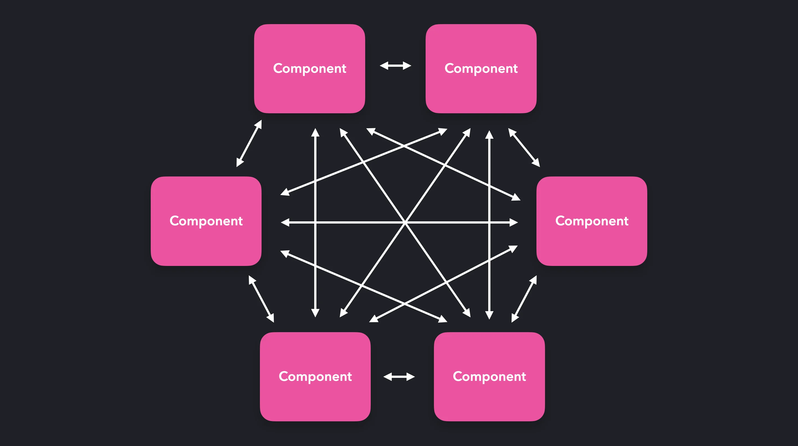
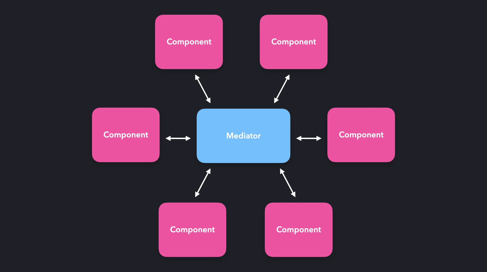
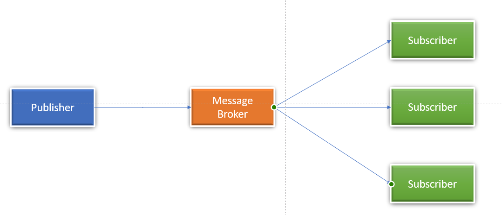

<br>
<p align="center">
  🔮 Comprehensive Guide to Design Patterns. 🔮
</p>
<p align="center">
Explore essential concepts in software engineering, such as Design Patterns, for creating scalable, maintainable, and efficient code. This repo simplifies these ideas, ensuring accessibility for developers of all levels. Let's delve into this world together and unravel the secrets of effective software engineering!
</p>

# Getting Started 📜

To get started, follow the navigation below to explore different sections of this repository:

- [Design Patterns](#design-patterns-): Reusable solutions to common problems in software design.

# Design Patterns 🔮

1. [Creational Design Patterns 🏗](#creational-design-patterns-)
   - [Singleton 💍](#singleton-)
   - [Prototype 🧬](#prototype-)
   - [Builder 👷](#builder-)
   - [Factory Method 🏭](#factory-method-)
   - [Abstract Factory 🔨](#abstract-factory-)
   - [Module Pattern ](#module-)
2. [Structural Design Patterns 🛠️](#structural-design-patterns-)
   - [Adapter 🔌](#adapter-)
   - [Bridge 🌉](#bridge-)
   - [Composite 🌴](#composite-)
   - [Decorator 🎨](#decorator-)
   - [Facade 🏰](#facade-)
   - [Flyweight 🪰](#flyweight-)
   - [Proxy 🔗](#proxy-)
3. [Behavioral Design Patterns 🧠](#behavioral-design-patterns-)
   - [Chain of Responsibility ⛓️](#chain-of-responsibility-)
   - [Command 👮‍♂️](#command-)
   - [Iterator 🔍](#iterator-)
   - [Mediator 🤝](#mediator-)
   - [Memento 💾](#memento-)
   - [Observer 👀](#observer-)
   - [State 📄](#state-)
   - [Strategy 🎯](#strategy-)
   - [Template Method 🏛️](#template-method-)
   - [Visitor 🚶‍♂️](#visitor-)

## What are Design Patterns? 👀

Design patterns are reusable solutions to common problems in software design, offering a structured and proven approach to addressing recurring challenges. They serve as templates or blueprints for solving specific types of problems, making it easier for developers to create efficient and maintainable code. Design patterns provide a shared vocabulary and understanding among developers, promoting reusability, modularity, and improved communication. They encapsulate the best practices of experienced developers, allowing for easier problem-solving and enhanced maintainability. However, it's crucial to apply design patterns judiciously, considering the specific context and potential trade-offs associated with their use.

## Origins and Evolution of Design Patterns 🪄

Imagine building houses. Sometimes, you use similar designs for windows or doors because they work well. The same idea applies to computer programs. Design patterns help us solve common problems in a smart and reusable way.

## Why Do We Use Design Patterns? 🎁

Several compelling reasons drive the utilization of design patterns:

1. **Reusability:** Design patterns offer proven solutions to common problems, reducing the time and effort required to address them from scratch, thereby promoting reusability and modularity in software systems.
2. **Improved Communication:** These patterns establish a shared vocabulary and understanding among developers, facilitating more effective communication about design decisions and solutions.
3. **Best Practices:** Encapsulating the best practices of experienced developers, design patterns provide a learning ground for novices to benefit from their expertise.
4. **Maintainability:** The implementation of design patterns often results in more maintainable code, easing the process of updating, debugging, and extending the codebase in the future.
5. **Easier Problem-Solving:** Design patterns offer a structured approach to problem-solving, aiding developers in breaking down complex issues into more manageable components.

## Things to Remember When Using Design Patterns ⚠️

It's super important to use design patterns wisely. Imagine you have a cool tool, but you shouldn't use it for everything. Here's why:

1. **Think About the Situation:** Design patterns work best in certain situations. Using them blindly might not always be the right choice.
2. **Keep It Simple:** Sometimes, a simple solution is better than a fancy one. Don't make things more complicated than they need to be.
3. **Watch Out for Speed Bumps:** Design patterns can slow down our programs a bit. We need to decide if the benefits are worth it.
4. **Be Ready to Change:** As projects grow, what worked before might not be the best choice anymore. We need to be flexible and adjust.

> Using design patterns is like having a toolbox full of helpful tools. Just remember, not every tool is right for every job. We should pick the ones that fit the situation best. If we do that, our programs will be strong and reliable!

# Creational Design Patterns 🏗

Creational design patterns 🎨 revolve around the intricacies of object creation. They introduce a level of abstraction to the instantiation process, ensuring the system remains agnostic to the specifics of how its objects come into existence, are composed, and represented. These design patterns offer a mechanism for object creation that conceals the intricacies of the creation logic, steering away from direct object instantiation using the new operator. By doing so, they grant greater flexibility in determining the objects necessary for a given use case. Notable examples of creational design patterns encompass Singleton, Factory Method, Abstract Factory, Builder, and Prototype. 🚀

- Creational Design Patterns : For Handling Object Creation Mechanisms.

<br/>
<hr/>

## Singleton 💍

> The Singleton pattern is a creational design pattern ensuring that a class has only one instance while providing global access to this instance.

In simple words:

> "Singleton - ensures that only one object of a particular class is ever created."

### Steps of Implementation

Implementing the Singleton pattern in object-oriented programming typically involves the following steps:

1. Declare a private `static` attribute in the singleton class.
2. Create a public static method (commonly named `getInstance()`) to serve as a global access point for the singleton object. This method embraces "lazy initialization," meaning it generates a new instance only when necessary.
3. Set the constructor of the singleton class as `private`, preventing external objects from using the `new` operator with the singleton class.
4. Within the static method of the class, verify the existence of the singleton instance. If it exists, return it; otherwise, create a new instance and return it.

### Classic Implementation:

Here is how we might create a database connection using the Singleton pattern:

```ts
class Database {
  // Step 1: Declare a private static instance
  private static instance: Database;

  // Step 3: Make the constructor private
  private constructor() {}

  // Step 2: Create a public static getInstance method
  public static getInstance(): Database {
    if (!Database.instance) {
      Database.instance = new Database();
    }
    return Database.instance;
  }

  public query(query: string): void {
    console.log(`Executing query '${query}' on database.`);
  }
}

// Usage
const db1 = Database.getInstance();
const db2 = Database.getInstance();

db1.query("SELECT * FROM users"); // Executing query `SELECT * FROM users` on database.
db2.query("DROP DATABASE users"); // Executing query `DROP DATABASE users` on database.

console.log(db1 === db2); // true
```

In this example, the `Database` class represents a database connection. The getInstance method ensures that there is only one instance of the Database class, and the query method allows you to perform queries on the database.
The usage demonstrates that `db1` and `db2` are the same instance, showcasing the Singleton pattern behavior.

### Example 2.

The singleton pattern is a creational JavaScript design patterns that restricts the instantiation of a class to a single object. It creates a new instance of the class if one doesn’t exist and if existing already, it simply returns a reference to it. It is also known as the Strict Pattern.

A singleton pattern solves two problems at the same time, violating the Single Responsibility Principle.

1. Guarantees that there is only a single instance of a class.
2. Provide a global access point to this instance.

- A practical example would be a single database object shared by different parts of the program. There is no need to create a new instance of a database when one is already existing.

- One drawback of the pattern is the difficulty associated with testing. There are hidden dependencies objects, which are difficult to single out to test.

```ts
//Singleton class

let instance;
let globalState = {
  color: "",
};

class StateUtility {
  constructor() {
    if (instance) {
      throw new Error("New instance cannot be created!!");
    }
    instance = this;
  }
  getPropertyByName(propertyName) {
    return globalState[propertyName];
  }
  setPropertyValue(propertyName, propertyValue) {
    globalState[propertyName] = propertyValue;
  }
}
let stateUtilityInstance = Object.freeze(new StateUtility());
export default stateUtilityInstance;

// We make sure that we don’t expose the globalState. We expose them using the class methods of StateUtility. In this way, we protect the global state from being altered directly.
// Finally, we create the instance of the class as follows: let stateUtilityInstance = Object.freeze(new StateUtility());.
// We have used Object.freeze so that no other class/component/module is able to modify the exposed stateUtilityInstance.

`OR`;

- In a singleton design pattern, only one object is created for each interface (class or function) and the same object is returned every time when called.

It is really useful in scenarios where only one object is needed to coordinate actions across the system.

For example, notification object, which sends notification across the system.

// We can implement the singleton pattern by creating a closure with a variable that stores the created instance and returns it every time.We can implement the singleton pattern by creating a closure with a variable that stores the created instance and returns it every time.

var Singleton = (function () {
  var instance;

  function createDBInstance() {
    var object = new Object("I am the DataBase instance");
    return object;
  }

  return {
    getDBInstance: function () {
      if (!instance) {
        instance = createDBInstance();
      }
      return instance;
    },
  };
})();

function run() {
  var instance1 = Singleton.getDBInstance();
  var instance2 = Singleton.getDBInstance();

  console.log("Same instance? " + (instance1 === instance2));
}

run(); // OUTPUT = "Same instance? true"
```

### Example 3.

we can have a Counter singleton, which contains a getCount, increment, and decrement method.
This singleton can be shared `globally across multiple files within the application`. The imports of this Singleton `all reference the same instance`.

The increment method increments the value of counter by 1. Any time the increment method has been invoked anywhere in the application, thus changing the value of counter, the `change is reflected throughout the entire application`.

### Implementation

```ts
In ES6, there are several ways to create Singletons.

`Classes`
// A. Creating a singleton with an ES2015 class can be done by:

let counter = 0;

class Counter {
  getInstance() {
    return this;
  }

  getCount() {
    return counter;
  }

  increment() {
    return ++counter;
  }

  decrement() {
    return --counter;
  }
}

const counter1 = new Counter();
const counter2 = new Counter();

console.log(counter1.getInstance() === counter2.getInstance()); // false

1.` However,Above  this class doesn’t meet the criteria for a Singleton! A Singleton should only be able to get instantiated once. Currently, we can create multiple instances of the Counter class.`
2. `By calling the new method twice, we just set counter1 and counter2 equal to different instances. The values returned by the getInstance method on counter1 and counter2 effectively returned references to different instances: they aren’t strictly equal!`


//  B. Let’s make sure that only one instance of the Counter class can be created.

`METHOD TO CREATE : - only one instance`

- One way to make sure that only one instance can be created, is by creating a variable called instance. `In the constructor of Counter`, we can set instance equal to a reference to the instance when a `new instance` is created. We can prevent `new instantiations` `by checking if the instance variable already had a value`. `If that’s the case, an instance already exists`. This shouldn’t happen: `an error should get thrown to let the user know.`


let instance;
let counter = 0;
// 1. Creating the `Counter` class, which contains a `constructor`, `getInstance`, `getCount`, `increment` and `decrement` method.
// Within the constructor, we check to make sure the class hasn't already been instantiated.
class Counter {
  constructor() {
    if (instance) {
      throw new Error("You can only create one instance!");
    }
    this.counter = counter;
    instance = this;
  }
  getInstance() {
    return this;
  }
  getCount() {
    return this.counter;
  }

  increment() {
    return ++this.counter;
  }

  decrement() {
    return --this.counter;
  }
}

// 2. Setting a variable equal to the the frozen newly instantiated object, by using the built-in `Object.freeze` method.
// This ensures that the newly created instance is not modifiable.
const singletonCounter = Object.freeze(new Counter());

// 3. Exporting the variable as the `default` value within the file to make it globally accessible.
export default singletonCounter;


- BY `Objects`

// We can also directly create objects without having to use a class, which can lead to much simpler and cleaner code.
// To create a singleton using a regular object, we have to:

let counter = 0;

// 1. Create an object containing the `getCount`, `increment`, and `decrement` method.
const counterObject = {
  getCount: () => counter,
  increment: () => ++counter,
  decrement: () => --counter,
};

// 2. Freeze the object using the `Object.freeze` method, to ensure the object is not modifiable.
const singletonCounter = Object.freeze(counterObject);

// 3. Export the object as the `default` value to make it globally accessible.
export default singletonCounter;


- NOTE : We could even `export` the frozen object directly, without having to declare multiple variables :

let counter = 0;

export default Object.freeze({
  getCount: () => counter,
  increment: () => ++counter,
  decrement: () => --counter,
});
```

`The Object.freeze`: method makes sure that consuming code cannot modify the Singleton. Properties on the frozen instance cannot be added or modified, which reduces the risk of accidentally overwriting the values on the Singleton.

## Tradeoffs

`Memory`: Restricting the instantiation to just one instance could potentially save a lot of memory space. Instead of having to set up memory for a new instance each time, we only have to set up memory for that one instance, which is referenced throughout the application.

`Unnecessary`: ES2015 Modules are singletons by default. We no longer need to explicitly create singletons to achieve this global, non-modifiable behavior.

`Dependency Hiding`: When importing another module, it may not always be obvious that that module is importing a Singleton. This could lead to unexpected value modification within the Singleton, which would be reflected throughout the application.

`Global Scope Pollution`: The global behavior of Singletons is essentially the same as a global variable. Global Scope Pollution can end up in accidentally overwriting the value of a global variable, which can lead to a lot of unexpected behavior. Usually, certain parts of the codebase modify the values within global state, whereas others consume that data. The order of execution here is important, understanding the data flow when using a global state can get very tricky as your application grows, and dozens of components rely on each other.

`Testing`: Since we can't create new instances each time, all tests rely on the modification to the global instance of the previous test. The order of the tests matter in this case, and one small modification can lead to an entire test suite failing. After testing, we need to reset the entire instance in order to reset the modifications made by the tests.

### State management in React

- In React, we often rely on a global state through state management tools such as Redux or React Context instead of using Singletons. Although their global state behavior might seem similar to that of a Singleton, these tools provide a read-only state rather than the mutable state of the Singleton. When using Redux, only pure function reducers can update the state, after a component has sent an action through a dispatcher.

- Although the downsides to having a global state don’t magically disappear by using these tools, we can at least make sure that the global state is mutated the way we intend it, since components cannot update the state directly.

### Points To Remember

- Singleton design pattern exposes a single instance that can be used by multiple components
- Singleton Pattern can be considered the basics of global state management libraries such `Redux or React Context`.
- It is a pattern that restricts the class to create only one instance.
- They can be accessed globally and acts as a single access point for accessing the global state.

### When To Use Singleton Pattern ? ✅

Consider using Singleton when:

- You have global variables that should be accessible universally.
- There is repeated, expensive initialization of the same resource.
- Multiple parts of your system access and potentially modify a shared resource.
- An entity is accessed inconsistently across the system.
- Duplicate instances are generated, and identical instances are unnecessary.
- Excessive parameters are passed through layers for an object.

### Disadvantages of Singleton Pattern 🆘 :

Despite its advantages, the Singleton pattern has drawbacks:

- **Violates Single Responsibility Principle 🚫:**
  Simultaneously managing object instantiation and global access might breach the Single Responsibility Principle.

- **Masking Design Issues 🎭:**
  Singleton can hide underlying design problems, offering a quick fix without addressing the root causes.

- **Multithreading Challenges 🔄:**
  Implementing Singleton in a multithreaded environment requires careful synchronization to prevent unintended multiple instantiations.

- **Unit Testing Complexity 🧪:**
  Unit testing client code using Singleton can be complex due to private constructors and challenges in mocking the singleton instance.

## Prototype 🧬

Prototype is a creational design pattern that lets you copy existing objects without making your code dependent on their classes. It allows you to create a copy of an existing object and modify it to your needs, instead of going through the trouble of creating an object from scratch and setting it up.

The prototype pattern is a useful way to share properties among many objects of the same type. The prototype is an object that’s native to JavaScript, and can be accessed by objects through the prototype chain.

In simple words:

> Create a new object based on an existing object through **cloning**.

### Implementation:

Let's see a simple implementation of the Prototype pattern in TS through an example in game development.

```ts
interface Prototype {
  clone(): Prototype;
  details: EnemyDetails;
}

interface EnemyDetails {
  type: string;
  strength: number;
}

/**
 * Concrete Prototype representing an Enemy in a Game
 */
class Enemy implements Prototype {
  constructor(public details: EnemyDetails) {}

  public clone(): Enemy {
    const clone = new Enemy({ ...this.details });
    return clone;
  }
}

// Usage
const originalEnemy: Prototype = new Enemy({ type: "Dragon", strength: 10 });
const clonedEnemy: Prototype = originalEnemy.clone();

console.log(originalEnemy.details); // { type: 'Dragon', strength: 10 }
console.log(clonedEnemy.details); // { type: 'Dragon', strength: 10 }

clonedEnemy.details = { type: "Goblin", strength: 8 };
console.log(clonedEnemy.details); // { type: 'Goblin', strength: 8 }
```

### This approach enhances code efficiency and maintainability, allowing easy modification of specific properties without creating new instances for each enemy.

### If we want to share properties among many objects of the same type, we can use the Prototype pattern.

Example.
`Implementation`

`Say we wanted to create many dogs with a createDog factory function.`

```ts
const createDog = (name, age) => ({
  name,
  age,
  bark() {
    console.log(`${name} is barking!`);
  },
  wagTail() {
    console.log(`${name} is wagging their tail!`);
  },
});

const dog1 = createDog("Max", 4);
const dog2 = createDog("Sam", 2);
const dog3 = createDog("Joy", 6);
const dog4 = createDog("Spot", 8);
```

`This way, we can easily create many dog objects with the same properties.`

`However, we're unnecessarily adding a new bark and wagTail methods to each dog object. Under the hood, we're creating two new functions for each dog object, which uses memory.`

We can use the Prototype Pattern to share these methods among many dog objects. Best Practice :

```ts
class Dog {
  constructor(name, age) {
    this.name = name;
    this.age = age;
  }

  bark() {
    console.log(`${this.name} is barking!`);
  }
  wagTail() {
    console.log(`${this.name} is wagging their tail!`);
  }
}

const dog1 = new Dog("Max", 4);
const dog2 = new Dog("Sam", 2);
const dog3 = new Dog("Joy", 6);
const dog4 = new Dog("Spot", 8);
```

`Notice here how the constructor contains a name property, and the class itself contains a bark and wagTail property. When using ES6 classes, all properties that are defined on the class itself, bark and wagTail in this case, are automatically added to the prototype.`

We can see the prototype directly through accessing the prototype property on a constructor, or through the **proto** property on any instance.

```ts
console.log(Dog.prototype);

console.log(dog1.__proto__);

// The value of __proto__ on any instance of the constructor, is a direct reference to the constructor’s prototype! Whenever we try to access a property on an object that doesn’t exist on the object directly, JavaScript will go down the prototype chain to see if the property is available within the prototype chain.
```

The prototype pattern is very powerful when working with objects that should have access to the same properties. Instead of creating a duplicate of the property each time, we can simply add the property to the prototype, since all instances have access to the prototype object.

Since all instances have access to the prototype, it’s easy to add properties to the prototype even after creating the instances.

Say that our dogs shouldn’t only be able to bark, but they should also be able to play! We can make this possible by adding a play property to the prototype.

### Implementation

```ts
class Dog {
  constructor(name) {
    this.name = name;
  }

  bark() {
    return `Woof!`;
  }
}

const dog1 = new Dog("Daisy");

const dog2 = new Dog("Max");

const dog3 = new Dog("Spot");

Dog.prototype.play = () => console.log("Playing now!");

dog1.play();
```

The term prototype chain indicates that there could be more than one step. Indeed! So far, we’ve only seen how we can access properties that are directly available on the first object that **proto** has a reference to. However, prototypes themselves also have a **proto** object!

Let’s create another type of dog, a super dog! This dog should inherit everything from a normal Dog, but it should also be able to fly. We can create a super dog by extending the Dog class and adding a fly method.

`Example`

```ts
class Dog {
  constructor(name) {
    this.name = name;
  }

  bark() {
    console.log("Woof!");
  }
}

class SuperDog extends Dog {
  constructor(name) {
    super(name);
  }

  fly() {
    console.log(`Flying!`);
  }
}

const dog1 = new SuperDog("Daisy");

dog1.bark();

dog1.fly();
```

We have access to the bark method, as we extended the Dog class. The value of **proto** on the prototype of SuperDog points to the Dog.prototype object!
It gets clear why it’s called a prototype chain: when we try to access a property that’s not directly available on the object, JavaScript recursively walks down all the objects that **proto** points to, until it finds the property!

### Object.create

The Object.create method lets us create a new object, to which we can explicitly pass the value of its prototype.

```ts
const dog = {
  bark() {
    return `Woof!`;
  },
};

const pet1 = Object.create(dog);
```

Although pet1 itself doesn’t have any properties, it does have access to properties on its prototype chain! Since we passed the dog object as pet1’s prototype, we can access the bark property.

```ts
const dog = {
  bark() {
    console.log(`Woof!`);
  },
};

const pet1 = Object.create(dog);

pet1.bark(); // Woof!

console.log("Direct properties on pet1: ", Object.keys(pet1));

console.log("Properties on pet1's prototype: ", Object.keys(pet1.__proto__));
```

Perfect! Object.create is a simple way to let objects directly inherit properties from other objects, by specifying the newly created object’s prototype. The new object can access the new properties by walking down the prototype chain.

The prototype pattern allows us to easily let objects access and inherit properties from other objects. Since the prototype chain allows us to access properties that aren’t directly defined on the object itself, we can avoid duplication of methods and properties, thus reducing the amount of memory used.

### NOTE :

Memory efficient: `The prototype chain allows us to access properties that aren't directly defined on the object itself, we can avoid duplication of methods and properties, thus reducing the amount of memory used.`

### When to Use the Prototype Pattern ? ✅

The Prototype pattern is handy when copying existing objects is more efficient than creating new ones. It's beneficial for systems seeking independence in creating, composing, and representing products.

- Clone prototypes to avoid redoing intricate constructions for similar objects.
- Clone pre-loaded objects to enhance efficiency when creating from scratch is resource-intensive.
- Use the Prototype pattern when needing multiple similar but not identical objects.
- Facilitates storing and cloning prototypes for restoring previous states, ideal for undo features.

### Advantages of the Prototype Pattern 🪄 :

- Avoiding Object Reference Errors 🚫
- Efficient Object Cloning 🚀
- Simplifying Object Creation 🌐

### Disadvantages of the Prototype Pattern 🆘 :

- Shallow vs. Deep Copying 🔄 : Cloning complex objects that have circular references might be very tricky
- Complex Cloning Hierarchies 📜: Cloning hierarchical structures introduces complexities, particularly with interconnected objects and relationships.
- Readability: When a class has been extended many times, it can be difficult to know where certain properties come from.
  For Example, if we have a BorderCollie class that extends all the way to the Animal class, it can be difficult to trace back where certain properties came from.

## Builder 👷

Builder is a Creational design pattern facilitating the step-by-step construction of complex objects. It enables the creation of various object types using a unified construction process, preventing constructor overload. _Use the Builder pattern to get rid of a “telescoping constructor”._

- OR

The Builder design pattern is a creational design pattern used to construct complex objects by separating the construction process from the actual representation. It’s especially useful when an object requires multiple steps or configurations to be created.

In simple words:

> Builder helps in creating different versions of an object without cluttering the constructor.

### Implementation Example in TypeScript:

```ts
interface IPizza {
  name: string;
  size: string;
  isCheese: boolean;
}

interface IPizzaBuilder {
  setName(name: string): IPizzaBuilder;
  setSize(size: string): IPizzaBuilder;
  setCheese(isCheese: boolean): IPizzaBuilder;
  build(): IPizza;
}

class Pizza implements IPizza {
  constructor(public name: string, public size: string, public isCheese: boolean) {}
}

class PizzaBuilder implements IPizzaBuilder {
  private name: string = "";
  private size: string = "";
  private isCheese: boolean = false;

  setName(name: string): IPizzaBuilder {
    this.name = name;
    return this;
  }

  setSize(size: string): IPizzaBuilder {
    this.size = size;
    return this;
  }

  setCheese(isCheese: boolean): IPizzaBuilder {
    this.isCheese = isCheese;
    return this;
  }

  build(): IPizza {
    return new Pizza(this.name, this.size, this.isCheese);
  }
}

class PizzaDirector {
  constructor(private builder: IPizzaBuilder) {}

  public buildMinimalPizza(name: string, size: string): IPizza {
    return this.builder.setName(name).setSize(size).build();
  }

  public buildFullFeaturedPizza(name: string, size: string, isCheese: boolean): IPizza {
    return this.builder.setName(name).setSize(size).setCheese(isCheese).build();
  }
}

// Usage:
const builder: IPizzaBuilder = new PizzaBuilder();
const director: PizzaDirector = new PizzaDirector(builder);
const pizzaWithoutCheese: IPizza = director.buildMinimalPizza("Pepperoni", "Medium");
const pizzaWithCheese: IPizza = director.buildFullFeaturedPizza("Hawaiian", "Small", true);

console.log(pizzaWithoutCheese); // Pizza: { name: 'Pepperoni', size: 'Medium', isCheese: false}
console.log(pizzaWithCheese); // Pizza: { name: 'Hawaiian', size :'Small', isCheese: true}
```

This TypeScript code implements a simplified Builder pattern for creating pizza objects, allowing customization of attributes like name, size, and the presence of cheese.

- New Example without using the Builder Design Pattern

`Let us take an example without using the Builder Design Pattern:`

```js
class User {
  constructor(name, age, weight, address, gender) {
    this.name = name;
    this.age = age;
    this.weight = weight;
    this.address = address;
    this.gender = gender;
  }
  printUser() {
    return `User: { name: ${this.name}, age: ${this.age}, weight: ${this.weight}, address: ${this.address}, gender: ${this.gender} }`;
  }
}

const user = new User("Abhishek", 22, 55, "India", "Male");
console.log(user.printUser());

- Explanation of the above example:

. The User class is defined with a constructor that takes parameters for the user’s name, age, weight, address, and gender. The constructor initializes the respective attributes.
. The printUser method generates a formatted string representing the user’s information.

Creating a User Instance:

const user = new User('Abhishek', 22, 55, 'India', 'Male');

. This line creates an instance of the User class by calling the constructor with the specified values for name, age, weight, address, and gender.
Displaying User Information:

. console.log(user.printUser());

This line calls the printUser method on the user instance, which generates a string containing the user’s information and logs it to the console.

Output:
. User: { name: Abhishek, age: 22, weight: 55, address: India, gender: Male }

- Before we move to implementing Builder Method we have to analyze what is wrong with this and what issues are solved by implementing builder method, at first we see the above code we realized that this is a correct and easy way to create a new object but we have to provide all information during initialization. If we look closely at the line:

const user = new User(‘Abhishek’ , 22 , 55 , ‘India’ , ‘Male’ );

we see that properties of this user object can be confusing, like sometime we can mistakenly give age instead of weight and weight instead of age . As our code size grows, we will have to look at the class to figure out which properties we have to provide when initializing a user object.

```

- Implementation of the above Example using Builder Design Pattern.

```js
//Blueprint for creating a new user using User class


// Here, a User class is defined with a constructor that takes a name parameter and initializes other user attributes (age, weight, address, gender) to null.
class User {
constructor(name) {
	this.name = name;
	this.age = null;
	this.weight = null;
	this.address = null;
	this.gender = null;
}

// These set methods allow you to set the user’s age, weight, address, and gender. They update the corresponding attributes and return the object to enable method chaining.

// Method to set Age of the user
setAge(age) {
	this.age = age;
	return this; // Return the object for method chaining
	}

// Method to set the Weight of the user
setWeight(weight) {
	this.weight = weight;
	return this; // Return the object for method chaining
}

// Method to set the Address of the user
setAddress(address) {
	this.address = address;
	return this; // Return the object for method chaining
}
// Method to set the gender of user
setGender(gender) {
	this.gender = gender;
	return this; // Return the object for method chaining
}


// The build method is used to finalize user creation. It checks if the name is provided and throws an error if it’s not. It returns the object to allow method chaining.

//Method to finalize the user creation
build() {
	if (!this.name) {
	throw Error('Name is required');
	}
	return this; // Return the object for method chaining
}

// The printUser method generates a string representation of the user’s information.
printUser() {
	return `User: { name: ${this.name}, age: ${this.age}, weight: ${this.weight}, address: ${this.address}, gender: ${this.gender} }`;
}
}
// Usage
const user = new User('Abhishek').setAge(30).setGender('Male').build();

console.log(user.printUser());


Note: In build method, we have only checked for name but we can also add more checks.

- Explanation of the above example using Builder Design Pattern:

This creates a new user with the name “Abhishek”, sets the age to 30, and sets the gender to “Male”. Then the build method is called to finalize user creation. Finally, the printUser method is used to print the user’s information to the console.

Output:

User: { name: Abhishek, age: 30, weight: null, address: null, gender: Male }
```

### Implementation using Function:

- Using Factory function to create a user object .

```js
function createUser(name) {
  const user = {
    name,
    age: null,
    weight: null,
    address: null,
    gender: null,

    // Method to set the age of the user
    setAge(age) {
      this.age = age;
      return this; // Return the object for method chaining
    },

    // Method to set the weight of the user
    setWeight(weight) {
      this.weight = weight;
      return this; // Return the object for method chaining
    },

    // Method to set the address of the user
    setAddress(address) {
      this.address = address;
      return this; // Return the object for method chaining
    },

    // Method to set the gender of the user
    setGender(gender) {
      this.gender = gender;
      return this; // Return the object for method chaining
    },

    // Method to finalize the user creation
    build() {
      if (!this.name) {
        throw Error("Name is required"); // Validate required properties
      }
      return this; // Return the object for method chaining
    },

    // Method to display the user information as a string
    printUser() {
      return `User: { name: ${this.name}, age: ${this.age}, weight: ${this.weight}, address: ${this.address}, gender: ${this.gender} }`;
    },
  };

  return user; // Return the user object
}

// Usage: Create a user object and set properties
const user = createUser("Abhishek").setAge(30).setWeight(70).setAddress("India").setGender("Male").build(); // Finalize user creation
// Here, a factory function "createUser" is used to create and initialize objects. The function takes a name parameter and returns a user object with properties and functions .

console.log(user.printUser()); // Display user information.

. This creates a new user with the name “Abhishek”, sets the age to 30, sets the gender to “Male”, sets the address to India and weight to 70.
. Then build function is called to finalize user creation.
. Finally, the printUser function is used to print the user’s information to the console.

```

### When to Use Builder Pattern ? ✅

- **Complex Object Creation 🧩:** Simplify the creation of objects with numerous optional and mandatory attributes.
- **Step-by-step Object Creation 🔨:** Useful when an object needs to be built in multiple ordered steps.
- **Immutable Objects 🔄:** Construct immutable objects with many attributes, enhancing object integrity.
- **Code Clarity 📝:** Enhance code readability, especially when dealing with constructors with numerous parameters.
- **Complex Object Creation:** Use the Builder pattern when dealing with complex objects that require multiple configurations and parameters for creation.
- **Object Initialization Flexibility:** When you want to provide flexibility in the order of setting properties and handle optional parameters.

### Where Not to Use the Builder Design Pattern:

- **Simple Objects:** For objects with a small number of properties or minimal configuration requirements, the Builder pattern might introduce unnecessary complexity.

### Advantages of Builder Pattern 🪄 :

- **Fluent Interface 🌐:** Enhances code readability for step-by-step object construction.
- **Separation of Construction Logic and Business Logic 🧠:** Keeps client code focused on business logic by isolating object construction details.
- **Different Representations 🎨:** Utilizes diverse builders for various object representations without modifying client code.
- **Increased Object Integrity 🔒:** Ensures object validity at each step, elevating data integrity.
- **Immutability 🔄:** Returns immutable objects for simplicity, safety, and cleaner code.
- **Improved Object Creation:** The Builder pattern allows for the step-by-step construction of an object, making the creation process more understandable and manageable.
- **Flexible Object Construction:** It provides flexibility by allowing different configurations for constructing objects.
- **Code Readability:** The code using the Builder pattern is often more readable and self-explanatory, as method names in the builder convey the intention of the construction steps.

### Disadvantages of Builder Pattern 🆘 :

- **Code Overhead:** Implementing the Builder pattern requires creating a separate builder class or methods, which can introduce additional code and complexity.
- **Not Suitable for Simple Objects:** For simple objects that do not have a significant number of properties or configurations, the Builder pattern may be overly complex.
- **Increased Complexity 📈📉:** Introduces abstraction layers, potentially complicating code for those unfamiliar with the pattern.
- **Additional Code 📄:** May result in more code, especially for smaller classes, potentially increasing codebase size.
- **Runtime Errors 🚫:** Lack of compile-time checks may lead to runtime errors if required fields are not set.
- **Refactoring Difficulties 🛠️:** Alters to the class structure might necessitate updates to the builder code, making refactoring more challenging and time-consuming.

## Factory Method 🏭

The Factory Method Pattern is a creational design pattern that provides an interface for creating objects in a superclass, allowing subclasses to alter the type of objects created.

In Simple Terms:

> It enables the delegation of object instantiation to child classes, offering a way to create objects without specifying their exact classes.

### Implementation:

Consider a car manufacturing program with different car types (Sedan, Hatchback):

```ts
abstract class Car {
  constructor(public model: string, public productionYear: number) {}

  abstract displayCarInfo(): void;
}

class Sedan extends Car {
  displayCarInfo() {
    console.log(`This is a Sedan. Model: ${this.model}, Production Year: ${this.productionYear}`);
  }
}

class Hatchback extends Car {
  displayCarInfo() {
    console.log(`This is a Hatchback. Model: ${this.model}, Production Year: ${this.productionYear}`);
  }
}

class CarFactory {
  public createCar(type: string, model: string, productionYear: number): Car {
    switch (type) {
      case "Sedan":
        return new Sedan(model, productionYear);
      case "Hatchback":
        return new Hatchback(model, productionYear);
      default:
        throw new Error("Invalid car type");
    }
  }
}

// Usage:
const carFactory = new CarFactory();

const sedan = carFactory.createCar("Sedan", "Camry", 2023);
sedan.displayCarInfo(); // This is a Sedan. Model: Camry, Production Year: 2023

const hatchback = carFactory.createCar("Hatchback", "Corolla", 2019);
hatchback.displayCarInfo(); // // This is a Sedan. Model: Corolla, Production Year: 2019
```

`Example 2.`

```ts
class Car {
  constructor(options) {
    this.wheels = options.wheels || 4;
    this.doors = options.doors || 4;
    this.color = options.color || "silver";
  }
}

class Truck {
  constructor(options) {
    this.wheels = options.wheels || 6;
    this.doors = options.doors || 2;
    this.color = options.color || "red";
  }
}

class Bus {
  constructor(options) {
    this.wheels = options.wheels || 4;
    this.doors = options.doors || 4;
    this.color = options.color || "white";
  }
}

class Motorcycle {
  constructor(options) {
    this.wheels = options.wheels || 2;
    this.doors = options.doors || 0;
    this.color = options.color || "Black";
  }
}

class Factory {
  create = (options, vehicleType) => {
    if (!vehicleType) {
      return "unable to make vehicle. Please specify a vehicle type and tryagain!";
    }

    let vehicle;

    if (vehicleType === "car") {
      vehicle = new Car(options);
    } else if (vehicleType === "truck") {
      vehicle = new Truck(options);
    } else if (vehicleType === "bus") {
      vehicle = new Bus(options);
    } else if (vehicleType === "motorcycle") {
      vehicle = new Motocycle(options);
    }

    vehicle.vehicleType = vehicleType;

    vehicle.startEngine = () => console.log(`Reving ${vehicleType} engine`);

    vehicle.driveVehicle = () => console.log(`Driving ${vehicleType}...`);

    vehicle.stopEngine = () => console.log(`Stop ${vehicleType} engine`);

    return vehicle;
  };
}

const vehicleFactory = new Factory();

const bus = vehicleFactory.create(
  {
    wheels: 4,
    doors: 4,
    color: "yellow",
  },
  "bus"
);

console.log(bus);
console.log(bus.startEngine());
console.log(bus.driveVehicle());

const bike = vehicleFactory.create(
  {
    wheels: 2,
    doors: 0,
    color: "red",
  },
  "motorcycle"
);

console.log(bike);
console.log(bike.startEngine());
console.log(bike.stopEngine());
```

### When To Use Factory Pattern ? ✅

- **Uncertain Object Types:** If your software is meant to create different objects at runtime.
- **Similar Classes:** When dealing with numerous classes sharing a common superclass.
- **Pluggability and Flexibility:** Providing users with a way to extend a library with their own classes.

### Advantages Of The Factory Pattern 🪄 :

- **Decoupling 🚀:** Reduces coupling between client code and concrete classes, enhancing maintainability.
- **Flexibility 🤸:** Allows easy addition of new object types without modifying existing client code.
- **Encapsulation 🧳:** Encapsulates object creation details, making the factory responsible for instantiation.

### Disadvantages of Factory Pattern 🆘 :

- **Refactoring 🔄:** Introducing the Factory Pattern to an existing codebase might pose challenges during refactoring.
- **Increased Number of Classes 📈:** The pattern can lead to a higher number of classes, potentially making the codebase more complex.
- **Testing 🧪:** While aiding in writing testable code, complex factories can complicate the testing process, requiring additional setup.

## Abstract Factory 🔨

The Abstract Factory pattern is a creational design pattern that furnishes an interface for constructing families of objects that are related or dependent, all without explicitly specifying their concrete classes.

OR

Abstract Factory Pattern is to abstract the process of object creation by defining a family of related factory methods, each responsible for creating a different type of object. These factory methods are organized within an abstract factory interface or class, and the client code uses this interface to create objects.

. In Simple Terms:

Suppose we have two Abstract Factories whose task it is to create page controls, such as, buttons, textboxes, radio buttons, and listboxes. One is the Light Factory which creates controls that are white and the other the Dark Factory which creates controls that are black. Both Factories creates the same types of controls, but they differ in color, which is their common theme. This is an implementation of the Abstract Factory pattern.

- NOTE : Over time the Abstract Factory and Factory Method patterns have merged into a more general pattern called Factory. A Factory is simply an object that creates other objects.
  > A factory of factories.

### Classical Implementation:

```ts
interface Button {
  render(): void;
  onClick(f: Function): void;
}

interface Checkbox {
  render(): void;
  toggle(): void;
}

interface GUIFactory {
  createButton(): Button;
  createCheckbox(button: Button): Checkbox;
}

class WindowsButton implements Button {
  render() {
    console.log("Render a button in Windows style");
  }

  onClick(f: Function) {
    console.log("Bind a Windows style button click event");
    f();
  }
}

class WindowsCheckbox implements Checkbox {
  private button: Button;

  constructor(button: Button) {
    this.button = button;
  }

  render() {
    console.log("Render a checkbox in Windows style");
  }

  toggle() {
    this.button.onClick(() => console.log("Checkbox state toggled!"));
  }
}

class MacOSButton implements Button {
  render() {
    console.log("Render a button in MacOS style");
  }

  onClick(f: Function) {
    console.log("Bind a MacOS style button click event");
    f();
  }
}

class MacOSCheckbox implements Checkbox {
  private button: Button;

  constructor(button: Button) {
    this.button = button;
  }

  render() {
    console.log("Render a checkbox in MacOS style");
  }

  toggle() {
    this.button.onClick(() => console.log("Checkbox state toggled!"));
  }
}

class WindowsFactory implements GUIFactory {
  createButton(): Button {
    return new WindowsButton();
  }

  createCheckbox(button: Button): Checkbox {
    return new WindowsCheckbox(button);
  }
}

class MacOSFactory implements GUIFactory {
  createButton(): Button {
    return new MacOSButton();
  }

  createCheckbox(button: Button): Checkbox {
    return new MacOSCheckbox(button);
  }
}

function renderUI(factory: GUIFactory) {
  const button = factory.createButton();
  const checkbox = factory.createCheckbox(button);

  button.render();
  checkbox.render();

  button.onClick(() => console.log("Button clicked!"));
  checkbox.toggle();
}

console.log("App: Launched with the Windows factory.");
renderUI(new WindowsFactory());

console.log("App: Launched with the MacOS factory.");
renderUI(new MacOSFactory());
```

# Example of Abstract Method in JavaScript Design Patterns:

Imagine, we’re building a UI component library that supports multiple themes (e.g., light and dark themes). We want to create sets of UI components like buttons, input fields, and tooltips for each theme.

```js
// Abstract factory for creating UI components

// Abstract Factory: Implement an abstract factory, UIFactory, that defines the blueprint for creating UI components.
class UIFactory {
  createButton() {}
  createInputField() {}
  createTooltip() {}
}


// Concrete factory for light theme components.

// Concrete Factory: Create concrete factories for different themes: LightThemeFactory and DarkThemeFactory, each inheriting from the UIFactory.
class LightThemeFactory extends UIFactory {
  createButton() {
    return new LightThemeButton();
  }
  createInputField() {
    return new LightThemeInputField();
  }
  createTooltip() {
    return new LightThemeTooltip();
  }
}

// Concrete factory for dark theme components
class DarkThemeFactory extends UIFactory {
  createButton() {
    return new DarkThemeButton();
  }
  createInputField() {
    return new DarkThemeInputField();
  }
  createTooltip() {
    return new DarkThemeTooltip();
  }
}

// Abstract product for buttons.

//  Abstract Product: Define abstract product classes for various UI components, such as Button.
class Button {}


// Concrete product for light theme buttons.
// Concrete Product: Create concrete product classes, such as LightThemeButton and DarkThemeButton, that inherit from the abstract product classes.
class LightThemeButton extends Button {
  constructor() {
    super();
    console.log("Light theme button created");
  }
}

// Concrete product for dark theme buttons
class DarkThemeButton extends Button {
  constructor() {
    super();
    console.log("Dark theme button created");
  }
}

// Usage
const lightFactory = new LightThemeFactory();
const lightButton = lightFactory.createButton(); // Output: Light theme button created

const darkFactory = new DarkThemeFactory();
const darkButton = darkFactory.createButton(); // Output: Dark theme button created

- Key components of Abstract factory Pattern

. Abstract Factory: This is an interface or an abstract class that declares a set of factory methods for creating a family of related objects.
. Concrete Factory: These are the implementations of the abstract factory interface. Each concrete factory is responsible for creating a specific family of related objects.
. Abstract Products: These are interfaces or abstract classes that declare the common set of methods for the objects within a family.
. Concrete Products: These are the actual implementations of the abstract products. Each concrete product is specific to a particular family and is created by a corresponding concrete factory.
. Client: The client code interacts with the abstract factory and abstract product interfaces.


- When a UI component is created, it should log a message indicating which theme it belongs to. For example, a button created by the light theme factory should display “Light theme button created.”

- Abstract Factory Pattern allows us to create entire families of related objects that are compatible with each other. The client code remains unaware of the specific implementations.
```

### When To Use Abstract Factory Pattern ? ✅

- **Interrelated Dependencies:** Ensure that a client uses objects that belong together in a family.
- **Switching Product Families:** Easily swap entire families of objects (e.g., different look-and-feel standards).
- **Supporting Multiple Architectures:** Run software in different environments requiring different implementations of related objects.

### Advantages of Abstract Factory Pattern 🪄 :

- **Consistency among products 🤝:** Ensure compatibility and belongingness within a family of products.
- **Code Reusability 🔄:** Promote reuse of code for creating related product families.
- **Single Responsibility Principle 🎯:** Each concrete factory has a single responsibility, leading to cleaner and more understandable code.
- **Encapsulation of Object Creation:** Abstract Factory pattern encapsulates the creation of objects. This means that the client code does not need to be aware of the specific classes it is instantiating, promoting loose coupling between the client and the concrete objects.
- **Flexibility:** Abstract Factory pattern allows us to switch between different families of objects by using different concrete factories. This is especially useful when we need to support multiple variations of a product or when we want to change the behavior of our application by swapping out factories at runtime.

### Disadvantages of Abstract Factory Pattern 🆘 :

- **Increased Complexity 📈:** Introduces complexity and abstraction into the code, which may be unnecessary for simpler applications.
- **Tight Coupling And Dependency 🔗:** Client code becomes dependent on the Abstract Factory interface, requiring changes if the interface changes.
- **Limited Flexibility In Modifying Product Families 🚫:** Adding new types of products may require changing the core factory interface, violating the Open/Closed Principle.
- **Code Duplication:** While implementing concrete factories patterns for different product families, we end up with duplicate code for creating similar types of objects across multiple factories.
- **Limited Use Cases:** Abstract Factory pattern is most valuable in scenarios where there are multiple related product families with interchangeable components. In simpler applications, the overhead of implementing and maintaining factories may not be justified.

### Conclusion

Abstract Factory Pattern promotes the creation of families of related objects while keeping the code decoupled, maintainable, and adaptable to changing requirements or platforms. It’s a powerful tool for managing object creation in complex systems.

## Module Pattern

- The Module pattern encapsulates private variables and functions, exposing only the necessary parts publicly. This enhances code organization and prevents pollution of the global namespace.
- The Module Pattern leverages JavaScript’s function scope and closures to achieve this encapsulation.
- Modules should be Immediately-Invoked-Function-Expressions (IIFE) to allow for private scopes — that is, a closure that protect variables and methods
- Private variables and methods are contained within the closure. They are accessible only within the closure and are not exposed to the outer environment.
- Public methods (and sometimes variables) are returned from this closure and are accessible outside.

```ts
const CounterModule = (function () {
  // Private variable
  let count = 0;

  // Private method
  function logChange(action) {
    console.log(`Counter was ${action}. Current count: ${count}`);
  }

  return {
    // Public methods
    increment: function () {
      count++;
      logChange("incremented");
    },

    decrement: function () {
      count--;
      logChange("decremented");
    },

    getCount: function () {
      return count;
    },
  };
})();

// Using the CounterModule
CounterModule.increment(); // "Counter was incremented. Current count: 1"
CounterModule.increment(); // "Counter was incremented. Current count: 2"
CounterModule.decrement(); // "Counter was decremented. Current count: 1"

console.log(CounterModule.getCount()); // 1

// Below : This will result in an error since 'count' and 'logChange' are private
// console.log(CounterModule.count); // undefined
// CounterModule.logChange('tested'); // Error
```

### Module Pattern In Other Ways To understand With ES2015 :

- ES2015 introduced built-in JavaScript modules. A module is a file containing JavaScript code and makes it easy to expose and hide certain values.

- As your application and codebase grow, it becomes increasingly important to keep your code maintainable and separated. The module pattern allows you to split up your code into smaller, reusable pieces.

- Besides being able to split your code into smaller reusable pieces, modules allow you to keep certain values within your file private. Declarations within a module are scoped (encapsulated) to that module , by default. If we don’t explicitly export a certain value, that value is not available outside that module. This reduces the risk of name collisions for values declared in other parts of your codebase, since the values are not available on the global scope.

`Examples :`

1. The module pattern is a great way to split a larger file into multiple smaller, reusable pieces. It also promotes code encapsulation, since the values within modules are kept `private` inside the `module by default`, and cannot be modified. Only the values that are explicitly `exported` with the `export` keyword are accessible to other files.

```js
- 1st module file  : math.js

export function add(x,y){
  return x+y
}

export function subtract(x,y){
  return x-y
}

export function multiply(x,y){
  return x+y
}


- 2nd module file  : input.js

export function validateInput(input){
  if(!typeof input !=='number'){
    throw new Error('Input must be a number')
  }
}


- 3rd module file  : index.js

import {validateInput} from "./input.js"
import {add,subtract,multiply} from "./math.js"


`NOTE :` When importing all modules on the top of a file, all modules get loaded before the rest of the file. SO By dynamically importing modules, we can reduce the page load time. We only have to load, parse, and compile the code that the user really needs, when the user needs it. (In React we user lazy and suspense for dynamically importing module files.)

```

2. The module pattern provides a way to have both public and private pieces with the export keyword. This protects values from leaking into the global scope or ending up in a naming collision.

```js
- 1st module file  : math.js

// private Because it is not exported.
const secret = "Private Secret Key"

// Public
export function add(x,y){
  return x+y
}

// Public
export function subtract(x,y){
  return x-y
}

// Public
export function multiply(x,y){
  return x+y
}


- 2nd module file  : input.js

export function validateInput(input){
  if(!typeof input !=='number'){
    throw new Error('Input must be a number')
  }
}


- 3rd module file  : index.js

import {validateInput} from "./input.js"
import {add,subtract,multiply} from "./math.js"

- In the above example, the secret variable is accessible within the module, but not outside of it. Other modules cannot import this value, as it hasn't been exported.

```

### Tradeoffs

- Encapsulation: The values within a module are scoped to that specific module. Values that aren't explicitly exported are not available outside of the module.

- Reusability: We can reuse modules throughout our application

# Structural Design Patterns 🛠

Structural design patterns are a type of design pattern that deal with object composition and the structure of classes/objects. They help ensure that when a change is made in one part of a system, it doesn't require changes in other parts. This makes the system more flexible and easier to maintain.

- Structural Design Patterns : For Identifying ways to realize relationships between Objects .

<br/>

<hr/>

## Adapter 🔌

The Adapter Design Pattern is a structural design pattern that allows the interface of an existing class to be used from another interface. It's often used to make existing classes work with others without modifying their source code. The Adapter Pattern is especially useful when the classes that need to communicate with each other do not have compatible interfaces.

OR

The adapter is a structural JavaScript design patterns that allows objects or classes with incompatible interfaces to collaborate. It matches interfaces of different classes or objects; therefore, they can work together despite incompatible interfaces. It is also referred to as the Wrapper pattern.
In simple words:

OR

Adapter Pattern in JavaScript is a structural design pattern that allows you to make one interface or object work with another that has a different interface. It acts as a bridge, enabling the compatibility of two systems that would not naturally work together.

`A real-world analogy would be trying to connect a projector to a laptop. The projector might have a VGA plug, and the laptop might have an HDMI plug. So we require an adapter that can make these two unrelated interfaces compatible.`

- This pattern will include a class that will be responsible for joining the incompatible interfaces/functionalities.

> Adapter allows objects with incompatible interfaces to collaborate.

### Classical Implementation:

```ts
// Duck class
class Duck {
  quack(): void {
    console.log("Quack, quack!");
  }

  fly(): void {
    console.log("I'm flying!");
  }
}

// Animal interface
interface Animal {
  makeSound(): void;
  move(): void;
}

// DuckAdapter class
class DuckAdapter implements Animal {
  private duck: Duck;

  constructor(duck: Duck) {
    this.duck = duck;
  }

  makeSound(): void {
    this.duck.quack();
  }

  move(): void {
    this.duck.fly();
  }
}

// Using the Duck and DuckAdapter
const duck = new Duck();
const adapter = new DuckAdapter(duck);

// Now, the duck can be used as an animal
adapter.makeSound(); // Output: Quack, quack!
adapter.move(); // Output: I'm flying!
```

## Example: 2

The below code shows an online flight ticket pricing calculation system. There is an old interface that performs pricing calculations in one way. There is a new, improved interface with additional features like user identification and improvised calculations.

An adapter class is introduced, which allows the client program to continue working without any API changes by matching the old interface with the new one.

```js
// old interface
function TicketPrice() {
  this.request = function (start, end, overweightLuggage) {
    // price calculation code...
    return "$150.34";
  };
}

// new interface
function NewTicketPrice() {
  this.login = function (credentials) {
    /* process credentials */
  };
  this.setStart = function (start) {
    /* set start point */
  };
  this.setDestination = function (destination) {
    /* set destination */
  };
  this.calculate = function (overweightLuggage) {
    //price calculation code...
    return "$120.20";
  };
}

// adapter interface
function TicketAdapter(credentials) {
  var pricing = new NewTicketPrice();

  pricing.login(credentials);

  return {
    request: function (start, end, overweightLuggage) {
      pricing.setStart(start);
      pricing.setDestination(end);
      return pricing.calculate(overweightLuggage);
    },
  };
}

var pricing = new TicketPrice();
var credentials = { token: "30a8-6ee1" };
var adapter = new TicketAdapter(credentials);

// original ticket pricing and interface
var price = pricing.request("Bern", "London", 20);
console.log("Old price: " + price);

// new ticket pricing with adapted interface
price = adapter.request("Bern", "London", 20);
console.log("New price: " + price);
```

### Example 3

Think about your electronic devices, like charging cables. You have an old charger (let’s call it “Old Plug”) with a big, round shape, and your new device (let’s call it “New Jack”) has a small, rectangular port.Now, you buy an adapter (Adapter in this case is a physical object, but it helps explain the concept). This adapter has a big round end that fits your old charger and a small rectangular end that fits your new device.

`In this example:`
. Your old charger represents one system with its own way of doing things.
. Your new device represents another system with its own way of doing things.
. The adapter (the physical object) acts as the bridge between them, making the old charger work with the new device.

`In JavaScript, the Adapter Pattern works similarly. It allows one piece of code to work with another piece of code, even if they have different interfaces, just like your adapter makes your old charger work with your new device.`

```js
// Existing system with an incompatible interface
class OldSystem {
  specificMethod() {
    console.log("Old system specific method");
  }
}

// Target interface that the client code expects
class TargetInterface {
  requiredMethod() {}
}

// Adapter class that adapts OldSystem to TargetInterface
class Adapter extends TargetInterface {
  constructor(oldSystem) {
    super();
    this.oldSystem = oldSystem;
  }

  requiredMethod() {
    this.oldSystem.specificMethod();
  }
}

// Client code that uses the adapter
const oldSystem = new OldSystem();
const adapter = new Adapter(oldSystem);

// Now, you can use the adapter as if it were an instance of TargetInterface
adapter.requiredMethod();


- Explanation of the above code:

Adapter class allows you to use the OldSystem with the interface expected by the client code TargetInterface, and calling adapter.requiredMethod() correctly invokes the specificMethod of the OldSystem. This demonstrates how the Adapter pattern bridges the gap between two incompatible interfaces.
```

### Example 4

```js
class OldCalculator {
  constructor() {
    this.operations = function(term1, term2, operation) {
      switch (operation) {
        case 'add':
          return term1 + term2;
        case 'sub':
          return term1 - term2;
        default:
          return NaN;
      }
    };
  }
}


class NewCalculator {
  constructor() {
    this.add = function(term1, term2) {
      return term1 + term2;
    };
    this.sub = function(term1, term2) {
      return term1 - term2;
    };
  }
}

class CalculatorAdapter {
  constructor() {
    const newCalculator = new NewCalculator();
    this.operations = function(term1, term2, operation) {
      switch (operation) {
        case 'add':
          return newCalculator.add(term1, term2);
        case 'sub':
          return newCalculator.sub(term1, term2);
        default:
          return NaN;
      }
    };
  }
}
const oldCalc = new OldCalculator();
const adaptedCalc = new CalculatorAdapter();
console.log(oldCalc.operations(3, 2, 'add')); // Output: 5
console.log(adaptedCalc.operations(3, 2, 'add')); // Output: 5


- In the example above, we define two calculator classes: OldCalculator and NewCalculator. The OldCalculator class uses a single method, operations, to perform addition and subtraction. The NewCalculator class, on the other hand, has separate methods for addition and subtraction (add and sub, respectively).

- We create an CalculatorAdapter class that uses the NewCalculator class internally and exposes an operations method, similar to the OldCalculator class. This allows objects that expect the OldCalculator interface to work seamlessly with the NewCalculator class.
```

### When To Use Adapter Pattern ? ✅

- **Incompatibility of Interfaces:** Use when different parts can't communicate due to different interfaces.
- **Alternatives to Multiple Inheritance:** In languages without it, Adapter helps inherit behavior from multiple sources.
- **Abstracting Volatile Classes:** Shields the app from changes in frequently changing classes.
- **Database Connectivity:** Adapters can be used to standardize database connections. For example, you can create an adapter to work with different database management systems (e.g., MySQL, PostgreSQL, MongoDB) using a common interface.

- **File Format Conversion:** Adapters can be used to convert data or file formats. For example, you can create adapters to read and write data in different formats like XML, JSON, or CSV.

- **Version Upgrades:** When upgrading libraries or components that have changed their interfaces, adapters can be used to maintain compatibility with existing code until it can be updated.

- **Data Transformation:** Adapters are helpful for data transformation tasks. You can adapt data from one format to another, such as converting between units of measurement, temperature scales, or date formats.

- **Third-Party API Integration:** When integrating with external services or APIs that have different interfaces, adapters can be used to convert the external API calls into a format that matches an application’s interface. This allows seamless integration without changing the application’s code.

### Advantages of Adapter Pattern 🪄 :

- **Reusability and Flexibility:** Reuse existing code without major changes.
- **Decoupling:** Reduces dependencies for easier maintenance.
- **Interoperability:** Enables different parts to work together despite interface mismatches.
- **Encapsulation:** It promotes encapsulation by isolating the adaptation logic within the Adapter class. This separation of concerns leads to cleaner, more modular, and maintainable code.
- **Enhanced Security:** Adapters can provide security and access control by controlling how the Adaptee’s methods are accessed and ensuring that only authorized actions are performed.

### Disadvantages of Adapter Pattern 🆘 :

- **Overuse or Unnecessary Use:** Be cautious to avoid unnecessary complexity.
- **Performance Overhead:** Involves some indirection; may impact performance in critical systems.
- **Potential for Confusion:** Clear documentation needed for developers unfamiliar with the codebase.
- **Overhead in Memory Usage:** Adapters can consume additional memory.

### NOTE :

At first sight, the "Bridge pattern" looks a lot like the "Adapter pattern" in that a class is used to convert one kind of interface to another. However, the intent of the Adapter pattern is to make one or more classes' interfaces look the same as that of a particular class. The Bridge pattern is designed to separate a class's interface from its implementation so you can vary or replace the implementation without changing the client code.

## Bridge 🌉

The Bridge pattern is a structural design pattern that lets you split a large class or a set of closely related classes into two separate hierarchies—abstraction and implementation—which can be developed independently of each other. It offers a way to separate a system’s "abstractions" from its "implementations".

The Bridge pattern is about creating a bridge between two potentially complex systems, ensuring that changes in one will not affect the other. Imagine a bustling city with two sides separated by a river. Without a bridge, crossing from one side to the other would be a challenge, especially as the city grows and traffic increases. But with a bridge, the two sides can operate independently, yet remain connected in a controlled manner.

In software terms, the “city” represents our system’s functionalities, the “river” represents the system’s complexities, and the “bridge” represents the design pattern that connects and manages these complexities.

In simple words:

> It's like a bridge between abstraction and implementation, enabling independent changes for flexibility.

### Let's implement:

1. Implementor interface and concrete implementors:

```ts
interface Database {
  connect(): void;
  query(sql: string): any;
  close(): void;
}

class PostgreSQLDatabase implements Database {
  connect(): void {
    console.log("Connecting to PostgreSQL database.");
  }

  query(sql: string): any {
    console.log(`Executing query '${sql}' on PostgreSQL database.`);
  }

  close(): void {
    console.log("Closing connection to PostgreSQL database.");
  }
}

class MongoDBDatabase implements Database {
  connect(): void {
    console.log("Connecting to MongoDB database.");
  }

  query(sql: string): any {
    console.log(`Executing query '${sql}' on MongoDB database.`);
  }

  close(): void {
    console.log("Closing connection to MongoDB database.");
  }
}
```

2. Abstraction and refined abstractions:

```ts
abstract class DatabaseService {
  protected database: Database;

  constructor(database: Database) {
    this.database = database;
  }

  abstract fetchData(query: string): any;
}

class ClientDatabaseService extends DatabaseService {
  fetchData(query: string): any {
    this.database.connect();
    const result = this.database.query(query);
    this.database.close();
    return result;
  }
}
```

3. Client code:

```ts
let databaseService = new ClientDatabaseService(new PostgreSQLDatabase());
databaseService.fetchData("SELECT * FROM users;"); // use PostgreSQL database

databaseService = new ClientDatabaseService(new MongoDBDatabase());
databaseService.fetchData("db.users.find({})"); // use MongoDB database
```

> In this example, we've created a "bridge" that decouples the high-level DatabaseService class from the specifics of the various Database implementations. By doing this, you can add a new type of database to the application without changing the DatabaseService class or the client code. Also, at runtime, the client can decide which database to use.

### Components/Elements of the Bridge Pattern in Javascript Design Patterns

```js
### Abstraction
. Role: Represents the high-level interface or control layer of the pattern. It maintains a reference to the Implementor but only communicates through a generalized interface.
. Responsibility: Defines and manages the interface for the “control” side of the two class hierarchies. Its the entry point for the client and delegates the work to the Implementor.
. Example: In the context of a UI library, the Abstraction might represent a generic UI element, like a Button.

### RefinedAbstraction
. Role: Extends or expands upon the Abstraction by providing more specific or varied implementations.
. Responsibility: Offers variants of the abstraction. While the Abstraction provides a generalized interface, the RefinedAbstraction might offer more specialized or diverse functionalities.
. Example: In the UI library context, RefinedAbstraction could represent specialized buttons like IconButton or ToggleButton.

### Implementor
. Role: This is the interface for the implementation classes. It defines how the Abstraction communicates with the various implementations.
. Responsibility: Provides the contract for the “implementation” side of the two class hierarchies. It doesn’t need to align directly with the Abstraction’s interface, allowing for flexibility in how the implementation is carried out.
. Example: In the UI library scenario, the Implementor might define methods like render or handleEvent, but it won’t specify how these methods work for a specific platform.

### ConcreteImplementor
. Role: Provides concrete implementations of the Implementor interface. This is where the actual work gets done.
. Responsibility: Implements the specifics. While the Implementor provides a general contract, the ConcreteImplementor fulfills this contract in a specific way.
. Example: For our UI library, a ConcreteImplementor might be WebButtonRenderer or MobileButtonRenderer, detailing how a button is rendered on a web platform versus a mobile platform.
```

- How The Components Interact With Each Other?

The client interacts with the Abstraction, which in turn delegates the work to its Implementor reference. This delegation is often where the “bridge” happens. The client isn’t aware of the specific ConcreteImplementor doing the work, ensuring a clean separation of concerns.

- For instance, when a client wants to render a button on a web platform, it interacts with the Button abstraction (which might be a RefinedAbstraction like IconButton). The Button then delegates the rendering task to its Implementor, which, in this case, would be the WebButtonRenderer (a ConcreteImplementor).

. This separation allows developers to introduce new types of buttons or support new platforms without altering existing code, demonstrating the power and flexibility of the Bridge pattern.

### 2. Example of the Bridge Pattern in Javascript Design Patterns: Remote Control and Devices

Imagine you’re designing a universal remote control system. You have different types of remote controls (basic, advanced) and various devices (TV, radio). Without the Bridge pattern, you’d end up with a combinatorial explosion of classes like BasicTVRemote, AdvancedTVRemote, BasicRadioRemote, AdvancedRadioRemote, and so on.

With the Bridge pattern, you can separate the remote control type (the abstraction) from the device it controls (the implementation), allowing you to add new remote types or devices without affecting the other hierarchy.

```js
// Implementor: Device
class Device {
  turnOn() {}
  turnOff() {}
}

class TV extends Device {
  turnOn() {
    console.log("TV is now ON");
  }
  turnOff() {
    console.log("TV is now OFF");
  }
}

class Radio extends Device {
  turnOn() {
    console.log("Radio is now ON");
  }
  turnOff() {
    console.log("Radio is now OFF");
  }
}

// Abstraction: RemoteControl
class RemoteControl {
  constructor(device) {
    this.device = device;
  }

  togglePower() {
    console.log("Default implementation of togglePower");
  }
}

class BasicRemote extends RemoteControl {
  togglePower() {
    console.log("Using Basic Remote to toggle power.");
    // Delegate the operation to the device
    this.device.turnOn();
  }
}

class AdvancedRemote extends RemoteControl {
  togglePower() {
    console.log("Using Advanced Remote to toggle power with additional features.");
    // Delegate the operation to the device
    this.device.turnOff();
  }
}

// Usage
const tv = new TV();
const radio = new Radio();

const basicTVRemote = new BasicRemote(tv);
basicTVRemote.togglePower(); // Using Basic Remote to toggle power. TV is now ON

const advancedRadioRemote = new AdvancedRemote(radio);
advancedRadioRemote.togglePower(); // Using Advanced Remote to toggle power with additional features. Radio is now OFF


- Explanation of the above code:

`In this example:`

. Device (like TV and Radio) acts as the Implementor. It defines the interface for the “implementation” side of the two class hierarchies.
RemoteControl (and its variants BasicRemote and AdvancedRemote) acts as the Abstraction. It represents the interface for the “control” side of the hierarchies.

. The RemoteControl doesn’t directly control the device. Instead, it delegates the control operations to the associated Device object. This separation allows us to add new types of remote controls or devices without affecting the other side of the hierarchy, demonstrating the power and flexibility of the Bridge pattern.
```

### 3. Example of how the Bridge design pattern can be implemented in JavaScript:

The Bridge design pattern is a structural design pattern that separates the abstraction of an object from its implementation so that they can be developed independently.
It does this by creating a bridge between the abstraction and the implementation, allowing them to vary independently of each other.

- The Bridge pattern consists of two main components:

1. `Abstraction`: This defines the high-level interface of an object, and delegates the implementation details to an Implementor object.This layer isn’t supposed to do any real work on its own. It should delegate the work to the implementation layer (also called platform).

2. `Implementor`: This defines the interface for concrete implementations, which are then used by the Abstraction object.

. The bridge pattern allows the Abstraction and the Implementation to be developed independently and the client code can access only the Abstraction part without being concerned about the Implementation part.

. The abstraction is an interface or abstract class and the implementer is also an interface or abstract class.

. The abstraction contains a reference to the implementer. Children of the abstraction are referred to as refined abstractions, and children of the implementer are concrete implementers. Since we can change the reference to the implementer in the abstraction, we are able to change the abstraction’s implementer at run-time. Changes to the implementer do not affect client code.

. It increases the loose coupling between class abstraction and it’s implementation.

. By separating the Abstraction from the Implementor, the Bridge pattern provides greater flexibility and extensibility to the system. It also allows the Abstraction and the Implementor to vary independently, which can lead to more reusable code.

. Overall, the Bridge pattern is useful in situations where there are multiple implementations of an abstraction, and where changes to the implementation should not affect the Abstraction interface.

. This pattern is commonly used in GUI toolkits, where the abstraction is the widget, and the implementor is the toolkit-specific code that renders the widget.

```js
// Implementation interface
class Implementor {
  operation() {}
}

// Concrete implementation classes
class ConcreteImplementorA extends Implementor {
  operation() {
    return "ConcreteImplementorA";
  }
}

class ConcreteImplementorB extends Implementor {
  operation() {
    return "ConcreteImplementorB";
  }
}

// Abstraction interface
class Abstraction {
  constructor(implementor) {
    this.implementor = implementor;
  }

  operation() {}
}

// Refined abstraction classes
class RefinedAbstraction extends Abstraction {
  operation() {
    return `RefinedAbstraction with ${this.implementor.operation()}`;
  }
}

// Usage
const implementorA = new ConcreteImplementorA();
const implementorB = new ConcreteImplementorB();
const abstraction1 = new RefinedAbstraction(implementorA);
const abstraction2 = new RefinedAbstraction(implementorB);

console.log(abstraction1.operation()); // Output: RefinedAbstraction with ConcreteImplementorA
console.log(abstraction2.operation()); // Output: RefinedAbstraction with ConcreteImplementorB


. In this example, the Implementor interface defines the operations that concrete implementors must implement. The ConcreteImplementorA and ConcreteImplementorB classes are two examples of concrete implementors that implement the operation method in their own way.

. The Abstraction interface defines the methods that abstractions must implement. In this case, we only have one method, operation, which is delegated to the implementor object. The RefinedAbstraction class is a concrete implementation of Abstraction that uses a specific Implementor object to perform its operation.

. Finally, we create two instances of RefinedAbstraction, each with a different Implementor object. We call the operation method on each instance to see the output, which demonstrates how the Bridge pattern allows us to separate the abstraction from its implementation.
```

### When To Use Bridge Pattern ? ✅

- **Hide Implementation Details:** Expose only necessary client methods for cleaner code.
- **Implementation-Specific Behavior:** Enable different platform implementations without altering client code.
- **Prevent Monolithic Designs:** Promote modularity to avoid widespread implications of changes.

### Advantages of Bridge Pattern 🪄 :

- **Decoupling 🧩:** Separates abstraction and implementation for independent evolution.
- **Improved Readability 📚:** Enhances code readability and maintainability.
- **Runtime Binding 🔄:** Allows changing implementations at runtime.

### Disadvantages of Bridge Pattern 🆘 :

- **Over-engineering 🛠️:** Adds complexity if abstraction and implementation are stable.
- **Design Difficulty 🤔:** Choosing the right abstraction can be challenging.
- **Development and Maintenance Costs 💸:** Introducing the Bridge pattern requires refactoring, increasing complexity.

## Composite 🌴

The Composite pattern is a structural design pattern that lets you compose objects into tree-like structures and then work with these structures as if they were individual objects.

`Example :`

There a number of somewhat common examples of the Composite pattern. If you’ve ever used a PC, you’ve more than likely seen a frequently used implementation of this pattern: the file structure. Consider every disk/drive and folder to be a composite object and every file to be a leaf. When you try to delete a folder, it’ll not only delete that folder, but also every other folder and file contained within it.

In simple words:

> It lets clients treat the individual objects in a uniform manner.

## Implementation in TS:

```ts
// Component
interface Employee {
  getName(): string;
  getSalary(): number;
  getRole(): string;
}

// Leaf
class Developer implements Employee {
  constructor(private name: string, private salary: number) {}

  getName(): string {
    return this.name;
  }

  getSalary(): number {
    return this.salary;
  }

  getRole(): string {
    return "Developer";
  }
}

// Another Leaf
class Designer implements Employee {
  constructor(private name: string, private salary: number) {}

  getName(): string {
    return this.name;
  }

  getSalary(): number {
    return this.salary;
  }

  getRole(): string {
    return "Designer";
  }
}

// Composite
interface CompositeEmployee extends Employee {
  addEmployee(employee: Employee): void;
  removeEmployee(employee: Employee): void;
  getEmployees(): Employee[];
}

class Manager implements CompositeEmployee {
  private employees: Employee[] = [];

  constructor(private name: string, private salary: number) {}

  getName(): string {
    return this.name;
  }

  getSalary(): number {
    return this.salary;
  }

  getRole(): string {
    return "Manager";
  }

  addEmployee(employee: Employee) {
    this.employees.push(employee);
  }

  removeEmployee(employee: Employee) {
    const index = this.employees.indexOf(employee);
    if (index !== -1) {
      this.employees.splice(index, 1);
    }
  }

  getEmployees(): Employee[] {
    return this.employees;
  }
}
```

Here's how you could use these classes:

```ts
const dev1 = new Developer("John Doe", 12000);
const dev2 = new Developer("Karl Durden", 15000);
const designer = new Designer("Mark", 10000);

const manager = new Manager("Michael", 25000);
manager.addEmployee(dev1);
manager.addEmployee(dev2);
manager.addEmployee(designer);

console.log(manager); // { name : "Michael", salary: 25000, employees: [ { name: "John Doe", salary: 12000 } ...] }
```

- Modern JS frameworks like React and Vue use the composite pattern to build user interfaces. The entire view is divided into components. Each component can contain multiple components. This method is preferred because of the ease of development and scalability compared to fewer monolithic objects. The composite pattern reduces the complexity of a system by allowing you to work with small objects and build them up into larger ones.

- Example: 2

A file-folder(directory) structure is explained in the below code. Here a directory can have two types of entities, a file or another directory, which can contain files or directories and so on.
We have two classes – File and Directory. We can add or remove files in the Directory and also getFileName, and the display will list all file names inside the directory.

```js
function File(name) {
  this.name = name;
}

File.prototype.display = function () {
  console.log(this.name);
};

function Directory(name) {
  this.name = name;
  this.files = [];
}

Directory.prototype.add = function (file) {
  this.files.push(file);
};

Directory.prototype.remove = function (file) {
  for (let i = 0, length = this.files.length; i < length; i++) {
    if (this.files[i] === file) {
      this.files.splice(i, 1);
      return true;
    }
  }

  return false;
};

Directory.prototype.getFileName = function (index) {
  return this.files[index].name;
};

Directory.prototype.display = function () {
  console.log(this.name);
  for (let i = 0, length = this.files.length; i < length; i++) {
    console.log("   ", this.getFileName(i));
  }
};

directoryOne = new Directory("Directory One");
directoryTwo = new Directory("Directory Two");
directoryThree = new Directory("Directory Three");

fileOne = new File("File One");
fileTwo = new File("File Two");
fileThree = new File("File Three");

directoryOne.add(fileOne);
directoryOne.add(fileTwo);

directoryTwo.add(fileOne);

directoryThree.add(fileOne);
directoryThree.add(fileTwo);
directoryThree.add(fileThree);

directoryOne.display();
directoryTwo.display();
directoryThree.display();

/*
Directory One
    File One
    File Two
Directory Two
    File One
Directory Three
    File One
    File Two
    File Three
*/
```

### Components of the Composite Design Pattern.

- The components of the Composite Design Pattern include:

1. Component: The `Component` is an Abstract class (or sometimes Interface) that defines all the methods or common operations for both Leaf and Composite classes.
2. Leaf: The Leaf is a class that extends or implements the Component to provide the implementation for the declared methods in it. The Leaf class represents the individual components that do not have any child classes or nodes in the hierarchy.
3. Composite: The Composite is a class that represents the composite nodes that can hold leaf nodes. It implements the Component interface and provides methods to add, remove, and manipulate child components.
4. Client: The client manipulates the objects in the composition through the component interface.

Note: JavaScript doesn’t support Interfaces directly. An alterative could be create a class and modify accordingly.

### Implementation of the Composite Design Pattern in JavaScript

. Let us follow the below steps to implement a ‘File System’ using Composite Design Pattern.

```js

- Step 1: Create a Component class

class Component {
print() {
	throw new Error('Override this method');
}

size() {
	throw new Error('Override this method');
}
}

- Explanation:

. This class `Component` represents the class that declares the method definitions that can be provided with accurate implementations. In this Component class, I declared two methods namely `print` and `size` whose implementation is hidden and will be override by subclasses. These methods are assumed to be commonly shared with each individual part in the whole hierarchy.


- Step 2: Create the Leaf class


class File extends Component {
constructor(name, size, location) {
	super();
	this.name = name;
	this.size = size;
	this.location = location
}

print() {
	console.log(`The File with the name ${this.name} whose size is ${this.size} KB, present is ${this.location}`);
}

size() {
	return this.size;
}
}


- Explanation:

. I have created the `File` class which represent individual component in the File System. This class extends the `Component` class and initializes a constructor with three parameters namely `name`, `size`, `location`. The methods `print` and `size` are overrided and accurately defined in this File class. The purpose of print method is to print the details of name, size and location of the file and the purpose of the size function is to return the size of the file.


- Step 3: Create the Composite class

class Folder extends Component {
constructor(name) {
	super();
	this.name = name;
	this.files= [];
}

add(file) {
	this.files.push(file);
}

delete(file) {
	const idx = this.children.indexOf(file);
	if (index !== -1) {
	this.files.splice(idx, 1);
	}
}

print() {
	console.log(`Folder: ${this.name}`);
	this.files.forEach((file) => {
	file.print();
	});
}
}


- Explanation:

. The Folder class represents the `Composite` class whose purpose is to hold the leaf classes and define methods to `add`, `delete` and manipulate the hierarchy. I have defined constructor which initializes the name of the folder/directory and an array to hold the files of that folder. Followed by that, I have defined two methods names `add` and `delete` whose purpose is to add the file to the part-whole hierarchy and delete the file from the hierarchy respectively. The method `print` is also overrided to provide the specific implementation for the folder.


- Step 4: Instance creation and usage. Final

const file = new File('document.txt', 10, 'c:/users/downloads');
const folder = new Folder('users');
folder.add(file);

const root = new Folder('Root');
root.add(folder);

console.log('File system structure:');
root.print();


- Explanation:

In this step, I am creating instance for the File class as file along with the values of name, size and location. I have created a instance for the Folder class with the name ‘users’ and added the file to the folder using the add method. I have also created a instance called root which represents the root directory of the filesystem which holds all the directories of the system and finally used print method to display the overall File system structure.
```

`NOTE :` All nodes in the Composite pattern share a common set of properties and methods which supports individual objects as well as object collections. This common interface greatly facilitates the design and construction of recursive algorithms that iterate over each object in the Composite collection.

### When To Use Composite Pattern ? ✅

- **Tree-like Object Structure:** Useful when objects form a tree-like pattern, such as organizational structures in companies.
- **Part-Whole Hierarchies:** Natural choice for part-whole hierarchies, treating parts and wholes the same way.
- **Uniform Treatment by Clients:** Clients treat all objects uniformly within the composite structure, simplifying client code.
- **Nested Components:** When you have components that can contain other components (e.g., a form containing input fields), the Composite Pattern helps manage the structure.

### Advantages of Composite Pattern 🪄 :

- **Simplifies Client Code 🎯:** Uniform treatment of objects simplifies client code.
- **Easily Adds New Components 🌱:** New leaf or composite objects can be added effortlessly by implementing the component interface.
- **Hierarchical Representation 🏰:** Natural fit for systems with hierarchical structures.

### Disadvantages of Composite Pattern 🆘 :

- **SRP Violation 🚧:** May violate the Single Responsibility Principle (SRP).
- **Challenges with Common Interface 🤹‍♂️:** Providing a common interface for classes with vastly different functionalities can be difficult.
- **Indirect Coupling 🔄:** Changes in one object can indirectly affect another, even if not directly linked.

## Decorator 🎨

The Decorator design pattern is a structural design pattern that allows you to dynamically add or override behaviour in an existing object without changing its implementation. This pattern is particularly useful when you want to modify the behavior of an object without affecting other objects of the same class.

In simple words:

> Dynamically enhances object behavior.

## Implementation in TS:

```ts
// Component
interface Coffee {
  cost(): number;
  description(): string;
}

// ConcreteComponent
class SimpleCoffee implements Coffee {
  cost() {
    return 10;
  }

  description() {
    return "Simple coffee";
  }
}

// Decorator
abstract class CoffeeDecorator implements Coffee {
  protected coffee: Coffee;

  constructor(coffee: Coffee) {
    this.coffee = coffee;
  }

  abstract cost(): number;
  abstract description(): string;
}

// ConcreteDecorator
class MilkDecorator extends CoffeeDecorator {
  constructor(coffee: Coffee) {
    super(coffee);
  }

  cost() {
    return this.coffee.cost() + 2;
  }

  description() {
    return `${this.coffee.description()}, with milk`;
  }
}

// Usage
const plainCoffee = new SimpleCoffee();
console.log("Plain Coffee Cost: $" + plainCoffee.cost()); // Plain Coffee Cost: $10
console.log("Description: " + plainCoffee.description()); // Description: Simple coffee

const coffeeWithMilk = new MilkDecorator(plainCoffee);
console.log("Coffee with Milk Cost: $" + coffeeWithMilk.cost()); // Coffee with Milk Cost: $12
console.log("Description: " + coffeeWithMilk.description()); // Description: Simple coffee, with milk
```

- Decorators are a structural JavaScript design patterns that aims to promote code reuse. This pattern allows behavior to be added to an individual object dynamically, without affecting the behavior of other objects from the same class. Decorators can also provide a flexible alternative to sub-classing for extending functionality.

Since JavaScript allows us to add methods and properties to objects dynamically, implementing this JavaScript design patterns is a very straight-forward process.

`EXAMPLE :2 Using Object`

```js
// A vehicle constructor
function Vehicle(vehicleType) {
  // some sane defaults
  this.vehicleType = vehicleType || "car";
  this.model = "default";
  this.license = "00000-000";
}

// Test instance for a basic vehicle
var testInstance = new Vehicle("car");
console.log(testInstance);

// Outputs:
// vehicle: car, model:default, license: 00000-000

// Lets create a new instance of vehicle, to be decorated
var truck = new Vehicle("truck");

// New functionality we're decorating vehicle with
truck.setModel = function (modelName) {
  this.model = modelName;
};

truck.setColor = function (color) {
  this.color = color;
};

// Test the value setters and value assignment works correctly
truck.setModel("CAT");
truck.setColor("blue");

console.log(truck);

// Outputs:
// vehicle:truck, model:CAT, color: blue

// Demonstrate "vehicle" is still unaltered . This A vehicle constructor is still unchanged. It still contains vehicleType ,model, license. No new properties.
var secondInstance = new Vehicle("car");
console.log(secondInstance);

// Outputs:
// vehicle: car, model:default, license: 00000-000

- NOTE : So, here A vehicle constructor is reusable code, we are using it to create N-number of new instances without making any change in A vehicle constructor function.
```

### Key Components of the Decorator Design Pattern in JavaScript

- 1. Component Interface: This is an abstract class or interface that defines the common interface for both the concrete components and decorators. It specifies the operations that can be performed on the objects.
- 2. Concrete Component: These are the basic objects or classes that implement the Component interface. They are the objects to which we want to add new behavior or responsibilities.
- 3. Decorator: This is an abstract class that also implements the Component interface and has a reference to a Component object. Decorators are responsible for adding new behaviors to the wrapped Component object.
- 4. Concrete Decorator: These are the concrete classes that extend the Decorator class. They add specific behaviors or responsibilities to the Component. Each Concrete Decorator can add one or more behaviors to the Component.

`Example of Decorator Design Pattern in JavaScript:3 Using classes`

1. Imagine you are developing a web application where users can create and customize their profiles. Each user has basic information such as name, email, and profile picture, but they can also choose to add optional features such as a bio, social media links, or a profile theme. You want to implement a system that allows users to dynamically customize their profiles with these optional features while keeping the codebase clean and maintainable.

2. The Decorator Design Pattern is ideal for this scenario because it allows you to add optional features to individual profile objects dynamically without modifying the core profile class. This promotes code reusability, flexibility, and maintainability, as new features can be easily added or removed without affecting the existing code.

```js

- 1. Component Interface (Profile):
// This is the base component interface representing a user profile.
// It contains basic properties such as name, email, and profile picture, along with a display() method to print profile information.

// Profile interface representing the base component
class Profile {
  constructor(name, email, profilePicture) {
    this.name = name;
    this.email = email;
    this.profilePicture = profilePicture;
  }

  display() {
    console.log(`Name: ${this.name}`);
    console.log(`Email: ${this.email}`);
    console.log(`Profile Picture: ${this.profilePicture}`);
  }
}


- 2. Concrete Component (BasicProfile):
// BasicProfile is a concrete subclass of Profile.
// It inherits properties and methods from the base Profile class and does not contain any additional features.

// Concrete component representing basic profile without any additional features
class BasicProfile extends Profile {
  constructor(name, email, profilePicture) {
    super(name, email, profilePicture);
  }
}


- 3. Decorator (ProfileDecorator):
// ProfileDecorator is an abstract decorator class implementing the Profile interface.
// It maintains a reference to the decorated Profile object and delegates method calls to it.


// Decorator class implementing the Profile interface
class ProfileDecorator extends Profile {
  constructor(profile) {
    super(profile.name, profile.email, profile.profilePicture);
    this.profile = profile;
  }

  display() {
    this.profile.display();
  }
}


- 4. Concrete Decorators (BioDecorator, SocialMediaDecorator):
// BioDecorator and SocialMediaDecorator are concrete decorators extending ProfileDecorator.
// They add additional features (bio, social media links) to the profile and override the display() method to include the new features.

// Concrete decorator adding a bio to the profile
class BioDecorator extends ProfileDecorator {
  constructor(profile, bio) {
    super(profile);
    this.bio = bio;
  }

  display() {
    super.display();
    console.log(`Bio: ${this.bio}`);
  }
}

// Concrete decorator adding social media links to the profile
class SocialMediaDecorator extends ProfileDecorator {
  constructor(profile, socialMediaLinks) {
    super(profile);
    this.socialMediaLinks = socialMediaLinks;
  }

  display() {
    super.display();
    console.log(`Social Media Links: ${this.socialMediaLinks}`);
  }
}

// Usage
let basicProfile = new BasicProfile("John Doe", "john@example.com", "profile.jpg");
basicProfile.display();

let profileWithBio = new BioDecorator(basicProfile, "I'm a software engineer.");
profileWithBio.display();

let profileWithSocialMedia = new SocialMediaDecorator(basicProfile, "@johndoe");
profileWithSocialMedia.display();
```

`EXAMPLE 4`

- In JavaScript, the Decorator Pattern can be implemented using classes and object composition.

```js
class Coffee {
  cost() {
    return 5; // Base cost of a regular coffee
  }
}

// Now, you want to add decorators to your coffee to customize it with additional options, such as milk and sugar:

class MilkDecorator {
  constructor(coffee) {
    this.coffee = coffee;
  }

  cost() {
    return this.coffee.cost() + 2; // Adding the cost of milk
  }
}

class SugarDecorator {
  constructor(coffee) {
    this.coffee = coffee;
  }

  cost() {
    return this.coffee.cost() + 1; // Adding the cost of sugar
  }
}


// You can then create decorated coffee instances like this :

const regularCoffee = new Coffee();
const coffeeWithMilk = new MilkDecorator(regularCoffee);
const coffeeWithMilkAndSugar = new SugarDecorator(coffeeWithMilk);

console.log(regularCoffee.cost()); // Output: 5
console.log(coffeeWithMilk.cost()); // Output: 7
console.log(coffeeWithMilkAndSugar.cost()); // Output: 8


- In this example, we have the Coffee class representing a base coffee. The MilkDecorator and SugarDecorator classes are decorators that wrap a coffee object and add the cost of milk and sugar, respectively, to the base cost.
```

### Characteristics of the Decorator Pattern in JavaScript

1. This pattern promotes flexibility and extensibility in software systems by allowing developers to compose objects with different combinations of functionalities at runtime.
2. It adheres to the open/closed principle, as new decorators can be added without modifying existing code, making it a powerful tool for building modular and customizable software components.
3. The Decorator Pattern is commonly used in scenarios where a variety of optional features or behaviors need to be added to objects in a flexible and reusable manner, such as in text formatting, graphical user interfaces, or customization of products like coffee or ice cream.

### When To Use Decorator Pattern ? ✅

- **Add Responsibilities Dynamically:** When adding responsibilities to objects without affecting others, such as adding formatting options to a text editor.
- **Dynamic Addition and Removal:** For adding and removing responsibilities from an object at runtime.
- **Easily Extend the System:** For future extension, allowing the system to be easily extended with new decorator classes.

### Advantages of Decorator Pattern 🪄 :

- **Flexible Alternative to SubClassing 🔄:** Adds new behaviors to objects without affecting other objects of the same class.
- **Runtime Addition and Removal 🕰️:** Decorators can be added to and removed from an object dynamically at runtime.
- **Code Reuse and Reduction 🔄:** Encapsulates specific features in decorator classes, promoting code reuse and reducing redundancy.
- **Clear Code Structure:** The Decorator pattern promotes a clear and structured design, making it easier for developers to understand how different features and responsibilities are added to objects.

### Disadvantages of Decorator Pattern 🆘 :

- **Many Small Objects 🧩:** Can lead to situations with many small objects, complicating the design and debugging.
- **Difficult Removal of Specific Wrapper 🔄:** It's challenging to remove a specific wrapper from the wrappers stack.
- **Complex Initial Configuration 🤯:** Initial configuration code of layers might look ugly in complex systems with many decorators.
- **Increased Number of Classes:** When using the Decorator pattern, you often end up with a large number of small, specialized decorator classes. This can lead to a proliferation of classes in your codebase, which may increase maintenance overhead.

- **Order of Decoration:** The order in which decorators are applied can affect the final behavior of the object. If decorators are not applied in the correct order, it can lead to unexpected results. Managing the order of decorators can be challenging, especially in complex scenarios.

## Facade 🏰

Facade design pattern is a Structural design pattern that allows users to create a simple interface that hides the complex implementation details of the system making it easier to use.

In simple words:

> It provides a simplified interface to a complex subsystem.

## Implementation in TS:

```ts
// Subsystem 1
class AudioPlayer {
  play(): string {
    return "Playing audio";
  }
}

// Subsystem 2
class VideoPlayer {
  play(): string {
    return "Playing video";
  }
}

// Subsystem 3
class Projector {
  display(): string {
    return "Projector displaying content";
  }
}

// Facade
class MultimediaFacade {
  private audioPlayer: AudioPlayer;
  private videoPlayer: VideoPlayer;
  private projector: Projector;

  constructor(audioPlayer: AudioPlayer, videoPlayer: VideoPlayer, projector: Projector) {
    this.audioPlayer = audioPlayer;
    this.videoPlayer = videoPlayer;
    this.projector = projector;
  }

  startMovie(): string {
    const audio = this.audioPlayer.play();
    const video = this.videoPlayer.play();
    const display = this.projector.display();

    return `${audio}\n${video}\n${display}`;
  }

  stopMovie(): string {
    return "Stopping multimedia playback";
  }
}

// Example usage
const audioPlayer = new AudioPlayer();
const videoPlayer = new VideoPlayer();
const projector = new Projector();

const multimediaFacade = new MultimediaFacade(audioPlayer, videoPlayer, projector);

console.log(multimediaFacade.startMovie()); // Playing audio, Playing video, Projector displaying content
console.log(multimediaFacade.stopMovie()); // Stopping multimedia playback
```

### Components of the Facade Design Pattern

The components of the Facade design pattern include:

1. Subsystem: The Subsystem is a class or group of classes or interfaces that handles the entire complex logic and implementation.
2. Facade: The Facade is the class or object that serves as an entry point to the Subsystem’s implementation hiding the complex implementation details.
3. Client: The Client interacts with the simplified Interface provided by Facade to perform operations without knowing the internal implementation details.

# Example 2:

```js


- Explanation:
In this step, I have created the Subsystem which contains three different classes namely `SubsystemA`, `SubsystemB` and` SubsystemC` along with the methods which console logs the information about which method they belong to.


class SubsystemA {
method() {
	console.log('This is a method of Subsystem-A');
}
}

class SubsystemB {
method() {
	console.log('This is a method of Subsystem-B');
}
}

class SubsystemC {
method() {
	console.log('This is a method of Subsystem-C');
}
}


- Explanation:
In this step, I have created a `Facade` class that contains a constructor that intialies the objects of the three Substystems i.e. `SubsystemA`, `SubsystemB`, `SubsystemC` respectively. The `Facade` class is also responsible for providing a common interface. So, I created a method called `commonInterface` which hides the implementation details of subsystem and serves as a entry point.


class Facade {
constructor() {
	this.subsystemA = new SubsystemA();
	this.subsystemB = new SubsystemB();
	this.subsystemC = new SubsystemC();
}

commonInterface() {
	this.subsystemA.method();
	this.subsystemB.method();
	this.subsystemC.method();
}
}


- Explanation:
In this step, I have created a `facade` object for the Facade class and calling the `commonInterface` method of the `Facade` class. Now, the actual process starts without need of knowing the implementation details.

const facade = new Facade();
facade.commonInterface();

```

### Example 3:

```js
var Mortgage = function (name) {
  this.name = name;
};

Mortgage.prototype = {
  applyFor: function (amount) {
    // access multiple subsystems...
    var result = "approved";
    if (!new Bank().verify(this.name, amount)) {
      result = "denied";
    } else if (!new Credit().get(this.name)) {
      result = "denied";
    } else if (!new Background().check(this.name)) {
      result = "denied";
    }
    return this.name + " has been " + result + " for a " + amount + " mortgage";
  },
};

var Bank = function () {
  this.verify = function (name, amount) {
    // complex logic ...
    return true;
  };
};

var Credit = function () {
  this.get = function (name) {
    // complex logic ...
    return true;
  };
};

var Background = function () {
  this.check = function (name) {
    // complex logic ...
    return true;
  };
};

var mortgage = new Mortgage("Joan Templeton");
var result = mortgage.applyFor("$100,000");
```

### Example 4:

```js
class FetchMusic {
  get resources() {
    return [
      { id: 1, title: "The Fragile" },
      { id: 2, title: "Alladin Sane" },
      { id: 3, title: "OK Computer" },
    ];
  }

  fetch(id) {
    return this.resources.find((item) => item.id === id);
  }
}

class GetMovie {
  constructor(id) {
    return this.resources.find((item) => item.id === id);
  }

  get resources() {
    return [
      { id: 1, title: "Apocalypse Now" },
      { id: 2, title: "Die Hard" },
      { id: 3, title: "Big Lebowski" },
    ];
  }
}

const getTvShow = function (id) {
  const resources = [
    { id: 1, title: "Twin Peaks" },
    { id: 2, title: "Luther" },
    { id: 3, title: "The Simpsons" },
  ];

  return resources.find((item) => item.id === 1);
};

const booksResource = [
  { id: 1, title: "Ulysses" },
  { id: 2, title: "Ham on Rye" },
  { id: 3, title: "Quicksilver" },
];

/* ~~~~~~~~~~~~~~~~~~~~~~~~~~~~~~ */

const TYPE_MUSIC = "music";
const TYPE_MOVIE = "movie";
const TYPE_TV = "tv";
const TYPE_BOOK = "book";

class CultureFacade {
  constructor(type) {
    this.type = type;
  }

  get(id) {
    switch (this.type) {
      case TYPE_MUSIC: {
        return this._tryToReturn(this._findMusic, id);
      }

      case TYPE_MOVIE: {
        return this._tryToReturn(this._findMovie, id);
      }

      case TYPE_TV: {
        return this._tryToReturn(this._findTVShow, id);
      }

      case TYPE_BOOK: {
        return this._tryToReturn(this._findBook, id);
      }

      default: {
        throw new Error("No type set!");
      }
    }
  }

  get _error() {
    return { status: 404, error: `No item with this id found` };
  }

  _tryToReturn(func, id) {
    const result = func.call(this, id);

    return new Promise((ok, err) => (!!result ? ok(result) : err(this._error)));
  }

  _findMusic(id) {
    const db = new FetchMusic();
    return db.fetch(id);
  }

  _findMovie(id) {
    return new GetMovie(id);
  }

  _findTVShow(id) {
    return getTvShow(id);
  }

  _findBook(id) {
    return booksResource.find((item) => item.id === id);
  }
}

const m = new FetchMusic();

const music = new CultureFacade(TYPE_MUSIC);
music
  .get(2)
  .then((data) => console.log(data))
  .catch((e) => console.error(e));


### First off, we need to identify how each resource is queried:

1. Music requires a new instance and then passing and ID within the method get;
2. Movie's each instance returns the data, requires ID during initialization;
3. TV Show is just a single function that accepts an ID and returns the data;
4. Books are just a resource, we need to query it ourselves.

```

[Facade Example](https://dev.to/tomekbuszewski/facade-pattern-in-javascript-3on4)

### When To Use Facade Pattern ? ✅

- **Rampant Dependencies:** Reduces high coupling by providing a unified interface.
- **Overwhelming Complexity:** Wraps complex subsystems for a straightforward interaction.
- **Simplified API Need:** For libraries or APIs, offers only essential functionalities.

### Advantages of Facade Pattern 🪄 :

- **Simplified Interface 🛡️:**The Facade design pattern uses a simplified interface which helps the client to interact with and perform operations without knowing the implementation details..
- **Reduced Dependencies 🤝:** Minimizes client code dependencies on subsystems.
- **Decoupling 🔗:** Changes in subsystems minimally impact clients.
- **Ease of Use 👤:** Abstracts complexities, making subsystems user-friendly.
- **Abstraction and Encapsulation:** The Facade design pattern abstracts the internal implementation details and Encapsulates the Subsystem’s logic.

### Disadvantages of Facade Pattern 🆘 :

- **Over-abstraction 🤯:** May introduce unnecessary complexity for simple subsystems.
- **Limited Flexibility 🚫:** Restricts access to full subsystem functionality.
- **Hiding Information 🕵️‍♂️:** May conceal crucial details useful in specific scenarios.

## Flyweight 🪰

1. The Flyweight design pattern is a structural pattern that aims to minimize memory usage or computational expenses by sharing as much as possible with related objects; it provides a way to use objects in large numbers more efficiently. The pattern achieves this by sharing common portions of the object's state among multiple instances, rather than each instance holding its own copy.

In simple words:

> Flyweight pattern is like having a shared pool of objects, where common features are stored centrally, allowing multiple instances to reuse and reference them. This significantly reduces the memory footprint and improves performance.


## Implementation in TS:

```ts
// Flyweight interface
interface TextStyle {
  applyStyle(): void;
}

// Concrete Flyweight
class SharedTextStyle implements TextStyle {
  private font: string;
  private size: number;
  private color: string;

  constructor(font: string, size: number, color: string) {
    this.font = font;
    this.size = size;
    this.color = color;
  }

  applyStyle(): void {
    console.log(`Applying style - Font: ${this.font}, Size: ${this.size}, Color: ${this.color}`);
  }
}

// Flyweight Factory
class TextStyleFactory {
  private textStyles: { [key: string]: TextStyle } = {};

  getTextStyle(font: string, size: number, color: string): TextStyle {
    const key = `${font}-${size}-${color}`;
    if (!this.textStyles[key]) {
      this.textStyles[key] = new SharedTextStyle(font, size, color);
    }
    return this.textStyles[key];
  }
}

// Client
class TextEditor {
  private textStyles: TextStyle[] = [];
  private textStyleFactory: TextStyleFactory;

  constructor(factory: TextStyleFactory) {
    this.textStyleFactory = factory;
  }

  applyStyle(font: string, size: number, color: string): void {
    const style = this.textStyleFactory.getTextStyle(font, size, color);
    this.textStyles.push(style);
  }

  printStyles(): void {
    this.textStyles.forEach((style) => style.applyStyle());
  }
}

// Usage
const textStyleFactory = new TextStyleFactory();
const textEditor = new TextEditor(textStyleFactory);

textEditor.applyStyle("Arial", 12, "Black");
textEditor.applyStyle("Times New Roman", 14, "Red");
textEditor.applyStyle("Arial", 12, "Black"); // Reusing existing style

textEditor.printStyles(); // print all styles...
```

### Other Definitions.

2. The Flyweight Design Pattern is a structural design pattern used in JavaScript to minimize memory usage by sharing the data as much as possible with the related objects.

`The shared data typically consists of two types of properties:`

1. Intrinsic properties: The properties that do not change over time while shared among related objects are called Intrinsic properties
2. Extrinsic properties: The properties that are unique to every, object and cannot be shared are called extrinsic properties.

### Example 2. Implementation of Flyweight Design Pattern in JavaScript:

```js
Step 1: First, we must create a Flyweight object with intrinsic and extrinsic properties.
// In this step, we created a `FlyweightDP` class which contains the constructor to initialize the `sharedData`(Intrinsic properties) and the `operation` method takes the `uniqueData` (Extrinsic properties) and logs a message combining shared and unique data.

class FlyweightDP {
constructor(sharedData) {
	this.sharedData = sharedData;
}
operation(uniqueData) {
	console.log(`Intrinsic Property: ${this.sharedData}, Extrinsic Property: ${uniqueData}`);
}
}


Step 2: Create a `FlyweightFactory` class which is used to manage and reuse the shared data and properties efficiently.

// In this step, we created a `FlyweightFactory` which contains a constructor to initialize an empty object called `data` to store the instances of `FlyweightDP` class. The `getData` method takes the `sharedData` as a parameter and checks whether a flyweight(object/instance of `FlyweightDP` class) with the given `sharedData` exists in the `data` object or not.

// If it doesn’t exists it create a new flyweight with that `sharedData` and add it to the `data` object and returns the flyweight associated with that `sharedData`. The `getFlyweightsCount` method returns the count of flyweights or instances of `FlyweightDP` class.

class FlyweightFactory {
constructor() {
	this.data = {};
}
getData(sharedData) {
	if (!this.data[sharedData]) {
	this.data[sharedData] = new FlyweightDP(sharedData);
	}
	return this.data[sharedData];
}
getFlyweightsCount() {
	return Object.keys(this.data).length;
}
}


Step 3: Create an object for the `FlyweightFactory` class to understand the working of Flyweight design pattern.

// In this step we created an object called `factory` for the `FlyweightFactory` class and invoked the `getData` method with the parameter ‘A’ which is stored in `flyweight1` and invoked the `operation` method with parameter ‘1’. We invoked the method `getData` with the parameter ‘B’ which is stored in `flyweight2` and invoked `operation` method with parameter ‘2’. We invoked the method `getData` with the parameter ‘A’ again. now it will be not added because it is already present in the object and invoked the operation method with parameter ‘3’.

const factory = new FlyweightFactory();
const flyweight1 = factory.getData('A');
flyweight1.operation('1');
const flyweight2 = factory.getData('B');
flyweight2.operation('2');
const flyweight3 = factory.getData('A');
flyweight3.operation('3');
console.log(`Number of flyweights created: ${factory.getFlyweightsCount()}`);

```

### Example 3.

```js
class Character {
  constructor(char, font, size) {
    this.char = char;
    this.font = font;
    this.size = size;
  }

  render() {
    console.log(`Rendering character "${this.char}" in ${this.font}, size ${this.size}`);
  }
}

class CharacterFactory {
  constructor() {
    this.characters = {};
  }

  getCharacter(char, font, size) {
    const key = `${char}-${font}-${size}`;
    if (!this.characters[key]) {
      this.characters[key] = new Character(char, font, size);
    }
    return this.characters[key];
  }
}

// Usage
const factory = new CharacterFactory();

const charA1 = factory.getCharacter('A', 'Arial', 12);
const charA2 = factory.getCharacter('A', 'Arial', 12);
const charB = factory.getCharacter('B', 'Times New Roman', 14);

charA1.render(); // Output: Rendering character "A" in Arial, size 12
charA2.render(); // Output: Rendering character "A" in Arial, size 12 (shared instance)
charB.render();  // Output: Rendering character "B" in Times New Roman, size 14

- In this example, the Character class represents individual characters with intrinsic properties like the character itself, font, and size. The CharacterFactory class ensures that characters with the same intrinsic properties are shared rather than duplicated.

```

### When To Use Flyweight Pattern ? ✅

- **Large Number of Similar Objects:** Useful when dealing with many similar instances.
- **Shared State:** When objects share a significant portion of their state.
- **Performance Optimization:** Optimizes performance by avoiding redundancy.

### Advantages of Flyweight Pattern 🪄 :

- **Memory Efficiency:** Reduces memory consumption by sharing common state.
- **Performance Improvement:** Minimizes computational costs by reusing shared portions.
- **Scalability:** Handles numerous instances without proportional memory increase.
- **Reduced Redundancy:** The Flyweight design pattern helps to reduce the redundant code by extracting the common state.

### Disadvantages of Flyweight Pattern 🆘 :

- **Complexity:** Introduces complexity by separating intrinsic and extrinsic states.
- **Potential Overhead:** Managing shared state might outweigh benefits in simple scenarios.
- **Dependency on a Factory:** The Flyweight design pattern often relies on a factory for creating flyweight objects, introducing a dependency on this factory.

### Considerations

- When using the Flyweight Pattern, consider the following:

1. Identifying Intrinsic State: Carefully identify and separate the intrinsic state from the extrinsic state of objects. Intrinsic state should be shared, while extrinsic state can vary.

2. Thread Safety: If your application is multi-threaded, ensure that the Flyweight objects are thread-safe.

3. Memory vs. Performance: While the Flyweight Pattern reduces memory usage, it can introduce a slight performance overhead due to the need for lookups and shared instances.

### When do we use Flyweight design pattern?

A. In software development, we may rely on the Flyweight pattern when we need to manage a large number of similar objects efficiently, especially when the objects share common intrinsic (immutable) properties that can be shared among multiple instances.

### Can you provide an example of a real-world use case for the Flyweight pattern?

A. In a text editor, characters in a document can be represented using the Flyweight pattern. Fonts, sizes, and styles are shared (intrinsic) properties, while character positions are unique (extrinsic) properties.

B. Caching: The pattern can be used to cache frequently used objects or data to improve performance.

## Proxy 🔗

The Proxy design pattern is a structural pattern that acts as a surrogate or placeholder for another object, controlling access to it. This pattern is useful when we want to add an extra layer of control over the functionality of an object, such as adding security checks, lazy loading, or logging.

Generally speaking, a proxy means a stand-in for someone else. Instead of speaking to that person directly, you’ll speak to the proxy person who will represent the person you were trying to reach. The same happens in JavaScript: instead of interacting with the target object directly, we’ll interact with the Proxy object.

In simple words:

> A Proxy acts as a middleman, standing between a client and an object. It controls access to the real object, allowing for additional functionalities or restrictions.


### Implementation :

```ts
// Subject interface representing the internet
interface Internet {
  accessWebsite(website: string): void;
}

// RealSubject representing the actual internet
class RealInternet implements Internet {
  accessWebsite(website: string): void {
    console.log(`Accessing website: ${website}`);
  }
}

// Proxy representing a Fortinet-like proxy internet for content filtering
class ProxyInternet implements Internet {
  private realInternet: RealInternet | null = null;
  private restrictedWebsites: Set<string> = new Set<string>();

  addRestrictedWebsite(website: string): void {
    this.restrictedWebsites.add(website);
    console.log(`Website ${website} is restricted.`);
  }

  accessWebsite(website: string): void {
    // Check if the website is restricted
    if (this.restrictedWebsites.has(website)) {
      console.log(`Access to ${website} is denied due to content restrictions.`);
      return;
    }

    // Only access the real internet if the website is not restricted
    if (this.realInternet === null) {
      this.realInternet = new RealInternet();
    }

    this.realInternet.accessWebsite(website);
  }
}

// Usage:
const internetUser: Internet = new ProxyInternet();

// Configuring the proxy internet to restrict access to certain websites
const proxyInternet = internetUser as ProxyInternet;
proxyInternet.addRestrictedWebsite("bad.com"); // Website bad.com is restricted.

// The user accesses the internet through the proxy
internetUser.accessWebsite("example.com"); // Accessing website: example.com
internetUser.accessWebsite("bad.com"); // Access to bad.com is denied due to content restrictions.
```

### Example 2: Example Implementation .

```js
- 1. Lazy Loading with Proxy :

### Suppose you have a resource-intensive object that you want to load lazily only when its needed. You can use a proxy to achieve lazy loading:

class ExpensiveResource {
  constructor() {
    console.log('Creating an expensive resource...');
  }

  fetchData() {
    console.log('Fetching data...');
  }
}

class LazyResourceProxy {
  constructor() {
    this.resource = null;
  }

  fetchData() {
    if (!this.resource) {
      this.resource = new ExpensiveResource();
    }
    this.resource.fetchData();
  }
}

// Usage
const lazyResource = new LazyResourceProxy();
// The actual resource is created and data is fetched only when needed
lazyResource.fetchData();

// In this example, the LazyResourceProxy acts as a surrogate for the ExpensiveResource, creating the actual resource only when the fetchData method is called for the first time.

- 2. Access Control with Proxy

### You can also use proxies to control access to objects and their properties:
const user = {
  username: 'john_doe',
  password: 'secret123',
};

const userProxy = new Proxy(user, {
  get(target, property) {
    if (property === 'password') {
      throw new Error('Access denied to password.');
    }
    return target[property];
  },
});

console.log(userProxy.username); // Output: 'john_doe'
console.log(userProxy.password); // Throws an error: 'Access denied to password.'

// In this example, the proxy intercepts the get operation and restricts access to the password property.
```

### Example 3.

```js
// The following code will aid you in getting a gist of Proxy implementation. We have an external API FlightListAPI for accessing Flight Details databases. We will create a proxy FlightListProxy which will act as the interface through which the client can access the API.

// External API

var FlightListAPI = function () {
  //creation
};

FlightListAPI.prototype = {
  getFlight: function () {
    // get master list of flights
    console.log("Generating flight List");
  },

  searchFlight: function (flightDetails) {
    // search through the flight list based on criteria
    console.log("Searching for flight");
  },

  addFlight: function (flightData) {
    // add a new flight to the database
    console.log("Adding new flight to DB");
  },
};

// creating the proxy
var FlightListProxy = function () {
  // getting a reference to the original object
  this.flightList = new FlightListAPI();
};

FlightListProxy.prototype = {
  getFlight: function () {
    return this.flightList.getFlight();
  },

  searchFlight: function (flightDetails) {
    return this.flightList.searchFlight(flightDetails);
  },

  addFlight: function (flightData) {
    return this.flightList.addFlight(flightData);
  },
};

console.log("----------With Proxy----------");
const proxy = new FlightListProxy();
console.log(proxy.getFlight());

// OUTPUT

// ----------With Proxy----------
// Generating flight List
```

### Example 4.

`Problem Statement:`
Imagine a scenario where you have an online document editor application that allows users to view and edit documents. However, accessing and editing certain documents might require permission due to their sensitivity or size. Loading large documents might be slow, and unauthorized access should be prevented. You need a mechanism to control access to these documents and optimize performance by loading them only when necessary.

`How the Proxy Pattern Solves the Problem?`
The Proxy Method Design Pattern can be applied here to create a proxy for the document object. The proxy will handle access control and lazy loading of the document content. This means that the document will only be loaded when the user has the necessary permissions and when they actually need to view or edit it. The proxy also helps in reducing the load on the system by deferring the document loading until it is absolutely required.

- Below is the code for the approach discussed above:

```js
// 1. Subject Interface
// Defines the operations that both the real document and the proxy will implement.

// Subject Interface
class Document {
  open() {}
  edit(content) {}
}

// 2. Real Subject
// The actual document object that contains the real content and the methods to interact with it.

// Real Subject
class RealDocument extends Document {
  constructor(filename) {
    super();
    this.filename = filename;
    this.content = this.loadFromDisk();
  }

  loadFromDisk() {
    console.log(`Loading document from disk: ${this.filename}`);
    return "Document content..."; // Simulate loading content
  }

  open() {
    console.log(`Opening document: ${this.filename}`);
    return this.content;
  }

  edit(newContent) {
    console.log(`Editing document: ${this.filename}`);
    this.content = newContent;
  }
}

// 3. Proxy
// The proxy object that controls access to the real document. It handles permission checks and lazy loading of the document content.

// Proxy
class DocumentProxy extends Document {
  constructor(filename, user) {
    super();
    this.filename = filename;
    this.user = user;
    this.realDocument = null;
  }

  checkAccess() {
    console.log(`Checking access for user: ${this.user}`);
    return this.user === "admin"; // Example permission check
  }

  open() {
    if (this.checkAccess()) {
      if (!this.realDocument) {
        this.realDocument = new RealDocument(this.filename);
      }
      return this.realDocument.open();
    } else {
      console.log("Access Denied: Unauthorized user");
      return null;
    }
  }

  edit(newContent) {
    if (this.checkAccess()) {
      if (!this.realDocument) {
        this.realDocument = new RealDocument(this.filename);
      }
      this.realDocument.edit(newContent);
    } else {
      console.log("Access Denied: Unauthorized user");
    }
  }
}

// 4. Client
// The client interacts with the proxy, unaware of whether it is dealing with a proxy or the real document.

// Client
const user = "admin";
const docProxy = new DocumentProxy("sample.txt", user);

// Open document
console.log(docProxy.open());

// Edit document
docProxy.edit("New content...");

// Open again to see the changes
console.log(docProxy.open());

### Below is the explanation of the above code:

1. `RealDocument:` Represents the actual document with methods to open and edit the document. The content is loaded from the disk when the document is created.
2. `DocumentProxy:` Acts as a mediator between the client and the RealDocument. It ensures that only authorized users can access the document and defers the loading of the document until it is necessary.
3. `Client:` Interacts with the DocumentProxy, which controls access to the RealDocument. The client does not need to worry about the underlying complexities of permission checking or document loading.
```

### When To Use Proxy Pattern ? ✅

- **Access Control (Protection Proxy):** When you need to control access to an object, for example, adding authentication or authorization checks.
- **Lazy Loading (Virtual Proxy):** To delay the creation and initialization of an object until it's actually needed.
- **Logging or Monitoring:** To log or monitor the interactions with the real object.
- **Caching:** Proxies can implement caching mechanisms to improve performance by storing and returning cached data instead of making expensive operations.
- **Remote Proxy:** When the actual object exists in a different address space (e.g., on a different server), the proxy provides a local representative for the remote object, handling communication between the client and the remote object.

### Advantages of Proxy Pattern 🪄 :

- **Controlled Access:** Allows for controlled access to the real object.
- **Lazy Loading:** Supports lazy loading for resource-intensive objects.
- **Enhanced Functionality:** Enables adding functionalities like logging, security checks, or caching.

### Disadvantages of Proxy Pattern 🆘 :

- **Complexity:** Introduces an additional layer, potentially increasing code complexity.
- **Reduced Performance:** Depending on the use case, the proxy might introduce some performance overhead.

# Behavioral Design Patterns 🧠

Behavioral design patterns help organize how different parts of a software system communicate and collaborate. They provide solutions for common challenges in defining algorithms and managing responsibilities, enhancing flexibility and extensibility. Essentially, these patterns guide the flow of communication and behavior in a software application.

- Behavioral Design Patterns : For Handling communication between different Objects .


<br/>

<hr/>

## Chain of Responsibility ⛓

The Chain of Responsibility is a behavioral design pattern that lets you pass requests along a chain of handlers. Upon receiving a request, each handler decides either to process the request or to pass it to the next handler in the chain.

In simple words:

> Imagine you have a series of processing tasks, and each task can be handled by a different entity. The Chain of Responsibility pattern allows you to link these entities in a chain. When a task is presented, each entity in the chain has the chance to handle it. If one entity can handle it, the chain stops; otherwise, the task moves along the chain until it finds a handler.

An example of a chain-of-responsibility is event-bubbling in which an event propagates through a series of nested controls one of which may choose to handle the event.


### Implementation :

```ts
// Handler interface
interface Approver {
  setNext(nextApprover: Approver): Approver;
  processRequest(amount: number): void;
}

// Concrete Handler 1
class Manager implements Approver {
  private nextApprover: Approver | null = null;

  setNext(nextApprover: Approver): Approver {
    this.nextApprover = nextApprover;
    return nextApprover;
  }

  processRequest(amount: number): void {
    if (amount <= 1000) {
      console.log(`Manager approves the purchase of $${amount}.`);
    } else if (this.nextApprover) {
      this.nextApprover.processRequest(amount);
    }
  }
}

// Concrete Handler 2
class Director implements Approver {
  private nextApprover: Approver | null = null;

  setNext(nextApprover: Approver): Approver {
    this.nextApprover = nextApprover;
    return nextApprover;
  }

  processRequest(amount: number): void {
    if (amount <= 5000) {
      console.log(`Director approves the purchase of $${amount}.`);
    } else if (this.nextApprover) {
      this.nextApprover.processRequest(amount);
    }
  }
}

// Concrete Handler 3
class VicePresident implements Approver {
  private nextApprover: Approver | null = null;

  setNext(nextApprover: Approver): Approver {
    this.nextApprover = nextApprover;
    return nextApprover;
  }

  processRequest(amount: number): void {
    if (amount <= 10000) {
      console.log(`Vice President approves the purchase of $${amount}.`);
    } else if (this.nextApprover) {
      this.nextApprover.processRequest(amount);
    }
  }
}

// Client
const manager = new Manager();

// Set up the chain of responsibility
manager.setNext(new Director()).setNext(new VicePresident());

// Test the chain with different purchase amounts
manager.processRequest(800); // Manager approves the purchase of $800
manager.processRequest(4500); // Director approves the purchase of $4500
manager.processRequest(10000); // Vice President approves the purchase of $10000
```

### Example 2.

- Behavioral pattern that allows multiple objects to handle a request, passing it along a chain until one of the objects handles it. Each object in the chain either processes the request or passes it to the next handler in the chain. This pattern is useful for decoupling the sender of a request from its receivers, providing a way to handle requests by different handlers without hard-wiring the request-processing code to specific classes. It promotes flexibility in assigning responsibilities to objects dynamically.

In this pattern, there are three key components:

1. The sender
2. The recipient
3. The request

The `sender` is responsible for initiating requests, while the `recipient` is composed of a series of one or more objects. Each of these objects has the authority to decide whether to directly respond to the request or delegate it to the next object in the chain. The `request` can take the form of a standard function call to the recipient without any parameters, or it can be encapsulated within an object containing all the necessary data.

The initial receiver object at the beginning of the chain is where senders dispatch their requests. Senders are only aware of this first link in the chain and have no knowledge of subsequent receivers. The primary receiver can choose to handle the request or pass it on to a secondary receiver in the chain for further processing.

- OR

- Components of Chain of Responsibility Method Design Pattern

The Chain of Responsibility design pattern consists of several key components:

1. Handler Interface: Defines an interface for handling requests. It typically includes a method to handle the request and a method to set the next handler in the chain.
2. Concrete Handler: Implements the handler interface and processes the request. If the handler cannot process the request, it passes it to the next handler in the chain.
3. Client: Initiates the request and sets up the chain of handlers. The client sends the request to the first handler in the chain.
4. Next Handler Reference: A reference in each handler to the next handler in the chain, allowing the request to be passed along the chain if the current handler cannot process it.

`Problem Statement:`
Imagine a tech support system where customer queries are handled by different levels of support agents. A basic query can be handled by a Level 1 support agent, but more complex issues need to be escalated to Level 2 or even Level 3 support. Without a clear process, queries might be mishandled, leading to delays or unresolved issues. The challenge is to efficiently route each customer query to the appropriate support level.

`Solution`
The Chain of Responsibility design pattern can be applied to solve this problem. Each support level will be a handler in the chain, processing the query or passing it on to the next level if it cannot handle it.

```js
// Handler Interface
class SupportHandler {
  setNextHandler(handler) {
    this.nextHandler = handler;
  }

  handleRequest(query) {
    throw new Error("This method should be overridden!");
  }
}

// Concrete Handlers (Level 1, Level 2, and Level 3 Support)
class Level1Support extends SupportHandler {
  handleRequest(query) {
    if (query.difficulty === "easy") {
      console.log("Level 1 Support: Handling easy query.");
    } else if (this.nextHandler) {
      this.nextHandler.handleRequest(query);
    }
  }
}

class Level2Support extends SupportHandler {
  handleRequest(query) {
    if (query.difficulty === "medium") {
      console.log("Level 2 Support: Handling medium query.");
    } else if (this.nextHandler) {
      this.nextHandler.handleRequest(query);
    }
  }
}

class Level3Support extends SupportHandler {
  handleRequest(query) {
    if (query.difficulty === "hard") {
      console.log("Level 3 Support: Handling hard query.");
    } else if (this.nextHandler) {
      this.nextHandler.handleRequest(query);
    } else {
      console.log("Query cannot be handled at any level.");
    }
  }
}

// Client Setup
const level1 = new Level1Support();
const level2 = new Level2Support();
const level3 = new Level3Support();

level1.setNextHandler(level2);
level2.setNextHandler(level3);

const easyQuery = { difficulty: "easy" };
const mediumQuery = { difficulty: "medium" };
const hardQuery = { difficulty: "hard" };
const unknownQuery = { difficulty: "unknown" };

level1.handleRequest(easyQuery);
level1.handleRequest(mediumQuery);
level1.handleRequest(hardQuery);
level1.handleRequest(unknownQuery);

// Below is the explanation of the above code:
//   SupportHandler: This is the base class with methods to set the next handler and handle requests.
//   Level1Support, Level2Support, Level3Support: These are concrete handlers. Each one checks if it can handle the query. If not, it passes the query to the next handler in the chain.
//   Client Setup: The client sets up the chain of responsibility by linking the support levels. When a query is passed to the first handler, it either processes it or passes it along the chain.
//   This design pattern is effective in handling queries of varying complexity by delegating responsibility through a chain, ensuring each query reaches the appropriate handler.
```

### Example 3.

This example differs slightly from the classic Chain of Responsibility pattern in that not one, but all handlers participate in handling the request.

The code demonstrates an elegant solution to a money dispensing machine problem. Say, a customer requires $247 from an ATM machine. What is the combination of bank notes ($100, $50, $20, $10, $5, $1) that satisfies that request?

A Request is created with the amount requested. Next, a series of get calls are chained together, each one handling a particular denomination. Each handler determines the number of bank notes dispensed and substract this amount from the remaining amount. The request object is passed through the chain by returning this in the get method.

```js
var Request = function (amount) {
  this.amount = amount;
  console.log("Requested: $" + amount + "\n");
};

Request.prototype = {
  get: function (bill) {
    var count = Math.floor(this.amount / bill);
    this.amount -= count * bill;
    console.log("Dispense " + count + " $" + bill + " bills");
    return this;
  },
};
function run() {
  var request = new Request(378);

  request.get(100).get(50).get(20).get(10).get(5).get(1);
}
```

### Example 4.

Suppose you are developing an order processing system, and you want to handle orders based on their total amount. You can use the Chain of Responsibility Pattern to create a chain of handlers, each responsible for processing orders within a certain price range:

```js
// Handler interface
class OrderHandler {
  constructor() {
    this.nextHandler = null;
  }

  setNextHandler(handler) {
    this.nextHandler = handler;
  }

  handleOrder(order) {
    if (this.canHandleOrder(order)) {
      this.processOrder(order);
    } else if (this.nextHandler) {
      this.nextHandler.handleOrder(order);
    } else {
      console.log("No handler can process this order.");
    }
  }

  canHandleOrder(order) {}
  processOrder(order) {}
}

// Concrete Handlers
class SmallOrderHandler extends OrderHandler {
  canHandleOrder(order) {
    return order.amount <= 100;
  }

  processOrder(order) {
    console.log(`Processing small order for ${order.amount}`);
  }
}

class MediumOrderHandler extends OrderHandler {
  canHandleOrder(order) {
    return order.amount <= 500;
  }

  processOrder(order) {
    console.log(`Processing medium order for ${order.amount}`);
  }
}

class LargeOrderHandler extends OrderHandler {
  canHandleOrder(order) {
    return order.amount > 500;
  }

  processOrder(order) {
    console.log(`Processing large order for ${order.amount}`);
  }
}

// Client
class Order {
  constructor(amount) {
    this.amount = amount;
  }
}

// Usage
const smallOrderHandler = new SmallOrderHandler();
const mediumOrderHandler = new MediumOrderHandler();
const largeOrderHandler = new LargeOrderHandler();

smallOrderHandler.setNextHandler(mediumOrderHandler);
mediumOrderHandler.setNextHandler(largeOrderHandler);

const order1 = new Order(80);
const order2 = new Order(250);
const order3 = new Order(600);

smallOrderHandler.handleOrder(order1); // Output: "Processing small order for 80"
smallOrderHandler.handleOrder(order2); // Output: "Processing medium order for 250"
smallOrderHandler.handleOrder(order3); // Output: "Processing large order for 600"


### In this example, the Chain of Responsibility Pattern is used to handle orders of different amounts. Handlers like SmallOrderHandler, MediumOrderHandler, and LargeOrderHandler each determine if they can process an order based on the order's amount. If they can, they process it; otherwise, they pass the order to the next handler in the chain.
```

### When To Use Chain of Responsibility Pattern ? ✅

- **Coupling:** Keep things simple and scalable by using this pattern to hide details from the requester.
- **Multiple Conditionals:** Organize messy code with lots of "if" statements by spreading them out.
- **Code Duplication:** Gather scattered, similar code in one place for better organization.
- **Sequential Processing:** Use it when tasks must happen in a specific order, like following steps in a recipe.
- When you want to simplify the code by allowing request processing to be passed through a chain of handlers.

### Advantages of Chain of Responsibility Pattern 🪄 :

- **Decoupling:** Separate sender and receiver for cleaner, modular code.
- **Dynamic Configuration:** Easily change how things work on-the-fly.
- **Easy Responsibility Management:** Add or remove tasks effortlessly.

### Disadvantages of Chain of Responsibility Pattern 🆘 :

- **Handling Overhead:** Might slow things down a bit.
- **Debugging Challenges:** Finding problems can be tricky.
- **Responsibility Overload:** Avoid giving one person too many jobs.

### Practical Applications Of Chain Of Responsibility Design Pattern In JavaScript

1. Event Propagation: The Chain of Responsibility pattern finds practical use in the space of user interface frameworks. It enables the seamless propagation of events throughout nested UI components. This empowers various elements to react to these events at different hierarchical levels, ensuring a flexible and extensible approach to event handling.

2. Logging Strategies: This design pattern is a valuable asset in the space of logging systems. It’s adept at forming a chain of responsibility for handling distinct log levels and message types. Loggers can be structured in a way that allows each logger in the chain to process logs according to its specific criteria, providing a sophisticated and customizable logging strategy.

3. Middleware Management: Web frameworks, such as Express.js, make effective use of the Chain of Responsibility pattern to manage middleware. In this context, middleware components are organized in a chain, where each middleware can either process incoming requests or pass them along to the next middleware in line. This approach ensures efficient request handling and allows for the creation of complex request-processing pipelines.

### A Real Life Example

1. In the real world, the JavaScript Chain of Responsibility design pattern can be illustrated through the operation of an ATM (Automated Teller Machine). When we insert our ATM card into the machine and initiate a transaction, the ATM system employs the Chain of Responsibility pattern to handle our request, ultimately providing us with the requested cash.

1. `Request Handling:` Managing HTTP request processing pipelines, where each middleware or handler can process or forward the request.

1. `Logging and Error Handling:` Handling log messages or errors in a structured way, with each handler responsible for a specific type of log message or error condition.

1. `Event Handling:` In event-driven systems, you can use this pattern to handle events with multiple subscribers, where each subscriber can process or filter events.

1. `Authorization and Authentication:` Implementing authentication and authorization checks in a sequence, with each handler verifying a specific aspect of the request.

### Link

[Chain of Responsibility](https://www.calibraint.com/blog/chain-of-responsibility-design-pattern)

## Command 👮‍♂

The Command design pattern transforms requests into standalone objects, making it easy to pass requests as method arguments, delay or queue their execution, and support undoable operations.

In simple words:

> It encapsulates actions, letting clients operate independently from receivers.


### Classic implementation :

```ts
// Command interface
interface Command {
  execute(): void;
}

// Concrete Command 1: Light On
class LightOnCommand implements Command {
  private light: Light;

  constructor(light: Light) {
    this.light = light;
  }

  execute(): void {
    this.light.turnOn();
  }
}

// Concrete Command 2: Light Off
class LightOffCommand implements Command {
  private light: Light;

  constructor(light: Light) {
    this.light = light;
  }

  execute(): void {
    this.light.turnOff();
  }
}

// Receiver: Light
class Light {
  turnOn(): void {
    console.log("Light is ON");
  }

  turnOff(): void {
    console.log("Light is OFF");
  }
}

// Invoker: Remote Control
class RemoteControl {
  private command: Command | null = null;

  setCommand(command: Command): void {
    this.command = command;
  }

  pressButton(): void {
    if (this.command) {
      this.command.execute();
    } else {
      console.log("No command assigned.");
    }
  }
}

// Client Code
const light = new Light();
const lightOnCommand = new LightOnCommand(light);
const lightOffCommand = new LightOffCommand(light);

const remote = new RemoteControl();

remote.setCommand(lightOnCommand);
remote.pressButton(); // Light is ON

remote.setCommand(lightOffCommand);
remote.pressButton(); // Light is OFF
```

> NOTE: This is a basic TypeScript implementation of a Command pattern, but in reality, it can encompass additional functionalities such as performing undo, redo, and more.

### The components of the Command Method include

1. `Command Interface:` The Command interface declares the methods that should be implemented by all the concrete classes. It serves as a common template that declares the method that is common for all the classes.
2. `Concrete Command class`:` The Concrete Command class implements the actions through the execute method and holds the information related to performed actions.
3. `Receiver:` The Receiver class contains the actual logic to process the requests.
4. `Invoker:` The invoker holds a reference to a command and triggers the execution of the command without knowing the specifics of the action being performed.

### Other Definition

The command method is a behavioral design pattern that encapsulates an incoming request into a standalone object. This object contains all the necessary information to perform a request including the method to call and parameters.

### Example 2.

We will implement control of a light bulb’s state (On or Off) using an organized and flexible structure. The system should allow the client to interact with the light bulb via commands and provide a simple and efficient way to switch the light on and off.

```js

1. Creation of Command class
// Note: JavaScript doesn’t support Interfaces directly. Create a class with empty implementation and override the method in other class.
// In this step, We have created the command class which contains the declaration of the execute method.

class Command {
  execute() {}
}


2. Creation of Concrete Command class.

// In this step, We have created two classes namely `OnCommand` and `OffCommand` which extend the `Command` class. Each class contains a variable `lightBulb` which holds the information i.e. `On` or `Off ` status. These classes override the `execute` method of the command class and define it with command-specific implementation.
class OnCommand extends Command {
  constructor(lightBulb) {
    super();
    this.lightBulb = lightBulb;
  }

  execute() {
    this.lightBulb.On();
  }
}

class OffCommand extends Command {
  constructor(lightBulb) {
    super();
    this.lightBulb = lightBulb;
  }

  execute() {
    this.lightBulb.Off();
  }
}

3. Creation of Receiver.
// In this step, We have created the `Receiver` class which is `LightBulb`, which contains the actual implementation of the `on` and `off` methods.
class LightBulb {
  On() {
    console.log("Bulb is ON");
  }

  Off() {
    console.log("Bulb is OFF");
  }
}

4. Creation of Invoker
// In this step, We have created the Invoker which is a `Switch` class that defines a constructor that initializes the command to a null value at first. The Switch class defines two methods namely `setCommand` and `executeCommand` whose purpose is to set the command (on or off) and execute the command (the console logs the information).

class Switch {
  constructor() {
    this.command = null;
  }

  setCommand(command) {
    this.command = command;
  }

  executeCommand() {
    this.command.execute();
  }
}

5. Usage and Client code
// The client code interacts with the `Concrete Command` class, `Receiver` and `Invoker`. The `Invoker (Switch)` sets the command and executes the command accordingly.

const light = new LightBulb();
const On = new OnCommand(light);
const Off = new OffCommand(light);

const switchButton = new Switch();

switchButton.setCommand(On);
switchButton.executeCommand();

switchButton.setCommand(Off);
switchButton.executeCommand();


### Explanation.

1. ON/OFF functionality of Light bulb using command design pattern, we can find `Command` class, which contains the methods that should be executed by all the remaining class which extends the `Command` class, here we declared the execute method that should be defined and implemented by the sub classes of `Command` class. i.e. `OnCommand` and `OffCommand` classes.

2. `execute` method contains the implementation for specific commands and calls the respective methods associated with those commands (`on` and `off`).

3. The implementation for `on` and `off` is mentioned in the `LightBulb` class which acts as the Reciever class.

4. `OnCommand` , `OffCommand` and `LightBulb` classes are directly associated. The `Switch` class acts as the invoker through which we can able to the set the specific command and execute that command and the defined methods `SetCommand` and `executeCommand` do this task.

```

### Example 3.

In our example, the calculator object contains four methods – add, subtract, divide, and multiply. Command objects define a method execute, which has the responsibility of invoking a method.

```js
var calculator = {
  add: function (x, y) {
    return x + y;
  },
  subtract: function (x, y) {
    return x - y;
  },
  divide: function (x, y) {
    return x / y;
  },
  multiply: function (x, y) {
    return x * y;
  },
};
var manager = {
  execute: function (name, args) {
    if (name in calculator) {
      return calculator[name].apply(calculator, [].slice.call(arguments, 1));
    }
    return false;
  },
};
console.log(manager.execute("add", 5, 2)); // prints 7
console.log(manager.execute("multiply", 2, 4)); // prints 8
```

### Example 4.

Let’s say we have an online food delivery platform. Users can place, track, and cancel orders.
On the OrderManager class, we have access to the placeOrder, trackOrder and cancelOrder methods. It would be totally valid JavaScript to just use these methods directly!

```js
class OrderManager() {
  constructor() {
    this.orders = []
  }

  placeOrder(order, id) {
    this.orders.push(id)
    return `You have successfully ordered ${order} (${id})`;
  }

  trackOrder(id) {
    return `Your order ${id} will arrive in 20 minutes.`
  }

  cancelOrder(id) {
    this.orders = this.orders.filter(order => order.id !== id)
    return `You have canceled your order ${id}`
  }
}

const manager = new OrderManager();

manager.placeOrder("Pad Thai", "1234");
manager.trackOrder("1234");
manager.cancelOrder("1234");
```

- However, there are downsides to invoking the methods directly on the manager instance. It could happen that we decide to rename certain methods later on, or the functionality of the methods change.

Say that instead of calling it placeOrder, we now rename it to addOrder! This would mean that we would have to make sure that we don’t call the placeOrder method anywhere in our codebase, which could be very tricky in larger applications. Instead, we want to decouple the methods from the manager object, and create separate command functions for each command!

Let’s refactor the OrderManager class: instead of having the placeOrder, cancelOrder and trackOrder methods, it will have one single method: execute. This method will execute any command it’s given.

Each command should have access to the orders of the manager, which we’ll pass as its first argument.

```js
class OrderManager {
  constructor() {
    this.orders = [];
  }

  execute(command, ...args) {
    return command.execute(this.orders, ...args);
  }
}

// We need to create three Commands for the order manager:
// 1. PlaceOrderCommand
// 2. CancelOrderCommand
// 3. TrackOrderCommand
class Command {
  constructor(execute) {
    this.execute = execute;
  }
}

function PlaceOrderCommand(order, id) {
  return new Command((orders) => {
    orders.push(id);
    console.log(`You have successfully ordered ${order} (${id})`);
  });
}

function CancelOrderCommand(id) {
  return new Command((orders) => {
    orders = orders.filter((order) => order.id !== id);
    console.log(`You have canceled your order ${id}`);
  });
}

function TrackOrderCommand(id) {
  return new Command(() => console.log(`Your order ${id} will arrive in 20 minutes.`));
}

const manager = new OrderManager();

manager.execute(new PlaceOrderCommand("Pad Thai", "1234"));
manager.execute(new TrackOrderCommand("1234"));
manager.execute(new CancelOrderCommand("1234"));


> Perfect! Instead of having the methods directly coupled to the OrderManager instance, they’re now separate, decoupled functions that we can invoke through the execute method that’s available on the OrderManager.
```

### Pros

The command pattern allows us to decouple methods from the object that executes the operation. It gives you more control if you’re dealing with commands that have a certain lifespan, or commands that should be queued and executed at specific times.

### Cons

The use cases for the command pattern are quite limited, and often adds unnecessary boilerplate to an application.

### When To Use Command Pattern ? ✅

- **Complex Commands:** For operations involving multiple methods on different objects, simplifying code by encapsulating them.
- **Parameterized Operations:** When an object needs to perform an operation with the specific action specified at runtime.
- **Undo/Redo Support:** Ideal for applications requiring undoable operations; each action is represented as a command.
- **Job Queue Implementation:** Useful for managing a queue of tasks executed at different times or by different threads.

### Advantages of Command Pattern 🪄 :

- **Extension:** Easily add new commands without altering existing code for improved system extensibility.
- **Complex Commands:** Encapsulate multi-step operations for cleaner and more manageable code.
- **Deferred and Asynchronous Operations:** Execute operations at different times or by different threads, allowing non-blocking execution.

### Disadvantages of Command Pattern 🆘 :

- **Dependency Management:** Concrete Command classes may require contextual initialization, adding some complexity.
- **Debugging Challenges:** Dynamic execution and deferred commands may make debugging less straightforward.
- **Lack of Direct Feedback:** Encapsulation may complicate obtaining direct results from command execution.

## Iterator 🔍

The Iterator pattern is a design pattern that allows sequential access to elements in a collection, without exposing its underlying representation. It provides a way to access the elements of an aggregate object sequentially without exposing the underlying details.

In simple words:

> It allows accessing elements without exposing how they're stored.


### Simple Implementation:

```ts
class ArrayIterator<T> {
  private collection: T[];
  private position: number = 0;

  constructor(collection: T[]) {
    this.collection = collection;
  }

  public next(): T {
    const result: T = this.collection[this.position];
    this.position += 1;
    return result;
  }

  public hasNext(): boolean {
    return this.position < this.collection.length;
  }
}

// Usage
const stringArray = ["Hello", "World", "!"];
const numberArray = [1, 2, 3, 4, 5];

const stringIterator = new ArrayIterator<string>(stringArray);
const numberIterator = new ArrayIterator<number>(numberArray);

console.log(numberIterator.next()); // 1

while (stringIterator.hasNext()) {
  console.log(stringIterator.next()); // Logs 'Hello', 'World', '!'
}
```

> NOTE: This was a simple TypeScript implementation of an iterator, but in reality, it can include more functionalities such as traversing in reverse and so on.

### Explanation 2.

The Iterator Pattern lets you access and traverses through elements of an aggregate object (collection) sequentially without exposing its underlying representation. This pattern allows JavaScript developers to design looping constructs that are far more flexible and sophisticated. In ES6, Iterator and Generators are introduced, which further aids in the Iteration pattern implementation.

`Example:`

This is a simple straight-forward code for front-to-back iteration. We have defined two methods for the Iterator – hasNext() and next().

```js
let items = ["Hi", "John", "how", "are", "you"];

function Iterator(value) {
  this.details = value;
  this.index = 0;
}
Iterator.prototype = {
  hasNext() {
    return this.index < this.details.length;
  },

  next() {
    return this.details[this.index++];
  },
  hasBack() {
    return this.index > 0;
  },
  back() {
    this.index--;
    if (this.index >= 0 && this.index < this.details.length) {
      return this.details[this.index];
    }
  },
};

const iterate = new Iterator(items);

while (iterate.hasNext()) {
  console.log("next", iterate.next());
}

setTimeout(() => {
  while (iterate.hasBack()) {
    console.log("back", iterate.back());
  }
}, 3000);
```

### Explanation 3.

Iterator design pattern is a behavioral design pattern that provides a way to access the elements of an aggregate object sequentially without exposing its underlying representation. It separates the responsibility of accessing and traversing the elements from the aggregate object. This pattern is widely used in many programming languages, including JavaScript, to manage collections and provide a consistent way of accessing their elements.

`The Iterator pattern consists of the following key components:`

1. `Iterator:` This is an interface that declares methods for traversing the elements of a collection.
2. `ConcreteIterator:` This is a specific implementation of the Iterator interface, providing the implementation for traversing the collection.
3. `Client:` The client is responsible for using the Iterator to traverse the elements of the collection without knowing its internal structure.
4. `Items:` These are the elements contained within the collection.

`Example :`

Consider a scenario where you have a custom data structure named “CustomList”, and you want to implement an iterator to traverse the elements of this list.

```js
// CustomList class implementing the Iterable interface
class CustomList {
constructor() {
	this.list = [];
}

add(item) {
	this.list.push(item);
}

getIterator() {
	return new ListIterator(this);
}
}

// Iterator class implementing the Iterator interface
class ListIterator {
constructor(list) {
	this.list = list.list;
	this.index = 0;
}

hasNext() {
	return this.index < this.list.length;
}

next() {
	return this.list[this.index++];
}
}

// Client code
const customList = new CustomList();
customList.add("item1");
customList.add("item2");
customList.add("item3");

const iterator = customList.getIterator();
while (iterator.hasNext()) {
console.log(iterator.next());
}


In this example:

We have implemented the Iterator design pattern in JavaScript using a custom “CustomList” class and an “ListIterator” class. The “CustomList” class acts as an iterable collection, while the “ListIterator” class is responsible for iterating through the elements of the collection.

Let’s break down the example step by step:

  1. CustomList class: This class represents a custom list and has a property “list” initialized as an empty array in the constructor. It has a method “add” to add items to the list and a “getIterator” method that returns an instance of the “ListIterator” class, passing the current instance of the “CustomList” as a parameter.

  2. ListIterator class: This class represents the iterator and takes an instance of “CustomList” as a parameter in its constructor. It has two methods: “hasNext”, which checks if there are more elements to iterate, and next, which returns the “next” element in the list and increments the index.

  3. Client code: The client code initializes a new “CustomList”, adds some items to it, and then retrieves an iterator using the “getIterator” method. It then uses the iterator to iterate through the elements of the list using a “while” loop and logs each element to the console.

The client code can iterate through the elements of the “CustomList” without needing to know its internal implementation. The use of the Iterator pattern enables separation between the iteration logic and the data structure, making the code more modular and maintainable.
```

### Explanation 4.

What is an iterator in JavaScript?

1. The iterator is a function that takes the collection as input and returns an object that has different methods, majorly next().
2. next() returns an object with the next value from the collection in the sequence and flag determining if we have reached the end of the collection.
3. We can create a custom iterator function by creating a closure with a variable that will track the items returned and then return an object from the function that will have a method next().

```js
function createIterator(collection){
  let i = 0;
  return {
    next(){
     if(i < collection.length){
    	return {value: collection[i++], done: false};
     }

        return {value: null, done: true};
     }
  }
};

const arr = [1, 2, 3];
const iterator = createIterator(arr);
console.log(iterator.next());
// {"value": 1, "done": false }

console.log(iterator.next());
// {"value": 2, "done": false }

console.log(iterator.next());
// {"value": 3, "done": false }

console.log(iterator.next());
// {"value": null, "done": true }

> The purpose of the iterator pattern is to provide similar methods to a different type of data structures to iterate on the values in a different sequence.

### Other Way : Creating iterators using Generator functions in JavaScript

function* Gen() {
  yield* ["a", "b", "c"];
}

const g = Gen();

console.log(g.next());
// { value: "a", done: false }

console.log(g.next());
// { value: "b", done: false }

console.log(g.next());
// { value: "c", done: false }

console.log(g.next());
// { value: undefined, done: false }

```

### When To Use Iterator Pattern ? ✅

- **Complex Navigation Logic:** Useful when traversing complex data structures like trees or graphs gets complicated and entangled with business logic.
- **Multiple Traversal Algorithms:** Access elements of a collection without revealing its structure.

### Advantages of Iterator Pattern 🪄 :

- **Simplifies Client Code:** Offers a common interface for traversing different collections, simplifying client code.
- **Enables Different Traversals:** Supports various traversal types - forward, backward, or random access, based on application needs.
- **Uniform Interface:** Provides a consistent interface for traversing diverse collections, aiding generic code.

### Disadvantages of Iterator Pattern 🆘 :

- **Increased Complexity:** Introduces more classes and interfaces, potentially adding complexity to the codebase.
- **Performance Considerations:** Depending on implementation, performance may be impacted, especially for computationally expensive hasNext() or next() methods.
- **Memory Consumption:** Multiple iterator instances can increase memory consumption, particularly for large collections.

## Mediator / middleware 🤝

The Mediator pattern is a design pattern that defines an object to centralize communication between different components, promoting loose coupling. It allows components to interact without directly referencing each other, reducing dependencies.

In simple words:

> It acts as a central hub, enabling components to communicate indirectly, minimizing direct connections.


### Implementation in TS :

```ts
interface IUser {
  notify(message: string): void;
  receive(message: string): void;
}

class Mediator {
  private users: Set<IUser> = new Set();

  addUser(user: IUser): void {
    this.users.add(user);
  }

  notifyUsers(message: string, originator: IUser): void {
    for (const user of this.users) {
      if (user !== originator) {
        user.receive(message);
      }
    }
  }
}

class User implements IUser {
  private mediator: Mediator;
  private name: string;

  constructor(mediator: Mediator, name: string) {
    this.mediator = mediator;
    this.name = name;
    this.mediator.addUser(this);
  }

  notify(message: string): void {
    console.log(`${this.name} sending message: ${message}`);
    this.mediator.notifyUsers(message, this);
  }

  receive(message: string): void {
    console.log(`${this.name} received message: ${message}`);
  }
}

// Example Usage
const mediator = new Mediator();
const user1 = new User(mediator, "User1");
const user2 = new User(mediator, "User2");
const user3 = new User(mediator, "User3");

user1.notify("Hello User2!");
user2.notify("Hi there!");
user3.notify("Greetings, everyone!");

// "User1" sending message: "Hello User2!"
// "User2" received message: "Hello User2!
// "User3" received message: "Hello User2!"
```

### Other Definitions.

1. The Mediator pattern is a behavioral design pattern that promotes loose coupling between objects by centralizing communication between them. It’s particularly useful when you have a complex system with multiple objects that need to interact and you want to avoid the tight coupling that can arise from direct object-to-object communication.

2. The mediator pattern makes it possible for components to interact with each other through a central point: the mediator. Instead of directly talking to each other, the mediator receives the requests, and sends them forward! In JavaScript, the mediator is often nothing more than an object literal or a function.

`Although we’re hopefully not controlling airplanes in JavaScript, we often have to deal with multidirectional data between objects. The communication between the components can get rather confusing if there is a large number of components.`

<p align="center">
  
</p>

`Instead of letting every objects talk directly to the other objects, resulting in a many-to-many relationship, the object’s requests get handled by the mediator. The mediator processes this request, and sends it forward to where it needs to be.`

<p align="center">
  
</p>

`The mediator pattern consists of the following key components:`

1. `Mediator:` The Mediator is an interface or class responsible for defining the communication interface between the objects within the system. It acts as a central hub for communication and typically contains methods that allow objects to send and receive messages.

2. `Concrete Mediator:` This is a specific implementation of the Mediator interface. It manages the interactions between the various objects in the system. It knows how to route messages and coordinate actions between objects.

3. `Colleague:` Colleagues are individual objects in the system that need to communicate with each other. They are aware of the mediator but don’t have direct references to other colleagues. Instead, they send messages to and receive messages from the mediator.

### Example:

Let’s illustrate the Mediator pattern with an example related to an air traffic control system. In this system, planes/pilots (Colleagues) need to communicate with each other to avoid collisions. The Air Traffic Control (Mediator) acts as the central hub for coordinating plane movements.

You can compare this pattern to the relationship between an air traffic controller and a pilot. Instead of having the pilots talk to each other directly, which would probably end up being quite chaotic, the pilots talk the air traffic controller. The air traffic controller makes sure that all planes receive the information they need in order to fly safely, without hitting the other airplanes.

```js
// Mediator: AirTrafficControl
class AirTrafficControl {
	requestTakeoff(plane) {
		console.log(`Air Traffic Control grants takeoff clearance for ${plane.getName()}.`);
	}

	requestLanding(plane) {
		console.log(`Air Traffic Control clears ${plane.getName()} for landing.`);
	}
}

// Colleague: Plane
class Plane {
	constructor(name) {
		this.name = name;
	}

	getName() {
		return this.name;
	}

	requestTakeoff() {
		console.log(`${this.name} requests takeoff clearance.`);
		airTrafficControl.requestTakeoff(this);
	}

	requestLanding() {
		console.log(`${this.name} requests landing clearance.`);
		airTrafficControl.requestLanding(this);
	}
}

const airTrafficControl = new AirTrafficControl();

const plane1 = new Plane('Flight 123');
const plane2 = new Plane('Flight 456');

plane1.requestTakeoff();
plane2.requestLanding();


### Let’s break down Air traffic control to get a better understanding:

1. Mediator

The “AirTrafficControl” class represents the Mediator in this example. It has two methods:
  1. “requestTakeoff(plane)”: responsible for granting takeoff clearance for a specific plane and logs a message indicating the clearance.
  2. “requestLanding(plane)”: responsible for clearing a plane for landing and logs a message indicating the clearance.

2. Colleague:

The “Plane” class represents a Colleague or an individual object in this example. It has a constructor that takes the “name” of the plane as a parameter and stores it as an instance variable.

  1. “requestTakeoff()” is a method that simulates a plane requesting takeoff clearance.
  2. “requestLanding()” is a method that simulates a plane requesting landing clearance.

3. Initialization:

An instance of “AirTrafficControl” is created and assigned to the variable “airTrafficControl”. This is our Mediator object. Two instances of “Plane” are created:

  1. “plane1” with name ‘Flight 123’ .
  2. “plane2” with the name ‘Flight 456’.


4. Interaction:

“Plane1” initiates the interaction by calling “requestTakeoff()”.

  1. This method logs that ‘Flight 123’ is requesting takeoff clearance and then invokes “airTrafficControl”.

  2. “requestTakeoff(this)”, where “this” refers to the “plane1” object.

  3. “airTrafficControl” receives the request, logs that it grants takeoff clearance for ‘Flight 123’, and acknowledges the request. Next, “plane2” initiates the interaction by calling “requestLanding()”.

  4. This method logs that ‘Flight 456’ is requesting landing clearance and then invokes “airTrafficControl”.

  5. “requestLanding(this)”, where “this” refers to the “plane2” object. Again, “airTrafficControl” receives the request, logs that it clears ‘Flight 456’ for landing, and acknowledges the request.


> This example demonstrates how the Mediator pattern facilitates communication between objects (planes) in a centralized and loosely coupled manner. The “AirTrafficControl” acts as a central hub, coordinating and managing the interactions between the planes, enabling them to request and receive clearances for takeoff and landing.
```

### Example 3.

A good use case for the mediator pattern is a chatroom! The users within the chatroom won’t talk to each other directly. Instead, the chatroom serves as the mediator between the users.

```js
class ChatRoom {
  logMessage(user, message) {
    const sender = user.getName();
    console.log(`${new Date().toLocaleString()} [${sender}]: ${message}`);
  }
}

class User {
  constructor(name, chatroom) {
    this.name = name;
    this.chatroom = chatroom;
  }

  getName() {
    return this.name;
  }

  send(message) {
    this.chatroom.logMessage(this, message);
  }
}

const chatroom = new ChatRoom();

//  We can create new users that are connected to the chat room. Each user instance has a send method which we can use in order to send messages.

const user1 = new User("John Doe", chatroom);
const user2 = new User("Jane Doe", chatroom);

user1.send("Hi there!");
user2.send("Hey!");
```

### NOTE : The Mediator/middleware pattern makes it easy for us to simplify many-to-many relationships between objects, by letting all communication flow through one central point.

### When To Use Mediator Pattern ? ✅

- **Complex Communication:** Useful when components need to communicate in a complex way, and direct connections become convoluted.
- **Reducing Dependencies:** Employed to avoid tight dependencies between components, promoting flexibility.
- **Centralized Control:** When a centralized control point for communication is beneficial, providing a mediator makes sense.

### Advantages of Mediator Pattern 🪄 :

- **Decouples Components:** Reduces direct connections between components, promoting cleaner and more maintainable code.
- **Centralized Communication:** Streamlines communication through a central mediator, simplifying the coordination of components.
- **Easier Maintenance:** Changes in communication logic can be made in one place (the mediator), easing maintenance.

### Disadvantages of Mediator Pattern 🆘 :

- **Mediator Complexity:** The mediator itself may become complex as more components are added, potentially introducing its own challenges.
- **Single Point of Failure:** The mediator becomes a critical point; if it fails, the entire communication system may be affected.
- **Learning Curve:** Developers may need time to understand and adapt to the mediator pattern, potentially slowing down initial development.

## Memento 💾

The Memento pattern is a behavioral design pattern that allows an object's state to be captured and restored at a later time without exposing its internal structure. It enables the ability to undo or rollback changes and is particularly useful when dealing with the history or snapshots of an object's state.

In simple words:

> Lets you save and restore the previous state of an object


### Implementation in TS :

```ts
// Memento
class EditorMemento {
  private state: string;

  constructor(state: string) {
    this.state = state;
  }

  getState(): string {
    return this.state;
  }
}

// Originator
class TextDocument {
  private text!: string;

  createMemento(): EditorMemento {
    return new EditorMemento(this.text);
  }

  restoreMemento(memento: EditorMemento): void {
    this.text = memento.getState();
  }

  setText(text: string): void {
    this.text = text;
  }

  getText(): string {
    return this.text;
  }
}

// Caretaker
class DocumentHistory {
  private mementos: EditorMemento[] = [];

  addMemento(memento: EditorMemento): void {
    this.mementos.push(memento);
  }

  getMemento(index: number): EditorMemento {
    return this.mementos[index];
  }
}

// Client Code
const editor = new TextDocument();
const documentHistory = new DocumentHistory();

editor.setText("Hello World!");
documentHistory.addMemento(editor.createMemento());

editor.setText("Good Bye World!");
documentHistory.addMemento(editor.createMemento());

console.log(editor.getText()); // Good Bye World!

editor.restoreMemento(documentHistory.getMemento(0));
console.log(editor.getText()); // Hello World!
```

### Example 2.

1. A behavioral design pattern in JavaScript called Memento focuses on externalizing and capturing an object’s internal state so that it can later be restored. When you need to add features like undo/redo functionality, history tracking, or reverting an item to a former state, this pattern is quite helpful.

2. The Memento pattern provides temporary storage as well as restoration of an object. The mechanism in which you store the object’s state depends on the required duration of persistence, which may vary.

- The Memento pattern consists of three key components: `the Originator`, `the Memento`, and `the Caretaker`.

  1. `Originator:` This is the object whose state needs to be saved and restored. It creates a Memento object to capture its state and can also restore its state from a Memento.
     (The Originator defines the interface that triggers the creation and storing of itself as the memento.)

  2. `Memento:` The Memento is an immutable object that stores the state of the Originator. It only allows the Originator to access its content, ensuring that the state remains encapsulated. (The Memento is the internal state representation of the Originator that is passed and retrieved from the Caretaker.)

  3. `Caretaker:` The Caretaker is responsible for keeping track of multiple Mementos. It can save and retrieve Mementos to and from an Originator.
     (The Caretaker has one job: to store or save the memento to be used later. It can retrieve the memento it stored but it does not mutate anything.)

`Case :` Imagine you are developing a document editor application, and you want to implement an undo/redo feature. Users should be able to revert to previous document states. Let’s apply the Memento pattern to this scenario.

```js
// Originator: Document
class Document {
	constructor(content) {
		this.content = content;
	}

	createMemento() {
		return new DocumentMemento(this.content);
	}

	restoreFromMemento(memento) {
		this.content = memento.getContent();
	}

	getContent() {
		return this.content;
	}
}

// Memento: DocumentMemento
class DocumentMemento {
	constructor(content) {
		this.content = content;
	}

	getContent() {
		return this.content;
	}
}

// Caretaker: HistoryManager
class HistoryManager {
	constructor() {
		this.history = [];
	}
)
	push(document) {
		this.history.push(document.createMemento());
	}

	pop() {
		if (this.history.length === 0) return null;
    this.history.pop()
		return this.history[this.history.length - 1];
	}
}

function runDocumentEditor() {
	const editor = new Document("Initial content");
	const historyManager = new HistoryManager();

	historyManager.push(editor); // Save initial state

	editor.content = "Updated content"; // Modify the document
	historyManager.push(editor); // Save updated state

	editor.restoreFromMemento(historyManager.pop()); // Restore to the previous state

	console.log(editor.getContent()); // Output: "Initial content"
}

runDocumentEditor();


### Lets Break down Document Editor to get a better understanding,

1. `Originator (Document):`
The ‘Document’ class represents the object whose state we want to track and restore. In this case, it’s a document with content. Here’s what this class does:

  A. `Constructor:` It initializes the ‘content’ property with the initial document content provided as a parameter.

  B. `createMemento():` This method creates a Memento object (an instance of ‘DocumentMemento’) that captures the current state of the document, which is the content. It returns the created Memento.

  C. `restoreFromMemento(memento):` This method allows the document to restore its state from a given Memento. It sets the document’s content to match the content stored in the Memento.

  D. `getContent():` This method simply returns the current content of the document.


2. `Memento (DocumentMemento):`
The ‘DocumentMemento’ class represents the Memento object responsible for storing the state of the ‘Document’. Here’s what this class does:

  A. `Constructor:` It takes the document’s content as a parameter during creation and stores it internally.

  B. `getContent():` This method allows external objects (in this case, the ‘Document’) to retrieve the stored content. It ensures that only the ‘Document’ can access its own content.


3. `Caretaker (HistoryManager):`
TThe ‘HistoryManager’ class acts as the caretaker, responsible for managing and keeping track of the history of document states. It uses an array to store Mementos. Here’s what this class does:

  A. `Constructor:` Initializes an empty array called ‘history’ to store Mementos.

  B. `push(document):` This method takes a ‘Document’ object as a parameter, creates a Memento from it using createMemento(), and then pushes the Memento onto the history array. This operation saves the current state of the document.

  C. `pop():` This method retrieves the most recent Memento from the ‘history’ array, effectively representing an “undo” operation. If the ‘history’ array is empty, it returns ‘null’.


4. `runDocumentEditor() Function:`
This function demonstrates how the Memento pattern works in practice:

  A. It creates a ‘Document’ object called ‘editor’ with initial content and a ‘HistoryManager’ called ‘historyManager’ to manage the history of states.
  B. It pushes the initial state of the ‘editor’ (the “Initial content”) into the ‘historyManager’.
  C. It modifies the content of the ‘editor’ to “Updated content.”
  D. It pushes the updated state of the ‘editor’ into the ‘historyManager’.
  E. It pops the most recent state from the ‘historyManager’, effectively performing an “undo” operation.
  F. Finally, it prints the content of the ‘editor’ to the console, which should show “Initial content” since we reverted to the previous state.


- This example demonstrates how the Memento pattern allows you to save and restore the state of an object, making it useful for implementing features like undo/redo functionality in applications like document editors. Users can navigate through the history of changes and revert to previous states easily.

```

### Applications Of The Memento Pattern.

`The versatility of the Memento pattern makes it applicable in various domains and scenarios, including :`

1. `Text Editors or Document Editing Software:` Enabling undo/redo functionalities for reverting changes made to documents.
2. `Gaming:` Facilitating the saving and restoration of game states, allowing players to return to specific points in the game.
3. `Version Control Systems:` Managing different versions of files or code repositories by storing their states.
4. `Database Management Systems:` Implementing transaction rollback mechanisms to restore databases to previous consistent states in case of failures.

### When To Use Memento Pattern ? ✅

- **Undo Mechanism:** Ideal when an application needs an undo mechanism to revert changes made to an object's state.
- **Version Control:** Useful for maintaining different versions or snapshots of an object's state, providing a form of version control.
- **Transaction Management:** When managing transactions, it can help to save and restore states in case of failures.

### Advantages of Memento Pattern 🪄 :

- **State Preservation:** Captures an object's state, allowing it to be restored to a previous state.
- **Encapsulation:** Keeps the internal details of the object's state encapsulated within the memento, preventing direct access.
- **Undo/Redo Support:** Enables undo and redo functionalities by maintaining a history of states.

### Disadvantages of Memento Pattern 🆘 :

- **Overhead:** For objects with large or complex states, storing and managing multiple snapshots may introduce overhead.
- **Memory Usage:** Maintaining a history of states can consume memory, especially if not managed efficiently.
- **Performance Impact:** Frequent state capturing and restoring may impact performance, depending on the complexity of the object.

## Observer 👀

The Observer pattern is a behavioral design pattern where an object, known as the subject, maintains a list of dependents, known as observers, that are notified of any changes in the subject's state. This pattern establishes a one-to-many relationship between the subject and its observers, allowing multiple objects to react to changes in another object.

> OR

Observer design pattern, a staple of behavioral design patterns in JavaScript, provides a means to establish a one-to-many relationship between objects. This design pattern is especially valuable for decoupling components and facilitating extensibility in software applications. By employing this pattern, you can have one object (the subject) notify multiple observers (subscribers) about changes or events without requiring them to have direct knowledge of each other. This decoupling enhances maintainability and extensibility in your software projects.

> OR

The Observer is a behavioral JavaScript design patterns that lets you define a subscription mechanism to notify multiple objects (observers) about any events that happen to the object (subject) they’re observing. This pattern is also `called Pub/Sub, short for Publication/Subscription`. It defines a one-to-many dependency between objects, promotes loose coupling, and facilitates good object-oriented design.

> OR

Observer design pattern in JavaScript, Also known as pub/sub pattern short for publication/subscription. It is clear from the name itself that if you are subscribed to the publication and if something is published in the publication it will notify the subscriber.
A subscription model in which an object subscribes to a host and the host notifies the object whenever an event occurs is known as the observer pattern.

In Simple Words:

> Defines a subscription mechanism to notify multiple objects about changes in an object's state.


### Implementation:

```ts
// Subject interface
interface Subject {
  addObserver(observer: Observer): void;
  removeObserver(observer: Observer): void;
  notifyObservers(): void;
}

// Concrete Subject: WeatherStation
class WeatherStation implements Subject {
  private temperature: number = 0;
  private observers: Observer[] = [];

  addObserver(observer: Observer): void {
    this.observers.push(observer);
  }

  removeObserver(observer: Observer): void {
    const index = this.observers.indexOf(observer);
    if (index !== -1) {
      this.observers.splice(index, 1);
    }
  }

  notifyObservers(): void {
    for (const observer of this.observers) {
      observer.update(this.temperature);
    }
  }

  setTemperature(temperature: number): void {
    this.temperature = temperature;
    this.notifyObservers();
  }
}

// Observer interface
interface Observer {
  update(temperature: number): void;
}

// Concrete Observer: TemperatureDisplay
class TemperatureDisplay implements Observer {
  private temperature: number = 0;

  update(temperature: number): void {
    this.temperature = temperature;
    this.display();
  }

  display(): void {
    console.log(`Temperature Display: ${this.temperature}°C`);
  }
}

// Client Code
const weatherStation = new WeatherStation();

const display1 = new TemperatureDisplay();
const display2 = new TemperatureDisplay();

weatherStation.addObserver(display1);
weatherStation.addObserver(display2);

weatherStation.setTemperature(25);
// Output:
// Temperature Display: 25°C
// Temperature Display: 25°C
```

### Example 2.

- The Observer pattern typically consists of three key participants:

  1. `Subject (e.g., WeatherStation):`The subject is the entity responsible for tracking a particular set of data or conditions and notifying observers when significant changes occur. In our example, we’ll use a WeatherStation as the subject.

  2. `Observers (e.g., DisplayDevices) :` Observers are entities that register interest with the subject to receive updates when specific events or changes occur. In our case, we’ll represent these as DisplayDevice objects.

  3. `Notify Method :` The subject provides a notify method that allows it to inform registered observers when changes take place. Observers, in turn, implement an update method that is called by the subject when changes occur.

```js


// Define a WeatherStation class
class WeatherStation {
constructor() {
	// Initialize an empty array to hold observers
	this.observers = [];
	// Initialize the temperature to 0
	this.temperature = 0;
}

// Method to add an observer to the list
addObserver(observer) {
	this.observers.push(observer);
}

// Method to remove an observer from the list
removeObserver(observer) {
	this.observers = this.observers.filter(obs => obs !== observer);
}

// Method to set the temperature and notify observers
setTemperature(temperature) {
	this.temperature = temperature;
	this.notifyObservers();
}

// Method to notify all observers about the temperature change
notifyObservers() {
	this.observers.forEach(observer => {
	// Call the update method on each observer
	observer.update(this.temperature);
	});
}
}

// Define a DisplayDevice class
class DisplayDevice {
constructor(name) {
	// Store the name of the display device
	this.name = name;
}

// Method called when the display is updated with temperature
update(temperature) {
	// Log a message indicating the name of the display and the temperature
	console.log(`${this.name} Display: Temperature is ${temperature}°C`);
}
}

// Create an instance of the WeatherStation class
const weatherStation = new WeatherStation();

// Create two instances of the DisplayDevice class with different names
const displayDevice1 = new DisplayDevice("Display 1");
const displayDevice2 = new DisplayDevice("Display 2");

// Add both display devices as observers to the weather station
weatherStation.addObserver(displayDevice1);
weatherStation.addObserver(displayDevice2);

// Simulate a change in temperature by setting it to 25°C
weatherStation.setTemperature(25);

// Simulate another change in temperature by setting it to 30°C
weatherStation.setTemperature(30);


### Explanation:

1.`WeatherStation Class:` This class represents a weather station and is responsible for managing temperature data and notifying observers when the temperature changes.

    A. `Constructor:` The WeatherStation class begins with a constructor function. It initializes two important properties:

    B. `Observers:` An empty array to hold all the observers (in this case, the display devices).

    C. `Temperature:` An initial temperature value set to 0°C.

    D. `AddObserver Method:` The addObserver method allows observers to subscribe to the weather station. It takes an observer parameter (in this context, a display device) and adds it to the list of observers.

    E. `RemoveObserver Method:` The removeObserver method enables the removal of observers from the list. It takes an observer as a parameter and filters out the matching observer from the list of observers.

    F. `SetTemperature Method:` The setTemperature method is used to update the temperature data. It takes a temperature parameter and sets the temperature property to the new value. After updating the temperature, it calls notifyObservers().

    G. `NotifyObservers Method:` The notifyObservers method iterates through the list of observers (display devices) and informs them of the temperature change. For each observer, it calls the update method and passes the current temperature as an argument.

2. `DisplayDevice Class:` This class represents a display device, such as a digital thermometer, and is designed to respond to temperature updates.

    A. `Constructor:` The DisplayDevice class begins with its constructor function, which takes a name parameter. This parameter represents the name or identifier of the display device.

    B. `update Method:` The update method is called when the display device receives a temperature update from the weather station. It logs a message to the console, indicating the device’s name and the current temperature in degrees Celsius.

    C. `Creating Instances:` Instances of the WeatherStation and DisplayDevice classes are created. Additionally, two display devices are instantiated with names, ‘Display 1’ and ‘Display 2’.

3. `Adding Observers:` Both display devices are added as observers to the weather station using the addObserver method. This means they will be notified when the temperature changes.

4. `Simulating Temperature Changes:` To simulate temperature changes, the setTemperature method of the weather station is called twice. First, it sets the temperature to 25°C, and then it updates it to 30°C. Each time the temperature changes, the observers are notified, and they log the updated temperature to the console.


### How it Works:

1. `Monitoring Temperature:` The WeatherStation constantly keeps an eye on the Temperature data. It’s like a sensor that detects changes in temperature.
2. `Notifying Observers:` When the WeatherStation senses a change in temperature, it immediately notifies the DisplayDevices. This is similar to sending a message to each screen.
3. `Updating Display:` Each DisplayDevice, upon receiving the notification, updates its own display with the new temperature data. It’s like each screen showing the updated temperature to the user.


```

### NOTE : Publish/Subscribe Pattern:

The Observer Method is often associated with the Publish/Subscribe pattern. In this pattern, there is a message broker (or event bus) that acts as an intermediary between publishers (objects producing events) and subscribers (objects interested in specific events). Publishers send events to the broker, and subscribers subscribe to specific event types.

<p align="center">
  
</p>

- In this diagram:

  1. `Publisher:` This is the source of data or events. It publishes data to specific topics.
  2. `Subscriber:` These are entities interested in receiving data or events from specific topics.
  3. `Topic:` It’s like a channel or category that acts as an intermediary between publishers and subscribers. It stores the list of subscribers for a specific type of data or event.

- How it Works:
  1. `Publishing:` The Publisher publishes data to a particular Topic. It’s like a radio station broadcasting on a specific channel.
  2. `Subscribing:` Subscribers express their interest by subscribing to specific Topics. They say, “I want to listen to data from this channel.”
  3. `Forwarding:` When the Publisher sends data to a Topic, the Topic forwards that data to all Subscribers interested in that Topic. It’s like broadcasting a message to everyone tuned to a particular radio channel.

### Example

```js

### Method 1. By Using Function.

function pubSub() {
  const subscribers = [];

  function publish(data) {
    subscribers.forEach((subscriber) => subscriber(data));
  }

  function subscribe(fn) {
    subscribers.push(fn);
  }

  return {
    publish,
    subscribe,
  };
}

// driver code
const pubSubObj = pubSub();
pubSubObj.subscribe((data) => {
  console.log("Subscriber 1: " + data);
});
pubSubObj.subscribe((data) => {
  console.log("Subscriber 2: " + data);
});

// all subscribers will be called with the data on publish
pubSubObj.publish("Value is 10");


### Method 2. By Using Class.

class NewsPublisher {
  constructor() {
    this.subscribers = [];
  }

  subscribe(subscriber) {
    this.subscribers.push(subscriber);
  }

  unsubscribe(subscriber) {
    const index = this.subscribers.indexOf(subscriber);
    if (index !== -1) {
      this.subscribers.splice(index, 1);
    }
  }

  publishNews(news) {
    this.subscribers.forEach((subscriber) => {
      subscriber(news);
    });
  }
}

// Usage
const publisher = new NewsPublisher();

const subscriber1 = (news) => {
  console.log(`Subscriber 1 received news: ${news}`);
};

const subscriber2 = (news) => {
  console.log(`Subscriber 2 received news: ${news}`);
};

publisher.subscribe(subscriber1);
publisher.subscribe(subscriber2);

publisher.publishNews('Breaking News: Important Announcement');


### 3.

class Store {
    constructor() {
        this.listeners = []; // Initialize an empty array for listeners
    }

    subscribe(listener) {
        this.listeners.push(listener); // Add the listener to the array
        return () => {
            // Return an unsubscribe function
            this.listeners = this.listeners.filter(l => l !== listener); // Remove the listener
        };
    }

    notify() {
        // Notify all listeners about a state change
        this.listeners.forEach(listener => listener());
    }
}

// Example usage
const store = new Store();

const unsubscribe1 = store.subscribe(() => console.log('Listener 1'));
const unsubscribe2 = store.subscribe(() => console.log('Listener 2'));

store.notify(); // Both listeners will be called

unsubscribe1(); // Unsubscribe the first listener

store.notify(); // Only "Listener 2" will be called

```

### Example 3.

The Observer Pattern is a behavioral design pattern that establishes a one-to-many dependency between objects. It allows one object (the subject or observable) to notify multiple observers (listeners) about changes in its state or data. This pattern is commonly used for implementing distributed event handling systems, where one object's state changes trigger actions in other dependent objects.

In JavaScript, you can implement the Observer Pattern using custom classes or built-in features like `event listeners` and `the addEventListener`.

- Implementation :
  Suppose you're building a weather application, and you want different parts of the UI to update when the weather conditions change. You can use a custom implementation of the Observer Pattern:

```js
class WeatherStation {
  constructor() {
    this.observers = [];
  }

  addObserver(observer) {
    this.observers.push(observer);
  }

  removeObserver(observer) {
    const index = this.observers.indexOf(observer);
    if (index !== -1) {
      this.observers.splice(index, 1);
    }
  }

  notifyObservers() {
    this.observers.forEach((observer) => {
      observer.update(this);
    });
  }

  setWeatherData(weatherData) {
    this.weatherData = weatherData;
    this.notifyObservers();
  }
}

class WeatherDisplay {
  update(weatherStation) {
    console.log(`Current weather: ${weatherStation.weatherData}`);
  }
}

// Usage
const weatherStation = new WeatherStation();
const display1 = new WeatherDisplay();
const display2 = new WeatherDisplay();

weatherStation.addObserver(display1);
weatherStation.addObserver(display2);

weatherStation.setWeatherData('Sunny'); // Both displays update with the new weather data


###  Explanation
In this example, the WeatherStation acts as the subject that notifies observers (display objects) when the weather data changes. Observers subscribe to the subject using the addObserver method and implement the update method to react to changes.
```

### Example 4.

To create the observer design pattern, we need to have two types of participants.

1. `Host`
  A. It will maintain the list of observers.
  B. Provides option to subscribe and unsubscribe to the observers.
  C. Notifies the observer when state changes.

2. Observer
  A. Has a function that gets called/invoked every time a state changes.

```js
const Move = function () {
  this.handlers = [];

  this.subscribe = function (fn) {
    this.handlers.push(fn);
  };

  this.unsubscribe = function (fn) {
    this.handlers = this.handlers.filter((item) => item !== fn);
  };

  this.fire = function (o, thisObj) {
    const scope = thisObj || window;
    this.handlers.forEach((item) => {
      item.call(scope, o);
    });
  };
};

// 1st observer
const moveHandler = function (item) {
  console.log("fired: " + item);
};

// 2nd observer
const moveHandler2 = function (item) {
  console.log("Moved: " + item);
};

const move = new Move();

// subscribe 1st observer
move.subscribe(moveHandler);
move.fire("event #1");

// unsubscribe 1st observer
move.unsubscribe(moveHandler);
move.fire("event #2");

// subscribe 1st & 2nd observer
move.subscribe(moveHandler);
move.subscribe(moveHandler2);
move.fire("event #3");

// Output:
// "fired: event #1"

// "fired: event #3"

// "Moved: event #3"
```

### When using the Observer Pattern, consider the following:

1. `Memory Management:` Be cautious about memory leaks when observers hold references to subjects. Ensure proper removal of observers when they are no longer needed.
2. `Order of Notification:` The order in which observers are notified can be important in some scenarios. Ensure that the order meets your application's requirements.
3. `Event Handling:` When using built-in event handling mechanisms, be aware of event propagation and bubbling in the DOM if applicable.

### When to Use Observer Pattern? ✅

- **Decoupling Components**: Ideal when you want to decouple the sender (subject) and the receivers (observers), allowing them to operate independently.
- **Event Handling**: Useful for implementing event handling systems where one object's state changes should trigger actions in other objects.
- **Dynamic Dependencies**: When you have a scenario where the number and types of observers can change dynamically.

### Advantages of Observer Pattern 🪄

- **Loose Coupling:** Promotes loose coupling between the subject and observers, allowing changes in one to not directly affect the other.
- **Extensibility:** New observers can be added easily without modifying the subject, making the system more extensible.
- **Notification Flexibility:** Observers are notified only when relevant changes occur, providing flexibility in handling different types of notifications.

### Disadvantages of Observer Pattern 🆘

- **Unintended Updates:** Observers may receive updates that are not relevant to their current state, leading to unnecessary updates.
- **Ordering Issues:** The order in which observers are notified may be important, and managing this order can be challenging.
- **Potential Memory Leaks:** If observers are not properly removed when they are no longer needed, it may lead to memory leaks.

## State 📄

The State pattern is a behavioral design pattern that allows an object to change its behavior when its internal state changes. The pattern represents states as separate classes and allows the context (the object whose behavior changes) to switch between these states dynamically.

In Simple Words:

> Enables an object to alter its behavior when its internal state changes by encapsulating states in separate classes.

### Implementation:

```ts
// State interface
interface EditingState {
  write(text: string): void;
  save(): void;
}

// Concrete State 1: DraftState
class DraftState implements EditingState {
  write(text: string): void {
    console.log(`Drafting: ${text}`);
  }

  save(): void {
    console.log("Draft saved");
  }
}

// Concrete State 2: ReviewState
class ReviewState implements EditingState {
  write(text: string): void {
    console.log(`Reviewing: ${text}`);
  }

  save(): void {
    console.log("Cannot save in review mode");
  }
}

// Context: DocumentEditor
class DocumentEditor {
  private editingState: EditingState;

  constructor(initialState: EditingState) {
    this.editingState = initialState;
  }

  setEditingState(state: EditingState): void {
    this.editingState = state;
  }

  write(text: string): void {
    this.editingState.write(text);
  }

  save(): void {
    this.editingState.save();
  }
}

// Usage
const documentEditor = new DocumentEditor(new DraftState());

documentEditor.write("Hello World");
documentEditor.save(); // Draft saved

documentEditor.setEditingState(new ReviewState());
documentEditor.write("Review comments");
documentEditor.save(); // Cannot save in review mode
```


### Other Definitions
 State method or State Design Patterns is a pattern that allows an object to alter its behavior when internal state changes occur. This pattern is used when an object wants to change its state dynamically. When we want to change behavior of object it internally uses if-else block to perform actions.


**Key Component of State Design Patterns**
  `1. Context:` Based on internal State Context object behavior changes. Context refers to the current state object.

  `2. State:`The state is a base class or an interface that defines a set of methods.Each state class implements these methods to provide particular behavior associated with that state.

  `3. Concrete States:`Concrete state class provides the behavior associated with that particular state.Each state provides its own implementation defined by the state interface of its own state methods.


### When to Use State Pattern? ✅

- **Object Behavior Depends on State:** Useful when the behavior of an object changes based on its internal state.
- **Avoiding Long Switch Statements:** When there are multiple conditional statements (if/else or switch) based on the state, and you want to avoid long and complex switch statements.
- **Dynamic State Transitions:** When state transitions need to be dynamic, allowing for different transitions based on the current state.

### Advantages of State Pattern 🪄

- **Clean Code Structure:** Separates state-specific behaviors into individual classes, leading to a cleaner and more maintainable code structure.
- **Encapsulation of States:** Encapsulates states in separate classes, reducing the need for conditional statements and promoting encapsulation.
- **Easy to Add/Modify States:** Adding or modifying states is easier as each state is represented by its own class.

### Disadvantages of State Pattern 🆘

- **Increased Number of Classes:** The pattern introduces multiple state classes, potentially increasing the overall number of classes in the system.
- **Complexity for Simple State Machines:** For simple state machines, using the State pattern may introduce unnecessary complexity.
- **Global Access to Context:** State classes may need access to the context, which can lead to a global context or dependency injection.

## Strategy 🎯

The Strategy pattern is a behavioral design pattern that defines a family of algorithms, encapsulates each algorithm, and makes them interchangeable. It allows the client to choose an appropriate algorithm at runtime without altering the context (the object that uses the algorithm). This pattern enables a class to vary its behavior dynamically by having multiple algorithms and selecting one of them.

In Simple Words:

> Defines a set of algorithms, encapsulates each one, and makes them interchangeable. Allows a client to choose an algorithm at runtime.


### Implementation:

```ts
// Strategy interface
interface SortingStrategy {
  sort(data: number[]): number[];
}

// Concrete Strategy 1: BubbleSort
class BubbleSort implements SortingStrategy {
  sort(data: number[]): number[] {
    console.log("Using Bubble Sort");
    // Implementation of Bubble Sort algorithm
    return data.slice().sort((a, b) => a - b);
  }
}

// Concrete Strategy 2: QuickSort
class QuickSort implements SortingStrategy {
  sort(data: number[]): number[] {
    console.log("Using Quick Sort");
    // Implementation of Quick Sort algorithm
    return data.slice().sort((a, b) => a - b);
  }
}

// Context: Sorter
class Sorter {
  private strategy: SortingStrategy;

  constructor(strategy: SortingStrategy) {
    this.strategy = strategy;
  }

  setStrategy(strategy: SortingStrategy) {
    this.strategy = strategy;
  }

  performSort(data: number[]): number[] {
    console.log("SortingContext: Sorting data using the strategy.");
    return this.strategy.sort(data);
  }
}

// Usage
const dataset = [1, 9, 100, 7, 77, 0, 3];
const sorter = new Sorter(new BubbleSort());
sorter.performSort(dataset); // Using Bubble Sort ; [0, 1, 3, 7, 9, 77, 100]

sorter.setStrategy(new QuickSort());
sorter.performSort(dataset); // // Using Quick Sort ; [0, 1, 3, 7, 9, 77, 100]
```

### When to Use Strategy Pattern? ✅

- **Multiple Algorithms:** When you have multiple algorithms for performing a task, and you want to make them interchangeable.
- **Dynamic Behavior:** When you need to vary an object's behavior dynamically without altering its class.

### Advantages of Strategy Pattern 🪄

- **Encapsulation:** Encapsulates algorithms in separate classes, promoting better code organization and maintainability.
- **Flexibility:** Provides flexibility by allowing clients to choose different algorithms at runtime.
- **No Modification of Context:** The context class remains unchanged even when switching between algorithms.

### Disadvantages of Strategy Pattern 🆘

- **Increased Number of Classes:** Introducing multiple strategy classes may increase the overall number of classes in the system.
- **Clients Must Be Aware:** Clients need to be aware of different strategies and choose the appropriate one, which may add complexity.

## Template Method 🏛

The Template Method pattern is a behavioral design pattern that defines the skeleton of an algorithm in the superclass but lets subclasses override specific steps of the algorithm without changing its structure. It allows a class to delegate certain steps of an algorithm to its subclasses, providing a framework for creating a family of related algorithms.

In Simple Words:

> Defines the structure of an algorithm in a superclass but allows subclasses to customize specific steps of the algorithm without changing its overall structure.

### Implementation in TS:

```ts
// Template Method: DocumentGenerator
abstract class DocumentGenerator {
  generateDocument(): string {
    const header = this.createHeader();
    const content = this.createContent();
    const footer = this.createFooter();

    return `${header} - ${content} - ${footer}`;
  }

  abstract createHeader(): string;
  abstract createContent(): string;
  abstract createFooter(): string;
}

// Concrete Template Method 1: PDFDocumentGenerator
class PDFDocumentGenerator extends DocumentGenerator {
  createHeader(): string {
    return "PDF Header";
  }

  createContent(): string {
    return "PDF Content";
  }

  createFooter(): string {
    return "PDF Footer";
  }
}

// Concrete Template Method 2: WordDocumentGenerator
class WordDocumentGenerator extends DocumentGenerator {
  createHeader(): string {
    return "Word Header";
  }

  createContent(): string {
    return "Word Content";
  }

  createFooter(): string {
    return "Word Footer";
  }
}

// Usage
const pdfGenerator = new PDFDocumentGenerator();
console.log(pdfGenerator.generateDocument()); // PDF Header - PDF Content - PDF Footer

const wordGenerator = new WordDocumentGenerator();
console.log(wordGenerator.generateDocument()); // Word Header - Word Content - Word Footer
```

### When to Use Template Method Pattern? ✅

- **Common Algorithm Structure:** When multiple classes share a common algorithm structure, but some steps need to be implemented differently.
- **Avoiding Code Duplication:** When you want to avoid code duplication by encapsulating the common parts of algorithms in a base class.
- **Providing Hooks:** When you want to provide hooks (methods) that subclasses can override to customize behavior.

### Advantages of Template Method Pattern 🪄

- **Code Reusability:** Encourages code reusability by defining a common algorithm structure in a base class.
- **Flexibility:** Allows subclasses to customize certain steps of the algorithm without altering its overall structure.
- **Encapsulation:** Encapsulates the common algorithm in one place, making it easier to maintain and understand.

### Disadvantages of Template Method Pattern 🆘

- **Rigidity:** May lead to a rigid structure, and changes in the overall algorithm structure can impact all subclasses.
- **Limited Runtime Changes:** The algorithm structure is determined at compile-time, limiting the ability to make runtime changes easily.

## Visitor 🚶‍♂

The Visitor pattern is a behavioral design pattern that allows you to define a new operation without changing the classes of the elements on which it operates. It separates the algorithms from the objects on which they operate by encapsulating these algorithms in visitor objects. This pattern enables you to add new behaviors to a set of classes without modifying their structure.

In Simple Words:

> Defines a way to perform operations on elements of a structure without changing the classes of those elements.


### Implementation in TS:

```ts
// Element interface
interface Shape {
  accept(visitor: ShapeVisitor): void;
}

// Concrete Element 1: Circle
class Circle implements Shape {
  radius: number;

  constructor(radius: number) {
    this.radius = radius;
  }

  accept(visitor: ShapeVisitor): void {
    visitor.visitCircle(this);
  }
}

// Concrete Element 2: Square
class Square implements Shape {
  side: number;

  constructor(side: number) {
    this.side = side;
  }

  accept(visitor: ShapeVisitor): void {
    visitor.visitSquare(this);
  }
}

// Visitor interface
interface ShapeVisitor {
  visitCircle(circle: Circle): void;
  visitSquare(square: Square): void;
}

// Concrete Visitor 1: DrawingVisitor
class DrawingVisitor implements ShapeVisitor {
  visitCircle(circle: Circle): void {
    console.log(`Drawing Circle with radius ${circle.radius}`);
  }

  visitSquare(square: Square): void {
    console.log(`Drawing Square with side ${square.side}`);
  }
}

// Concrete Visitor 2: AreaCalculatorVisitor
class AreaCalculatorVisitor implements ShapeVisitor {
  visitCircle(circle: Circle): void {
    const area = Math.PI * circle.radius * circle.radius;
    console.log(`Area of Circle: ${area.toFixed(2)}`);
  }

  visitSquare(square: Square): void {
    const area = square.side * square.side;
    console.log(`Area of Square: ${area}`);
  }
}

// Usage
const circle = new Circle(5);
const square = new Square(4);

const drawingVisitor = new DrawingVisitor();
const areaCalculatorVisitor = new AreaCalculatorVisitor();

circle.accept(drawingVisitor); // Drawing Circle with radius 5
circle.accept(areaCalculatorVisitor); // Area of Circle: 78.54

square.accept(drawingVisitor); // Drawing Square with side 4
square.accept(areaCalculatorVisitor); // Area of Square: 16
```

### When to Use Visitor Pattern? ✅

- **Adding Operations to Classes:** When you want to add new operations to classes without modifying their code.
- **Decoupling Operations:** When you want to decouple the algorithm from the objects on which it operates.
- **Complex Object Structures:** When dealing with complex object structures and you want to keep related behaviors together.

### Advantages of Visitor Pattern 🪄

- **Open-Closed Principle:** Supports the open-closed principle by allowing the addition of new operations without modifying existing classes.
- **Modular and Extensible:** Makes it easy to add new functionalities by introducing new visitor classes.
- **Separation of Concerns:** Separates concerns by moving the behavior into visitor classes, keeping the object structure clean.

### Disadvantages of Visitor Pattern 🆘

- **Increased Number of Classes:** Introducing visitor classes may increase the overall number of classes in the system.
- **Access to Private Members:** Visitors might need access to private members of elements, leading to potential encapsulation violations.

### MVC Pattern.

MVC is an acronym for Model-View-Controller. It is a design pattern for software projects. It is used majorly by Node developers and by C#, Ruby, PHP framework users too. In MVC pattern, application and its development are divided into three interconnected parts. The advantage of this is it helps in focusing on a specific part of the application name, the ways information is presented to and accepted from, the user.

It helps in allowing for efficient code reuse and the parallel development of the application. Even if the project structure might look a little different than an ideal MVC structure, the basic program flow in and out the application remains the same. In this post, the program flow between these components of an application will be shown by creating a demo application.

- The Components of MVC
  The three interconnected components of MVC are `the Model`, `the View`, and `the Controller`.
  Let's take a closer look at each of these components.

1. Model
   Model represents the structure of data, the format and the constraints with which it is stored. It maintains the data of the application. Essentially, it is the database part of the application.

The Model is responsible for managing the application's data and business logic. It interacts with the database or any other data source to perform operations such as inserting, updating, deleting, and retrieving data.

2. View
   View is what is presented to the user. Views utilize the Model and present data in a form in which the user wants. A user can also be allowed to make changes to the data presented to the user. They consist of static and dynamic pages which are rendered or sent to the user when the user requests them.

The View is responsible for presenting data to the user. It generates the HTML, CSS, and JavaScript that make up the user interface. The View can also receive user input and send it to the Controller for processing.

3. Controller
   Controller controls the requests of the user and then generates appropriate response which is fed to the viewer. Typically, the user interacts with the View, which in turn generates the appropriate request, this request will be handled by a controller. The controller renders the appropriate view with the model data as a response.

The Controller is responsible for receiving requests from the View, processing them, and updating the Model accordingly. It acts as an intermediary between the Model and the View, ensuring that both components remain decoupled.

`So, to sum it up:`
A. Model is data part.
B. View is User Interface part.
C. Controller is request-response handler.

### Explanation :

- Implementing MVC in Node.js

Implementing MVC in Node.js requires a few steps. Let's take a look at how to set up the environment and create the Model, View, and Controller.

```js
// 1. Creating a model.
// you need to create the Model. The Model represents the data and business logic of the application. You can define the Model as a JavaScript class that interacts with the database or any other data source. For example, you can define a User model that represents a user in the application.
// In this example, we're using Mongoose, a popular object data modeling (ODM) library for Node.js that provides a higher-level API for interacting with MongoDB, a NoSQL database.

// user.js
const mongoose = require('mongoose');
const userSchema = new mongoose.Schema({
  name: { type: String, required: true },
  email: { type: String, required: true, unique: true },
  password: { type: String, required: true },
});

module.exports = mongoose.model('User', userSchema);


// 2. Creating a view

// Next, you need to create the View. The View represents the presentation layer of the application. You can define the View as a template engine that generates the HTML, CSS, and JavaScript that make up the user interface.
// In this example, we're using EJS, a popular template engine for Node.js that allows you to embed JavaScript code in HTML templates.


// index.ejs
<!DOCTYPE html>
<html>
  <head>
    <title>My App</title>
  </head>
  <body>
    <h1>Welcome to My App</h1>
    <% if (user) { %>
      <p>Hello <%= user.name %></p>
    <% } else { %>
      <a href="/login">Login</a>
    <% } %>
  </body>
</html>

// 3. Creating a controller
// you need to create the Controller. The Controller represents the logic of the application. You can define the Controller as a JavaScript module that exports functions that handle requests from the View.
// In this example, we're using bcrypt, a library for hashing passwords, and jwt, a library for generating JSON Web Tokens (JWTs), a popular way of implementing authentication and authorization in web applications.


// authController.js
const bcrypt = require('bcrypt');
const jwt = require('jsonwebtoken');
const User = require('../models/user');

exports.login = async (req, res) => {
  const { email, password } = req.body;

  // Find user by email
  const user = await User.findOne({ email });

  // Check if user exists and password matches
  if (!user || !bcrypt.compareSync(password, user.password)) {
    return res.status(401).json({ message: 'Invalid email or password' });
  }

  // Generate JWT token
  const token = jwt.sign({ id: user._id }, process.env.JWT_SECRET);

  res.cookie('token', token);

  res.redirect('/');
};


// 4. Routing requests
// Finally, you need to route requests from the View to the Controller. You can define the routes using Express, the web framework we installed earlier.

// app.js

const express = require('express');
const authController = require('./controllers/authController');

const app = express();

app.set('view engine', 'ejs');

app.use(express.urlencoded({ extended: true }));

app.get('/', (req, res) => {
  res.render('index', { user: req.user });
});

app.post('/login', authController.login);

app.listen(3000, () => {
  console.log('Server started on http://localhost:3000');
});


// In this example, we're defining a GET route for the home page and a POST route for logging in. We're also using the EJS template engine to render the View.
```

### Example In JavaScript.

1.

```js
// Model
function UserModel() {
  this.data = [];
  this.addData = function (item) {
    this.data.push(item);
  };
}
// View
function UserView(model) {
  this.render = function () {
    console.log("Rendered user data:", model.data);
  };
}
// Controller
function UserController(model, view) {
  this.addUser = function (user) {
    model.addData(user);
    view.render();
  };
}
// Usage
var userModel = new UserModel();
var userView = new UserView(userModel);
var userController = new UserController(userModel, userView);
userController.addUser("John Doe");

`Explanation:`;
// The MVC pattern separates concerns in an application. UserModel handles data, UserView renders the data, and UserController manages user interactions, ensuring a clean and organized structure.
```

2.

```js
// Model
class TodoModel {
  constructor() {
 this.todos = [];
  }

  addTodo(todo) {
 this.todos.push(todo);
  }

  removeTodo(todo) {
 this.todos = this.todos.filter(t => t !== todo);
  }

  getTodos() {
 return this.todos;
  }
}

// View
class TodoView {
  constructor(model) {
 this.model = model;
  }

  render() {
 console.log('Todo List:');
 this.model.getTodos().forEach(todo => {
 console.log(`- ${todo}`);
  });
  }
}

// Controller
class TodoController {
  constructor(model, view) {
 this.model = model;
 this.view = view;
  }

  addTodo(todo) {
 this.model.addTodo(todo);
 this.view.render();
  }

  removeTodo(todo) {
 this.model.removeTodo(todo);
 this.view.render();
  }
}

// Usage
const model = new TodoModel();
const view = new TodoView(model);
const controller = new TodoController(model, view);

controller.addTodo('Buy milk');
controller.addTodo('Walk the dog');
controller.removeTodo('Buy milk');


In this example, we have three classes: TodoModel, TodoView, and TodoController. The TodoModel class represents the data and business logic of the application, the TodoView class represents the user interface, and the TodoController class handles the interaction between the model and the view.

The TodoModel class has methods for adding, removing, and getting todos. The TodoView class has a method for rendering the todos. The TodoController class has methods for adding and removing todos, and it updates the view after each action.

```

### NOTE : Now Days We are Using Express.js, So

Since we're building a RESTful API, we don't need a traditional view layer. Instead, we'll use the res.json() method to return JSON data to the client.
