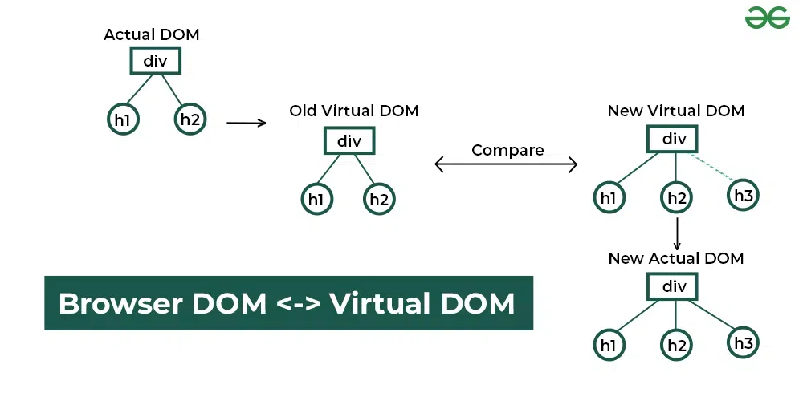
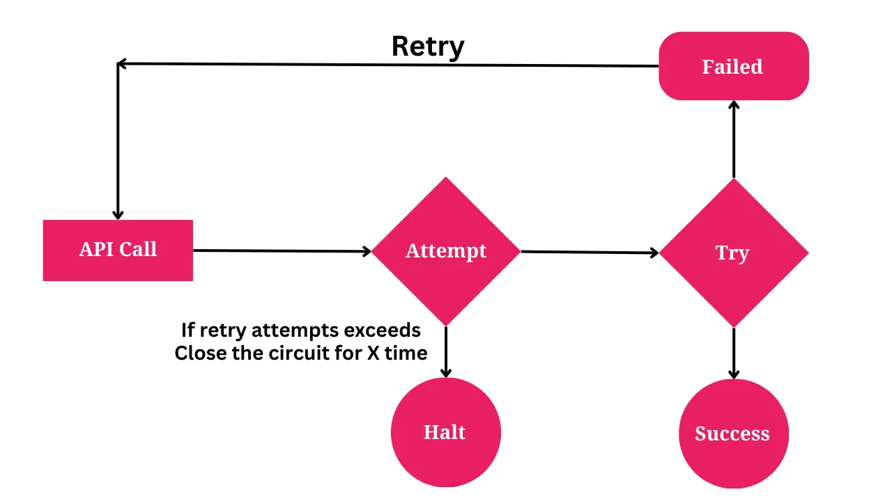

### 1. Find The OutPut

```ts
foo(); // Output: "Hello 2"
function foo() {
  console.log("Hello 1");
}
// The above code is equivalent to:
function foo() {
  console.log("Hello 2");
}
foo(); // Output: "Hello 2"


- In above example, we define `a function foo()` and call it before the actual declaration. Surprisingly, the code works without any errors. This is `because function declarations are hoisted to the top of their scope`, allowing us to `call the function before its declaration in the code`.


### Example 2.

foo();
function foo() {
  console.log("Hello");
}

function foo() {
  console.log("Hello 2");
}
foo()

Explanation:

Hello 2" is being printed twice and "Hello" is not printed.

1. In JavaScript, function declarations are "hoisted" to the top of the script, regardless of where they are defined. This means that the function is moved to the top of the script, even if it's defined later in the code.

2. In your example, the first foo() call is executed before the function is defined. However, because of hoisting, the function is already defined at the top of the script. two function declarations with the same name foo are provided. In JavaScript, when you declare a function with the same name multiple times, the last declaration will overwrite any previous declarations. Therefore, the second function definition (which logs "Hello 2") will replace the first one (which logs "Hello").

3. The second function definition, which logs "Hello 2", is defined later in the code, but it overwrites the first function definition. So, when the second foo() call is made, it will execute the second function definition, which logs "Hello 2".

4. The reason why "Hello" is not printed at all is because the first function definition is overwritten by the second one, so the first function is never executed.

- To illustrate this, here's what the code looks like after hoisting:

function foo() {
  console.log("Hello");
}

function foo() {
  console.log("Hello 2");
}
foo(); // logs "Hello 2"
foo(); // logs "Hello 2"

As you can see, the first function definition is executed once, and then the second function definition overwrites it, so the second call to foo() executes the second function definition.


### Other Example:

console.log(foo) // O/p  function foo
var foo='foo'

function foo(){
  console.log('fun')
}

console.log(foo) // O/p 'foo


// During hoisting ( memory creation phase ):
// 1. Function declaration gets priority
// 2. Variable declaration happens but
//    doesn't override function


// Step 1: First console.log(foo)
┌────────────────────────────────┐
│ Global Execution Context       │
│                               │
│ console.log(foo)              │
│ Output: [Function: foo]       │ <- Prints function because function
│                               │    declaration takes precedence
└────────────────────────────────┘

// Step 2: Variable assignment
┌────────────────────────────────┐
│ Global Execution Context       │
│                               │
│ foo = 'foo'                   │ <- Variable foo gets assigned string
│                               │    value, overwriting function
└────────────────────────────────┘

// Step 3: Second console.log(foo)
┌────────────────────────────────┐
│ Global Execution Context       │
│                               │
│ console.log(foo)              │
│ Output: "foo"                 │ <- Prints string value since foo
│                               │    was reassigned
└────────────────────────────────┘
```

### 2. Difference between Micro-task Queue and Callback Queue ?

In JavaScript, both the Micro-task Queue (also known as the Job Queue) and the Callback Queue (also known as the Task Queue) are parts of the event loop mechanism that helps manage asynchronous operations. However, they serve different purposes and have distinct characteristics. Let’s explore the differences between the Micro-task Queue and the Callback Queue:

## Micro-task Queue (Job Queue):

Priority:

1. Higher priority than the Callback Queue.
2. Microtasks are executed before the next rendering, which makes them suitable for tasks that should be executed before the user interface updates.

`Examples of Microtasks:`

1. Promises: then(), catch(), and finally() callbacks.
2. process.nextTick in Node.js.

`Order of Execution:`

1. Microtasks are processed in a FIFO (First-In-First-Out) order.
2. Once the call stack is empty, the event loop checks the Microtask Queue and processes each microtask one by one.

`Usage Scenario:`

1. Often used for tasks that need to be executed before the browser renders, making it suitable for UI-related updates and ensuring faster response times.

## Callback Queue (Task Queue):

`Priority:`

1. Lower priority than the Microtask Queue.
2. Callbacks in the Callback Queue are executed after the Microtask Queue is empty.

`Examples of Callbacks:`

1. setTimeout and setInterval callbacks.
2. DOM events like click, input, etc.
3. I/O operations in Node.js.

`Order of Execution:`

1. Callbacks in the Callback Queue are processed in a FIFO order, similar to the Microtask Queue.
   The event loop checks the Callback Queue only when the Microtask Queue is empty.

`Usage Scenario:`

1. Used for general asynchronous tasks and I/O operations that don’t require immediate attention and can be deferred.

## Relationship:

1. Execution Order:

A. When the call stack is empty, the event loop first checks the Microtask Queue. If there are microtasks, it executes them all.
B. After the Microtask Queue is empty, the event loop checks the Callback Queue and executes any available callbacks.
C. This process continues in a loop.

2. Interaction:

A. Microtasks are often used for tasks that need to be completed immediately and impact the rendering process.
B. Callbacks in the Callback Queue are typically used for less critical tasks, such as deferred or background operations.

### 3. Virtual DOM.

ReactJS Virtual DOM is an in-memory representation of the actual DOM (Document Object Model). React uses this lightweight JavaScript object to track changes in the application state and efficiently update the actual DOM only where necessary.

`How Does the Virtual DOM Work ? `

1. **Rendering the Virtual DOM:** React creates a virtual representation of the UI as a tree of JavaScript objects.
2. **Updating State:** It generates a new Virtual DOM tree to reflect the updated state when the application state changes.
3. **Diffing Algorithm:** React compares the new Virtual DOM tree with the previous one using its efficient diffing algorithm to identify the minimal set of changes required.
4. **Updating the Real DOM:** React applies only the necessary changes to the real DOM, optimizing rendering performance.

<p align="center">
  
</p>

### 4. What is Document Object Model (DOM)

- The Document Object Model (DOM) is an application programming interface (API) for manipulating HTML documents.

- The DOM represents an HTML document as a tree of nodes. The DOM provides functions that allow you to add, remove, and modify parts of the document effectively.

- Note that the DOM is cross-platform and language-independent ways of manipulating HTML and XML documents.

- In this DOM tree, the document is the root node. The root node has one child node which is the <html> element. The <html> element is called the document element.

- Each document can have only one document element. In an HTML document, the document element is the <html> element. Each markup can be represented by a node in the tree.

# NOTE :

`The getElementById()` and `querySelector()` returns an object with the Element type while `getElementsByTagName()` or `querySelectorAll()` returns NodeList which is a collection of nodes.

`Node Relationships`

- Any node has relationships to other nodes in the DOM tree. The relationships are the same as the ones described in a traditional family tree.

1. For example, <body> is a child node of the <html> node, and <html> is the parent of the <body> node.

2. The <body> node is the sibling of the <head> node because they share the same immediate parent, which is the <html> element.

### 5. What is the Output

```ts
setTimeout(() => {
  console.log("timeout 1");

  Promise.resolve().then(() => {
    console.log("promise 1");
  });
}, 0);

new Promise(function (resolve, reject) {
  console.log("promise 2");

  setTimeout(() => {
    console.log("timeout 2");

    resolve("resolve 1");
  }, 0);
}).then((res) => {
  console.log("dot then 1");
  setTimeout(() => {
    console.log(res);
  }, 0);
});
```

### 6. What is the OutPut

```ts
console.log("start");

const promise1 = Promise.resolve().then(() => {
  console.log("promise 1");
  const timer2 = setTimeout(() => {
    console.log("timer2");
  }, 0);
});

const timer1 = setTimeout(() => {
  console.log("timer1");
  const promise2 = Promise.resolve().then(() => {
    console.log("promise2");
  });
}, 0);

console.log("stop");
```

### 7. What is the OutPut

```ts
var value = 2;

function outer() {
  console.log(value, "outer");

  function inner() {
    console.log(value, "inner");
  }

  inner();

  var value = 5;
}

outer();


### Example 2.

- the output is showing 2 instead of undefined  due to hoisting

var value = 2;

function outer(value) {
  console.log(value, "outer");

  function inner() {
    console.log(value, "inner");
  }

  inner();

  var value = 5;
}

outer(value);


In JavaScript, variable declarations are "hoisted" to the top of the scope, but their assignments are not. This means that the variable is declared at the top of the scope, but its value is not assigned until the assignment statement is executed.

In your example, the value variable is declared at the top of the outer function scope, but its assignment var value = 5; is not executed until after the inner function is called.

- Here's what the code looks like after hoisting:

var value = 2;

function outer(value) {
  var value; // hoisted declaration
  console.log(value, "outer");

  function inner() {
   console.log(value, "inner");
  }

  inner();

  value = 5; // assignment happens after inner() is called
}

outer(value);


When the outer function is called, the value parameter is passed with the value 2. The value variable is declared at the top of the outer function scope, but its value is not assigned yet. So, when the console.log(value, "outer"); statement is executed, it logs 2, which is the value of the value parameter passed to the outer function.

The inner function is then called, and it logs 2 again, because the value variable is still not assigned a new value.

Finally, the assignment value = 5; is executed, but it's too late, the inner function has already been called and logged the value 2.

So, to summarize:

  1. The value variable is declared at the top of the outer function scope due to hoisting.
  2. The assignment value = 5; happens after the inner function is called.
  3. The inner function logs the value 2 because the value variable is still not assigned a new value.


### Example 3.

var x =10
function outer(){
    console.log(x,'x1')
    var x =20
    function inner(){
      console.log(x,'x2')
      var x = 30
      console.log(x,'x3')
    }
  inner()
}
outer()


### Example 4.

let a=10
function outer(){
    console.log(a,'a1')

    if(true){
      console.log(a,'a2')
      var a = 20
      let b= 30
    }
  console.log(b,'b')
}
outer()


### Example 5.

(function (){
  console.log(x,'x1')

  var x= 10

  (function (){
  console.log(x,'x2')

  var x= 20
  console.log(x,'x3')
})()

})()


### Example 6

function f() {
  var a = 1; // Step 1: Declare variable 'a' and initialize it to 1
  a = 2;     // Step 2: Change the value of 'a' to 2
  var b = g(); // Step 3: Call function 'g()' and assign its return value to 'b'
  a = 3;     // Step 4: Change the value of 'a' to 3
  return b;  // Step 5: Return the value of 'b'

  function g() { // Step 6: Define function 'g'
    return a;    // Step 7: Return the current value of 'a'
  }
}

const result = f()
console.log(result)


```

### 8. what is the output

```ts
var name = "Yomesh";

function print(name) {
  console.log(name);
  var name = "Ajay";
  console.log(name);
}

print(name);

- NOTE :  We are capturing the variable in function arguments.

// OUTPUT:

1. "Yomesh"
2.  "Ajay"


//            B.

var name = "Yomesh";

function print() {
  console.log(name);
  var name = "Ajay";
  console.log(name);
}
print();


- NOTE : Here we did not pass variable inside function arguments, so value will not be retained and hence due to hoisting it will show undefined.

// OUTPUT :
1. undefined
2. "Ajay"
```

### 9. what is the output

```ts
async function check() {
  await Promise.resolve(console.log(1));
  console.log(2);
}

console.log(3);
check();
console.log(4);

//  O/P  3,1,4,2

//  Explanation :

//  js starts executing the code synchronously so,
//  first console.log(3) will be printed.
//  next code will move on to check function ,now this is a asynchronous function which executes its statement synchronously up-to the await statement.
//  so when it reaches the await statement promise.resolve function is called  since argument provided to this function is a function call itself with console.log(1)
//  so this console function is also executed and return undefined (console does not return anything) so this undefined is passed to the promise.resolve function
//  top level code up-to await is now executed synchronously but the below which comes after the await will run asynchronously(consider this as a .then(()=>))
//  now however this promise resolved immediately js first completes the synchronous task first and moves on to next synchronous code which is console.log(4)
//  now all  of these synchronous task has finished executing and then it moves back to execute asynchronous task so this means that after
//  running console.log(4)  the final console.log(2) statement will be executed.

//  Note : the asynchronous code is handled by the micro-task queue and it is executed by the event loop only after the call stack is empty.

When you use await with a promise, it pauses the execution of the surrounding code until the promise is resolved. However, it does not block the execution of other code outside of the async function.

- In your example, here's what happens:

1. console.log(3) is executed immediately, logging 3 to the console.
2. The check() function is called, which is an async function.
3. Inside check(), await Promise.resolve(console.log(1)) is executed. This creates a promise that resolves immediately, logging 1 to the console.
4. Because of the await keyword, the execution of the check() function is paused until the promise is resolved.
5. Meanwhile, the code outside of the check() function continues to execute, so console.log(4) is executed, logging 4 to the console.
6. Once the promise is resolved, the execution of the check() function resumes, and console.log(2) is executed, logging 2 to the console.

- So, the order of execution is:

1. console.log(3) (immediate)
2. console.log(1) (inside check(), due to await)
3. console.log(4) (outside check(), while check() is paused)
4. console.log(2) (inside check(), after promise is resolved)
5. This is why the output is 3, 1, 4, 2 . The await keyword only pauses the execution of the surrounding code inside the async function, but does not block the execution of other code outside of it.


Example 2. This code will work asynchronously, will wait for promise to resolve by then  console with value 4 will be printed.

- Check this code, It resolving with value 1

async function check() {
  await Promise.resolve(1);
  console.log(2);
}

console.log(3);
check();
console.log(4);

> O/p : 3,4,2


### Example 3. This code will work synchronously.

async function check() {
  Promise.resolve(console.log(1));
  console.log(2);
}

console.log(3);
check();
console.log(4);

> O/p : 3,1,2,4

### Example 4. This code will work asynchronously by putting .then(()) to micro-stack

//  NOTE : .then(()) goes to micro-task queue.

async function check() {
   Promise.resolve(console.log(5)).then(()=>{
     console.log(1)
   });
  console.log(2);
}

console.log(3);
check();
console.log(4);
```

### 10. what is the output

<!--  Check above explanation  both have same working functionality -->

```ts
Example 1.

async function check() {
  await setTimeout(() => {
    console.log(1);
  }, 100);
  console.log(2);
}

console.log(3);
check();
console.log(4);

// O/P :  3,4,2,1

### Explanation: the output is coming as 3, 4, 2, 1 is due to the way JavaScript handles asynchronous code, setTimeout, and the await keyword.

- Here's what happens:

1. console.log(3) is executed immediately, logging 3 to the console.
2. The check() function is called, which is an async function.
3. Inside check(), await setTimeout(() => { console.log(1); }, 100) is executed. This sets a timer to log 1 to the console after 100ms.
4. Because of the await keyword, the execution of the check() function is paused until the timer is resolved (i.e., after 100ms).
5. Meanwhile, the code outside of the check() function continues to execute, so console.log(4) is executed, logging 4 to the console.
6. After 100ms, the timer is resolved, and the execution of the check() function resumes.
7. The next statement in check() is console.log(2), which logs 2 to the console.
8. Finally, the callback function inside setTimeout is executed, logging 1 to the console.

- So, the order of execution is:

1. console.log(3) (immediate)
2. console.log(4) (outside check(), while check() is paused)
3. console.log(2) (inside check(), after timer is resolved)
4. console.log(1) (inside setTimeout callback, after 100ms)

This is why the output is 3, 4, 2, 1 instead of 3, 2, 4, 1. The await keyword only pauses the execution of the surrounding code inside the async function, but does not block the execution of other code outside of it. Additionally, setTimeout is an asynchronous function that schedules a callback to be executed after a certain delay, which in this case is 100ms.


// Just like above here we have removed await keyword,  Next below code console.log(2) will not works as async because no await is there as given at above example.

Example 2.

async function check() {
  setTimeout(() => {
    console.log(1);
  }, 100);
  console.log(2);
}

console.log(3);
check();
console.log(4);

//  O/P : 3,2,4,1
```

### 11. write a function which satisfy the logic

<!--
count() // 1
count() // 2
count() // 3
count.reset()
count() //1
count() // 2
count() // 3
-->

```ts
//  A closure is a function having access to the parent scope, even after the parent function has closed.

//  Method 1. with the help of closure we can get it.
function add() {
  let counter = 0;

  function countValue() {
    counter += 1;
    return counter;
  }

  //  NOTE: We know that everything in js is an object, so we created a reset function on  countValue function in its property,
  countValue.reset = function () {
    counter = 0;
  };

  //  OR We can add reset in Function prototype like this as well.

  // Function.prototype.reset = function () {
  //   counter = 0;
  //   return counter;
  // };

  return countValue;
}

const count = add();

console.log(count());
console.log(count());
console.log(count());

count.reset();

console.log(count());
console.log(count());
console.log(count());

//                                                      By using IIFE to form closure

const count = (function () {
  let value = 0;

  function inner() {
    value++;
    return value;
  }

  inner.reset = function () {
    value = 0;
  };

  return inner;
})();

console.log(count());
console.log(count());
console.log(count());
count.reset();

console.log(count());
console.log(count());
console.log(count());

// The variable 'count' is assigned to the return value of a self-invoking function.
// The self-invoking function only runs once. It sets the counter to zero (0), and returns a function expression.
// This way add becomes a function. The "wonderful" part is that it can access the counter in the parent scope.
// This is called a JavaScript closure. It makes it possible for a function to have "private" variables.
// The counter is protected by the scope of the anonymous function, and can only be changed using the count function.
```

### 12. what is the output

```ts
// <!--  1. -->
function counter() {
  let count = 0;

  return function call() {
    count++;
    return count;
  };
}

const callBack = counter();
console.log(callBack());
console.log(callBack());
console.log(callBack());

//    2.
function counter() {
  let count = 0;

  return function call() {
    return count++;
  };
}

const callBack = counter();

console.log(callBack());
console.log(callBack());
console.log(callBack());


//  NOTE :The increment (++) operator increments (adds one to) its operand and returns the value before or after the increment,depending on where the operator is placed.
// 1. If used postfix, with operator after operand (for example, x++), the increment operator increments and returns the value before incrementing.

- Postfix increment
Example :
let x = 3;
const y = x++;
// x is 4; y is 3

let x2 = 3n;
const y2 = x2++;
// x2 is 4n; y2 is 3n

// 2. If used prefix, with operator before operand (for example, ++x), the increment operator increments and returns the value after incrementing.
- Prefix increment
let x = 3;
const y = ++x;
// x is 4; y is 4

let x2 = 3n;
const y2 = ++x2;
// x2 is 4n; y2 is 4n
```

### 13. Write a script to fetch top 3 results from Google search. Search this in google engine : last element of string java and get top 3 results.

```ts
function search() {
  let items = document.querySelectorAll(".yuRUbf a");

  let array = [];

  for (let x of items) {
    let links = x.getAttribute("href");

    array.push(links);
  }

  return array.slice(0, 3);
}

const result = search();

console.log(result);
```

### 14. What is Reconciliation in React JS

```ts

1️⃣ When a component's state is updated in ReactJS, it generates a new virtual DOM tree, referred to as the "updated tree", which mirrors the new state of the UI.

2️⃣ React compares this "updated tree" with the previous virtual DOM tree, known as the "current tree", to pinpoint the differences.

3️⃣ After identifying the changes, React selectively updates only the parts of the actual DOM that have changed, avoiding a complete re-render.

4️⃣ This selective update process, known as "reconciliation" or "diffing", is key to ReactJS's efficiency, significantly reducing the number of operations needed to refresh the UI.

5️⃣ React also prioritizes updates to improve user experience by ensuring critical updates are processed first, making interactions feel smoother and more responsive.

6️⃣ Additionally, React can batch multiple state updates together, which further optimizes performance by reducing the frequency of re-renders and updates to the DOM.

```

### 15. What is the output ?

```js
const promise = new Promise((resolve, reject) => {
  console.log(1);
  setTimeout(() => {
    console.log("timerStart");
    resolve("success");
    console.log("timerEnd");
  }, 0);
  console.log(2);
});

promise.then((res) => {
  console.log(res);
});

console.log(4);
```

### 16. Guess the Output

```js

> Question 1:

function Person(name) {
  this.name = name;

  function person() {
    return {
      name: 'Prithvi'
    };
  }

  var person = {
    name: 'Ajay',
    Game:'GTA 6'
  };

  var person = false;
  return person

}

const data = new Person('Hoka')
console.log(data,'data')


Question 2:

function Person(name) {
  this.name = name;

  function person() {
    return {
      name: 'Prithvi'
    };
  }
  var person = {
    name: 'Ajay',
    Game:'GTA 6'
  };

  return person

}

const data = new Person('Hoka')
console.log(data,'data')


> Question 3:

function Person(name) {
  this.name = name;

  function person() {
    return {
      name: 'Prithvi'
    };
  }

  return person

}

const data = new Person('Hoka')
console.log(data,'data')


```

### 17. Design and Implement localStorage API .

you need to design and implement the localStorage API. It should mimic the behaviour of existing window.localStorage.

- Properties

1. localStorage.length
   Returns an integer representing the number of data items stored in the localStorage object.

- Methods:

1. localStorage.setItem(key, value)
   When passed a key name and value, will add that key to the storage, or update that key's value if it already exists.

2. localStorage.getItem(key)
   When passed a key name, will return that key's value.

3. localStorage.removeItem(key)
   When passed a key name, will remove that key from the storage.

4. localStorage.clear()
   When invoked, will empty all keys out of the storage.

Make sure you handle different edge cases

```ts

// 1.                          Implementation using Objects:

class LocalStorage {
  constructor() {
    this.store = {};
    this.length = 0;
  }

  getItem = (...args) => {
    if (!args.length) {
      throw new TypeError("Failed to execute 'getItem'. 1 argument required, but only 0 present.");
    }

    const key = args[0];

    if (Object.prototype.hasOwnProperty.call(this.store, key)) {
      return this.store[key];
    }

    return undefined;
  };

  setItem = (...args) => {
    if (!args.length || args.length < 2) {
      throw new TypeError(`Failed to execute 'setItem'. 2 argument required, but only ${args.length} present.`);
    }

    const key = args[0];
    const value = args[1];

    this.store[String(key)] = String(value);
    this.length += 1;
  };

  removeItem = (...args) => {
    if (!args.length) {
      throw new TypeError("Failed to execute 'removeItem'. 1 argument required, but only 0 present.");
    }

    const key = args[0];

    if (Object.prototype.hasOwnProperty.call(this.store, key)) {
      delete this.store[key];
    }

    this.length -= 1;
  };

  clear = () => {
    this.store = {};
    this.length = 0;
  };
}

const localStorageItem = new LocalStorage();

// 2.                                     Implementation using Array:

class LocalStorage {
  constructor() {
    this.store = [];
    this.length = 0;
  }

  setItem(key, value) {
    this.store.push({ [key]: value });
    this.length += 1;
  }

  getItem(key = "") {
    if (!key) {
      throw new Error("Failed to execute 'removeItem' on 'Storage': 1 argument required, but only 0 present.");
    }
    for (let item of this.store) {
      if (key in item) {
        return item[key];
      }
    }

    return undefined;
  }

  removeItem(key = "") {
    if (!key) {
      throw new Error("Failed to execute 'removeItem' on 'Storage': 1 argument required, but only 0 present.");
    }

    for (let x = 0; x < this.store.length; x++) {
      if (key in this.store[x]) {
        this.store.splice(x, 1);
        this.length -= 1;
      }
    }
  }

  clear() {
    this.store = [];
    this.length = 0;
  }
}

const localStorageItem = new LocalStorage();

//  3.                                       Implementation using Map

class LocalStorage {
  constructor() {
    this.store = new Map();
  }

  get length() {
    return this.store.size;
  }

  getItem = (...args) => {
    if (!args.length) {
      throw new TypeError("Failed to execute 'getItem'. 1 argument required, but only 0 present.");
    }

    const key = args[0];

    return this.store.get(String(key));
  };

  setItem = (...args) => {
    if (!args.length || args.length < 2) {
      throw new TypeError(`Failed to execute 'setItem'. 2 argument required, but only ${args.length} present.`);
    }

    const key = args[0];
    const value = args[1];

    this.store.set(String(key), String(value));
  };

  removeItem = (...args) => {
    if (!args.length) {
      throw new TypeError("Failed to execute 'removeItem'. 1 argument required, but only 0 present.");
    }

    const key = args[0];

    this.store.delete(String(key));
  };

  clear = () => {
    this.store.clear();
  };
}

const localStorageItem = new LocalStorage();

localStorageItem.setItem("1", "part one");
localStorageItem.setItem("2", "part two");
localStorageItem.setItem("3", "part 3");
localStorageItem.setItem("4", "part 4");
console.log(localStorageItem, "before clear");
console.log(localStorageItem.getItem("3"));
localStorageItem.removeItem("2");
console.log(localStorageItem, "after clear");

```

### 18. LocalStorage with expiry

`Points:`

1. Extend the local storage to accept an expiry time and expire the entry after that time.

- To implement this we will override the existing local storage method.

While adding the entry we will accept the expiry date in milliseconds (30 days by default). Set the expiry date to time from the current date along with the value and store it in the original local storage.

Likewise, while getting the value for the given key, check if there is a value associated with the key, if it exists and is not expired then return the value, else remove the entry and return null.

```ts

### Example 1. By using window object and using localStorage.

window.myLocalStorage = {
  getItem(key) {
    // get the parsed value of the given key
    let result = JSON.parse(window.localStorage.getItem(key));

    // if the key has value
    if (result) {
      // if the entry is expired
      // remove the entry and return null
      if (result.expireTime <= Date.now()) {
        window.localStorage.removeItem(key);
        return null;
      }

      // else return the value
      return result[key];
    }

    // if the key does not have value
    return null;
  },

  // add an entry

  // default expiry is 30 days in milliseconds

  setItem(key, value, maxAge = 30 * 60 * 60 * 1000) {
    // store the value as object
    // along with expiry date
    let result = {
      [key]: value,
    };

    if (maxAge) {
      // set the expiry
      // from the current date
      result.expireTime = Date.now() + maxAge;
    }

    // stringify the result
    // and the data in original storage
    window.localStorage.setItem(key, JSON.stringify(result));
  },

  // remove the entry with the given key
  removeItem(key) {
    window.localStorage.removeItem(key);
  },

  // clear the storage
  clear() {
    window.localStorage.clear();
  },
};

`Input:`;
myLocalStorage.setItem("foo", "bar", 1000);

setTimeout(() => {
  console.log(myLocalStorage.getItem("foo"));
}, 1500);

`Output:`;
// null


### Example 2. By building custom local storage with class and not using built in localStorage. Here we are setting a single expiry time  for all the key/value pairs .

class LocalStorage {
  constructor() {
    this.store = {};
    this.length = 0;
  }

  getItem = (...args) => {
    if (!args.length) {
      throw new TypeError("Failed to execute 'getItem'. 1 argument required, but only 0 present.");
    }

    const key = args[0];

    if (Object.prototype.hasOwnProperty.call(this.store, key)) {

      if(this.store.expiry<= Date.now()){
        delete this.store[key]
        delete this.store['expiry']
        return null
      }
      return this.store[key];
    }

    return undefined;
  };

  setItem = (...args) => {
    if (!args.length || args.length < 2) {
      throw new TypeError(`Failed to execute 'setItem'. 2 argument required, but only ${args.length} present.`);
    }

    const key = args[0];
    const value = args[1]
    const expiry=args[2]
    if(expiry){
      this.store['expiry'] = Date.now()+expiry
    }

    this.store[String(key)] = String(value);
    this.length += 1;
  };

  removeItem = (...args) => {
    if (!args.length) {
      throw new TypeError("Failed to execute 'removeItem'. 1 argument required, but only 0 present.");
    }

    const key = args[0];

    if (Object.prototype.hasOwnProperty.call(this.store, key)) {
      delete this.store[key];
    }

    this.length -= 1;
  };

  clear = () => {
    this.store = {};
    this.length = 0;
  };
}

const localStorageItem = new LocalStorage();

localStorageItem.setItem("1", "part one",30);

setTimeout(()=>{

 console.log(localStorageItem.getItem("1"),'Get Item inside')

 console.log(localStorageItem,'localStorageItem inside')

},4000)

console.log(localStorageItem.getItem("1"),'Get Item outside')
console.log(localStorageItem,'localStorageItem outside')


### 3. This Custom Expiry is More accurate than Above example. Here we are setting expiry time  for each the key/value pairs separately.
class LocalStorage {

  constructor(){
    this.storage = {}
    this.length = 0
  }


  setItem(key,value,expiry=0){

    if(!key){
      throw new Error('key is required')
    }
    if(!value){
      throw new Error('value is required')
    }

     const item = {
      [key] : value,
       expiry: Date.now() + expiry
    }
    this.length +=1

    this.storage[String(key)] = item
  }

  getItem(key){

    if(!this.storage[key]){
      return undefined
    }

    if(Date.now() >= this.storage[key].expiry){
      this.length -=1
      delete this.storage[key]
      return null
    }

    return this.storage[key][key]

  }

  removeItem(key){
    if(!key){
      throw new Error('key is required')
    }
    this.length -=1
    delete this.storage[key]
  }

  clear(){
    this.storage = {}
    this.length=0
  }

}

const localStorage = new LocalStorage()

localStorage.setItem('place','Nether')
localStorage.setItem('Country','uk')
localStorage.setItem('Id','99',50)
console.log(localStorage.getItem('Id'))

console.log(localStorage,'localStorage')

setTimeout(()=>{
  console.log(localStorage.getItem('Id'))
  console.log(localStorage,'localStorage')
},2000)


localStorage.clear()

console.log(localStorage,'localStorage')


```

### 19. design ui which shows concentric circles based on given number of times.

```ts
export default function App() {
  const NUM = 5;
  return (
    <div className="App">
      <Circles n={NUM} />
    </div>
  );
}

const Circles = ({ n }) => {
  const size = `${n * 100}px`;
  const styles = {
    width: size,
    height: size,
    border: "1px solid gray",
    borderRadius: "50%",
    display: "flex",
    alignItems: "center",
    justifyContent: "center",
  };

  return <div style={styles}>{n > 1 ? <Circles n={n - 1} /> : null}</div>;
};
```

### 20. Fetch not throwing error on 4XX in JavaScript.

1. Fetch in JavaScript helps you to make the network call and fetch the data from the server.

2. It is easy to use and abstracts the traditional XMLHttpRequest object and helps to do better to Ajax calls.

```ts

`This is how we make requests using fetch`
async function networkCall(){
  try{
    const response = await fetch('https://learnersbucket.com/dummy');
    return response.json();
  }catch(e){
    console.error(e);
  }
}

- The weird thing about above example is that  fetch does not throw an error when the HTTP network returns status 4XX or 5XX. To fix this, we can use a workaround and manually throw an error when the network status is not OK or 200.

`Solution :`
async function networkCall(){
  try{
    const response = await fetch('https://learnersbucket.com/dummy');
    if(!response.ok){
       // Throw an error if not 200
       throw new Error('Did not received 200 in response');
    }
    return response.json();
  }catch(e){
    console.error(e);
  }
}
```

### 21. Implement ClearAllInterval in JavaScript

- Points To Notice.

1. JavaScript has a timer function setInterval which repeatedly executes a function after a specified amount of time. Each setInterval method returns a unique id which can be used to cancel or clear the interval using clearInterval.

2. It is a common interview question where we are asked to implement a method clearAllInterval which will clear all the running setInterval’s.

3. Similarly, as we have implemented the clearAllTimeout method, the same logic can be used to implement the clearAllInterval.

4. First, to clear all the intervals at once, we need to store all of them so that they can be cleared one by one using the clearInterval method.

5. Thus we can define a global variable intervalIds that will store the ids of the setIntervals and override the existing setInterval function to push the ids in this global variable.

```ts
//to store all the interval ids

window.intervalIds = [];

//original interval function
const originalIntervalFn = window.setInterval;

//overriding the original
window.setInterval = function (fn, delay) {
  const id = originalIntervalFn(fn, delay);
  //storing the id of each interval
  intervalIds.push(id);
  return id;
};

//clear all interval
window.clearAllInterval = function () {
  while (intervalIds.length) {
    clearInterval(intervalIds.pop());
  }
};

//  Execution:

let timer = setInterval(() => {
  console.log("Hello");
}, 2000);

let timer2 = setInterval(() => {
  console.log("Hello2");
}, 5000);

clearAllInterval(); // It will stop all setIntervals But if you want to stop single interval then pass the timer inside clearAllInterval(timer) and set while loop accordingly.

let timer3 = setInterval(() => {
  console.log("Hello3");
}, 1000);

// Output:
("Hello3"); // after every ~1 sec

//  Note: top two setInterval method  will not execute because we have called clearAllInterval but below setInterval will work and o/p : Hello3


- If you notice, here we have added a global variable intervalIds which we are using to store the ids of each setInterval and later to cancel all of them. Using the global variable is bad practice as it can be overridden.

1. One thing you could do over here is to wrap these inside a closure or higher-order function or an Object to keep it restricted.

2. This way we won’t be interfering with existing methods and can still get our work done.


const MY_TIMERS = {
    intervalIds : [],//global interval id's arrays
    //create a MY_TIMERS's interval
    setInterval : function(fn,delay){
        let id = setInterval(fn,delay);
        this.intervalIds.push(id);
        return id;
    },
    //MY_TIMERS's clearAllTimeout
    clearAllInterval : function(){
        while(this.intervalIds.length){
          clearInterval(this.intervalIds.pop());
        }
    }
};

//  Execution:

MY_TIMERS.setInterval(() => {
  console.log("Hello");
}, 2000);

MY_TIMERS.setInterval(() => {
  console.log("Hello2");
}, 500);

MY_TIMERS.clearAllInterval();

MY_TIMERS.setInterval(() => {
  console.log("Hello3");
}, 1000);

```

### 22 .Implement clearAllTimeout in JavaScript.

1. ClearAllTimeout clears all the setTimeout which are active.

2. setTimeout is an asynchronous function that executes a function or a piece of code after a specified amount of time.

3. setTimeout method returns a unique Id when it is invoked, which can be used to cancel the timer anytime using the clearTimeout method which is inbuilt.

4. Reading about the problem statement we can understand that all we have to do is to clear all the active timers and the same can be done by clearing all timeoutIds using clearTimeout.

```ts
//  to clear all the timeoutIds at once, we will need to store them somewhere, let’s say in an array. For which we will override the existing setTimeout method and collect all the timeoutIds in an array.
window.timeoutIds = [];

// store the original method
const originalTimeoutFn = window.setTimeout;

//over-writing the original method
window.setTimeout = function (fn, delay) {
  const id = originalTimeoutFn(fn, delay);
  timeoutIds.push(id);

  //return the id so that it can be originally cleared
  return id;
};

window.clearAllTimeout = function () {
  //clear all timeouts
  while (timeoutIds.length) {
    clearTimeout(timeoutIds.pop());
  }
};


//  Execution :
- If we test this, this runs as expected. It will clear all the timeouts, as setTimeout is an Asynchronous function, meaning that the timer function will not pause execution of other functions in the functions stack, thus clearAllTimeout runs and cancels them before they can be executed.

setTimeout(() => {console.log("hello")}, 2000);
setTimeout(() => {console.log("hello1")}, 3000);

clearAllTimeout(); // Here it will clear all timeout above it and prevent them from execution.

setTimeout(() => {console.log("hello2")}, 4000);
setTimeout(() => {console.log("hello3")}, 5000);


- OR By Using IIFE

(function(w) {

  const timeoutIds = [];

  // store the original method
  const originalTimeoutFn = w.setTimeout;

  // override the original setTimeout method with our
  // custom implementation
  w.setTimeout = function(fn, delay) {
    const id = originalTimeoutFn(fn, delay);
    timeoutIds.push(id);
    //return the id so that it can be originally cleared
    return id;
  }
  w.clearAllTimeout = function(){
    //clear all timeouts
    while(timeoutIds.length){

      clearTimeout(timeoutIds.pop());

    }
  }
})(window);

- Case 1 without clearing
setTimeout(() => {console.log("One")}, 4000);
setTimeout(() => {console.log("Two")}, 5000);
setTimeout(() => {console.log("Three")}, 6000);
setTimeout(() => {console.log("Four")}, 7000);

`O/P :`
// One
// Two
// Three
// Four


- Case 2 with clearing
setTimeout(() => {console.log("One")}, 4000);
setTimeout(() => {console.log("Two")}, 5000);
setTimeout(() => {console.log("Three")}, 6000);
setTimeout(() => {console.log("Four")}, 7000);
clearAllTimeout();

`O/P :`
//  It will print nothing.

- NOTE :
1. Here we have added a global variable timeoutIds which we are using to store the ids of each setTimeout and later to cancel all of them, using the global variable is bad practice as it can be overridden.

2. One thing you could do over here is to wrap these inside a closure or higher-order function or an Object to keep it restricted.

3. This way we won’t be interfering with existing methods and can still get our work done.


`Optimized Way :`
const MY_TIMERS = {
    timeoutIds : [],//global timeout id arrays.

    //create a MY_TIMERS's timeout
    setTimeout : function(fn,delay){
        let id = setTimeout(fn,delay);
        this.timeoutIds.push(id);
        return id;
    },
    //MY_TIMERS's clearAllTimeout
    clearAllTimeout : function(){
        while(this.timeoutIds.length){
          clearTimeout(this.timeoutIds.pop());
        }
    }
};


const id1 = MY_TIMERS.setTimeout(() => {console.log("hello1")}, 1000);
console.log(id1);

const id2 = MY_TIMERS.setTimeout(() => {console.log("hello2")}, 2000);
console.log(id2);

MY_TIMERS.clearAllTimeout();

const id3 = MY_TIMERS.setTimeout(() => {console.log("hello3")}, 3000);
console.log(id3);
```

### 23. Methods for Merging Nested Objects in JavaScript.

```ts
const obj1 = {
  name: "gk",
  Home: {
    place: "London",
    country: "Uk",
    Game: {
      type: {
        action: "gta",
      },
    },
  },
};

const obj2 = {
  subject: "SST",
  school: {
    place: "bangalore",
    name: "dav",
  },
};


- 1. Shallow Merge with Spread Operator
The spread operator (...) is a concise way to merge two objects. While it performs a shallow merge, it's a quick and clean solution for simple cases.

const shallowMergedObj = { ...obj1, ...obj2 };
console.log(shallowMergedObj)


- 2. Using Object.assign
Object.assign is a method for copying the values of all enumerable properties from one or more source objects to a target object, providing a simple way for shallow merging.

const shallowMergedObjAssign = Object.assign({}, obj1, obj2);
console.log(shallowMergedObjAssign)

- 3.  Using JSON.parse and JSON.stringify
For JSON-serializable objects, converting them to JSON strings, merging the strings, and then parsing them back can be an interesting approach.

const jsonString1 = JSON.stringify(obj1);
const jsonString2 = JSON.stringify(obj2);
const mergedJsonString = JSON.stringify({ ...JSON.parse(jsonString1), ...JSON.parse(jsonString2) });

const deepMergedObjJSON = JSON.parse(mergedJsonString);
console.log(deepMergedObjJSON)


- 4. Using a Library — Lodash
Lodash is a popular utility library with a merge function that handles deep merging efficiently.

const _ = require('lodash');

const lodashMergedObj = _.merge({}, obj1, obj2);

- 5. Using a Library — Deepmerge
The deepmerge library provides a dedicated utility for deep merging, making the process straightforward.

const deepmerge = require('deepmerge');

const deepMergedObjDeepmerge = deepmerge(obj1, obj2);


- 6. Using a Library — Ramda
Ramda is a functional programming library that includes a mergeDeepRight function for deep merging.

const R = require('ramda');
const ramdaMergedObj = R.mergeDeepRight(obj1, obj2);

- 7. Using ES6 Spread Operator for Deep Merge : shallow copy
Leveraging the ES6 spread operator with recursion allows for a concise syntax while achieving a deep merge.

function deepMergeShallow(obj1, obj2) {
  const result = { ...obj1 };

  for (let key in obj2) {
    if (obj2.hasOwnProperty(key)) {
      if (obj2[key] instanceof Object && obj1[key] instanceof Object) {
        result[key] = deepMergeShallow(obj1[key], obj2[key]);
      } else {
        result[key] = obj2[key];
      }
    }
  }

  return result;
}

const deepMergedObjSpread = deepMergeShallow(obj1, obj2);


- 8. Deep Merge with Recursive Function : shallow copy
For a deep merge, a recursive function can be employed to traverse and merge nested objects at all levels.

function deepMergeShallow(obj1, obj2) {
  for (let key in obj2) {
    if (obj2.hasOwnProperty(key)) {
      if (obj2[key] instanceof Object && obj1[key] instanceof Object) {
        obj1[key] = deepMergeShallow(obj1[key], obj2[key]);
      } else {
        obj1[key] = obj2[key];
      }
    }
  }
  return obj1;
}

const deepMergedObj = deepMergeShallow(obj1, obj2);

- 9 Shallow copy
function deepMergeShallow(...objs){
  let result = {}

  for(let item of objs){
    for(let key in item){
      result [key] = item[key]
    }
  }
  return result
}

const result = deepMergeShallow(obj1,obj2)


# Above all are shallow copy examples.
```

### 24. What is a deep copy ?

1. A deep copy means actually creating a new array and copying over the values, since whatever happens to it will never affect the original one.
2. For objects and arrays containing other objects or arrays, copying these objects requires a deep copy. Otherwise, changes made to the nested references will change the data nested in the original object or array.
3. When JavaScript objects including arrays are deeply nested, the spread operator only copies the first level with a new reference, but the deeper values are still linked together. To solve this problem requires creating a deep copy

- Shallow Copy Example

```ts
1. Array.from,
let a = [{x:1,y:2,z:3}];
let b = Array.from(a);
b[0].x = 0;

console.log(JSON.stringify(a)); // [{"x":0,"y":2,"z":3}]
console.log(JSON.stringify(b)); // [{"x":0,"y":2,"z":3}]

2. Object.create,
let a = [{x: 1,y: 2,z: 3}];
let b = Array.from(Object.create(a));
b[0].x = 0;

console.log(JSON.stringify(a)); // [{"x":0,"y":2,"z":3}]
console.log(JSON.stringify(b)); // [{"x":0,"y":2,"z":3}]

3. Object.assign,

let a = { x: {z:1} , y: 2};
let b = Object.assign({}, a);
b.x.z=0

console.log(JSON.stringify(a)); // {"x":{"z":0},"y":2}
console.log(JSON.stringify(b)); // {"x":{"z":0},"y":2}

```

- For Deep Copy,

1. $.extend is the deep copy solution for nested objects and objects inside array.

2. JSON.parse and JSON.stringify is the best and simple way to Deep copy. The JSON.stringify() method converts a JavaScript value to a JSON string.The JSON.parse() method parses a JSON string, constructing the JavaScript value or object described by the string.

- Deep Copy Example

```ts
The easiest (but flawed) way to deep copy an object in JavaScript is to first serialize it and then deserialize it back via JSON.stringify and JSON.parse.

Although this approach is acceptable given the input object only contains null, boolean, number, string, you should be aware of the downsides of this approach:

  1.  We can only copy non-symbol-keyed properties whose values are supported by JSON. Unsupported data types are simply ignored.
  2. JSON.stringify also has other a few surprising behaviors such as converting Date objects to ISO timestamp strings, NaN and Infinity becoming null etc.


 - On Object.
let a = { x:{z:1} , y: 2};
let b = JSON.parse(JSON.stringify(a));
b.x.z=0

console.log(JSON.stringify(a)); // {"x":{"z":1},"y":2}
console.log(JSON.stringify(b)); // {"x":{"z":0},"y":2}


- On objects inside array.

//Deep Clone
let a = [{ x:{z:1} , y: 2}];
let b = JSON.parse(JSON.stringify(a));
b[0].x.z=0

console.log(JSON.stringify(a)); //[{"x":{"z":1},"y":2}]
console.log(JSON.stringify(b)); // [{"x":{"z":0},"y":2}]

- Implementation of Deep Copy, Without using any third party.

A deep clone makes a copy of JavaScript value, leading to a completely new value that has no references pointing back to the properties in the original object (if it's an object). Any changes made to the deep-copied object will not affect the original object.

const obj = {
   a1: {
       b1: {
           c1: "SS"
       }
    }
}

// Method 1.

const deepCopy = (val) => {
   if (["string", "boolean", "number"].includes(typeof val)) {
      return val;
   } else if (Array.isArray(val)) {
      return val.map(item => deepCopy(item))
   } else {
      return Object.keys(val).reduce((acc, key) => {
        acc[key] = deepCopy(val[key]);
        return acc;
     }, {});
  }
}
console.log(deepCopy(obj));

//   Method 2.

const  deepClone(value) {
  if (typeof value !== 'object' || value === null) {
    return value;
  }

  if (Array.isArray(value)) {
    return value.map((item) => deepClone(item));
  }

  return Object.fromEntries(
    Object.entries(value).map(([key, value]) => [key, deepClone(value)]),
  );
}

console.log(deepClone(obj))


//  Method 3. By using for loops

const obj1 = {
  place:'Germany',
  name: "gk",
  Home: {
    genre:[1,2,{'horror':8,'rate':9},{'imdb':9}],
    place: "London",
    country: "Uk",
    Game: {
      type: {
        action: "gta",
      },
    },
  },
};

function deepMergeShallow(obj1){

  let result = {}

   if(["string", "boolean", "number",'function'].includes(typeof obj1)){
     return obj1
   }

  if (Array.isArray(obj1)) {
      return obj1.map(deepMergeShallow)
   }

   for(let item in obj1){
      if(typeof obj1[item]==='object'){
       result [item] = deepMergeShallow(obj1[item])
      }else{
        result [item] = obj1[item]
      }
    }

  //      OR Below more optimized.

  //  for(let item in obj1){
  //       let value= obj1[item]
  //      result [item] = deepMergeShallow(value)
  //   }


  return result
}

const result = deepMergeShallow(obj1)

result.Home.genre[2]['horror']='sare gama'
console.log(result,obj1)


### Method 4. This is more Optimized

function deepMergeShallow(input) {
    // Handle null and primitive types
    if (input === null || ["string", "boolean", "number", "function"].includes(typeof input)) {
        return input;
    }

    // Handle arrays
    if (Array.isArray(input)) {
        return input.map(deepMergeShallow);
    }

    // Handle objects
    const result = {};
    Object.keys(input).forEach(key => {
        const value = input[key]
        result[key] = deepMergeShallow(value);
    });

    return result;
}

const result = deepMergeShallow(obj1)
result.Home.genre[2]['horror']='sare gama'
console.log(result,obj1);
```

### 25. Convert HEX color to RGB in JavaScript.

`NOTE :`

- Hexadecimal uses 16 unique symbols, representing values as “0 – 9” for values between 0 – 9 and “A – F” or “a – f” for values between “10 – 15”.

- Hexadecimal is a base 16 system numbering system where a Hex code can be any of these 16 digits: 0 1 2 3 4 5 6 7 8 9 A B C D E F

- RGB format is a combination of three colors, red, green, and blue in the range of 0 – 255. A hex color code is the hexadecimal representation of the RGB numbers.

`NOTE :`

- The parseInt() function parses a string argument and returns an integer of the specified radix (the base in mathematical numeral systems).

// Syntax :
parseInt(string)
parseInt(string, radix)

- Parameters

1. string
   A string starting with an integer. Leading whitespace in this argument is ignored.

2. radix Optional
   An integer between 2 and 36 that represents the radix (the base in mathematical numeral systems) of the string. It is converted to a 32-bit integer; if it's nonzero and outside the range of [2, 36] after conversion, the function will always return NaN. If 0 or not provided, the radix will be inferred based on string's value. Be careful — this does not always default to 10! The description below explains in more detail what happens when radix is not provided.

- Return value
  An integer parsed from the given string, or NaN when :

1. the radix as a 32-bit integer is smaller than 2 or bigger than 36, or
2. the first non-whitespace character cannot be converted to a number.

`Examples :`
console.log(parseInt('123'));
// 123 (default base-10)
console.log(parseInt('123', 10));
// 123 (explicitly specify base-10)
console.log(parseInt(' 123 '));
// 123 (whitespace is ignored)
console.log(parseInt('077'));
// 77 (leading zeros are ignored)
console.log(parseInt('1.9'));
// 1 (decimal part is truncated)
console.log(parseInt('ff', 16));
// 255 (lower-case hexadecimal)
console.log(parseInt('0xFF', 16));
// 255 (upper-case hexadecimal with "0x" prefix)
console.log(parseInt('xyz'));
// NaN (input can't be converted to an integer)

```ts
const Input = "#ff33ff"

// Output:{
//   "r": 255,
//   "g": 51,
//   "b": 255
// }


`Approach 1. Using slice() method.`

A HEXA color code '#ff33ff' starts with '#' followed by six alpha-numeric characters ff,33,ff, two of them each representing, R, G, & B.
We can use the slice() to get the two number and then use parseInt() method that accepts a radix value and convert the string to number.


// Example :
const hex2rgb = (hex) => {
    const r = parseInt(hex.slice(1, 3), 16);
    const g = parseInt(hex.slice(3, 5), 16);
    const b = parseInt(hex.slice(5, 7), 16);

    // return {r, g, b}
    return { r, g, b };
}

console.log(hex2rgb("#ff33ff"));

- In case we are given a short form of Hexa code like #f3f, we will have to convert it to the original form.

const fullHex = (hex) => {
  let r = hex.slice(1,2);
  let g = hex.slice(2,3);
  let b = hex.slice(3,4);

  r = parseInt(r+r, 16);
  g = parseInt(g+g, 16);
  b = parseInt(b+b, 16);

  // return {r, g, b}
  return { r, g, b };
}

//convert hex to rgb
const hex2rgb = (hex) => {
    if(hex.length === 4){
      return fullHex(hex);
    }

    const r = parseInt(hex.slice(1, 3), 16);
    const g = parseInt(hex.slice(3, 5), 16);
    const b = parseInt(hex.slice(5, 7), 16);

    // return {r, g, b}
    return { r, g, b };
}

console.log(hex2rgb("#f3f"));
```

### 26 .Convert RGB color to HEX in JavaScript.

```ts

- All the input parameters are mandatory so let us first take case of the error condition
const isInvalid = (value) => {
  return Boolean(value === null || value === undefined || typeof value !== "number");
};


- Every input parameter is an integer, let us create a function to convert them to strings using toString method with a base of 16.

The each Hex code should be at-least of length 2. Let us extend our function to handle this case so that RGB values like 0 results in 00. We would be using padStart method for this. The padStart method takes the total length of the string and another string that needs to appended to the start of the original string i.e. '0'.padStart(3, '1') becomes 110.

function convertToString(value) {
  //  The RGB values are in the range 0-255. Let us handle if the values provided are outside this range.

  if (value > 255) {
    return "FF";
  } else if (value < 0) {
    return "00";
  }

  return value.toString(16).padStart(2, "0").toUpperCase();
}

function rgbToHex(r, g, b) {
  "use strict";

  const isRedValueInvalid = isInvalid(r);
  const isGreenValueInvalid = isInvalid(g);
  const isBlueValueInvalid = isInvalid(b);

  if (isRedValueInvalid || isGreenValueInvalid || isBlueValueInvalid) {
    throw new TypeError("Invalid input parameters");
  }

  return "#" + convertToString(r) + convertToString(g) + convertToString(b);
}


- Our function rgbToHex takes three input parameters, namely, r, g, and b where each parameter defines the intensity of a color as an integer between 0 and 255.

rgbToHex(255, 255, 255);
// -> Should return #FFFFFF

rgbToHex(0, 0, 0);
// -> Should return #000000

rgbToHex(186, 218, 85);
// -> Should return #BADA55

rgbToHex(256, 255, 255);
// -> Should return #FFFFFF


-  OR

function rgb(...arrays){
    let hex ='#'

  for(let x of arrays){

    hex = hex + x.toString(16)
  }
  return hex
}

let result = rgb(29,55,25)
console.log(result,'result')


//                Second Way

var a = "rgb(255,255,255)".split("(")[1].split(")")[0];
// Then split it into separate numbers:

a = a.split(",");
// Convert the single numbers to hex

var b = a.map(function(x){             //For each array element
    x = parseInt(x).toString(16);      //Convert to a base16 string
    return (x.length==1) ? "#" : x;  //Add # if we get only one character
})
// And glue it back together:

b = "#"+b.join("");

console.log(b,'result')


// ===============================================================================================================================================================
 - NOTE : The toString() method of Number values returns a string representing this number value.

 function hexColor(c) {
  if (c < 256) {
    return Math.abs(c).toString(16);
  }
  return 0;
}

console.log(hexColor(233));
// Expected output: "e9"

console.log(hexColor('11'));
// Expected output: "b"

`Syntax:`
1. toString()
2. toString(radix)

`Parameters`
1. radix Optional
An integer in the range 2 through 36 specifying the base to use for representing the number value. Defaults to 10.

`Return value`
A string representing the specified number value. Scientific notation is used if radix is 10 and the number's magnitude (ignoring sign) is greater than or equal to 1021 or less than 10-6.

`Exceptions`
1. RangeError
Thrown if radix is less than 2 or greater than 36.

`TypeError`
Thrown if this method is invoked on an object that is not a Number.


- Examples
const count = 10;
console.log(count.toString()); // "10"

console.log((17).toString()); // "17"
console.log((17.2).toString()); // "17.2"

const x = 6;
console.log(x.toString(2)); // "110"
console.log((254).toString(16)); // "fe"
console.log((-10).toString(2)); // "-1010"
console.log((-0xff).toString(2)); // "-11111111"


- Converting radix of number strings
If you have a string representing a number in a non-decimal radix, you can use parseInt() and toString() to convert it to a different radix.

`Example:`
const hex = "CAFEBABE";
const bin = parseInt(hex, 16).toString(2); // "11001010111111101011101010111110"
```

### 27. Execute async functions in parallel in JavaScript.

Implement a function in JavaScript that takes a list of async functions as input and a callback function and executes the async tasks in parallel that is all at once and invokes the callback after every task is executed.

```js
// To create an async task, we have created a function that accepts a callback and runs a setTimeout for a random time and invokes this callback inside the timeout.
function createAsyncTask() {
  const value = Math.floor(Math.random() * 10);
  return function (callback) {
    setTimeout(() => {
      callback(value);
    }, value * 1000);
  };
}

function asyncParallel(tasks, callback) {
  const results = [];
  let tasksCompleted = 0;

  // run each task
  tasks.forEach((asyncTask) => {
    // invoke the async task
    // it can be a promise as well
    // for a promise you can chain it with then
    asyncTask((value) => {
      // store the output of the task
      results.push(value);

      // increment the tracker
      tasksCompleted++;

      // if all tasks are executed
      // invoke the callback
      if (tasksCompleted >= tasks.length) {
        callback(results);
      }
    });
  });
}

//                      OR

// function asyncParallel(tasks, callback) {
//   const results = [];

//   let tasksCompleted = 0;

//   const callBackFunction = (value) => {

//     results.push(value);
//     tasksCompleted++;

//     if (tasksCompleted >= tasks.length) {
//       callback(results);
//     }
//   };

//   tasks.forEach((asyncTask) => {

//     asyncTask(callBackFunction);

//   });

// }

const taskList = [createAsyncTask(1), createAsyncTask(2), createAsyncTask(3), createAsyncTask(4), createAsyncTask(5), createAsyncTask(6)];

asyncParallel(taskList, (result) => {
  console.log("results", result);
});


- NOTE : In above example data is not getting stored in a sequence. To store Data in sequence we need take index and store data to matched index in an array.

### Example to store async function data in a sequence.

function createAsyncTask(data) {
  const value = Math.floor(Math.random() * 10);
  return function (callback,index) {
    setTimeout(() => {
      callback(data,index);
    }, value * 1000);
  };
}

function asyncParallel(tasks, callback) {
  const results = [];

  let tasksCompleted = 0;

  const callBackFunction = (value,index) => {

    results[index] = value
    tasksCompleted++;

    if (tasksCompleted >= tasks.length) {
      callback(results);
    }
  };

  tasks.forEach((asyncTask,index) => {

    asyncTask(callBackFunction,index);

  });

}


const taskList = [createAsyncTask(1), createAsyncTask(2), createAsyncTask(3), createAsyncTask(4), createAsyncTask(5), createAsyncTask(6)];

asyncParallel(taskList, (result) => {
  console.log("results", result);
});


```

`NOTE`: Execute promises in Parallel.
In the above example, we have seen the async task created through setTimeout, the same can be extended to execute the promises in Parallel.

First thing we will have to do is update the createAsyncTask() test function, this function will now return a promises that will reject if the random value is less than 5, else it will resolve.

```js
function createAsyncTask() {
  const value = Math.floor(Math.random() * 10);
  return new Promise((resolve, reject) => {
    setTimeout(() => {
      if (value < 5) {
        reject(`Error ${value}`);
      } else {
        resolve(value * 1000);
      }
    }, value * 1000);
  });
}

// After this, we will modify the asyncParallel() function, we will use the same logic, but now will store the outcome of resolved as well as rejected promises in different arrays, and handle them using the then, catch, and finally block.

function asyncParallel(tasks, callback) {
  // store the result
  const results = [];

  const errors = [];

  // track the task executed
  let tasksCompleted = 0;

  // run each task
  tasks.forEach((asyncTask) => {
    // invoke the async task
    // it can be a promise as well
    // for a promise you can chain it with then
    asyncTask
      .then((value) => {
        // store the output of the task
        results.push(value);
      })
      .catch((error) => {
        errors.push(error);
      })
      .finally(() => {
        // increment the tracker
        tasksCompleted++;

        // if all tasks are executed
        // invoke the callback
        if (tasksCompleted >= tasks.length) {
          callback(errors, results);
        }
      });
  });
}

const taskList = [createAsyncTask(), createAsyncTask(), createAsyncTask(), createAsyncTask(), createAsyncTask(), createAsyncTask()];

asyncParallel(taskList, (error, result) => {
  console.log("errors", error);
  console.log("results", result);
});
```

### 28. Javascript setInterval method And Same will go for setTimeout.

```js

- 1. Calling predefined function
 let start = 0;

 let count = (count, message) => {
  console.log(start,'start')
  console.log(`${message} is ${count}`);
 }

 setInterval(function(){
   count(start++, 'count');
 }, 1000);

//count is 0
//count is 1
//count is 2


- 2. Passing params separately
 let start = 0;

 let count = (count, message) => {
  console.log(start,'start')
   console.log(`${message} is ${count}`);
 }

 setInterval(count, 1000, start++, 'count');

//count is 0
//count is 0
//count is 0

### Explanation :
// The setInterval function does not update the count variable on each iteration because the count variable is passed by value, not by reference. This means that the setInterval function receives a copy of the current value of count when it is called, and any changes made to the count variable inside the setInterval function do not affect the original count variable.

// you are passing start++ as the first argument to the count function. However, start++ uses the value of start (which is 0 initially) and then increments it afterwards. This means that every time count is called by setInterval, it receives the initial value of start (which is 0), and only after that does start get incremented. As a result, the value of count (the first parameter) remains 0 in all invocations of the count function.

`NOTE :`  Here the start is not getting increment because the value is accessed from the global scope. Also this method won’t work in IE9 and less.


- 3. Handling this with setInterval.
let increment = {
  count: 1,
  start: function(){
    setInterval(function(){
      console.log(this.count++);
    }, 1000)
  }
}

increment.start();
//NaN
//NaN
//NaN

### Explanation :
// The issue you're experiencing is due to the way JavaScript handles the this keyword in different contexts. In your case, the this keyword inside the setInterval function is referring to the global object, which is window in a browser environment, instead of the increment object.

// This is because the setInterval function is a method of the window object, and when it calls the callback function, it sets the this keyword to the global object, which is window. This is a common gotcha in JavaScript, known as the "this" context issue.

`Solution :`

1. Use a closure to capture the this context.

let increment = {
  count: 1,
  start: function(){
    //Assign this to a variable that
    var that = this;
    setInterval(function(){
      console.log(that.count++);
    }, 1000)
  }
}

increment.start();
//1
//2
//3

2. with introduction of Arrow Function  => function in ES6 we can handle this easily.

let increment = {
  count: 1,
  start: function(){
    setInterval(() => {
      console.log(this.count++);
    }, 1000)
  }
}

increment.start();
//1
//2
//3


### Explanation:
// When you use an arrow function inside setInterval, it helps to set the this keyword to the object increment by leveraging the lexical scoping rules of arrow functions.

//  Lexical scoping is a crucial concept in JavaScript that allows functions to access variables from their enclosing scopes. This feature enables powerful programming patterns, such as closures, which can help manage state and encapsulate data effectively.

// Enclosing scopes are a fundamental aspect of JavaScript's lexical scoping model. They allow inner functions to access variables defined in their outer functions, enabling powerful programming patterns like closures. enclosing scopes refer to the outer contexts in which a function is defined.

//  NOTE :

// In the context of lexical scoping, the “enclosing scope” is often used to explain how variables and functions declared in an outer scope are accessible in an inner scope. When a function is defined inside another function, it creates a nested lexical scope, where the inner function can access variables and functions defined in its containing (or enclosing) scope.


// Here's what happens:

// 1. The start method is called on the increment object, which sets the this context to the increment object.
// 2. The setInterval function is called, which takes a callback function as its first argument.
// 3. The callback function is an arrow function, which inherits the "this" context from the surrounding scope, which is the start method.
// 4. Since the start method has its "this" context set to the increment object, the arrow function also inherits "this" context.
// 5. When the arrow function is executed by setInterval, the this keyword inside the arrow function refers to the increment object.
// 6. In other words, the arrow function "remembers" the this context of the start method, which is the increment object, and uses it as its own this context. This allows the this keyword inside the arrow function to refer to the increment object, rather than the global object window.
// 7. The arrow function is lexically scoped to the start method, which is scoped to the increment object. Therefore, the this keyword inside the arrow function refers to the increment object.

// 8. By using an arrow function, you can ensure that the this keyword inside the setInterval callback refers to the increment object, rather than the global object window. This allows you to access the count property and increment it correctly.


3. Use the bind method to set the this context explicitly:
let increment = {
  count: 1,
  start: function(){
 setInterval(function(){
 console.log(this.count++, this);
 }.bind(this), 1000)
  }
}

```

### 29. Retry promises N number of times in JavaScript.

Implement a function in JavaScript that retries promises N number of times with a delay between each call.

We have to create a retry function that Keeps on retrying until the promise resolves with delay and max retries.

```js
`Delay function`
We can create a delay function by creating a new promise and resolve it after a given time using setTimeout.

//delay func
const wait = ms => new Promise((resolve) => {
  setTimeout(() => resolve(), ms);
});


- 1. By Using async…await.
When using async-await, we need to wrap the code inside try..catch block to handle the error, thus in the catch block, we can check if the max retries are still left then recursively call the same function or else throw the final error.


const retryWithDelay = async (
    fn,
    retries = 3,
    interval = 5000,
    finalErr = 'Retry failed'
  ) => {
    try {
      let result = await fn();
      return result;

    } catch ({ error, message }) {

      // if no retries left throw error
      if (retries <= 1) {
        return Promise.reject(finalErr);
      }

      //delay the next call, meaning until this wait get resolved the below code will not be executed. below code has to be to wait for this function.
      await wait(interval);
                              //  OR Directly we can put delay like this instead of using await wait():
      // await new Promise(resolve => setTimeout(resolve, interval));

      //recursively call the same func
      return retryWithDelay(fn, retries - 1, interval, finalErr);
    }
  };


- 2. By Using then…catch.

To retry the promise we have to call the same function recursively with reduced max tries, if the promise fails that is in the catch block. Check if there is a number of tries left then recursively call the same function or else reject with the final error.


  // const retryWithDelay = (
  //   operation,
  //   retries = 3,
  //   delay = 5000,
  //   finalErr = 'Retry failed'
  // ) =>
  //   new Promise((resolve, reject) => {
  //     return operation()
  //       .then((finalResult) => {
  //         resolve(finalResult);
  //       })
  //       .catch((reason) => {
  //         //if retries are left
  //         if (retries > 0) {
  //           //delay the next call
  //           return (
  //             wait(delay)
  //               //recursively call the same function to retry with max retries - 1
  //               .then(
  //                 retryWithDelay.bind(
  //                   null,
  //                   operation,
  //                   retries - 1,
  //                   delay,
  //                   finalErr
  //                 )
  //               )
  //               .then(resolve)
  //               .catch(reject)
  //           );
  //         }

  //         // throw final error
  //         return reject(finalErr);
  //       });
  //   });


  // Test function
  const getTestFunc = () => {
    const value = Math.floor(Math.random() * 10);
    return async function () {
      try {
        const response = await fetch(
          `https://dummyjson.com/users?limit=${value}&skip=0&select=firstName`
        );
        const result = await response.json();
        return result;
      } catch (error) {
        throw new Error(error);
      }
    };
  };

  // Test the code
  const test = async () => {
    try {
      let result = await retryWithDelay(getTestFunc(), 3);
      return result;
    } catch (error) {
      throw new Error(error);
    }
  };

  // Print the result
  test()
    .then((result) => {
      console.log(result, 'result final');
    })
    .catch(({ message }) => {
      console.log('final error >>>>>>>>>>>>>', message);
    });
```

### 2. NEW Way Of Retry promises N number of times in JavaScript.

```js
const wait = (ms) =>
  new Promise((resolve) => {
    setTimeout(() => {
      resolve();
    }, ms);
  });

function fetchDataWithRetry(url, maxRetries) {
  return new Promise((resolve, reject) => {
    let retries = 0;
    const fetchData = async () => {
      fetch(url)
        .then((response) => {
          if (!response.ok) {
            throw new Error(`HTTP error! Status: ${response.status}`);
          }
          return response.json();
        })
        .then((data) => resolve(data))
        .catch((error) => {
          retries++;
          if (retries <= maxRetries) {
            console.log(`Request failed. Retrying (${retries}/${maxRetries})...`);
            wait(5000).then(() => {
              fetchData();
            });
          } else {
            reject(new Error(`Failed after ${maxRetries} retries. Error: ${error.message}`));
          }
        });
    };

    fetchData();
  });
}

// Usage example:
//const apiUrl = 'https://jsonplaceholder.typicode.com/posts3';
const apiUrl = "https://jsonplaceholder.typicode.com/posts";
console.log("URL-> ", apiUrl);
const maxRetries = 3;

fetchDataWithRetry(apiUrl, maxRetries)
  .then((data) => {
    console.log("Fetched data:", data);
  })
  .catch((error) => {
    console.log("Error:", error.message);
  });


  `In the above exercise -`

  // 1. The "fetchDataWithRetry()" function accepts two parameters: url specifies the API endpoint to fetch data from, and maxRetries indicates the maximum number of retries if the request fails.

  // 2. Inside the function, a counter retries is initialized to keep track of the number of retries. The core logic is encapsulated in the fetchData() function, which performs the fetch request and handles success and failure cases.

  // 3. If the request is successful (response.ok), the data is resolved using resolve(data). Otherwise, if the request fails, the function checks if the number of retries is less than or equal to the 'maxRetries'. If so, it logs a retry message and recursively calls "fetchData()" again to retry the request. If the maximum number of retries is reached, it rejects the Promise with an error.

  // 4. In the usage example, the apiUrl specifies the API endpoint, and 'maxRetries' is set to 3. The function "fetchDataWithRetry()" is called, and the retrieved data or error is logged accordingly.


### 3.  Retry promises N number of times in TypeScript.

export async function fetchRetry(url: string, delay: number, tries: number, callback: () => void, handleError?: (error: any) => void) {
  async function onError(err: any) {
    const triesLeft = tries - 1;
    if (!triesLeft) {
      handleError?.(err);
      return;
    }
    await wait(delay);
    return fetchRetry(url, delay, triesLeft, callback, handleError);
  }
  try {
    const response = await fetchPolyfill(api(url));
    const result: { canRoute: boolean } = await response.json();
    if (result.canRoute) {
      callback();
    } else {
      onError("Contact not created in Hubspot CRM");
    }
  } catch (error) {
    onError(error);
  }
}
```

### 30.A How to implement custom map function with limit on number of operations?

Implement a mapLimit function that is similar to the Array.map() which returns a promise that resolves on the list of output by mapping
each input through an asynchronous iteratee function or rejects it if any error occurs. It also accepts a limit to decide how many operations can occur at a time.

`The mapLimit function` is a utility that allows you to process an array of items asynchronously with a limit on the number of concurrent operations.
This is useful when you want to avoid overwhelming a resource (like a database or an API) by controlling how many asynchronous tasks are running at the same time.
This is useful for scenarios where you want to avoid overwhelming a server or API with too many requests at once.

`In this question, you need to implement a custom mapLimit function that takes 4 arguments`

1. inputs: An array of inputs
2. limit: The maximum number of operations at any given time.
3. iterateeFn: The async function that should be called with each input to generate the corresponding output. It will have two arguments:
   A. input: The input being processed
   B. callback: A function that will be called when the input is finished processing. It will be provided with one argument, the processed output.
4. callback: A function that should be called with the array of outputs once all inputs have been processed.

`NOTE:` At any given point, your program can make max 2 calls i.e. at any given point your program can process 1, 2 or 2, 3 or so on user ids.

```js
function getUserById(id, callback) {
  // simulating async request
  const randomRequestTime = Math.floor(Math.random() * 100) + 200;

  setTimeout(() => {
    callback("User" + id);
  }, randomRequestTime * 10);
}

function mapLimit(inputs, limit, iterateeFn, callback) {
  let index = 0;
  let response = [];
  let taskCompleted = 0;

  function postCompletionCallback(activeIndex, output) {
    response[activeIndex] = output; // we are taking index here,so that after performing async behavior it should put data related to its index (Sequence).
    taskCompleted++;

    if (taskCompleted === inputs.length) {
      callback(response);
      return;
    }

    if (index < inputs.length) {
      iterateeFn(inputs[index], postCompletionCallback.bind(null, index));
      index += 1;
    }
  }

  while (index < limit) {
    iterateeFn(inputs[index], postCompletionCallback.bind(null, index));
    index += 1;
  }
}

mapLimit([1, 2, 3, 4, 5], 2, getUserById, (allResults) => {
  console.log("final result:", allResults);
});

- 2. OR we Can do like this way :;

function getUserById(id, callback, activeIndex) {
  // simulating async request
  const randomRequestTime = Math.floor(Math.random() * 100) + 200;

  setTimeout(() => {
    console.log('Id :',id)
    callback("User" + id, activeIndex);
  }, randomRequestTime);
}

function mapLimit(inputs, limit, iterateeFn, callback) {
  let index = 0;
  const outputs = [];

  function postCompletionCallback(output, activeIndex) {
    outputs[activeIndex] = output;

    if (outputs.length === inputs.length) {
      callback(outputs);
    }

    if (index >= inputs.length) {
      return;
    }

    iterateeFn(inputs[index], postCompletionCallback, index);
    index += 1;
  }

  while (index < limit) {
    iterateeFn(inputs[index], postCompletionCallback, index);
    index += 1;
  }

  //NOTE:Here limit is 2,so in while loop it will take input from index 0 and 1.if it 3 then 0,1,2. and to take rest data we used iterateeFn to take rest index data
}

mapLimit([1, 2, 3, 4, 5], 2, getUserById, (allResults) => {
  console.log("output:", allResults);
});

- 3. we can do like this as well.

function getUserById(id, callback) {
  // simulating async request
  const randomRequestTime = Math.floor(Math.random() * 100) + 200;

  setTimeout(() => {
    callback("User" + id);
  }, randomRequestTime);
}

function mapLimit(inputs, limit, iterateeFn, callback) {
  // write your solution here
  const indexedInputs = inputs.map((value, index) => ({ value, index }));
  const results = [];

  function run(input) {
    iterateeFn(input.value, (result) => {
      results[input.index] = result;

      if (indexedInputs.length > 0) {
        const nextInput = indexedInputs.shift();
        run(nextInput);
      }

      if (results.length === inputs.length) {
        callback(results);
      }
    });
  }

  indexedInputs.splice(0, limit).forEach(run);
}

mapLimit([1, 2, 3, 4, 5], 2, getUserById, (allResults) => {
  console.log("output:", allResults);
});


- 4. we can solve it by using for loop as well.

function getUserById(id, callback,activeIndex) {

  const randomRequestTime = Math.floor(Math.random() * 100) + 200;

  setTimeout(() => {
    callback("User" + id,activeIndex)
  }, randomRequestTime*10);
}

function mapLimit(inputs, limit, iterateeFn, callback) {

  let index =0
  let result =[]
  let totalTaskDone=0

  function postCompletionCallback(output,activeIndex) {

    result[activeIndex]= output
    totalTaskDone++

    if(totalTaskDone>=inputs.length){
      callback(result)
      return
    }

    if(index>=inputs.length){
      return
    }
    iterateeFn(inputs[index],postCompletionCallback,index)
    index=index+1

    }

  for(let x=0;x<limit;x++){
    iterateeFn(inputs[x],postCompletionCallback,x)
    index=index+1
  }

}

mapLimit([1,2,3,4,5], 2, getUserById, (allResults) => {
  console.log('output:', allResults)
})


- 5. Using Promises

/**
 * Applies an asynchronous function to each item in an array, with a specified concurrency limit.
 *
 * @param {Array} arr The array to be processed.
 * @param {Number} limit The maximum number of concurrent operations.
 * @param {Function} asyncFn The asynchronous function to be applied to each item.
 * @returns {Promise} A promise that resolves with the results of the asynchronous operations.
 */

async function mapLimit(arr, limit, asyncFn) {
  // Initialize an empty array to store the results
  const results = new Array(arr.length);

  // Initialize a counter to keep track of the current index
  let index = 0;

  // Initialize a counter to keep track of the number of completed operations
  let completed = 0;

  // Return a promise that resolves with the results
  return new Promise((resolve, reject) => {
   // Define a function to execute the asynchronous operation
   function execute() {
    // Check if all operations have been completed
    if (completed === arr.length) {
      // Resolve the promise with the results
      resolve(results);
      return;
    }

    // Check if the concurrency limit has been reached
    if (index >= arr.length) {
      return;
    }

    // Get the current item and increment the index
    const currentItem = arr[index++];

    // Apply the asynchronous function to the current item
    asyncFn(currentItem)
      .then((result) => {
       // Store the result in the results array
       results[completed++] = result;
        console.log(result,'result')
       // Execute the next operation
       execute();
      })
      .catch((error) => {
       // Reject the promise with the error
       reject(error);
      });
   }

   // Execute the first 'limit' operations
   for (let i = 0; i < limit; i++) {
    execute();
   }
  });


}

// Example usage:
const arr = [1, 2, 3, 4, 5];
const limit = 2;

const callback =async (item) => {
  // Simulate an asynchronous operation
 return await new Promise((resolve) => {
   setTimeout(() => {
    resolve(item * 2);
   }, 1000);
  });
}

mapLimit(arr, limit, callback)
.then((results) => {
  // Use globalThis.console to make sure console is defined
  globalThis.console.log(results); // Output: [2, 4, 6, 8, 10]
})
.catch((error) => {
  globalThis.console.error(error);
});


### This implementation uses a promise to manage the asynchronous operations and ensures that the concurrency limit is not exceeded.
The execute function is used to apply the asynchronous function to each item in the array, and the results are stored in the results array.
Once all operations have been completed, the promise is resolved with the results.

```

### 30.B Implement a mapLimit function that is similar to the Array.map() which returns a promise that resolves on the list of output by mapping each input through an asynchronous iteratee function or rejects it if any error occurs. It also accepts a limit to decide how many operations can occur at a time.

The asynchronous iteratee function will accept a input and a callback. The callback function will be called when the input is finished processing, the first argument of the callback will be the error flag and the second will be the result.

`To implement this function we will have to use the combination of both Async.parallel and Async.series.`

1. First chop the input array into the subarrays of the given limit. This will return us an array of arrays like [[1, 2, 3], [4, 5]].

2. The parent array will run in series that is the next subarray will execute only after the current subarray is done.

3. All the elements of each sub-array will run in parallel.

4. Accumulate all the results of each sub-array element and resolve the promise with this.

5. If there is any error, reject.

6. sub-array will run in parallel but store result in sequence, So use index to store result.

```js
// helper function to chop array in chunks of given size
Array.prototype.chop = function (size) {
  //temp array
  const temp = [...this];

  //if the size is not defined
  if (!size) {
    return temp;
  }

  //output
  const output = [];
  let i = 0;

  //iterate the array
  while (i < temp.length) {
    //slice the sub-array of a given size
    //and push them in output array
    output.push(temp.slice(i, i + size));
    i = i + size;
  }

  return output;
};

const mapLimit = (arr, limit, fn) => {
  // return a new promise
  return new Promise((resolve, reject) => {
    // chop the input array into the subarray of limit
    // [[1, 2, 3], [1, 2, 3]]
    let chopped = arr.chop(limit);

    // for all the subarrays of chopped
    // run it in series
    // that is one after another
    // initially it will take an empty array to resolve
    // merge the output of the subarray and pass it on to the next

    const final = chopped.reduce((a, b) => {
      return a.then((val) => {
        // run the sub-array values in parallel ( elements inside b array will call in sequence but run in parallel depending on their resolve timer.  )
        // pass each input to the iteratee function
        // and store their outputs in sequence( order in which they are called ) by using index
        // after all the tasks are executed
        // merge the output with the previous one and resolve

        return new Promise((resolve, reject) => {
          const results = [];
          let tasksCompleted = 0;
          b.forEach((e, index) => {
            fn(e, (error, value) => {
              if (error) {
                reject(error);
              } else {
                results[index] = value;
                tasksCompleted++;
                if (tasksCompleted >= b.length) {
                  resolve([...val, ...results]);
                }
              }
            });
          });
        });
      });
    }, Promise.resolve([]));

    // based on final promise state
    // invoke the final promise.
    final
      .then((result) => {
        resolve(result);
      })
      .catch((e) => {
        reject(e);
      });
  });
};

let numPromise = mapLimit([1, 2, 3, 4, 5], 3, function (num, callback) {
  setTimeout(function () {
    num = num * 2;
    console.log(num);
    callback(null, num);
  }, 2000);
});

numPromise.then((result) => console.log("success:" + result)).catch(() => console.log("no success"));
```

### 30.c "Design a custom function that executes a series of operations in batches, where the batch size is determined by a specified limit. For instance, if the limit is set to 2, the function will execute the first two operations sequentially, followed by the next two operations, and so on, ensuring that each batch of operations is executed in series before proceeding to the next batch."

**Alternatively, you could also phrase it as:**

`Create a custom function that throttles the execution of multiple operations by limiting the number of concurrent executions to a specified limit. For example, if the limit is set to 2, the function will execute the first two operations in series, then the next two operations in series, and continue this pattern until all operations have been executed."`

```js
Array.prototype.chop = function (size) {
  //temp array
  const temp = [...this];

  //if the size is not defined
  if (!size) {
    return temp;
  }

  //output
  const output = [];
  let i = 0;

  //iterate the array
  while (i < temp.length) {
    //slice the sub-array of a given size
    //and push them in output array
    output.push(temp.slice(i, i + size));
    i = i + size;
  }

  return output;
};

function asyncFunc1(value) {
  return new Promise((resolve, reject) => {
    setTimeout(() => {
      resolve(value + 1);
    }, 6000);
  });
}

function asyncFunc2(value) {
  return new Promise((resolve, reject) => {
    setTimeout(() => {
      resolve(value + 2);
    }, 4000);
  });
}

function asyncFunc3(value) {
  return new Promise((resolve, reject) => {
    setTimeout(() => {
      resolve(value + 3);
    }, 5000);
  });
}

function asyncFunc4(value) {
  return new Promise((resolve, reject) => {
    setTimeout(() => {
      resolve(value + 4);
    }, 7000);
  });
}

function asyncFunc5(value) {
  return new Promise((resolve, reject) => {
    setTimeout(() => {
      resolve(value + 5);
    }, 2000);
  });
}

function asyncFunc6(value) {
  return new Promise((resolve, reject) => {
    setTimeout(() => {
      resolve(value + 6);
    }, 1000);
  });
}

const arr = [asyncFunc1, asyncFunc2, asyncFunc3, asyncFunc4, asyncFunc5, asyncFunc6];

function callbackManager(arrays) {
  let result = arrays.reduce((acc, curr) => {
    return acc.then((response) => {
      return new Promise((resolve) => {
        const subArr = curr.reduce((acc, curr) => {
          console.log(curr, "curr in order");
          return acc.then((response) => {
            return curr(response);
          });
        }, Promise.resolve(response));
        resolve(subArr);
      });
    });
  }, Promise.resolve(0));

  return result;
}

let limit = 2;

let result = callbackManager(arr.chop(limit));

result.then((response) => {
  console.log(response, "response");
});
```

### 31. Create an array sequence from 1 to N in a single line in JavaScript

```js
- 1. Using Array.from() function
const N = 5;
const arr = Array.from({length: N}, (_, index) => index + 1);
console.log(arr);
/*
    Output: [ 1, 2, 3, 4, 5 ]
*/
Or use Array Constructor

const N = 5;
const arr = Array.from(Array(N), (_, index) => index + 1);
console.log(arr);

/*
    Output: [ 1, 2, 3, 4, 5 ]
*/

Or

const N = 5;
const arr = Array.from(Array(N+1).keys()).slice(1);
console.log(arr);

/*
    Output: [ 1, 2, 3, 4, 5 ]
*/


- 2. Using Spread operator
const N = 5;
const arr = [...Array(N+1).keys()].slice(1);
console.log(arr);

/*
    Output: [ 1, 2, 3, 4, 5 ]
*/

or

const N = 5;
const arr = [...Array(N).keys()].map(x => ++x);
console.log(arr);

/*
    Output: [ 1, 2, 3, 4, 5 ]
*/

or

const N = 5;
const arr = [...Array(N)].map((_, index) => index + 1);
console.log(arr);

/*
    Output: [ 1, 2, 3, 4, 5 ]
*/

- 3. Using Underscore Library
var _ = require('underscore');

const N = 5;
const arr = _.range(1, N+1);
console.log(arr);

/*
    Output: [ 1, 2, 3, 4, 5 ]
*/

- The _.range method is overloaded to generate a range from start (inclusive) to stop (exclusive), incremented (or decremented) by step.

var _ = require('underscore');

const start = 1, end = 10, step = 2;
const arr = _.range(start, end, step);
console.log(arr);

/*
    Output: [ 1, 3, 5, 7, 9 ]
*/


```

### 32. Write your own Event Emitter.

The Event Emitter in JavaScript, particularly in the context of Node.js, is a core component that facilitates event-driven programming. It allows objects to emit events and for other objects to listen and respond to those events, following a publisher-subscriber pattern.

The EventEmitter class is part of the events module in Node.js. It provides methods to manage events, including:

1. `on:` Register a listener for an event.

2. `emit:` Trigger an event.

3. `once:` Register a one-time listener for an event. once designed to register a listener that will be invoked only the first time an event is emitted. After the listener is called, it is automatically removed, meaning it will not respond to subsequent emissions of the same event.

4. `removeListener:` Remove a specific listener from an event.

5. `removeAllListeners:` Remove all listeners for a specific event.

```js
class MyEventEmitter {
  constructor() {
    this.events = [];
  }

  addListener(eventName, fn) {
    this.events[eventName] = this.events[eventName] || [];
    this.events[eventName].push(fn);
    return this;
  }

  on(eventName, fn) {
    return this.addListener(eventName, fn);
  }

  off(eventName, fn) {
    return this.removeListener(eventName, fn);
  }

  removeListener(eventName, fn) {
    if (!this.events[eventName]) return this;
    const filteredListeners = (listener) => listener !== fn;
    this.events[eventName] = this.events[eventName].filter(filteredListeners);
    return this;
  }

  removeAllListeners(eventName) {
    if (!this.events[eventName]) {
      return this;
    }

    this.events[eventName] = [];
  }

  emit(eventName, data) {
    if (!this.events[eventName]) {
      throw new Error(`Can't emit an event. Event ${eventName} doesn't exists. `);
    }
    const fireCallbacks = (callback) => {
      callback(data);
    };

    this.events[eventName].forEach(fireCallbacks);
  }

  once(eventName, fn) {
    this.events[eventName] = this.events[eventName] || [];
    const onceWrapper = () => {
      fn();
      this.off(eventName, onceWrapper);
    };
    this.events[eventName].push(onceWrapper);
    return this;
  }

  eventsCount(eventName) {
    let fns = this.events[eventName] || [];
    return fns.length;
  }

  rawListeners(eventName) {
    return this.events[eventName];
  }
}

// Usage
const emitter = new MyEventEmitter();

const handleMyEvent = (data) => {
  console.log("Was fired: ", data);
}

const handleMyGame = (name) => {
  console.log("Game Played By: ", name);
}

const onceListener =()=>{
  console.log("Listener will be listened:only by ", name)
}
const eventName = 'Testing My Emitter'

emitter.on(eventName,handleMyEvent)
emitter.on(eventName,handleMyGame)
emitter.emit(eventName,'By Duke')
emitter.emit(eventName,'By Nuke')

emitter.once(eventName,onceListener)

setTimeout(()=>{
 emitter.emit(eventName,'By Duke')
  console.log(emitter,'emitter timer ')
  // Here onceListener will be called first time when emit is called first time.
},3000)

setTimeout(()=>{
 emitter.emit(eventName,'By Duke')
  console.log(emitter,'emitter timer ')
  // Here onceListener will not be called because it is automatically removed from this.events when emit is called second times.
},5000)


### How once Works

1. Registration: When you use once(eventName, listener), you are telling the EventEmitter to listen for an event named eventName and execute the listener function only the next time that event is emitted.

2. Automatic Removal: After the listener is executed, it is removed from the list of listeners for that event, ensuring that it cannot be triggered again.(On the second call to emit, there is no onceListener function inside the this.events because the listener has already been removed after its first invocation.)

3. The `once` method provides a clean and efficient way to manage listeners in an event-driven architecture, ensuring that specific actions are only taken when needed without cluttering your event handling logic with unnecessary checks or state management.
```

### 33. the frequently and commonly used methods available on Math object with coding examples

```js

. abs is used to get the absolute value of the given number
. floor is used to get the greatest integer smaller than or equal to the given number
. ceil is used to get the smallest integer greater than or equal to the given number
. round is used to round the given number to the nearest integer.
. max is used to get the largest of zero or more numbers
. min is used to get the smallest of zero or more numbers
. sqrt is used to calculate the square root of the given number
. pow is used to calculate the power base on inputs
. trunc is used to return the integer part of a number by removing any fractional digits (method is present on prototype of Number)


- Examples :

Math.abs(-5));                      // 5
Math.floor(1.6));                   // 1
Math.ceil(2.4));                    // 3
Math.round(3.8));                   // 4
Math.max(-4, 5, 6));                // 6
Math.min(-7, -2, 3));               // -7
Math.sqrt(64));                     // 8
Math.pow(5, 3));                    // 125
Math.trunc(-6.3));                  // -6
```

### 34. Write a function which executes only if the number of "arguments" match the number of "parameters" the function is expecting

. When a function is invoked the arguments passed to it are accessible using the default object called "arguments".
. The number of parameters declared in a function can be obtained by accessing the length property of the function

```js
function func(a, b, c) {
  if (func.length === arguments.length) {
    console.log("Number of arguments passed match the expected arguments");
  } else {
    throw new Error("Number of arguments passed do not match the expected arguments");
  }
}
```

### 35. Find the output

```js
function func() {
  try {
    console.log(1); // First this executes and prints 1
    return "hola"; // Return statement is encountered
  } catch (e) {
    console.log(2); // This block is skipped as no error occurred
  } finally {
    console.log(3); // Finally block always executes
  }
  console.log(4); // This never executes due to return statement
}

console.log(func());

//  The Code after the try-catch-finally blocks won't execute if a return statement is encountered in the try or catch blocks.
```

### 36. What is The Output

```js
const result = Promise.resolve("Hola");

function ab() {
  result.then((res) => {
    console.log(res, "res");
  });

  setTimeout(() => {
    console.log("timer 111111111");
  });
  console.log("console 1");
}

async function bc() {
  const data = await result;
  console.log(data, "data");
  setTimeout(() => {
    console.log("timer 2222222222");
  });
  console.log("console 2");
}
ab();
bc();

`Execution Flow Explanation:`
  1. First, a Promise is created with Promise.resolve('Hola') and stored in the variable result. This is an immediately resolved promise with the value 'Hola'.

2. `Two functions are defined:`

    ab(): A regular function that uses .then() to handle the promise

    bc(): An async function that uses await to handle the promise

3. When the code runs, both functions are called in sequence: ab() followed by bc().

`Execution Order:`

1. ab() is called first:

  The .then() callback is registered to run when the promise resolves (this gets added to the microtask queue)

  A setTimeout is scheduled to run after the current execution (this gets added to the task queue)

  console.log('console 1') executes immediately (synchronous code)

2. bc() is called next:

  Since it's an async function with await, it pauses at the await result line

  The function continues execution once the promise resolves (also added to the microtask queue)

3. After the synchronous code finishes, the JavaScript event loop processes the microtask queue before the task queue:

  The .then() callback from ab() runs, logging Hola res

  The awaited promise in bc() resolves, and execution continues in that function

  console.log(data,'dataaaaaaaa') runs, logging Hola dataaaaaaaa

  Another setTimeout is scheduled

  console.log('console 2') executes

4. Finally, the task queue (setTimeout callbacks) is processed:

  The first setTimeout callback runs, logging timer 111111111

  The second setTimeout callback runs, logging timer 2222222222
```

### 37. What is the output

```js
function ab(a) {
  delete a;
  return a;
}
console.log(ab(5));
```

### 45. Show how an array in JavaScript can act like a stack and queue.

```js
. Stack is a 'Last In First Out' data structure can be achieved using push and pop operations
// To add the value to the stack
arr.push(value);
// To remove the value from the stack
arr.pop();


. Queue is a 'First In First Out' data structure can be achieved using push and shift operations
// To add the value to the queue
arr.push(value);
// To remove the value from the queue
arr.shift();
```

### 46. Show the execution of 3 asynchronous block of code, one after the other in sequence.

```js
. The asynchronous block of code can be a function which executes asynchronously
. The execution of such function can be simulated using setTimeout to with delay and execute different blocks of code inside each


function asyncFunc() {
  console.log("Started asyncFunc1");
  //Async1 code
  setTimeout(() => {
    console.log("Completed asyncFunc1");
    console.log("Started asyncFunc2");
    //Async2 code
    setTimeout(() => {
      console.log("Completed asyncFunc2");
      console.log("Started asyncFunc3");
      //Async3 function code
      setTimeout(() => {
        console.log("Completed asyncFunc3");
      }, 1000);
    }, 2000);
  }, 3000);
}
asyncFunc();
```

### 47. Create a function which returns a random number in the given range of values both inclusive

. Math.random function returns a floating-point, pseudo-random number between 0 (inclusive) and 1 (exclusive)

```js
function randomNumberGeneratorInRange(rangeStart, rangeEnd) {
  return rangeStart + Math.round(Math.random() * (rangeEnd - rangeStart));
}

randomNumberGeneratorInRange(10, 50); // 12

`Notes`
Usage of Math.round depends on the logic used to accomplish the requirement
```

### 48. Write a function which can convert the time input given in 12 hours format to 24 hours format.

. The check for 'AM' and 'PM' can be verified using endsWith String method
. An extra 0 would be needed if the hours have single digit
. Conversion of string to lowerCase helps in case insensitive comparison

```js
function convertTo24HrsFormat(timeText) {
  var timeTextLower = timeText.toLowerCase();
  let [hours, mins] = timeTextLower.split(":");

  // 12 o clock is the special case to be handled both for AM and PM
  if (timeTextLower.endsWith("am")) hours = hours == 12 ? "0" : hours;
  else if (timeTextLower.endsWith("pm")) hours = hours == 12 ? hours : String(+hours + 12);

  return hours.padStart(2, 0) + ":" + mins.slice(0, -2).padStart(2, 0);
}

// Example
convertTo24HrsFormat("12:10AM"); // 00:10
convertTo24HrsFormat("5:00AM"); // 05:00
convertTo24HrsFormat("12:33PM"); // 12:33
convertTo24HrsFormat("01:59PM"); // 13:59
convertTo24HrsFormat("11:8PM"); // 23:08
convertTo24HrsFormat("10:02PM"); // 22:02
```

### 49. Write a function which accepts a string argument and returns the count of characters between the first and last character 'X'

. indexOf and lastIndexOf are the methods on String which returns the position of the given string in the input string from start and end respectively
. If the match is not found, these methods return -1

```js

// Method 1.
function getTheGapX(str) {
  if (!str.includes("X")) {
    return -1;
  }

  const firstIndex = str.indexOf("X");
  const lastIndex = str.lastIndexOf("X");
  return firstIndex === lastIndex ? -1 : lastIndex - firstIndex;
}

// Example

getTheGapX("XeroX"); // 4
getTheGapX("Xamarin"); // -1       (If there is only single character 'X')
getTheGapX("JavaScript"); // -1       (If there is no character 'X')
getTheGapX("F(X) !== G(X) !== F(X)"); // 18

// Method 2.

Using for...of with early return (More performant for large strings) :

function getTheGapX(str) {
    let first = -1;
    let last = -1;

    for (let i = 0; i < str.length; i++) {
        if (str[i] === 'X') {
            if (first === -1) first = i;
            last = i;
        }
    }

    return first === last ? -1 : last - first;
}

```

### 50. Write a function which accepts two valid dates and returns the difference between them as number of days.

. The difference between 2 dates in JavaScript will give the time difference in milliseconds
. Time difference can be converted in to days by dividing the 24Hrs time in milliseconds

```js
const DAY_IN_MILLISECONDS = 1000 * 60 * 60 * 24;

function getDaysBetweenDates(dateText1, dateText2) {
  const date1 = new Date(dateText1);
  const date2 = new Date(dateText2);
  const diffTime = Math.abs(date2 - date1);
  const diffDays = Math.ceil(diffTime / DAY_IN_MILLISECONDS);
  return diffDays;
}

getDaysBetweenDates("10/15/2020", "12/1/2020"); // 47
```

### 51. Design a function with toggle functionality for given list of inputs where toggle function accepts list of values to be toggled upon.

. Toggle functionality can be obtained by returning the next value cyclically on each call to the function
. The toggle function will return another function which maintains the closure over the values with which it was initialized

```js
function toggle(...values) {
  let state = -1;
  const length = values.length;
  return function () {
    state = (state + 1) % length;
    return values[state];
  };
}

// Example
var hello = toggle("hello");
var onOff = toggle("on", "off");
var speed = toggle("slow", "medium", "fast");

hello(); // "hello"
hello(); // "hello"

onOff(); // "on"
onOff(); // "off"
onOff(); // "on"

speed(); // "slow"
speed(); // "medium"
speed(); // "fast"
speed(); // "slow"
```

### 52. Create a range function which returns an array for the provided inputs as start and end.

. Range functionality can be obtained by returning the an array from start to end both inclusive
. In case if 2nd argument is not passed, function will return another function which calls itself with once both the values are obtained

```js
function range(start, end) {
  if (end === undefined) {
    return function (end) {
      return range(start, end);
    };
  }

  const arr = [];
  for (let i = start; i <= end; i++) {
    arr.push(i);
  }
  return arr;
}

// Example
range(3, 6); // [3, 4, 5, 6]
range(3)(5); // [3, 4, 5]
range(3)(0); // []
```

### 53. Create a single function which can perform sum(a, b, c), sum(a, b)(c), sum(a)(b, c) and sum(a)(b)(c) and returns sum of a, b and c.

. Sum functionality can be obtained by returning the sum when all the arguments are present
. The cases when only 1 or 2 arguments are passed need to be managed and handled

```js
function sum(a, b, c) {
  if (a !== undefined && b !== undefined && c !== undefined) {
    return a + b + c;
  }
  if (a !== undefined && b !== undefined) {
    return function (c) {
      return sum(a, b, c);
    };
  }
  return function (b, c) {
    if (b !== undefined && c !== undefined) {
      return sum(a, b, c);
    }
    return function (c) {
      return sum(a, b, c);
    };
  };
}

// Example
sum(2)(4)(6); // 12
sum(3, 2)(5); // 10
sum(4)(-10, -6); // -12
sum(6, -3, 1); // 4
```

### 54. Create an interface for a function such that whenever a function is triggered the system should log the time. Do not modify the function code

. Function call can be handled using Proxy in JavaScript
. apply keyword in proxy can be used to achieve the functionality without modifying the existing function code

```js
function generateSecretObject(key, value) {
  return { [key]: value };
}

generateSecretObject = new Proxy(generateSecretObject, {
  apply(target, context, args) {
    console.log(`${target.name} function is accessed at ${new Date()}`);
    return target.apply(context, args);
  },
});

// driver code
const user = {
  username: "0001",
  generateSecretObject,
};
generateSecretObject("username", "Password"); // "generateSecretObject function is accessed at {time}"


`NOTE :`

This technique is helpful in logging or managing the data being passed to & returned from function without modifying the actual function code especially when function is a part of library or framework
```

### 55. Create an interface exposing subscribe and publish functionality, which allows publishing data which in turn invokes all the subscribers with the data.

. A simple module with publish and subscribe function can be exposed to achieve such functionality
. List of subscribers can be maintained in an array and can be invoked in loop on each publish

```js
function pubSub() {
  const subscribers = [];

  function publish(data) {
    subscribers.forEach((subscriber) => subscriber(data));
  }

  function subscribe(fn) {
    subscribers.push(fn);
  }

  return {
    publish,
    subscribe,
  };
}

// driver code
const pubSubObj = pubSub();
pubSubObj.subscribe((data) => {
  console.log("Subscriber 1: " + data);
});
pubSubObj.subscribe((data) => {
  console.log("Subscriber 2: " + data);
});

// all subscribers will be called with the data on publish
pubSubObj.publish("Value is 10");


`NOTE :`
1. This is a well known JavaScript pattern called as Publish/Subscribe Pattern.

2. The Publish/Subscribe (Pub/Sub) Pattern is a messaging pattern that enables loose coupling between components in a system through asynchronous communication.


### Example 2:

// Basic structure
class PubSub {
    constructor() {
        this.subscribers = {};
    }

    subscribe(event, callback) {
        if (!this.subscribers[event]) {
            this.subscribers[event] = [];
        }
        this.subscribers[event].push(callback);

        // Return unsubscribe function
        return () => {
            this.subscribers[event] = this.subscribers[event].filter(cb => cb !== callback);
        };
    }

    publish(event, data) {
        if (!this.subscribers[event]) return;

        this.subscribers[event].forEach(callback => {
            callback(data);
        });
    }
}

// Create a PubSub instance
const pubsub = new PubSub();

// Subscribe to events
const unsubscribe = pubsub.subscribe('userLoggedIn', (user) => {
    console.log(`User ${user.name} logged in!`);
});

// Publish events
pubsub.publish('userLoggedIn', { name: 'John' });

// Unsubscribe when needed
unsubscribe();


`This pattern is particularly useful in:`

  1. Event-driven architectures
  2. UI component communication
  3. Application state management
  4. Real-time features
  5. Microservices communication

```

### 56. Display all the keys and values of a nested object.

. typeof operator on value gives the type of value
. Recursive solution can be used to iterate over all the nested objects

```js
let nestedObject = {
  id: 28802695164,
  date: "December 31, 2016",
  data: {
    totalUsers: 99,
    online: 80,
    onlineStatus: {
      active: 67,
      away: 13,
      busy: 8,
    },
  },
};

function keyValuePrinter(obj) {
  for (let key in obj) {
    if (typeof obj[key] !== "object") {
      console.log("[" + key + " : " + obj[key] + "]");
    } else {
      keyValuePrinter(obj[key]);
    }
  }
}

keyValuePrinter(nestedObject);
```

### 57. Write a program which can empty a given object.

. Object can be emptied by removing all the keys present on it.
. Alternatively, a new object can be created and the prototype of the new object can be set as prototype of old object.

```js
for (let key in obj) {
  if (obj.hasOwnProperty(key)) {
    delete obj[key];
  }
}

OR;

const newObj = {};
Object.setPrototypeOf(newObj, obj);
```

### 58. Create an object with a property 'marks' which cannot be set to a value less than 0.

. getter and setter on the properties of object can be used to control the read and write behavior

```js
const obj = { marks: 0 };

Object.defineProperty(obj, "marks", {
  set(value) {
    if (value < 0) throw new Error("Marks cant be less than zero");
    marks = value;
  },
  get() {
    return marks;
  },
});


OR

. This solution shown directly defines getter and setter for property marks, hence uses another variable to store the data

const obj = {
  _marks: 0,

  set marks(value) {
    if (value < 0) throw new Error("Marks cant be less than zero");
    this._marks = value;
  },

  get marks() {
    return this._marks;
  },
};
```

### 59. Stringify an object by excluding the 'password' property

. JSON.stringify is the method which can be used for stringification of an object or any other value
. It accepts 2nd argument which can be a function or array.

```js
// Example
const obj = {
  id: 1,
  username: "John",
  password: "secret",
  email: "john@email.com",
};

1. JSON.stringify(obj, (key, value) => (key === "password" ? undefined : value)); // {"id":1,"username":"John","email":"john@email.com"}

2. JSON.stringify(obj, ["id", "username", "email"]); // {"id":1,"username":"John","email":"john@email.com"}
```

### 60.A Write a program to make all the properties of an object read only but allow the addition of new properties.

- The existing properties of the object can be made read only with set keyword using Proxy.

```js
const readOnlyObj = new Proxy(obj, {
  get: function (target, key) {
    return target[key];
  },

  set: function () {
    if (target.hasOwnProperty(key)) {
      throw new Error("Object properties are read only");
    }
    target[key] = value;
  },
});

NOTE :

If condition takes care whether the property is new or existing to handle the read only scenario.
```

### 60.B Design a utility on an array of objects where the access can be made to the object using index (as usual) and also from primary key of the object.

. The access to the index happens for arrays by default and the Proxy can be setup to enable the fetching of object using primary key (any other key can also be coded)

```js
const employees = [
  { name: "John", id: "1" },
  { name: "Jane", id: "2" },
  { name: "Pai", id: "0" },
];

const flexEmployees = new Proxy(employees, {
  get(target, handler) {
    if (handler in target) {
      return target[handler];
    } else if (typeof handler === "string") {
      return target.find((obj) => obj.name === handler);
    } else {
      return undefined;
    }
  },
});

// Example

flexEmployees[0]; // { name: 'John', id: '1' }
flexEmployees["Pai"]; // { name: 'Pai', id: '0' }
flexEmployees["doe"]; // undefined
```

### 61. Provide an object on which a value can be set to nested property even if it does not exist.

. The nested object can be accessed only if all the nested properties are defined on the object
. A proxy can designed to create such nested object properties on demand whenever such non existent property is requested and attempted to set with value
. get trap of proxy can be used to create the objects dynamically and set the value.

```js
function ProxyObject(obj) {
  return new Proxy(obj, {
    get: (target, property) => {
      if (!(property in target)) {
        target[property] = new ProxyObject({});
      }
      return target[property];
    },
  });
}

// driver code
const obj = new ProxyObject({});
obj.x.y.z = "nested value";

obj.x.y.z; // nested value
```

### 62. Create a Proxy object through which the array can be accessed as usual but also allow to access the values through negative indices.

```js
. get trap of proxy can be used to map the negative index to the valid array position

let arr = [10, 20, 30];


let array = new Proxy(arr, {
  get(target, handler) {
    if (handler < 0) return target[target.length + Number(handler)];
    else return target[handler];
  },
});
```

### 63. Extract the list of all the elements from the list of numbers given in 2 arrays.

- The union array will be the result if all the elements from the 2 arrays are picked

```js
const set1 = new Set(arr1);
const set2 = new Set(arr2);
const distinctArr = [...set1, ...set2];
```

### 64. Get the list of all distinct elements which are present in both list of numbers.

- The intersection array will be the result if the common elements from the 2 arrays are picked.

```js
Method .1.
const intersectionArr = arr1.filter((value) => arr2.includes(value));
const distinctIntersectionArr = [...new Set(intersectionArr)];

Method .2.
const set1 = new Set(arr1);
const set2 = new Set(arr2);
const distinctIntersectionArr = [...set1].filter((value) => set2.has(value));
```

### 65. Extract list of elements present only in the first list given.

- The only present elements of 1st list will be the result when all the elements of 1st list not present in the 2nd are chosen.

```js
const set1 = new Set(arr1);
const set2 = new Set(arr2);
const intersectionArr = [...set1].filter((value) => !set2.has(value));

`Notes`

Elements of 2nd list only can be obtained by checking for all the elements of lis 2 which are not present in list1
```

### 66. Write a code to eliminate duplicate objects in an array where each object has an 'id' property which can be used to identify the object and the duplicate object with lower rank to be removed.

```js
// Example
const arr = [
  {
    id: 1,
    name: "emp1",
    rank: 4,
  },
  {
    id: 2,
    name: "emp2",
    rank: 1,
  },
  {
    id: 2,
    name: "emp2",
    rank: 2, // this is a duplicate object (id = 2) and has lower rank
  },
  {
    id: 3,
    name: "emp3",
    rank: 3,
  },
];


- METHOD 1.

. The duplicate objects cannot be removed using Set as the 2 objects with same structure and data have different references
. Map can be used to have 'id' as the key and object as value
. If 'id' is already present in the array, object with the higher rank can be retained.


const map = new Map();

arr.forEach((obj) => {
  if (map.has(obj.id)) {
    if (obj.rank < map.get(obj.id).rank) {
      map.set(obj.id, obj);
    }
  } else {
    map.set(obj.id, obj);
  }
});

distinctArr = [...map.values()];


METHOD 2.


let newArray = [...arr].sort((a,b)=>{
  if(a.id!==b.id){
    return 1
  }else{
    return a.rank > b.rank ? 1 : -1
  }
})


function removeDuplicate(){
  let arrays = newArray.filter((item,index,array)=>index === array.findIndex((indexItem)=>indexItem.id===item.id))
  return arrays
}

console.log(removeDuplicate(),'removeDuplicate()')


METHOD 3.

`Using keys as Index:`

. A temporary array is created that stores the objects of the original array using one of its keys as the index.
. Any of the object properties can be used as a key. The key is extracted from the object and used as the index of the new temporary array.
. The object is then assigned to this index.
. This approach will remove the duplicate objects as only one of each object of the original array will get assigned to the same index.


function removeDuplicates() {

    // Create an array of objects
    books = [
        { title: "C++", author: "Bjarne" },
        { title: "Java", author: "James" },
        { title: "Python", author: "Guido" },
        { title: "Java", author: "James" },
    ];

    // Declare a new array
    let newArray = [];

    // Declare an empty object
    let uniqueObject = {};

    // Loop for the array elements
    for (let i in books) {

        // Extract the title
        objTitle = books[i]['title'];

        // Use the title as the index
        // If Object keys are same then it will overwrite the existing key with the new key.
        uniqueObject[objTitle] = books[i];
    }

    // Loop to push unique object into array
    for (i in uniqueObject) {
        newArray.push(uniqueObject[i]);
    }

    // Display the unique objects
    console.log(newArray);
}
removeDuplicates();


//   OR

function removeDup(books){
  let newItem= {}
  for(let item of books){
    newItem[item.title] = item
  }
  return Object.values(newItem)
}

console.log(removeDup(books))


Method 4.

function removeDuplicate(arrays) {
  const resultMap = {};

  for (const item of arrays) {
    // If the id is not in the resultMap or the current item's rank is higher, update it
    if (!resultMap[item.id] || resultMap[item.id].rank > item.rank) {
      resultMap[item.id] = item;
    }
  }

  // Convert the resultMap values back to an array
  return Object.values(resultMap);
}

const result = removeDuplicate(arr);
console.log(result, 'result');
```

### 67. Write a utility which prints numbers starting from an initial value and increment in steps which can be started and stopped by the user, any number of times

1. The functionality to start and stop can be exposed from a function which internally takes care of incrementing and displaying data
2. setInterval can be used to achieve the task and handle the start & stop of data display

```js
function timer(init = 0, step = 1) {
  var intervalId;
  var count = init;

  function startTimer() {
    if (!intervalId) {
      intervalId = setInterval(() => {
        console.log(count);
        count += step;
      }, 1000);
    }
  }

  function stopTimer() {
    clearInterval(intervalId);
    intervalId = null;
  }

  return {
    startTimer,
    stopTimer,
  };
}

// driver code
const timerObj = timer(100, 10);
timerObj.startTimer();
setTimeout(() => {
  timerObj.stopTimer();
}, 5000);
```

### 68. Implement a function to find the closest ancestor with the provided selector (Element.closest() method)

- The closest() method traverses the Element and its parents (heading toward the document root) until it finds a node that matches the provided selector string. Will return itself or the matching ancestor. If no such element exists, it returns null.

```js
Element.prototype.closest = function (selector) {
  var el = this;
  while (el) {
    if (el.matches(selector)) {
      return el;
    }
    el = el.parentElement;
  }
  return null;
};


## Description

. The closest() method searches up the DOM tree for elements which matches a specified CSS selector.

. The closest() method starts at the element itself, then the ancestor (parent, grandparent, ...) until a match is found.

. The closest() method returns null() if no match is found.
```

### 69 . Write a function to find the corresponding node in two identical DOM trees.

- Given two same DOM tree A, B, and an Element a in A, find the corresponding Element b in B. By corresponding, we mean a and b have the same relative position to their DOM tree root.

```js
const A = document.createElement("div");
A.innerHTML = `
<div>
<div>
  <div>
    <div id="node1"></div>
  </div>
  <div>
  </div>
  <div>
    <div>
      <p id="node2"></p>
    </div>
  </div>
<div>
</div>`;

const B = A.cloneNode(true);
const node1 = A.querySelector("#node1");
const node2 = A.querySelector("#node2");
const node1Target = B.querySelector("#node1");
const node2Target = B.querySelector("#node2");

const findCorrespondingNode = (rootA, rootB, target) => {
  if (rootA === target) return rootB;

  if (rootA.childElementCount) {
    for (let i = 0; i < rootA.childElementCount; i++) {
      let result = findCorrespondingNode(rootA.children[i], rootB.children[i], target);
      if (result) {
        return result;
      }
    }
  }
};

findCorrespondingNode(A, B, node1); // node1Target
findCorrespondingNode(A, B, node2); // node2Target
```

### 70. Write a function to get depth of a given DOM tree

- A depth of a given DOM tree is the max depth till which DOM nodes are nested

```js

Example 1.

/**
 * @param {HTMLElement | null} tree
 * @return {number}
 */
function getHeight(root) {
  if (!root) return 0;

  let maxDepth = 0;

  const helper = (current, depth = 1) => {
    if (current.hasChildNodes()) {
      for (let child of current.children) {
        helper(child, depth + 1);
      }
    }
    maxDepth = Math.max(maxDepth, depth);
  };

  helper(root);
  return maxDepth;
}


### Example 2.

`Problem Description :`

1. Height of a tree is the maximum depth from root node. Empty root node have a height of 0.
2. If given DOM tree, can you create a function to get the height of it?
3. For the DOM tree below, we have a height of 4.


<!DOCTYPE html>
<html>
  <head>
    <title>Hello, World!</title>
    <link rel="stylesheet" href="styles.css" />
  </head>
  <body>
     <div>
  <div>
    <p>
      <button>Hello</button>
    </p>
  </div>
  <p>
    <span>World!</span>
  </p>
</div>
      <script src="script.js"></script>
  </body>
</html>


- Solution :

//  Recursive Solution with DFS

/**
 * @param {HTMLElement | null} tree
 * @return {number}
 */
function getHeight(tree) {
  if (tree === null) {
    return 0;
  }

  let maxHeight = 0;
  // Use .children instead of .childNodes to ignore TextNodes.
  for (const child of tree.children) {
    maxHeight = Math.max(maxHeight, getHeight(child));
  }

  return maxHeight + 1;
}

const result = getHeight(document.body.firstElementChild);
```

### 71. Implement a function to get the root node of a given DOM fragment (document.getRootNode() method).

- Root node is the topmost parent node of any given DOM fragment.

```js

<!DOCTYPE html>
<html>
  <head>
    <title>Hello, World!</title>
    <link rel="stylesheet" href="styles.css" />
  </head>
  <body>
     <div>
  <div>
    <p>
      <button>Hello</button>
    </p>
  </div>
  <p>
    <span>World!</span>
  </p>
</div>
      <script src="script.js"></script>
  </body>
</html>


/**
 * @param {HTMLElement | null} tree
 * @return {HTMLElement | null}
 */
function getRootNode(tree) {
  if (!tree) return null;

  while (tree.parentElement) {
    tree = tree.parentElement;
  }

  return tree;
}

const rootNode = getRootNode(document.querySelector('span'))
```

### 72. Implement a function to get unique tag names in a given DOM tree

```js

- index.html

<!DOCTYPE html>
<html>
  <head>
    <title>Hello, World!</title>
    <link rel="stylesheet" href="styles.css" />
  </head>
  <body>
      <h1 class="title">Hello World! </h1>
      <p id="currentTime"></p>

      <div>
        <p>
          <h1>
            <h2>
              <h3>
                <h4>
                  <h5>
                    <h6></h6>
                  </h5>
                </h4>
              </h3>
            </h2>
          </h1>
        </p>
      </div>
      <script src="script.js"></script>
  </body>
</html>


- script.js

const rootElement = document.body


/**
 * @param {HTMLElement | null} tree
 * @return {Array}
 */
function getUniqueTags(root, result = new Set()) {
  if (!root) return [];

  if (!result.has(root.tagName)) {
    result.add(root.tagName);
  }

  if (root.hasChildNodes()) {
    for (let child of root.children) {
      getUniqueTags(child, result);
    }
  }

  return [...result];
}

let result = getUniqueTags(rootElement)
console.log(result,'result')
```

### 73. Implement a function to get elements by tag name (document.getElementsByTagName() method).

1. The getElementsByTagName method of Document interface returns an HTMLCollection of elements with the given tag name.
2. For example, document.getElementsByTagName('div') returns a collection of all div elements in the document.

```js

- index.html

<!DOCTYPE html>
<html>
  <head>
    <title>Hello, World!</title>
    <link rel="stylesheet" href="styles.css" />
  </head>
  <body>
      <h1 class="title">Hello World! </h1>
      <p id="currentTime"></p>

      <div>
        <p>
          <h1>
            1st h1 tag
            <h2>
              <h3>
                <h4>
                  <h5>
                    <h6>
                      <h1>
                        2nd h1 tag
                        <h1>3rd H1 Tag</h1>
                      </h1>
                    </h6>
                  </h5>
                </h4>
              </h3>
            </h2>
          </h1>
        </p>
      </div>
      <script src="script.js"></script>
  </body>
</html>


- script.js


const rootElement = document.body

/**
 * @param {HTMLElement | null} tree
 * @return {Array}
 */
function getElementsByTagName(root, tagName) {
  if (!root) return [];

  let result = [];

  if (root.tagName.toLowerCase() === tagName.toLowerCase()) {
    result.push(root);
  }

  if (root.hasChildNodes()) {
    for (let child of root.children) {
      result = result.concat(getElementsByTagName(child, tagName));
    }
  }

  return result;
}

let result = getElementsByTagName(rootElement,'h1')

console.log(result,'result')
```

### 74. Implement a function to check if a given DOM tree has duplicate IDs

1. In a given DOM tree, the id on each node has be unique
2. Although HTML is very forgiving, but we should avoid duplicate identifiers

```js
- index.html

<!DOCTYPE html>
<html>
  <head>
    <title>Hello, World!</title>
    <link rel="stylesheet" href="styles.css" />
  </head>
  <body>
      <h1 class="title">Hello World! </h1>
      <p id="currentTime"></p>

      <div>
        <p>
          <h1 id="h1tags">
            1st h1 tag
            <h2>
              <h3 id="currentTimes">
                <h4>
                  <h5>
                    <h6>
                      <h1>
                        2nd h1 tag
                        <h1 id="h1tag">3rd H1 Tag</h1>
                      </h1>
                    </h6>
                  </h5>
                </h4>
              </h3>
            </h2>
          </h1>
        </p>
      </div>
      <script src="script.js"></script>
  </body>
</html>


- script.js

const rootElement = document.body


/**
 * @param {HTMLElement | null} tree
 * @return {Boolean}
 */
function hasDuplicateId(tree, idSet = new Set()) {
  if (!tree) return false;

  if (idSet.has(tree.id)) return true;

  tree.id && idSet.add(tree.id);

  if (tree.hasChildNodes()) {
    for (let child of tree.children) {
      const result = hasDuplicateId(child, idSet);
      if (result) return true;
    }
  }

  return false;
}

const result = hasDuplicateId(rootElement)

console.log(result,'result')
```

### 75. Execute an array of asynchronous functions one after the other in sequence using callbacks.

1. The asynchronous function can be simulated using setTimeout which executes the callback
2. The array of functions execution can be managed by having a function which takes care of execution of all the async functions
3. Asynchronous functions need not be aware of the function to be executed and will take a callback as argument and execute it after completion

```js

### METHOD : 1
function asyncFunc1(callback) {
  console.log("Started asyncFunc1");
  setTimeout(() => {
    console.log("Completed asyncFunc1");
    callback();
  }, 3000);
}

function asyncFunc2(callback) {
  console.log("Started asyncFunc2");
  setTimeout(() => {
    console.log("Completed asyncFunc2");
    callback();
  }, 2000);
}

function asyncFunc3(callback) {
  console.log("Started asyncFunc3");
  setTimeout(() => {
    console.log("Completed asyncFunc3");
    callback();
  }, 1000);
}

function callbackManager(asyncFuncs) {
  function nextFuncExecutor() {
    const nextAsyncFunc = asyncFuncs.shift();
    if (nextAsyncFunc && typeof nextAsyncFunc === "function") {
      nextAsyncFunc(nextFuncExecutor);
    }
  }
  nextFuncExecutor();
}

// driver code
callbackManager([asyncFunc1, asyncFunc2, asyncFunc3]);

//  It wil work in a sequence.


### METHOD 2:  ABOVE CODE IS BETTER THAN BELOW CODE.
function asyncFunc() {
  console.log("Started asyncFunc1");
  //Async1 code
  setTimeout(() => {
    console.log("Completed asyncFunc1");
    console.log("Started asyncFunc2");
    //Async2 code
    setTimeout(() => {
      console.log("Completed asyncFunc2");
      console.log("Started asyncFunc3");
      //Async3 function code
      setTimeout(() => {
        console.log("Completed asyncFunc3");
      }, 1000);
    }, 2000);
  }, 3000);
}
asyncFunc();


1. The asynchronous block of code can be a function which executes asynchronously
2. The execution of such function can be simulated using setTimeout to with delay and execute different blocks of code inside each


### Method 3 : using for loop.

function callbackManager(arrays){
  let index =0

  function postCall(){

    if(index>=arrays.length){
      return
    }

    if(index<arrays.length){
      arrays[index++](postCall)
    }
  }
  for(let x=0;x<1;x++){
    postCall(x)
  }
}
callbackManager([asyncFunc1, asyncFunc2, asyncFunc3]);

### Extra Here we are storing values in sequence.

function asyncFunc1(callback) {
  console.log("Started asyncFunc1");
  setTimeout(() => {
    console.log("Completed asyncFunc1");
    callback(1);
  }, 3000);
}

function asyncFunc2(callback) {
  console.log("Started asyncFunc2");
  setTimeout(() => {
    console.log("Completed asyncFunc2");
    callback(2);
  }, 2000);
}

function asyncFunc3(callback) {
  console.log("Started asyncFunc3");
  setTimeout(() => {
    console.log("Completed asyncFunc3");
    callback(3);
  }, 1000);
}


function callbackManager(arrays,callback){
  let index =0
  let result = []
  function postCall(values){

    if(values){
      result.push(values)
    }
    if(index>=arrays.length){
      callback(result)
      return
    }

    if(index<arrays.length){
      arrays[index++](postCall)
    }
  }
  for(let x=0;x<1;x++){
    postCall(x)
  }

}

const finalResult =(result)=>{
  console.log(result,'result')
}

callbackManager([asyncFunc1, asyncFunc2, asyncFunc3],finalResult);

```

### 76. Execute the given list of asynchronous functions in parallel and return the results in a sequence as an array to the callback.

```js


function asyncFunc1(callback) {
  setTimeout(() => {
    callback(1);
  }, 3000);
}

function asyncFunc2(callback) {
  setTimeout(() => {
    callback(2);
  }, 2000);
}

function asyncFunc3(callback) {
  setTimeout(() => {
    callback(3);
  }, 6000);
}

function asyncFunc4(callback) {
  setTimeout(() => {
    callback(4);
  }, 4000);
}

function asyncFunc5(callback) {
  setTimeout(() => {
    callback(5);
  }, 1000);
}

function asyncFunc6(callback) {
  setTimeout(() => {
    callback(6);
  }, 7000);
}


### METHOD 1:


function finalResult(data){

console.log(data,'data')

}

function callbackManager(asyncFunctions,finalResultFunction){

  let resultCounter = 0;
  let length = asyncFunctions.length
  const resultArr = new Array(length);

  asyncFunctions.forEach((item,index)=>{

//  NOTE : Here we have used callback function directly inside item function so, it is able to access index.
    item((value)=>{
      resultArr[index] = value
      resultCounter++

      if(resultCounter>=length){
        finalResultFunction(resultArr)
      }
    })

  })
}

callbackManager([asyncFunc1,asyncFunc2,asyncFunc3,asyncFunc4,asyncFunc5,asyncFunc6],finalResult)


- OR If we want to use callback separately instead of using it inside item function then we have pass index like below :


function asyncFunc1(callback,index) {
  setTimeout(() => {
    callback(1,index);
  }, 3000);
}

function asyncFunc2(callback,index) {

  setTimeout(() => {

    callback(2,index);
  }, 2000);
}

function asyncFunc3(callback,index) {

  setTimeout(() => {

    callback(3,index);
  }, 6000);
}


function asyncFunc4(callback,index) {

  setTimeout(() => {

    callback(4,index);
  }, 1000);
}


function asyncFunc5(callback,index) {

  setTimeout(() => {

    callback(5,index);
  }, 5000);
}


function asyncFunc6(callback,index) {

  setTimeout(() => {

    callback(6,index);
  }, 7000);
}


function finalResult(data){

console.log(data,'data')

}

function callbackManager(asyncFunctions,finalResultFunction){

  let data=[]
  let counter = 0

  const callback=(value,index)=>{
    data[index] = value
    counter++

    if(counter>=asyncFunctions.length){
      finalResult(data)
    }
  }

  asyncFunctions.forEach((item,index)=>{

    item(callback,index)

  })

}

callbackManager([asyncFunc1,asyncFunc2,asyncFunc3,asyncFunc4,asyncFunc5,asyncFunc6],finalResult)


### Example with using promise.

function asyncFunc1(value) {
  return new Promise((resolve,reject)=>{

    setTimeout(()=>{
      resolve(value)
    },6000)
  })
}

function asyncFunc2(value) {

   return new Promise((resolve,reject)=>{

    setTimeout(()=>{
      resolve(value)
    },4000)
  })
}

function asyncFunc3(value) {

 return new Promise((resolve,reject)=>{

    setTimeout(()=>{
      resolve(value)
    },5000)
  })
}

function asyncFunc4(value) {

 return new Promise((resolve,reject)=>{

    setTimeout(()=>{
      resolve(value)
    },7000)
  })
}

function asyncFunc5(value) {
 return new Promise((resolve,reject)=>{

    setTimeout(()=>{
      resolve(value)
    },2000)
  })
}

function asyncFunc6(value) {
  return new Promise((resolve,reject)=>{
    setTimeout(()=>{
      resolve(value)
    },1000)
  })
}


 ### A. Here  callbackManager function is calling Function of an array and storing data both in sequence (Not in parallel).
 function callbackManager(asyncFunctions, callback) {

   return new Promise((resolve,reject)=>{
     let output = [];
    let count =1
     async function asyncExecutor() {
    let asyncfunc = asyncFunctions.shift();

    if (asyncfunc && typeof asyncfunc === "function") {
      let response = await asyncfunc(count)
      output.push(response)
      count++
      asyncExecutor()
    } else {
      return resolve(output)
    }
  }

  asyncExecutor();
   })

}

let result = callbackManager([asyncFunc1, asyncFunc2, asyncFunc3, asyncFunc4, asyncFunc5, asyncFunc6]);
result.then((response)=>{
  console.log(response,'response')
})


### B. Here callbackManager  function is calling Functions of an array in parallel and storing data in sequence.

 function callbackManager(asyncFunctions, callback) {
   return new Promise((resolve,reject)=>{
     let output = []
     let count = 0
     asyncFunctions.forEach((asyncsFn,index)=>{
       asyncsFn(index+1).then((response)=>{
       output[index] = response
       count++
       if(count>=asyncFunctions.length){
         resolve(output)
       }
     })

     })
   })
}

let result = callbackManager([asyncFunc1, asyncFunc2, asyncFunc3, asyncFunc4, asyncFunc5, asyncFunc6]);
result.then((response)=>{
  console.log(response,'response')
})

```

### 78.YOU HAVE AN ARRAY OF ASYNC FUNCTIONS ( OR PROMISES ). YOU NEED TO EXECUTE THEM IN BATCHES WHERE functions in EACH BATCH can RUNS IN PARALLEL and store result in sequence BUT BATCHES THEMSELVES ARE PROCEED IN SERIES (like if we have total 6 ASYNC FUNCTIONS and we want to call them in batch of two then 1st batch [fn1,fn2] will execute then after 2nd batch [fn3,fn4] and then 3rd batch [f5,f6] will executed.)

```JS


function asyncFunc1() {
 return new Promise((resolve,reject)=>{
    setTimeout(() => {
    resolve(1);
  }, 7000);
 })
}

function asyncFunc2() {
   return new Promise((resolve,reject)=>{
    setTimeout(() => {
    resolve(2);
  }, 5000);
 })
}

function asyncFunc3() {
  return new Promise((resolve,reject)=>{
    setTimeout(() => {
    resolve(3);
  }, 3000);
 })
}

function asyncFunc4() {
  return new Promise((resolve,reject)=>{
    setTimeout(() => {
    resolve(4);
  }, 2000);
 })
}

function asyncFunc5() {
  return new Promise((resolve,reject)=>{
    setTimeout(() => {
    resolve(5);
  }, 1000);
 })
}

function asyncFunc6() {
   return new Promise((resolve,reject)=>{
    setTimeout(() => {
    resolve(6);
  }, 800);
 })
}


let batch = 2


### METHOD 1.

const wait =(delay)=>{
  return new Promise((resolve)=>{
    setTimeout(()=>{
      resolve()
    },delay)
  })
}


 function callbackManager(asyncFunctions,batch){

  let length = asyncFunctions.length
  let count = 0

  const executor=()=>{

   let callback = asyncFunctions.slice(count,count+batch)
   asyncFunctions.splice(count,count+batch)

   if(!!callback.length){

      Promise.all(callback).then(async(response)=>{
        console.log(response,'response >>>>>>>>>')
      if(!!response.length){
        await wait(5000)
        executor()
      }
    }).catch((error)=>{
      console.log(error,'error')
    })
   }

  }


  executor()
}

callbackManager([asyncFunc1(),asyncFunc2(),asyncFunc3(),asyncFunc4(),asyncFunc5(),asyncFunc6()],batch)


### METHOD 2. IN A MORE SIMPLIFIED WAY:


function asyncFunction(value,delay) {
 return new Promise((resolve,reject)=>{
    setTimeout(() => {
    resolve(value);
  }, delay);
 })
}


const p1 = asyncFunction(1,6000)
const p2 = asyncFunction(2,5000)
const p3= asyncFunction(3,4000)
const p4 = asyncFunction(4,3000)
const p5 = asyncFunction(5,2000)
const p6= asyncFunction(6,1000)

let batch = 2

const wait =(delay)=>{
  return new Promise((resolve)=>{
    setTimeout(()=>{
      resolve()
    },delay)
  })
}


 function callbackManager(asyncFunctions,batch){

  let length = asyncFunctions.length
  let count = 0

  const executor=()=>{

   let callback = asyncFunctions.slice(count,count+batch)
   asyncFunctions.splice(count,count+batch)

   if(!!callback.length){

      Promise.all(callback).then(async(response)=>{
        console.log(response,'response >>>>>>>>>')
      if(!!response.length){
        await wait(5000)
        executor()
      }
    }).catch((error)=>{
      console.log(error,'error')
    })
   }

  }

  executor()
}

callbackManager([p1,p2,p3,p4,p5,p6],batch)


### Method 3: By using forEach loop.

 function callbackManager(asyncFunctions,batch){

   async function postBatchCall(){
     let batchedItem = asyncFunctions.slice(0,batch)
     let count=0
     let result = []

     batchedItem.forEach((fn,index)=>{
       fn().then(async(res)=>{
         result[index] =res
         count++
         if(count>=batch){
           asyncFunctions.splice(0,batch)
           console.log(result,'result')
           await wait(4000)
           postBatchCall()

         }
       })

     })

   }

   postBatchCall()
}
callbackManager([asyncFunc1,asyncFunc2,asyncFunc3,asyncFunc4,asyncFunc5,asyncFunc6],batch)
```

### 79. Execute 3 asynchronous functions one after the other in sequence using async await.

- Async function with await for each promise can be used to execute in sequence.

```js
function asyncFunction(value, delay) {
  return new Promise((resolve, reject) => {
    setTimeout(() => {
      resolve(value);
    }, delay);
  });
}

const asyncFunc1 = asyncFunction(1, 3000);
const asyncFunc2 = asyncFunction(2, 2000);
const asyncFunc3 = asyncFunction(3, 1000);

async function executor() {
  try {
    let r1 = await asyncFunc1;
    let r2 = await asyncFunc2;
    let r3 = await asyncFunc3;
    console.log(r1, r2, r3);
  } catch (error) {
    console.log(error, "error");
  }
}

executor();
```

### 80. Execute 3 asynchronous functions one after the other in sequence using promise chaining .

- Promise chaining syntax

```js

### Sometimes, you have multiple asynchronous tasks you want to execute in sequence. In addition, you need to pass the result of the previous step to the next one. In this case, you can use the following syntax:

step1()
    .then(result => step2(result))
    .then(result => step3(result))
    ...

### If you need to pass the result of the previous task to the next one without passing the result, you use this syntax:

step1()
    .then(step2)
    .then(step3)
    ...


```

- EXAMPLE :

```js
### EXAMPLE 1.

function asyncFunction1(value,delay) {
 return new Promise((resolve,reject)=>{
    setTimeout(() => {
    resolve(value);
  }, delay);
 })
}

function asyncFunction2({value,delay}) {
 return new Promise((resolve,reject)=>{
    setTimeout(() => {
    resolve(value);
  }, delay);
 })
}


function asyncFunction3({value,delay}) {
 return new Promise((resolve,reject)=>{
    setTimeout(() => {
    resolve(value);
  }, delay);
 })
}


asyncFunction1(1,3000).then(
    (result1) => {
      console.log("Async1 success",result1);
      return {value:2,delay:2000}
    },
    () => {
      console.log("Async1 failure");
    }
  )
  .then(asyncFunction2)
  .then(
    (result2) => {
      console.log("Async2 success",result2);
      return {value:3,delay:1000}
    },
    () => {
      console.log("Async2 failure");
    }
  )
  .then(asyncFunction3)
  .then(
    (result3) => {
      console.log("Async3 success",result3);
    },
    () => {
      console.log("Async3 failure");
    }
  );

### EXAMPLE 2.

### Suppose that you want to perform the following asynchronous operations in sequence:

. First, get the user from the database.
. Second, get the services of the selected user.
. Third, calculate the service cost from the user’s services.


function getUser(userId) {
    return new Promise((resolve, reject) => {
        console.log('Get the user from the database.');
        setTimeout(() => {
            resolve({
                userId: userId,
                username: 'admin'
            });
        }, 1000);
    })
}

function getServices(user) {
    return new Promise((resolve, reject) => {
        console.log(`Get the services of ${user.username} from the API.`);
        setTimeout(() => {
            resolve(['Email', 'VPN', 'CDN']);
        }, 3 * 1000);
    });
}

function getServiceCost(services) {
    return new Promise((resolve, reject) => {
        console.log(`Calculate the service cost of ${services}.`);
        setTimeout(() => {
            resolve(services.length * 100);
        }, 2 * 1000);
    });
}


getUser(100)
    .then(getServices)
    .then(getServiceCost)
    .then(console.log);
```

### 81. Execute 3 asynchronous functions one after the other in sequence using async await and do not terminate on failure.

```js
function getUser(userId) {
  return new Promise((resolve, reject) => {
    console.log("Get the user from the database.");
    setTimeout(() => {
      resolve({
        userId: userId,
        username: "admin",
      });
    }, 1000);
  });
}

function getServices(user) {
  return new Promise((resolve, reject) => {
    console.log(`Get the services of ${user.username} from the API.`);
    setTimeout(() => {
      resolve(["Email", "VPN", "CDN"]);
    }, 3 * 1000);
  });
}

function getServiceCost(services) {
  return new Promise((resolve, reject) => {
    console.log(`Calculate the service cost of ${services}.`);
    setTimeout(() => {
      resolve(services.length * 100);
    }, 2 * 1000);
  });
}

(async function executor() {
  let user, services, cost;
  try {
    user = await getUser(100);
    console.log("Async1 success", user);
  } catch (error) {
    console.log("Async1 failure", error);
  }
  try {
    services = await getServices(user || 10);
    console.log("Async2 success", services);
  } catch (error) {
    console.log("Async2 failure", error);
  }
  try {
    cost = await getServiceCost(services || ["vpn", "lan", "wan"]);
    console.log("Async3 success", cost);
  } catch (error) {
    console.log("Async3 failure", error);
  }
  console.log("All succeeded", cost);
})();


. Unlike promises, try-catch block can be used on async functions
. catch block for each asynchronous function can be used to catch errors and continue with next execution which will not propagate failures.

```

### 82. Perform async function in sequence using for loop. sequentially resolve a bunch of promises in order, one after the other.

- We can achieve the result with the help of async/await.

```js
function asyncFunction1(value = 1, delay = 8000) {
  console.log(value, "value >>>>>>>>>>>>>>", delay);
  return new Promise((resolve, reject) => {
    setTimeout(() => {
      resolve(value);
    }, delay);
  });
}

//  NOTE: Below wil work in stackblitz tool, but if you use other tool like js-bin, code-chef, scaler editor then it will not work.
//  it will throw : [TimeLimitExceeded] Your code took more than 1 second(s) to complete.(HERE we have given time like 8,5 and 2 seconds).

1. EXAMPLE:

let files = [asyncFunction1(1, 8000), asyncFunction1(2, 5000), asyncFunction1(3, 2000)];

const main = async () => {
  let finalResult = []
  console.log("Before For Each Loop");

  for (let i = 0; i < files.length; i++) {
    console.log(i, "i >>>>>>>>>>>>>>>>>>>>>>>>>");
    const result = await files[i];
    finalResult[i] = result
    console.log(result, "result");
  }

  console.log("After For Each Loop");
  return finalResult
};

let result = main()
result.then((response)=>{
    console.log(response,'response')
})


-  BUT If we give time like 0 second then it will work:

2. EXAMPLE :

let files = [asyncFunction1(1, 0), asyncFunction1(2, 0), asyncFunction1(3, 0)];

const main = async () => {
  let finalResult = []
  console.log("Before For Each Loop");

  for (let i = 0; i < files.length; i++) {
    console.log(i, "i >>>>>>>>>>>>>>>>>>>>>>>>>");
    const result = await files[i];
    finalResult[i] = result
    console.log(result, "result");
  }

  console.log("After For Each Loop");

  return Promise.resolve(finalResult)  // same as return finalResult
};

let result = main()
result.then((response)=>{
    console.log(response,'response')
}).catch((error)=>{
  console.log(error)
})


### NOTE :

1. This behavior works with most loops (like while and for-of loops)
2. But it wont work with loops that require a callback. Examples of such loops that require a fallback include forEach, map, filter, and reduce.
3. So, sequentially resolve a bunch of promises in order, one after the other is not not possible in forEach, map, filter (loops that require a callback).
But we can achieve this by using reduce method.


### Reduce Method Example:

  function asyncFunction1(value = 1, delay = 6000) {
    return new Promise((resolve, reject) => {
      setTimeout(() => {
        resolve(value);
      }, delay);
    });
  }

  function asyncFunction2(value = 2, delay = 3000) {
    return new Promise((resolve, reject) => {
      setTimeout(() => {
        resolve(value);
      }, delay);
    });
  }

  function asyncFunction3(value = 3, delay = 1000) {
    return new Promise((resolve, reject) => {
      setTimeout(() => {
        resolve(value);
      }, delay);
    });
  }

const asyncFuncArr = [asyncFunction1, asyncFunction2, asyncFunction3];


###   TYPE : 1
let arr = asyncFuncArr.reduce((acc, asyncFn) => {

  let accResult =  acc.then((response) => {

   let data = asyncFn().then((result)=>{
     console.log(result,'result >>>>>>>>>>')
     return result
   })

   return data

  });

  return accResult

}, Promise.resolve());


### TYPE : 2
let arr = asyncFuncArr.reduce((acc, asyncFn) => {
  return acc.then((response) => {
   return  asyncFn().then((result)=>{
     console.log(result,'result >>>>>>>>>>')
     return result
   })
  });

}, Promise.resolve());


### TYPE : 3

let arr = asyncFuncArr.reduce(async (acc, asyncFn) => {
   await acc
   return asyncFn().then((result)=>{
     console.log(result,'result')
     return result
   })
}, Promise.resolve());


- Final Result :

arr.then((result)=>{
  console.log(result,'result')
})


### Explanation.

- Each time our callback fires, we return a promise that resolves to another promise. And while reduce() doesn’t wait for any resolution to take place, the advantage it does provide is the ability to pass something back into the same callback after each run, a feature unique to reduce(). As a result, we’re able build a chain of promises that resolve into more promises, making everything nice and sequential:

new Promise( (resolve, reject) => {
  // Promise #1
  resolve();
}).then( (result) => {
  // Promise #2
  return result;
}).then( (result) => {
  // Promise #3
  return result;
}); // ... and so on!


- All of this should also reveal why we can’t just return a single, new promise each iteration. Because the loop runs synchronously, each promise will be fired immediately, instead of waiting for those created before it.

- Since all we’re returning in our callback is a chained promise, that’s all we get when the loop is finished: a promise. After that, we can handle it however we want, even long after reduce() has run its course.


- We found that the reason reduce() works for us is because we’re able to return something right back to our same callback (namely, a promise), which we can then build upon by having it resolve into another promise. With all of these other methods like map,filter,forEach, however, we just can’t pass an argument to our callback that was returned from our callback. Instead, each of those callback arguments are predetermined, making it impossible for us to leverage them for something like sequential promise resolution.
```

- For More Information about how it works in reduce method, Check out:

[Why Using reduce() to Sequentially Resolve Promises Works](https://css-tricks.com/why-using-reduce-to-sequentially-resolve-promises-works/)

- TO See Explanation of async and await in loops, Click on the following link :

### Link To JavaScript async and await in loops Documentation.

[JavaScript async and await in loops](https://www.freecodecamp.org/news/javascript-async-and-await-in-loops-30ecc5fb3939/)

### 83. PERFORM ASYNCHRONOUS FUNCTIONS IN PARALLEL AND STORE RESULT IN A SEQUENTIAL ORDER ( ORDER IN WHICH THE ASYNC FUNCTIONS ARE CALLED) USING PROMISE.ALL AND MAP METHOD AND FOR LOOP.

```JS

### Using map function.

function asyncFunction1(value=1,delay=8000) {
  console.log(value,'value >>>>>>>>>>>>>>',delay)
 return new Promise((resolve,reject)=>{
    setTimeout(() => {
    resolve(value);
  },delay);
 })
}


let files= [asyncFunction1(1,8000),asyncFunction1(2,5000),asyncFunction1(3,2000)]

async function printFiles () {

// If you use await in a map, map will always return an array of promise. This is because asynchronous functions always return promises.
// Since map always return promises (if you use await), you have to wait for the array of promises to get resolved. You can do this with await Promise.all(arrayOfPromises).

   let result = await Promise.all(files.map(async (file) => {
    const contents = await file
    console.log(contents,'contents') // called : 3,2,1
    return contents
  }))

console.log(result,'result')

return result
}

### OR : Above and below have same implementation, below we are just calling  Promise.all() separately.

async function printFiles () {

// If you use await in a map, map will always return an array of promise. This is because asynchronous functions always return promises.
// Since map always return promises (if you use await), you have to wait for the array of promises to get resolved. You can do this with await Promise.all(arrayOfPromises).

   let promises = files.map(async (file) => {
    const contents = await file
    console.log(contents,'contents') // called : 3,2,1
    return contents
  })

   let finalResult = await Promise.all(promises)
   console.log(result,'result')

return result
}


let output = printFiles()

//   [1, 2, 3]


### Using For Loop


function asyncFunction1(value=1,delay=8000) {
  console.log(value,'value >>>>>>>>>>>>>>',delay)
 return new Promise((resolve,reject)=>{
    setTimeout(() => {
    resolve(value);
  },delay);
 })
}


let files= [asyncFunction1(1,8000),asyncFunction1(2,5000),asyncFunction1(3,2000)]

function asyncFunction(){
  return new Promise((resolve,reject)=>{
  let result = []
  let counter = files.length
  for(let item=0;item<files.length;item++){

  files[item].then((res)=>{
    result[item] = res
    counter--
    if(!counter){
      resolve(result)
    }
  })

}
})

}
let finalResult = asyncFunction()
finalResult.then((result)=>{
  console.log(result,'finalResult')
})

//  HERE we are using for loop inside  new promise method, then only it will work and put result in a sequence, Simply using for loop inside a function without new promise
// won't help to achieve the result

```

### 84. Example Function sequential piping and with promises.

- The pipe function takes a sequence of functions and returns a new function. When the new function is called with an argument, the sequence of functions are called in order, which each one receiving the return value of the previous function.

```js
const pipe =(...functions) =>(initialValue) => functions.reduce((acc, fn) => fn(acc), initialValue);

// Building blocks to use for composition
const double = (x) => 2 * x;
const triple = (x) => 3 * x;
const quadruple = (x) => 4 * x;

// Composed functions for multiplication of specific values
const multiply6 = pipe(double, triple);
const multiply9 = pipe(triple, triple);
const multiply16 = pipe(quadruple, quadruple);
const multiply24 = pipe(double, triple, quadruple);

// Usage
multiply6(6); // 36
multiply9(9); // 81
multiply16(16); // 256
multiply24(10); // 240


###  Running promises in sequence
- Promise sequencing is essentially function piping demonstrated in the previous section, except done asynchronously.

// Compare this with pipe: fn(acc) is changed to acc.then(fn),
// and initialValue is ensured to be a promise
const asyncPipe =(...functions) =>(initialValue) =>{

 return functions.reduce((acc, fn) => {
  let response =  acc.then((res)=>{
   return fn(res)
  })
  return response
 }, Promise.resolve(initialValue))

}

# OR Below

// const asyncPipe =(...functions) =>(initialValue) => functions.reduce(async (acc, fn) => fn(await acc), initialValue);


// Building blocks to use for composition
const p1 = async (a) => {
 console.log(a,'a1')
  return new Promise((resolve,reject)=>{
    setTimeout(()=>{
      resolve(a*5)
    },1000)
  })
};
const p2 = (a) =>{
    console.log(a,'a2')
  return new Promise((resolve,reject)=>{
    setTimeout(()=>{
      resolve(a*2)
    },4000)
  })
}

// The composed functions can also return non-promises, because the values are
// all eventually wrapped in promises
const f3 = (a) => {
  console.log(a,'a3')
  return a * 3
}
const p4 = async (a) => {
  console.log(a,'a4')
  return a * 4
}

asyncPipe(p1, p2, f3, p4)(10).then(console.log)

```

### 85. Write a function to truncate a string to a certain number of letters.

1. Text can be truncated by fetching the substring from start till the count of characters
2. substr methods of String can be used to fetch the part of the string.

```js
function truncateString(str, charCount) {
  if (str.length > charCount) {
    return str.substr(0, charCount - 3) + "...";
  } else {
    return str;
  }
}

// Example
truncateString("JavaScript", 7); // "Java..."
truncateString("JS is fun", 10); // "JS is fun"
truncateString("JS is funny", 10); // "JS is f..."
```

### 85. O/P

```js
var show = 1;

console.log(show, "show top"); // 1

function show() {
  console.log("show");
}

console.log(show, "show bottom"); // 1
show() // show is not a function

### Note that in JavaScript, functions are "hoisted" to the top of their scope, which means that the function show() is moved to the top of the script.

- Hoisting is the default behavior of javascript where all the variable and function declarations are moved on top.
- This means that irrespective of where the variables and functions are declared, they are moved on top of the scope. The scope can be both local and global.

```

### 86. Explain Implicit Type Coercion in javascript.

- Implicit type coercion in javascript is the automatic conversion of value from one data type to another. It takes place when the operands of an expression are of different data types.

```js
1. String coercion
String coercion takes place while using the ‘ + ‘ operator. When a number is added to a string, the number type is always converted to the string type.

### Example 1:

var x = 3;
var y = "3";
x + y // Returns "33"


### Example 2:

var x = 24;
var y = "Hello";
x + y   // Returns "24Hello";


### Note - ‘ + ‘ operator when used to add two numbers, outputs a number. The same ‘ + ‘ operator when used to add two strings, outputs the concatenated string:

var name = "Vivek";
var surname = " Bisht";
name + surname     // Returns "Vivek Bisht"


- When JavaScript sees that the operands of the expression x + y are of different types ( one being a number type and the other being a string type ), it converts the number type to the string type and then performs the operation. Since after conversion, both the variables are of string type, the ‘ + ‘ operator outputs the concatenated string “33” in the first example and “24Hello” in the second example.


### Note - Type coercion also takes place when using the ‘ - ‘ operator, but the difference while using ‘ - ‘ operator is that, a string is converted to a number and then subtraction takes place.

### EXAMPLE 3:
var x = 3;
Var y = "3";
x - y    //Returns 0 since the variable y (string type) is converted to a number type


### Example 4:

function func1(){
  setTimeout(()=>{
    console.log(x); // 2
    console.log(y); // 12
  },3000);

  var x = 2;
  let y = 12;
}
func1();

Explanation:
- Outputs 2 and 12. Since, even though let variables are not hoisted, due to the async nature of javascript, the complete function code runs before the setTimeout function. Therefore, it has access to both x and y.

- Due to JavaScripts hoisting mechanism, variable declarations are moved to the top of their scope during compilation. However, only the declarations are hoisted, not their initializations.


 - Above code after hoisting

 function func1() {
    var x; // Declaration is hoisted
    let y; // Declaration is hoisted but not initialized

    setTimeout(function() {
        console.log(x);
        console.log(y);
    }, 3000);

    x = 2; // Initialization happens here
    y = 12; // Initialization happens here
}


### Explanation :

- Execution Breakdown
1. Function Call: When func1() is called, the following happens:
 A. The setTimeout function is set to execute after 3 seconds with its callback function.

2. Variable Declarations:
  A. The declaration of x (var x;) is hoisted to the top of the function scope.
  B. The declaration of y (let y;) is also hoisted but remains uninitialized until its line of declaration is executed.

3. Initialization:
  A. After setting up the setTimeout, the code initializes x to 2 and y to 12.

4. After 3 Seconds: When the callback function inside setTimeout executes:
 A. At this point, both variables have been initialized:
 B. x has been set to 2.
 C. y has been set to 12.


### Summary
1. The output is indeed 2 and 12 because both variables are initialized before the callback function executes.

2. The initial confusion might arise from how hoisting works; while declarations are hoisted, initializations occur in order. By the time the timeout callback runs, both variables have been assigned their values.
```

### 87. What gets logged?

```js
setTimeout(() => console.log(1));
Promise.resolve().then(() => console.log(2));
Promise.resolve().then(() => setTimeout(() => console.log(3)));
new Promise(() => console.log(4));
setTimeout(() => console.log(5));

### Explanation :

The order of logging in this scenario is determined by the event loop and the way JavaScript handles asynchronous operations. Here's a breakdown of what happens:

1. setTimeout(() => console.log(1)): This schedules a timer to log 1 to the console after a delay of 0 milliseconds. However, due to the way the event loop works, this will not be executed immediately.

2. Promise.resolve().then(() => console.log(2)): This creates a resolved promise and schedules a callback to log 2 to the console. Since promises are handled in the microtask queue, which has higher priority than the macrotask queue (where timeouts are handled), this will be executed before the first setTimeout.

3. Promise.resolve().then(() => setTimeout(() => console.log(3))): This creates another resolved promise and schedules a callback to set a timeout to log 3 to the console. The promise callback will be executed immediately after the previous one, but the timeout will be scheduled for later execution.

4. new Promise(() => console.log(4)): This creates a new promise and executes the provided callback immediately, logging 4 to the console. Note that this is not a resolved promise, so it doesn't schedule a callback in the microtask queue.

5. setTimeout(() => console.log(5)): This schedules another timer to log 5 to the console.

The order of execution and result are as follows:

4 (logged immediately by the promise constructor)
2 (logged by the first promise callback)
1 (logged by the first timeout)
5 (logged by the second timeout)
3 (logged by the timeout scheduled by the second promise callback)
```

### 88. What gets logged?

```js
setTimeout(() => console.log(1));

(async () => {
  console.log(2);
  await Promise.resolve();
  console.log(3);
})();

Promise.resolve().then(() => Promise.resolve().then(() => console.log(4)));

// O/P : 2,3,4,1

### Explanation :

1. The setTimeout function schedules a callback to be executed after a certain delay (in this case, 0ms). The callback is added to the macrotask queue.
2. The immediately invoked function expression (IIFE) is executed, logging 2 to the console.
3. The await keyword inside the IIFE creates a microtask that resolves the Promise.resolve() promise. When the promise is resolved, the execution is paused, and the microtask is added to the microtask queue.
4. The Promise.resolve().then() chain creates another microtask that resolves the promise and logs 4 to the console. This microtask is also added to the microtask queue.
5. The event loop checks the microtask queue and executes the microtask created by the await keyword, logging 3 to the console.
6. The event loop then checks the macrotask queue and executes the callback scheduled by setTimeout, logging 1 to the console.

### The order of execution is:

1. IIFE (logs 2)
2. Microtask queue (logs 3)
3. Microtask queue (logs 4)
4. Macrotask queue (logs 1)

- Note that the order of execution can vary depending on the specific JavaScript engine and its implementation of the event loop. However, in most modern browsers and Node.js, the order will be as described above. 😊
```

### 89. What gets logged?

```js
const objA = {
  type: "A",
  foo() {
    console.log(this.type, "<<<<<< this >>>>>>", this);
  },
};

const objB = {
  type: "B",
  foo: objA.foo,
  bar: () => objA.foo(),
  baz() {
    objA.foo();
  },
};

objB.foo();
objB.bar();
objB.baz();
```

### 90. Implement a throttler that executes an array of tasks. When the throttler is passed a number, only executes that number of the tasks and passes the other tasks into a queue.

- Example 1: In JavaScript

```js
<!DOCTYPE html>
<html>
  <head>
    <title>Hello, World!</title>
    <link rel="stylesheet" href="styles.css" />
  </head>
  <body>
      <h1 class="title">Throttle an array of tasks</h1>
      <button id="btn">Add Throttle</button>
      <script>
        const throttleButton = document.querySelector('#btn')
          let array = [1, 2, 3, 4, 5, 6, 7, 8];
          let numberToThrottle = 2;

   const throttle = (arrays, number, callback) => {
    let flag = true;

    return function () {
      if (flag) {

       let argument = arrays.splice(0, number);
        callback.call(this, argument);
        flag = false;
        setTimeout(() => {
          flag = true;
        }, 1000);
      }
    };
  };

  const callbackFunction = (value) => {
    console.log(value, 'value');
  };

throttleButton.addEventListener('click',throttle(array,numberToThrottle,callbackFunction))
      </script>
  </body>
</html>


### Output:
// [object Array] (2)
[1,2] // 1st call

// [object Array] (2)
[3,4] // 2nd call after 2 seconds

// [object Array] (2)
[5,6] // 3rd call after 2 seconds

// [object Array] (2)
[7,8] // 4th call after 2 seconds

// [object Array] (2)
[1,2] // 5th call after 2 seconds

// [object Array] (2)
[3,4] // 6th call after 2 seconds

```

- Example 2: In JavaScript.

```js
<!DOCTYPE html>
<html>
  <head>
    <title>Hello, World!</title>
    <link rel="stylesheet" href="styles.css" />
  </head>
  <body>
      <h1 class="title">Throttle an array of tasks</h1>
      <button id="btn">Add Throttle</button>
      <script>
        const throttleButton = document.querySelector('#btn')
          const throttle = (task, count = task.length, callback, delay = 1000) => {
  // track the throttle
  let lastFunc;
  let lastRan;

  // track the task
  let queue = [];

  return function() {
    // store the context to pass it to the callback function
    const context = this;
    const args = arguments;

    // if the throttle is executed the first time
    // run it immediately
    if (!lastRan) {
      // copy all the tasks to the queue
      queue = [...queue, ...task];

      // get the amount of task to run
      const execute = queue.splice(0, count);

      // pass those tasks to the callback
      callback(execute);

      // update the last ran time
      // to run it after the delay
      lastRan = Date.now();
    } else {
      // clear the timer
      clearTimeout(lastFunc);

      // start a new timer
      // run the function after the delay
      lastFunc = setTimeout(function() {
        // calc the difference between
        // the last ran and current time
        // if it is greater than the delay
        // invoke it
        if ((Date.now() - lastRan) >= delay) {
          // copy all the tasks to the queue
          queue = [...queue, ...task];

           // get the amount of task to run
          const execute = queue.splice(0, count);

          // pass those tasks to the callback
          callback(execute);

          // update the last ran time
          // to run it after the delay
          lastRan = Date.now();
        }
      }, delay - (Date.now() - lastRan));
    }
  }
};


throttleButton.addEventListener('click',  throttle([1, 2, 3, 4, 5, 6, 7, 8, 9, 10], 2, (task) => {
  console.log(task);
}, 2000));
      </script>
  </body>
</html>


### Output:
// [object Array] (2)
[1,2] // 1st call

// [object Array] (2)
[3,4] // 2nd call after 2 seconds

// [object Array] (2)
[5,6] // 3rd call after 2 seconds

// [object Array] (2)
[7,8] // 4th call after 2 seconds

// [object Array] (2)
[9,10] // 5th call after 2 seconds

// [object Array] (2)
[1,2] // 6th call after 2 seconds


```

Example 3: In React.

```js
import React, { useState } from "react";
import "./style.css";

export default function App() {
  let array = [1, 2, 3, 4, 5, 6, 7, 8];
  let numberToThrottle = 2;

  const throttle = (arrays, number, callback) => {
    let flag = true;
    let queue = [...arrays];
    return function () {
      if (!queue.length) {
        queue = [...arrays];
      }
      if (flag) {
        let argument = queue.splice(0, number);
        callback.call(this, argument);
        flag = false;
        setTimeout(() => {
          flag = true;
        }, 1000);
      }
    };
  };

  const callbackFunction = (value) => {
    console.log(value, "value");
  };

  const handleClick = throttle(array, numberToThrottle, callbackFunction);

  return (
    <div>
      <h1>Hello StackBlitz!</h1>
      <p>Start editing to see some magic happen :)</p>

      <button onClick={() => handleClick()}>{"Add"}</button>
    </div>
  );
}
```

### 91. What is the drawback of declaring methods directly in JavaScript objects?

- One of the drawbacks of declaring methods directly in JavaScript objects is that they are very memory inefficient. When you do that, a new copy of the method is created for each instance of an object. Here's an example:

```js
var Employee = function (name, company, salary) {
  this.name = name || "";
  this.company = company || "";
  this.salary = salary || 5000;

  // We can create a method like this:
  this.formatSalary = function () {
      return "$ " + this.salary;
  };
};

// Alternatively we can add the method to Employee's prototype:
Employee.prototype.formatSalary2 = function() {
    return "$ " + this.salary;
}

//creating objects
var emp1 = new Employee('Yuri Garagin', 'Company 1', 1000000);
var emp2 = new Employee('Dinesh Gupta', 'Company 2', 1039999);
var emp3 = new Employee('Erich Fromm', 'Company 3', 1299483);


### In this case each instance variable emp1, emp2, emp3 has its own copy of theformatSalary method. However the formatSalary2 will only be added once to Employee.prototype.
```

### 92. What will be the output of the following code?

```js
## EXAMPLE 1:

var output = (function(x) {
  delete x;
  return x;
})(0);

console.log(output);

### The code above will output 0 as output. delete operator is used to delete a property from an object. Here x is not an object, it's a local variable. delete operator doesn't affect local variables.

EXAMPLE 2:

var x = 1;
var output = (function() {
  delete x;
  return x;
})();

console.log(output);

EXAMPLE 3:
var x = { foo : 1};
var output = (function() {
  delete x.foo;
  return x.foo;
})();

console.log(output);
```

### 93. What will be the output of the following code?

```js
var Employee = {
  company: 'xyz'
}
var emp1 = Object.create(Employee);
delete emp1.company
console.log(emp1.company);


- The code above will output `xyz` as output. Here `emp1` object got company as **prototype** property. delete operator doesn't delete prototype property.
emp1 object doesn't have company as its own property. you can test it console.log(emp1.hasOwnProperty('company'));
 //output : false However, we can delete company property directly from Employee object using delete Employee.company or we can also delete from emp1 object using __proto__ property delete emp1.__proto__.company.


###  output of the following code?
var z = 1, y = z = typeof y;
console.log(y);

- The code above will print string "undefined" as output. According to associativity rule operator with the same precedence are processed based on their associativity property of operator. Here associativity of the assignment operator is Right to Left so first typeof y will evaluate first which is string "undefined" and assigned to z and then y would be assigned the value of z. The overall sequence will look like that:

var z;
z = 1;
var y;
z = typeof y;
y = z;

```

### 94. What is the difference between declaring a function in the formats listed below?

```js
1.
var foo = function() {
  // Some code
}

2.
function bar () {
  // Some code
}


### The main difference is that function foo is defined at run-time and is called a function expression, whereas function bar is defined at parse time and is called a function statement. To understand it better, let's take a look at the code below :

A.
// Run-Time function declaration
  foo(); // Call foo function here, It will give an error
  var foo = function() {
    console.log("Hi I am inside Foo");
  };

B.
// Parse-Time function declaration
bar(); // Call bar function here, It will not give an Error
function bar() {
  console.log("Hi I am inside Foo");
}
```

### 95. What is the output of the following?

```js
bar();
(function abc(){console.log('something')})();

function bar(){console.log('bar got called')};


- Since the function is called first and defined during parse time the JS engine will try to find any possible parse time definitions and start the execution loop which will mean function is called first even if the definition is post another function.
```

### 95. Calculate the length of the associative array

```js
var counterArray = {
  A : 3,
  B : 4
};
counterArray["C"] = 1;

### Method 1.
Object.keys(counterArray).length; // Output 3

### Method 2.
function getLength(object) {
  var count = 0;
  for(key in object) {
    // hasOwnProperty method check own property of object
    if(object.hasOwnProperty(key)) count++;
  }
  return count;
}


### Method 3.
Object.getOwnPropertyNames(counterArray).length; // Output 3
```

### 96. Write a function called deepClone which takes an object and creates a object copy of it.

```js

var personalDetail = {
	name : 'Nishant',
	address : {
	  location: 'xyz',
	  zip : '123456',
	  phoneNumber : {
	    homePhone: 8797912345,
	    workPhone : 1234509876
	  }
	}
}

function deepClone(object){
	var newObject = {};
	for(var key in object){
		if(typeof object[key] === 'object'  && object[key] !== null ){
		 newObject[key] = deepClone(object[key]);
		}else{
		 newObject[key] = object[key];
		}
	}
	return newObject;
}


var newObject = deepClone(personalDetail);

### Explanation: We have been asked to do deep copy of object so What's basically it's mean ??. Let's understand in this way you have been given an object personalDetail this object contains some property which again a type of object here as you can see address is an object and phoneNumber in side an address is also an object. In simple term personalDetail is nested object(object inside object). So Here deep copy means we have to copy all the property of personalDetail object including nested object.

- So when we do deep clone then we should copy every property (including the nested object).
```

### 97. What would be the output of the following code?

```js

function User(name) {
  this.name = name || "JsGeeks";
}

var person = new User("xyz")["location"] = "USA";
console.log(person);


### The output of above code would be "USA". Here new User("xyz") creates a brand new object and created property location on that and USA has been assigned to object property location and that has been referenced by the person.

Let say new User("xyz") created a object called foo. The value "USA" will be assigned to foo["location"], but according to ECMAScript Specification , pt 12.14.4 the assignment will itself return the rightmost value: in our case it's "USA". Then it will be assigned to person.

To better understand what's going on here, try to execute this code in console, line by line:

function User(name) {
 this.name = name || "JsGeeks";
}

var person;
var foo = new User("xyz");
foo["location"] = "USA";
// the console will show you that the result of this is "USA"

```

### 98. Design Browser History

- You have a browser of one tab where you start on the homepage and you can visit another URL, get back in the history number of steps or move forward in the history number of steps. The task is to design a data structure and implement the functionality of visiting a URL starting from the homepage and moving back and forward in the history.

### Example 1: By using basic class methods. it is working fine but not optimized solution.

```js
### 1.

let defaultUrl = "https://www.ARC018.com";  // it is the parent url.

class BrowserHistory {
  constructor(urlDefault) {
    this.history = [urlDefault];
    this.currentIndex = 0;
  }

  visit(url) {
    this.history.push(url);
    this.currentIndex = this.history.length - 1;
  }

  // previous(steps){
  //     if(this.currentIndex - steps <= 0){
  //       this.currentIndex = 0
  //       return this.history[this.currentIndex]
  //     }
  //     this.currentIndex -= steps
  //     return this.history[this.currentIndex]

  // }


//  OR Below
  previous(step) {
    if (this.currentIndex - step <= 0) {
      this.currentIndex = 0;
      return this.history[0];
    } else {
      let previousUrl = this.history[this.currentIndex - step];
      this.currentIndex -= step;
      return previousUrl;
    }
  }

  // forward(steps){
  //   if(this.currentIndex + steps >=this.history.length){
  //     this.currentIndex = this.history.length -1
  //     return  this.history[this.currentIndex]
  //   }
  //     this.currentIndex += steps
  //     return this.history[this.currentIndex]
  // }

  //  OR Below
  forward(step) {
    if (this.history.length <= this.currentIndex + step) {
      this.currentIndex = this.history.length - 1;
      return this.history[this.history.length - 1];
    } else {
      let forwardUrl = this.history[this.currentIndex + step];
      this.currentIndex += step;

      return forwardUrl;
    }
  }
}

const browserHistory = new BrowserHistory(defaultUrl);

### 2. It more optimized than above.

class BrowserHistory {


   /**
  * Initializes the browser history with a default URL.
  * @param {string} defaultUrl - The default URL to start with.
  */
  constructor(defaultUrl) {
   this.history = [defaultUrl];
   this.currentIndex = 0;
  }


  /**
  * Visits a new URL and adds it to the browser history.
  * @param {string} url - The URL to visit.
  */
  visit(url) {
   this.history.push(url);
   this.currentIndex = this.history.length -1
  }

  /**
  * Goes back in the browser history by a specified number of steps.
  * @param {number} steps - The number of steps to go back.
  * @returns {string} The URL at the new current index.
  */
  previous(steps) {
   this.currentIndex = Math.max(this.currentIndex - steps, 0);
   return this.history[this.currentIndex];
  }

 /**
  * Goes forward in the browser history by a specified number of steps.
  * @param {number} steps - The number of steps to go forward.
  * @returns {string} The URL at the new current index.
  */
  forward(steps) {
   this.currentIndex = Math.min(this.currentIndex + steps, this.history.length - 1);
   return this.history[this.currentIndex];
  }
}

const browserHistory = new BrowserHistory(defaultUrl);

- This implementation uses an array to store the URLs visited and an index to keep track of the current position in the history. The visit method adds a new URL to the history and updates the index. The previous and forward methods update the index and return the URL at the new index.


### Calling methods :


browserHistory.visit('https://www.google.com');
browserHistory.visit('https://www.bing.com');
browserHistory.visit('https://www.duckduckgo.com');

console.log(browserHistory.previous(1));
console.log(browserHistory.previous(1));
console.log(browserHistory.forward(1));
browserHistory.visit('https://www.komoi.com');
console.log(browserHistory.previous(1));
console.log(browserHistory.previous(9));
console.log(browserHistory.previous(7));
console.log(browserHistory,'browserHistory')

```

### Example 2: Naive Approach [Use Two Stacks] :

We can implement a browser history design by employing two stacks. We need a stack to keep track of the previously visited URLs and another stack to store the current URL on the browser tab.

- The following functionalities should be covered:

1. visit(url) : Visits a URL given as string
2. forward(steps) : Takes ‘steps’ forward.
3. back(steps) : Takes ‘steps’ backward.

`Follow the steps mentioned below to implement the idea:`

1. Create two stacks, backStack, and forwardStack.
   A. A backStack stores the current URL, while a forwardStack keeps track of previously visited URLs.
2. The constructor BrowserHistory(string homepage) initializes the object with the homepage of the browser. Push the homepage into backStack.
3. We have a visit() function to visit a URL from the current page:
   A. While visiting a URL, the forward history gets cleared up. Since there will be nothing beyond the last visited URL. So, pop all the elements from the forwardStack and then push the URL we need to visit in the backSTack.
4. We have a back() function to move backward in history and return to the current page. The steps represent the number of steps we need to move.
   A. To move steps back, run a while loop till there is at least one element left in the backStack or we have moved step number of times.
   B. Push the top of the backStack into the forwardStack and then pop it from the backStack. Return the topmost element from the backStack.
   C. If we can only return x steps in the history and steps > x, we will return only x steps.
5. There is a forward() function to move steps forward in history and return the current page.
   A. To move steps forward, run a while loop for steps numbers of times and till the stack is not empty push the top element of forwardStack into backStack and then pop it from the forwardStack.
   B.Return the top value of backStack.

```js
// JavaScript Implementation of the approach

class BrowserHistory {
  constructor(homepage) {
    this.backStack = [];
    this.forwardStack = [];

    // Initialize object with homepage
    this.backStack.push(homepage);
  }

  // Visit current URL
  visit(url) {
    this.forwardStack = [];
    this.backStack.push(url);
  }

  // 'steps' move backward in history and return
  // current page
  back(steps) {
    while (this.backStack.length > 1 && steps-- > 0) {
      this.forwardStack.push(this.backStack[this.backStack.length - 1]);
      this.backStack.pop();
    }
    return this.backStack[this.backStack.length - 1];
  }

  // 'steps' move forward and return
  //current page
  forward(steps) {
    while (this.forwardStack.length > 0 && steps-- > 0) {
      this.backStack.push(this.forwardStack[this.forwardStack.length - 1]);
      this.forwardStack.pop();
    }
    return this.backStack[this.backStack.length - 1];
  }
}
// Driver Code

// Input case
let homepage = "gfg.org";

// Initialize the object of BrowserHistory
let obj = new BrowserHistory(homepage);

let url = "google.com";
obj.visit(url);

url = "facebook.com";
obj.visit(url);

url = "youtube.com";
obj.visit(url);

console.log(obj.back(1));
console.log(obj.back(1));
console.log(obj.forward(1));
obj.visit("linkedin.com");
console.log(obj.forward(2));
console.log(obj.back(2));
console.log(obj.back(7));

###
1. facebook.com
2. google.com
3. facebook.com
4. linkedin.com
5. google.com
6. gfg.org


### Explanation:
1. visit(“google.com”) :  We are at google.com
2. visit(“facebook.com”): Now, we are at facebook.com
3. visit(“youtube.com”): We are at youtube.com
4. back(1):  We would land up at facebook.com, if we move one step back.
5. back(1):  Moving one step back, takes us to google.com
6. forward(1): Moving a step forward we would be at facebook.com
7. visit(“linkedin.com”):  We are at linkedin.com
8. forward(2): We are still at linkedin. since visiting clear the forward history . When we are the current URL, there is no URL to move forward to.
9. back(2): Moving two steps back, takes us to google.com
10. back(7):  We need to move 7 steps back, but only 1 url is available. Therefore we would return gfg.org.
```

### Example 3: Expected Approach [Using a Doubly Linkeded List].

1. First Create a class Node have attributes as a link, Previous (Denoting the previous Node), Next (Denoting Next Node)
2. Node Made class BrowserHistory have attribute as Node Current where Current denotes the website in which you are currently
3. The constructor BrowserHistory(string homepage) initializes the object with the homepage of the browser set Current Node as current.link=homepage
4. We have a visit(String url) function to visit a URL from the current page: when visit(String url) is called it will a made new node have a link as URL and Previous as Current and Next as null then we will change the pointer of Current.next to the new node that we made then just do one thing make new Node as Current Node
5. For Function forward(int step) we will travel in a forward direction in the list and if attend the end of the string before completing all steps then we return the last link and if all steps are complete then we will return Node.link that travelling
6. For Function back(int step) we will do similar to forward just that we travel in the opposite direction

```js
class Node {
  constructor(link) {
    this.Previous = null; // Represents the previous link/node in the history.
    this.Next = null; // Represents the next link/node in the history.
    this.link = link; // Stores the URL of this node.
  }
}

class BrowserHistory {
  constructor(homepage) {
    this.Current = new Node(homepage); // Initialize with the homepage as the current node.
  }

  visit(url) {
    const urlNode = new Node(url); // Create a new node for the visited URL.
    urlNode.Previous = this.Current; // Set the previous node to the current node.
    this.Current.Next = urlNode; // Set the next node for the current node.
    this.Current = urlNode; // Update the current node to the newly visited URL.
  }

  back(step) {
    let temp = this.Current;
    // Travel 'step' times back if possible.
    while (temp.Previous && step > 0) {
      temp = temp.Previous;
      step--;
    }
    // After traveling back, update the current node.
    this.Current = temp;
    return this.Current.link;
  }

  forward(step) {
    let temp = this.Current;
    // Travel 'step' times forward if possible.
    while (temp.Next && step > 0) {
      temp = temp.Next;
      step--;
    }
    // After traveling forward, update the current node.
    this.Current = temp;
    return this.Current.link;
  }
}

// Input case
const homepage = "gfg.org";
const obj = new BrowserHistory(homepage);

let url = "google.com";
obj.visit(url);

url = "facebook.com";
obj.visit(url);

url = "youtube.com";
obj.visit(url);

console.log(obj.back(1)); // Move back one step.
console.log(obj.back(1)); // Move back one more step.
console.log(obj.forward(1)); // Move forward one step.
obj.visit("linkedin.com"); // Visit a new URL.
console.log(obj.forward(2)); // Move forward two steps.
console.log(obj.back(2)); // Move back two steps.
console.log(obj.back(7)); // Move back seven steps.

### OUTPUT :
facebook.com
google.com
facebook.com
linkedin.com
google.com
gfg.org
```

### Example 4:

```js
// Node Class: Define a ‘Node” class to represent each page in the browsing history, linked by pointers to the previous and next pages.

// 1.‘data’ stores the URL or identifier of the webpage.
// 2.‘next’ stores the pointer to the next page in the browsing history.
// 3. ‘back’ stores the previous page in the browsing history

// ‘next’ and ‘back’ pointers link each node to its adjacent nodes forming a doubly linked list representing the browsing history and enabling navigation backward and forward in the browsing history.

class Node {
  // Stores the URL of the page
  constructor(x) {
    this.data = x;
    // Pointer to the next page in history
    this.next = null;
    // Pointer to the previous page in history
    this.back = null;
  }
}

// Browser Class:

// The Browser Class has to be implemented in such a way that it encapsulates the functionalities of browsing, managing a history of visited URLs and navigating that history.

// Constructor: initialises the `Browser` object with the specified homepage URL and it creates a `Node` representing the homepage and sets it as the `currentPage`.

// `currentPage` is a private member variable initialised when a new ‘Browser’ object is created. Each instance of the `Browser` class will have its own `currentPage` pointer, maintaining its individual browsing history.

// `visit (string url)` adds a new page to the history by creating a new `Node` with the given URL, setting its back pointer to the current page and updating the current page to this node.

// `back (int steps)` navigates backward in the history by the specified number of steps, updating the `currentPage` pointer to the previous node. Returns the URL of the resulting page.

// `forward (int steps)` navigates forward in the history by a specified number of steps, updating the `currentPage` pointer to the next node. Returns the URL of the resulting page.

// This Browser class essentially maintains a linked list structure of visited pages, where each Node represents a page and contains the URL and pointers to the previous and next pages in the history. The Browser methods enable navigation through this history by updating the currentPage pointer accordingly.

class Browser {
  // Pointer to the current
  // page being viewed
  constructor(homepage) {
    this.currentPage = new Node(homepage);
  }

  // Visit a new page and
  // update the browsing history
  visit(url) {
    const newNode = new Node(url);
    // Set the back pointer of the
    // new page to the current page
    newNode.back = this.currentPage;
    // Set the next pointer of the
    // current page to the new page
    this.currentPage.next = newNode;
    // Update the current page to the new page
    this.currentPage = newNode;
  }

  // Go back a certain number
  // of steps in history
  back(steps) {
    // While there are steps
    // and a previous page exists
    while (steps && this.currentPage.back) {
      // Move to the previous page
      this.currentPage = this.currentPage.back;
      // Decrement the steps count
      steps--;
    }
    // Return the URL of the current page
    return this.currentPage.data;
  }

  // Go forward a certain number of steps in history
  forward(steps) {
    // While there are steps and a next page exists
    while (steps && this.currentPage.next) {
      // Move to the next page
      this.currentPage = this.currentPage.next;
      // Decrement the steps count
      steps--;
    }
    // Return the URL of the current page
    return this.currentPage.data;
  }
}

// Create a browser with a homepage
const browser = new Browser("homepage.com");
const queries = [
  ["visit", "google.com"], // Visit 'google.com'
  ["visit", "bing.com"], // Visit 'bing.com'
  ["back", "1"], // Go back one step
  ["forward", "1"], // Go forward one step
];

console.log("Queries:");
// Loop through each query and execute it
for (const query of queries) {
  if (query[0] === "visit") {
    console.log(`Visited ${query[1]}`);

    // Execute visit query
    browser.visit(query[1]);
  } else if (query[0] === "back") {
    console.log(`Back ${query[1]} steps: `);

    // Execute back query and print the result
    console.log(browser.back(parseInt(query[1])));
  } else if (query[0] === "forward") {
    console.log(`Forward ${query[1]} steps: `);

    // Execute forward query and print the result
    console.log(browser.forward(parseInt(query[1])));
  }
}


### Algorithm
Step 1:Define a Node class to represent each webpage in the browsing history. This class should have data fields for URL, a pointer to the next page, and a pointer to the previous page.

Step 2: Implement the Browser class by Create a private member variable `currentPage` within the constructor to maintain its browser history navigation pointer.

Step 3: Implement the `visit` function by adding a new webpage to the browsing history every time it is called.
  A. When invoked, this function creates a new Node representing the visited webpage and updates the pointers linking it ahead of the current webpage.
  B. The browser history now gets extended to this newly visited webpage with the currentPage navigator on it to go forward and backward.

Step 4: Implement the `forward function to facilitate forward traversal in the browsing history.
  A. This function advances the `currentPage` pointer to the next web page in the sequence.
  B. Allows users to navigate forward by a specified number of steps within their browsing history object instance.

Step 5: Implement the `backward function` to facilitate backward navigation in the browsing history.
  A. This function moves the `currentPage` pointer backward to the previous web pages.
  B.Allows users to move to web pages they visited web pages they had previously visited.
```

### 99. How to check whether a key exist in a JavaScript object or not.

```js
// Method 1: We can use in operator on objet to check own property or inherited property.

//  in operator also look into inherited property and if it finds then return true.

// Method 2: If we want to test property of object instance not inherited properties then we will use hasOwnProperty method of object instance.

let myObj = {
  game: "gta",
};

var person = Object.create(myObj);

person.name = "Vasco";
person.age = 22;

console.log(person);
console.log(person.hasOwnProperty("game"));
console.log("game" in person);
```

### 100.Sequentially call addTen,SubFive,and mulTwo methods.pass result of addTen to subFive methods and result of subFive methods to MulTwo methods then finally get the output

```js
const addTen = (num) => {
  return new Promise((resolve, reject) => {
    setTimeout(() => {
      resolve(num + 10);
    }, 6000);
  });
};

const subFive = (num) => {
  return new Promise((resolve, reject) => {
    setTimeout(() => {
      resolve(num - 5);
    }, 4000);
  });
};

const mulTwo = (num) => {
  return new Promise((resolve, reject) => {
    setTimeout(() => {
      resolve(num * 2);
    }, 2000);
  });
};


### Method 1: By Using async/await functions.

async function sequenceCall(){

  let add = await addTen(10)
  let sub = await subFive(add)
  let mul = await mulTwo(sub)
  return mul
}
let res = sequenceCall()
res.then((res)=>{
  console.log(res,'res')
})


### Method 2: By Promise.resolve() in Reduce functions.

async function sequenceCall(arrays) {
  return arrays.reduce((promiseAccumulator, currentPromise) => {
    return promiseAccumulator.then((response) => {
      return currentPromise(response);
    });
  }, Promise.resolve(10));
}

let result = sequenceCall([addTen, subFive, mulTwo]);
result.then((result) => {
  console.log(result, "result >>>>>>>>>>>>");
});


//  Note Promise in reduce function working like this :  Its like a chaining function, result of one promise is passed to another promise and so on.
// promise.then(addTen).then(subFive).then(mulTwo).then((ans)=>{
// console.log(ans)
// }).catch((err)=>{console.log(err)});
```

### 101. What would be the output of following code?

```js
### 1.
var objA = {prop1: 42};
var objB = objA;
objB = {};
console.log(objA)

// ### The output will be {prop1: 42}.
// When we assign objA to objB, the objB variable will point to the same object as the objB variable.
// However, when we reassign objB to an empty object, we simply change where objB variable references to. This doesnt affect where objA variable references to.


### 2.
var arrA = [{prop1: "value of array A!!"},  {someProp: "also value of array A!"}, 3,4,5];
var arrB = arrA;
arrB[0].prop1=42;
console.log(arrA);

// ### The output will be [{prop1: 42},  {someProp: "also value of array A!"}, 3,4,5].
// Arrays are object in JS, so both variables arrA and arrB point to the same array. Changing arrB[0] is the same as changing arrA[0]


### 3.
var arrA = [{prop1: "value of array A!!"}, {someProp: "also value of array A!"},3,4,5];
var arrB = arrA.slice();
arrB[0].prop1=42;
arrB[3] = 20;
console.log(arrA,arrB);

// ### The output will be [{prop1: 42},  {someProp: "also value of array A!"}, 3,4,5].
// The slice function copies all the elements of the array returning the new array. However, it doesnt do deep copying. Instead it does shallow copying.
// In case of our array arr[0] is an object {prop1: "value of array A!!"}. Only the reference to this object will be copied. This effectively means that arrays arrA and arrB share first two elements.
// This is why changing the property of arrB[0] in arrB will also change the arrA[0].


### 5.
(function() {
	console.log(typeof displayFunc);
	var displayFunc = function(){
		console.log("Hi I am inside displayFunc");
	}
}());

### 6.
var employeeId = 'abc123';
function foo(){
	employeeId = '123bcd';
	return;
}
foo();
console.log(employeeId);

### 7.
var employeeId = 'abc123';
function foo() {
	employeeId = '123bcd';
	return;
	function employeeId() {}
}
foo();
console.log(employeeId);

### 8.
var employeeId = 'abc123';
function foo() {
	employeeId();
	return;
	function employeeId() {
		console.log(typeof employeeId,'type');
	}
}
foo();

### 9.
function foo() {
	employeeId();
	var product = 'Car';
	return;
	function employeeId() {
		console.log(product);
	}
}
foo();

### In the given code, the function foo is defined, which has its own scope. Inside the foo function, a variable product is declared and assigned the value 'Car'.
The function employeeId is also defined inside the foo function, and it logs the value of the product variable to the console.
When the foo function is called, the employeeId function is executed immediately, before the product variable is assigned a value. At this point, the product variable has been declared, but not assigned a value, so its value is undefined.
Therefore, the console.log(product) statement inside the employeeId function logs undefined to the console.
The return statement inside the foo function exits the function immediately, so the assignment of the product variable is never executed.

### 10.
(function foo() {
	bar();
	function bar() {
		abc();
		console.log(typeof abc,'abc');
	}
	function abc() {
		console.log(typeof bar,'bar');
	}
}());
```

### 102. What would be the output of following code ?

```js
### 1.
var obj = {
  message: 'Hello',
  innerMessage: function () {
    (function () {
      console.log(this.message);
    }());
  }
};
console.log(obj.innerMessage()); // undefined

### NOTE :
// The O/p showing "undefined" is due to the way JavaScript handles the this keyword in different contexts.
// In the innerMessage function, this refers to the obj object, so this.message correctly logs 'Hello'.
// However, when you immediately invoke the inner function using the IIFE (Immediately Invoked Function Expression) syntax (),
// the this keyword inside that function no longer refers to the obj object. Instead, it refers to the global object
// (usually the window object in a browser or the global object in a Node.js environment).
// Since the global object does not have a message property, this.message is undefined, which is why youre seeing undefined logged to the console.

// - To fix this, you can use an arrow function instead of a traditional function expression for the inner function.
//   Arrow functions inherit the this context from their surrounding scope, so this will still refer to the obj object:

 const obj = {
  message: 'Hello',
  innerMessage: function () {
      (() => {
       console.log(this.message);
      })();
  }
};
console.log(obj.innerMessage());


//  OR We can do like this :
var obj = {
  message: 'Hello',
  innerMessage: function () {
  	var self = this;
    (function () {
      console.log(self.message);
    }());
  }
};
console.log(obj.innerMessage());


### 2.
function Person(name, age){
	this.name = name || "John";
	this.age = age || 24;
	this.displayName = function(){
		console.log(this.name);
	}
}

Person.name = "John";
Person.displayName = function(){
	console.log(this.name);
}

var person1 = new Person('John');
	person1.displayName();
	Person.displayName();
```

### 104. What would be the output of following code ?

```js
### 1.
(function() {
	var greet = 'Hello World';
	var toGreet = [].filter.call(greet, function(element, index) {
		return index > 5;
	});
	console.log(toGreet);
}());

// filter() is a method that creates a new array with all elements that pass the test implemented by the provided function. However, in this case, it's not being called on an array, but rather on the string greet.
// - call() is a method that calls a function with a given this value and arguments provided individually. In this case, it's being used to call the filter() method on the string greet, rather than on an array.
// - The callback function passed to filter() takes two arguments: element and index. In the context of a string, element will be each character of the string, and index will be the index of that character in the string.

//  In Simple terms :
// var greet = 'Hello World';
// Array.prototype.filter= null
// Array.prototype.filter=function(){
//   console.log(this,'this')
// }
// const res = [].filter.call(greet)


### 2.
(function greetNewCustomer() {
	console.log('Hello ' + this.name);
}.bind({
	name: 'John'
})());


### 3.
function mul(x){
	return function(y){
		return [x*y, function(z){
			return x*y + z;
		}];
	}
}

console.log(mul(2)(3)[0]);
console.log(mul(2)(3)[1](4));


### 4.
function mul(x) {
	return function(y) {
		return {
			result: x * y,
			sum: function(z) {
				return x * y + z;
			}
		};
	};
}
console.log(mul(2)(3).result);
console.log(mul(2)(3).sum(4));

### 5. which option is correct.
const bird = {
  size: 'small',
};

const mouse = {
  name: 'Mickey',
  small: true,
};

// A: mouse.bird.size is not valid
// B: mouse[bird.size] is not valid
// C: mouse[bird["size"]] is not valid

### 6.
class Chameleon {
  static colorChange(newColor) {
    this.newColor = newColor;
    return this.newColor;
  }

  constructor({ newColor = 'green' } = {}) {
    this.newColor = newColor;
  }
}

const freddie = new Chameleon({ newColor: 'purple' });
console.log(freddie.colorChange('orange'));

// The colorChange function is static. Static methods are designed to live only on the constructor in which they are created,
// and cannot be passed down to any children or called upon class instances. Since freddie is an instance of class Chameleon,
// the function cannot be called upon it. A TypeError is thrown.

### 7.
function Person(firstName, lastName) {
  this.firstName = firstName;
  this.lastName = lastName;
}

const member = new Person('Lydia', 'Hallie');
Person.getFullName = function() {
  return `${this.firstName} ${this.lastName}`;
};
console.log(member.getFullName());

// In JavaScript, functions are objects, and therefore, the method getFullName gets added to the constructor function object itself. For that reason,
// we can call Person.getFullName(), but member.getFullName throws a TypeError.
// If you want a method to be available to all object instances, you have to add it to the prototype property:
Person.prototype.getFullName = function() {
  return `${this.firstName} ${this.lastName}`;
};

### 8.
function Person(firstName, lastName) {
  this.firstName = firstName;
  this.lastName = lastName;
}

const lydia = new Person('Lydia', 'Hallie');
const sarah = Person('Sarah', 'Smith');

console.log(lydia);
console.log(sarah);

### 9.

let number = 0;
console.log(number++);
console.log(++number);
console.log(number);

### 10.
const a = {};
const b = { key: 'b' };
const c = { key: 'c' };

a[b] = 123;
a[c] = 456;

console.log(a[b]);

// ### Object keys are automatically converted into strings. We are trying to set an object as a key to object a, with the value of 123.
// However, when we stringify an object, it becomes "[object Object]". So what we are saying here, is that a["[object Object]"] = 123. Then, we can try to do the same again. c is another object that we are implicitly stringifying. So then, a["[object Object]"] = 456.
// Then, we log a[b], which is actually a["[object Object]"]. We just set that to 456, so it returns 456.

### 11. values which are falsy
a. undefined, b. nullNaN, c. false, d. '' ,e.  (empty string),f.  0, g. -0, h. 0n , i. (BigInt(0))

//  Function constructors, like new Number and new Boolean are truthy. and non-primitive.

### 12.  Everything in JavaScript is either a...
A. primitive or object - "non-primitive"

### 13.
(() => {
  let x, y;
  try {
    throw new Error();
  } catch (x) {
    (x = 1), (y = 2);
    console.log(x); // 1
  }
  console.log(x); // undefined
  console.log(y); // 2
})();

// ### The catch block receives the argument x. This is not the same x as the variable when we pass arguments. This variable x is block-scoped.
// Later, we set this block-scoped variable equal to 1, and set the value of the variable y. Now, we log the block-scoped variable x, which is equal to 1.
// Outside of the catch block, x is still undefined, and y is 2. When we want to console.log(x) outside of the catch block, it returns undefined, and y returns 2.
// primitive types are passed by values and not by references.


### 14.
let person = { name: 'Lydia' };
const members = [person];
person = null;
console.log(members);
// We are only modifying the value of the person variable, and not the first element in the array, since that element has a different (copied) reference to the object. The first element in members still holds its reference to the original object. When we log the members array, the first element still holds the value of the object, which gets logged.


### 15.
function greeting() {
  throw 'Hello world!';
}

function sayHi() {
  try {
    const data = greeting();
    console.log('It worked!', data);
  } catch (e) {
    console.log('Oh no an error:', e);
  }
}

sayHi();

// With the throw statement, we can create custom errors. With this statement, you can throw exceptions. An exception can be a string, a number, a boolean or an object. In this case, our exception is the string 'Hello world!'.
// With the catch statement, we can specify what to do if an exception is thrown in the try block. An exception is thrown: the string 'Hello world!'. e is now equal to that string, which we log. This results in 'Oh an error: Hello world!'.

### 16.
function Car() {
  this.make = 'Lamborghini';
  return [{ make: 'Maserati' }];
}

const myCar = new Car();
console.log(myCar[0].make,myCar);

### 17.
(() => {
  let x = (y = 10);
})();

console.log(typeof x);
console.log(typeof y);

// When we set y equal to 10, we actually add a property y to the global object (window in the browser, global in Node). In a browser, window.y is now equal to 10.

// Then, we declare a variable x with the value of y, which is 10. Variables declared with the let keyword are block scoped, they are only defined within the block they're declared in; the immediately invoked function expression (IIFE) in this case. When we use the typeof operator, the operand x is not defined: we are trying to access x outside of the block it's declared in. This means that x is not defined. Values who haven't been assigned a value or declared are of type "undefined". console.log(typeof x) returns "undefined".

// However, we created a global variable y when setting y equal to 10. This value is accessible anywhere in our code. y is defined, and holds a value of type "number". console.log(typeof y) returns "number".

//  let x = (y = 10); is actually shorthand for:
// y = 10;
// let x = y;


### 18.
// counter.js
let counter = 10;
export default counter;

// index.js
import myCounter from './counter';

myCounter += 1;

console.log(myCounter);

// An imported module is read-only: you cannot modify the imported module. Only the module that exports them can change its value.
// When we try to increment the value of myCounter, it throws an error: myCounter is read-only and cannot be modified.


### 19.
const name = 'Lydia';
age = 21;

console.log(delete name);
console.log(delete age);

// The delete operator returns a boolean value: true on a successful deletion, else it'll return false. However, variables declared with the var, const, or let keywords cannot be deleted using the delete operator.
// The name variable was declared with a const keyword, so its deletion is not successful: false is returned. When we set age equal to 21, we actually added a property called age to the global object. You can successfully delete properties from objects this way, also the global object, so delete age returns true.

### 20.
const numbers = [1, 2, 3, 4, 5];
const [y] = numbers;

console.log(y);

### 20.

let num = 10;
const increaseNumber = () => num++;
const increasePassedNumber = number => number++;
const num1 = increaseNumber();
const num2 = increasePassedNumber(num1);
console.log(num1,num);
console.log(num2,num);

// 1. The unary operator ++ first returns the value of the operand, then increments the value of the operand. The value of num1 is 10, since the increaseNumber function first returns the value of num, which is 10, and only increments the value of num afterward.
// 2. num2 is 10, since we passed num1 to the increasePassedNumber. number is equal to 10(the value of num1). Again, the unary operator ++ first returns the value of the operand, then increments the value of the operand. The value of number is 10, so num2 is equal to 10.


### 21.

const value = { number: 10 };
const multiply = (x = { ...value }) => {
  console.log((x.number *= 2));
};
multiply();
multiply();
multiply(value);
multiply(value);

// 1. In ES6, we can initialize parameters with a default value. The value of the parameter will be the default value, if no other value has been passed to the function, or if the value of the parameter is "undefined". In this case, we spread the properties of the value object into a new object, so x has the default value of { number: 10 }.
// 2. The default argument is evaluated at call time! Every time we call the function, a new object is created. We invoke the multiply function the first two times without passing a value: x has the default value of { number: 10 }. We then log the multiplied value of that number, which is 20.
// 3. The third time we invoke multiply, we do pass an argument: the object called value. The *= operator is actually shorthand for x.number = x.number * 2: we modify the value of x.number, and log the multiplied value 20.
// 4. The fourth time, we pass the value object again. x.number was previously modified to 20, so x.number *= 2 logs 40.

### 22.
// index.js
console.log('running index.js');
import { sum } from './sum.js';
console.log(sum(1, 2));

// sum.js
console.log('running sum.js');
export const sum = (a, b) => a + b;

// 1. With the import keyword, all imported modules are pre-parsed. This means that the imported modules get run first, and the code in the file that imports the module gets executed after.

// 2. This is a difference between require() in CommonJS and import! With require(), you can load dependencies on demand while the code is being run. If we had used require instead of import, running index.js, running sum.js, 3 would have been logged to the console.


### 23.
var status = '😎';

setTimeout(() => {
  const status = '😍';

  const data = {
    status: '🥑',
    getStatus() {
      return this.status;
    },
  };

  console.log(data.getStatus());
  console.log(data.getStatus.call(this));
}, 0);

// 1. The value of the this keyword is dependent on where you use it. In a method, like the getStatus method, the this keyword refers to the object that the method belongs to. The method belongs to the data object, so this refers to the data object. When we log this.status, the status property on the data object gets logged, which is "🥑".

// 2. With the call method, we can change the object to which the this keyword refers. In functions, the this keyword refers to the the object that the function belongs to. We declared the setTimeout function on the global object, so within the setTimeout function, the this keyword refers to the global object. On the global object, there is a variable called status with the value of "😎". When logging this.status, "😎" gets logged.


### 24.
const person = {
  name: 'Lydia',
  age: 21,
};

let city = person.city;
city = 'Amsterdam';

console.log(person);

// We set the variable city equal to the value of the property called city on the person object. There is no property on this object called city, so the variable city has the value of undefined.
// Note that we are not referencing the person object itself! We simply set the variable city equal to the current value of the city property on the person object.
// Then, we set city equal to the string "Amsterdam". This doesn't change the person object: there is no reference to that object.
// When logging the person object, the unmodified object gets returned.


### 25.
function checkAge(age) {
  if (age < 18) {
    const message = "Sorry, you're too young.";
  } else {
    const message = "Yay! You're old enough!";
  }

  return message;
}

console.log(checkAge(21));
// Variables with the const and let keywords are block-scoped. A block is anything between curly brackets ({ }). In this case, the curly brackets of the if/else statements. You cannot reference a variable outside of the block it's declared in, a ReferenceError gets thrown.


### 26.
function sum(num1, num2 = num1) {
  console.log(num1 + num2);
}

sum(10);

// You can set a default parameter's value equal to another parameter of the function, as long as they've been defined before the default parameter. We pass the value 10 to the sum function. If the sum function only receives 1 argument, it means that the value for num2 is not passed, and the value of num1 is equal to the passed value 10 in this case. The default value of num2 is the value of num1, which is 10. num1 + num2 returns 20.
// If you're trying to set a default parameter's value equal to a parameter that is defined after (to the right), the parameter's value hasn't been initialized yet, which will throw an error.


### 27.
// module.js
export default () => 'Hello world';
export const name = 'Lydia';

// index.js
import * as data from './module';

console.log(data);

// 1. With the import * as name syntax, we import all exports from the module.js file into the index.js file as a new object called data is created. In the module.js file, there are two exports: the default export, and a named export. The default export is a function that returns the string "Hello World", and the named export is a variable called name which has the value of the string "Lydia".

// 2. The data object has a default property for the default export, other properties have the names of the named exports and their corresponding values.


### 28.
function giveLydiaPizza() {
  return 'Here is pizza!';
}

const giveLydiaChocolate = () =>
  "Here's chocolate... now go hit the gym already.";

console.log(giveLydiaPizza.prototype);
console.log(giveLydiaChocolate.prototype);

// Regular functions, such as the giveLydiaPizza function, have a prototype property, which is an object (prototype object) with a constructor property. Arrow functions however, such as the giveLydiaChocolate function, do not have this prototype property. undefined gets returned when trying to access the prototype property using giveLydiaChocolate.prototype.


### 29.

class Person {
  constructor() {
    this.name = 'Lydia';
  }
}

Person = class AnotherPerson {
  constructor() {
    this.name = 'Sarah';
  }
};

const member = new Person();
console.log(member.name);

// We can set classes equal to other classes/function constructors. In this case, we set Person equal to AnotherPerson. The name on this constructor is Sarah, so the name property on the new Person instance member is "Sarah".

### 30.

const getList = ([x, ...y]) => [x, y]
const getUser = user => { name: user.name, age: user.age }

const list = [1, 2, 3, 4]
const user = { name: "Lydia", age: 21 }

console.log(getList(list))
console.log(getUser(user))


// The getList function receives an array as its argument. Between the parentheses of the getList function, we destructure this array right away. You could see this as:

// [x, ...y] = [1, 2, 3, 4]

// With the rest parameter ...y, we put all "remaining" arguments in an array. The remaining arguments are 2, 3 and 4 in this case. The value of y is an array, containing all the rest parameters. The value of x is equal to 1 in this case, so when we log [x, y], [1, [2, 3, 4]] gets logged.

// The getUser function receives an object. With arrow functions, we don't have to write curly brackets if we just return one value. However, if you want to instantly return an object from an arrow function, you have to write it between parentheses, otherwise everything between the two braces will be interpreted as a block statement. In this case the code between the braces is not a valid JavaScript code, so a SyntaxError gets thrown.

// The following function would have returned an object:

// const getUser = user => ({ name: user.name, age: user.age })


### 31.

const output = `${[] && 'Im'}possible! You should${'' && `n't`} see a therapist after so much JavaScript lol`;

// [] is a truthy value. With the && operator, the right-hand value will be returned if the left-hand value is a truthy value. In this case, the left-hand value [] is a truthy value, so "Im' gets returned.

// "" is a falsy value. If the left-hand value is falsy, nothing gets returned. n't doesn't get returned.


### 32.
(function() {
	'use strict';

	var person = {
		name: 'John'
	};
	person.salary = '10000$';
	person['country'] = 'USA';

	Object.defineProperty(person, 'phoneNo', {
		value: '8888888888',
		enumerable: true
	})

	console.log(Object.keys(person));
})();


### 33.
(function() {
	'use strict';

	var person = {
		name: 'John'
	};
	person.salary = '10000$';
	person['country'] = 'USA';

	Object.defineProperty(person, 'phoneNo', {
		value: '8888888888',
		enumerable: false
	})

	console.log(Object.keys(person));
})();


### 34.
(function() {
	var objA = {
		foo: 'foo',
		bar: 'bar'
	};
	var objB = {
		foo: 'foo',
		bar: 'bar'
	};
	console.log(objA == objB);
	console.log(objA === objB);
}());


### 35.
const myPromise = () => Promise.resolve('I have resolved!');

function firstFunction() {
  myPromise().then(res => console.log(res));
  console.log('second');
}

async function secondFunction() {
  console.log(await myPromise());
  console.log('second');
}

firstFunction();
secondFunction();

### 36.
Promise.resolve(5);
// o/p : Promise {<fulfilled>: 5}

### 37.
const colorConfig = {
  red: true,
  blue: false,
  green: true,
  black: true,
  yellow: false,
};

const colors = ['pink', 'red', 'blue'];

console.log(colorConfig.colors[1]);

// 1. In JavaScript, we have two ways to access properties on an object: bracket notation, or dot notation.
// In this example, we use dot notation (colorConfig.colors) instead of bracket notation (colorConfig["colors"]).

// 2. With dot notation, JavaScript tries to find the property on the object with that exact name.
//  In this example, JavaScript tries to find a property called colors on the colorConfig object. There is no property called colors, so this returns undefined.
// Then, we try to access the value of the first element by using [1]. We cannot do this on a value that's undefined,
//  so it throws a TypeError: Cannot read property '1' of undefined.

// 3. JavaScript interprets (or unboxes) statements. When we use bracket notation, it sees the first opening bracket [ and keeps going until it finds the closing bracket ].
// Only then, it will evaluate the statement. If we would've used colorConfig[colors[1]], it would have returned the value of the red property on the colorConfig object.


### 38.
const food = ['🍕', '🍫', '🥑', '🍔'];
const info = { favoriteFood: food[0] };

info.favoriteFood = '🍝';

console.log(food);
// 1. We set the value of the favoriteFood property on the info object equal to the string with the pizza emoji, '🍕'.
// A string is a primitive data type. In JavaScript, primitive data types don't interact by reference.

// 2. In JavaScript, primitive data types (everything that's not an object) interact by value. In this case,
// we set the value of the favoriteFood property on the info object equal to the value of the first element in the food array, the string with the pizza emoji in this case ('🍕').
// A string is a primitive data type, and interact by value (see my blogpost if you're interested in learning more)

// 3. Then, we change the value of the favoriteFood property on the info object.
// The food array hasn't changed, since the value of favoriteFood was merely a copy of the value of the first element in the array,
//  and doesn't have a reference to the same spot in memory as the element on food[0]. When we log food, it's still the original array, ['🍕', '🍫', '🥑', '🍔'].


### 39.
JSON.parse();
// With the JSON.parse() method, we can parse JSON string to a JavaScript value.
// Stringifying a number into valid JSON, then parsing the JSON string to a JavaScript value:
const jsonNumber = JSON.stringify(4); // '4'
JSON.parse(jsonNumber); // 4

// Stringifying an array value into valid JSON, then parsing the JSON string to a JavaScript value:
const jsonArray = JSON.stringify([1, 2, 3]); // '[1, 2, 3]'
JSON.parse(jsonArray); // [1, 2, 3]

// Stringifying an object  into valid JSON, then parsing the JSON string to a JavaScript value:
const jsonArray = JSON.stringify({ name: 'Lydia' }); // '{"name":"Lydia"}'
JSON.parse(jsonArray); // { name: 'Lydia' }


### 40.
function* generatorOne() {
  yield ['a', 'b', 'c'];
}

function* generatorTwo() {
  yield* ['a', 'b', 'c'];
}

const one = generatorOne();
const two = generatorTwo();

console.log(one.next().value);
console.log(two.next().value);

// With the yield keyword, we yield values in a generator function. With the yield* keyword, we can yield values from another generator function,
//  or iterable object (for example an array).

// In generatorOne, we yield the entire array ['a', 'b', 'c'] using the yield keyword. The value of value property on the object returned
//  by the next method on one (one.next().value) is equal to the entire array ['a', 'b', 'c'].

// console.log(one.next().value); // ['a', 'b', 'c']
// console.log(one.next().value); // undefined
// In generatorTwo, we use the yield* keyword. This means that the first yielded value of two, is equal to the first yielded value in the iterator.
// The iterator is the array ['a', 'b', 'c']. The first yielded value is a, so the first time we call two.next().value, a is returned.

// console.log(two.next().value); // 'a'
// console.log(two.next().value); // 'b'
// console.log(two.next().value); // 'c'
// console.log(two.next().value); // undefined


### 41.
let config = {
  alert: setInterval(() => {
    console.log('Alert!',this);
  }, 1000),
};

config = null;
// Normally when we set objects equal to null, those objects get garbage collected as there is no reference anymore to that object.
// However, since the callback function within setInterval is an arrow function (thus bound to the config object), the callback function still holds a reference to the config object.
// As long as there is a reference, the object won't get garbage collected. Since this is an interval, setting config to null or delete-ing config.alert wont garbage-collect
// the interval, so the interval will still be called. It should be cleared with clearInterval(config.alert) to remove it from memory.
// Since it was not cleared, the setInterval callback function will still get invoked every 1000ms (1s).


### 42.

const person = {
  name: 'Lydia',
  age: 21,
};

const changeAge = (x = { ...person }) => (x.age += 1);
const changeAgeAndName = (x = { ...person }) => {
  x.age += 1;
  x.name = 'Sarah';
};

changeAge(person);
changeAgeAndName();

console.log(person);

// 1. Both the changeAge and changeAgeAndName functions have a default parameter, namely a newly created object { ...person }.
// This object has copies of all the key/values in the person object.

// 2. First, we invoke the changeAge function and pass the person object as its argument. This function increases the value of the age property by 1.
// person is now { name: "Lydia", age: 22 }.

// 3. Then, we invoke the changeAgeAndName function, however we don't pass a parameter. Instead, the value of x is equal to a new object: { ...person }.
// Since it's a new object, it doesn't affect the values of the properties on the person object. person is still equal to { name: "Lydia", age: 22 }.


### 43.
let num = 1;
const list = ['🥳', '🤠', '🥰', '🤪'];
console.log(list[(num += 1)]);

// With the += operator, we're incrementing the value of num by 1. num had the initial value 1, so 1 + 1 is 2.
// The item on the second index in the list array is 🥰, console.log(list[2]) prints 🥰.


### 44.
const person = {
  firstName: 'Lydia',
  lastName: 'Hallie',
  pet: {
    name: 'Mara',
    breed: 'Dutch Tulip Hound',
  },
  getFullName() {
    return `${this.firstName} ${this.lastName}`;
  },
};

console.log(person.pet?.name);
console.log(person.pet?.family?.name);
console.log(person.getFullName?.());
console.log(member.getLastName?.());


// With the optional chaining operator ?., we no longer have to explicitly check whether the deeper nested values are valid or not.
// If we're trying to access a property on an undefined or null value (nullish), the expression short-circuits and returns undefined.
// person.pet?.name: person has a property named pet: person.pet is not nullish. It has a property called name, and returns Mara.
// person.pet?.family?.name: person has a property named pet: person.pet is not nullish. pet does not have a property called family, person.pet.family is nullish.
// The expression returns undefined. person.getFullName?.(): person has a property named getFullName: person.getFullName() is not nullish and can get invoked,
// which returns Lydia Hallie. member.getLastName?.(): variable member is non-existent therefore a ReferenceError gets thrown!


### 45.
const config = {
  languages: [],
  set language(lang) {
    return this.languages.push(lang);
  },
};

console.log(config.language);
// The language method is a setter. Setters don't hold an actual value, their purpose is to modify properties. When calling a setter method, undefined gets returned.

### 46.
const name = 'Lydia Hallie';

console.log(!typeof name === 'object');
console.log(!typeof name === 'string');

// typeof name returns "string". The string "string" is a truthy value, so !typeof name returns the boolean value false. false === "object" and false === "string" both return false.
// (If we wanted to check whether the type was (un)equal to a certain type, we should've written !== instead of !typeof)

### 47.
async function* range(start, end) {
  for (let i = start; i <= end; i++) {
    yield Promise.resolve(i);
  }
}

(async () => {
  const gen = range(1, 3);
  for await (const item of gen) {
    console.log(item);
  }
})();

// The generator function range returns an async object with promises for each item in the range we pass: Promise{1}, Promise{2}, Promise{3}. We set the variable gen equal to the async object, after which we loop over it using a for await ... of loop. We set the variable item equal to the returned Promise values: first Promise{1}, then Promise{2}, then Promise{3}. Since we're awaiting the value of item, the resolved promise, the resolved values of the promises get returned: 1, 2, then 3.

### 48.
const myFunc = ({ x, y, z }) => {
  console.log(x, y, z);
};

myFunc(1, 2, 3);

// myFunc expects an object with properties x, y and z as its argument. Since we're only passing three separate numeric values (1, 2, 3) instead of one object with properties x, y and z ({x: 1, y: 2, z: 3}), x, y and z have their default value of undefined.


### 49.
const spookyItems = ['👻', '🎃', '🕸'];
({ item: spookyItems[3] } = { item: '💀' });

console.log(spookyItems);
// By destructuring objects, we can unpack values from the right-hand object, and assign the unpacked value to the value of the same property name on the left-hand object. In this case, we're assigning the value "💀" to spookyItems[3]. This means that we're modifying the spookyItems array, we're adding the "💀" to it. When logging spookyItems, ["👻", "🎃", "🕸", "💀"] gets logged.

### 50.
const myPromise = Promise.resolve(Promise.resolve('Promise'));

function funcOne() {
  setTimeout(() => console.log('Timeout 1!'), 0);
  myPromise.then(res => res).then(res => console.log(`${res} 1!`));
  console.log('Last line 1!');
}

async function funcTwo() {
  const res = await myPromise;
  console.log(`${res} 2!`)
  setTimeout(() => console.log('Timeout 2!'), 0);
  console.log('Last line 2!');
}

funcOne();
funcTwo();
// First, we invoke funcOne. On the first line of funcOne, we call the asynchronous setTimeout function, from which the callback is sent to the Web API. (see my article on the event loop here.)

// Then we call the myPromise promise, which is an asynchronous operation. Pay attention, that now only the first then clause was added to the microtask queue.

// Both the promise and the timeout are asynchronous operations, the function keeps on running while it's busy completing the promise and handling the setTimeout callback. This means that Last line 1! gets logged first, since this is not an asynchonous operation.

// Since the callstack is not empty yet, the setTimeout function and promise in funcOne cannot get added to the callstack yet.

// In funcTwo, the variable res gets Promise because Promise.resolve(Promise.resolve('Promise')) is equivalent to Promise.resolve('Promise') since resolving a promise just resolves it's value. The await in this line stops the execution of the function until it receives the resolution of the promise and then keeps on running synchronously until completion, so Promise 2! and then Last line 2! are logged and the setTimeout is sent to the Web API. If the first then clause in funcOne had its own log statement, it would be printed before Promise 2!. Howewer, it executed silently and put the second then clause in microtask queue. So, the second clause will be printed after Promise 2!.

// Then the call stack is empty. Promises are microtasks so they are resolved first when the call stack is empty so Promise 1! gets to be logged.

// Now, since funcTwo popped off the call stack, the call stack is empty. The callbacks waiting in the queue (() => console.log("Timeout 1!") from funcOne, and () => console.log("Timeout 2!") from funcTwo) get added to the call stack one by one. The first callback logs Timeout 1!, and gets popped off the stack. Then, the second callback logs Timeout 2!, and gets popped off the stack.


### 51.
// sum.js
export default function sum(x) {
  return x + x;
}

// index.js
import * as sum from './sum';

// With the asterisk *, we import all exported values from that file, both default and named. If we had the following file:

// // info.js
// export const name = 'Lydia';
// export const age = 21;
// export default 'I love JavaScript';

// // index.js
// import * as info from './info';
// console.log(info);
// The following would get logged:

// {
//   default: "I love JavaScript",
//   name: "Lydia",
//   age: 21
// }
// For the sum example, it means that the imported value sum looks like this:

// { default: function sum(x) { return x + x } }
// We can invoke this function, by calling sum.default - Solution : sum.default(4)


### 52.
const add = x => x + x;

function myFunc(num = 2, value = add(num)) {
  console.log(num, value);
}

myFunc();
myFunc(3);

// First, we invoked myFunc() without passing any arguments. Since we didn't pass arguments, num and value got their default values: num is 2, and value is the returned value of the function add. To the add function, we pass num as an argument, which had the value of 2. add returns 4, which is the value of value.

// Then, we invoked myFunc(3) and passed the value 3 as the value for the argument num. We didn't pass an argument for value. Since we didn't pass a value for the value argument, it got the default value: the returned value of the add function. To add, we pass num, which has the value of 3. add returns 6, which is the value of value.

### 53.
const person = {
  name: 'Lydia Hallie',
  hobbies: ['coding'],
};

function addHobby(hobby, hobbies = person.hobbies) {
  hobbies.push(hobby);
  return hobbies;
}

addHobby('running', []);
addHobby('dancing');
addHobby('baking', person.hobbies);

console.log(person.hobbies);

// The addHobby function receives two arguments, hobby and hobbies with the default value of the hobbies array on the person object.

// First, we invoke the addHobby function, and pass "running" as the value for hobby and an empty array as the value for hobbies. Since we pass an empty array as the value for hobbies, "running" gets added to this empty array.

// Then, we invoke the addHobby function, and pass "dancing" as the value for hobby. We didn't pass a value for hobbies, so it gets the default value, the hobbies property on the person object. We push the hobby dancing to the person.hobbies array.

// Last, we invoke the addHobby function, and pass "baking" as the value for hobby, and the person.hobbies array as the value for hobbies. We push the hobby baking to the person.hobbies array.

// After pushing dancing and baking, the value of person.hobbies is ["coding", "dancing", "baking"]


### 54.
class Bird {
  constructor() {
    console.log("I'm a bird. 🦢");
  }
}

class Flamingo extends Bird {
  constructor() {
    console.log("I'm pink. 🌸");
    super();
  }
}

const pet = new Flamingo();

// We create the variable pet which is an instance of the Flamingo class. When we instantiate this instance, the constructor on Flamingo gets called.
// First, "I'm pink. 🌸" gets logged, after which we call super(). super() calls the constructor of the parent class, Bird. The constructor in Bird gets called,
// and logs "I'm a bird. 🦢".

### 55.
const animals = {};
let dog = { emoji: '🐶' }
let cat = { emoji: '🐈' }

animals[dog] = { ...dog, name: "Mara" }
animals[cat] = { ...cat, name: "Sara" }

console.log(animals[dog])

// Since the value of dog is an object, animals[dog] actually means that we’re creating a new property called "[object Object]" equal to the new object.
// animals["[object Object]"] is now equal to { emoji: "🐶", name: "Mara"}.
// cat is also an object, which means that animals[cat] actually means that we’re overwriting the value of animals["[object Object]"] with the new cat properties.
// Logging animals[dog], or actually animals["[object Object]"] since converting the dog object to a string results "[object Object]", returns the { emoji: "🐈", name: "Sara" }.

### 56.
const promise1 = Promise.resolve('First')
const promise2 = Promise.resolve('Second')
const promise3 = Promise.reject('Third')
const promise4 = Promise.resolve('Fourth')

const runPromises = async () => {
	const res1 = await Promise.all([promise1, promise2])
	const res2  = await Promise.all([promise3, promise4])
	return [res1, res2]
}

runPromises()
	.then(res => console.log(res))
	.catch(err => console.log(err))

// The Promise.all method runs the passed promises in parallel. If one promise fails, the Promise.all method rejects with the value of the rejected promise.
// In this case, promise3 is rejected with the value "Third". We’re catching the rejected value in the chained catch method on the runPromises invocation
// to catch any errors within the runPromises function. Only "Third" gets logged, since promise3 is rejected with this value.


### 57.
let randomValue = { name: "Lydia" }
randomValue = 23

if (!typeof randomValue === "string") {
	console.log("It's not a string!")
} else {
	console.log("Yay it's a string!")
}

// The condition within the if statement checks whether the value of !typeof randomValue is equal to "string". The ! operator converts the value to a boolean value.
// If the value is truthy, the returned value will be false, if the value is falsy, the returned value will be true.
// In this case, the returned value of typeof randomValue is the truthy value "number", meaning that the value of !typeof randomValue is the boolean value false.

// !typeof randomValue === "string" always returns false, since we're actually checking false === "string".
// Since the condition returned false, the code block of the else statement gets run, and Yay it's a string! gets logged.
```

### 105. JavaScript Proxies

- In JavaScript, proxies (proxy object) are used to wrap an object and redefine various operations into the object such as reading, insertion, validation, etc. Proxy allows you to add custom behavior to an object or a function.

- A Proxy is a built-in object that allows you to create a custom behavior for fundamental operations on another object (called the target object). Proxies enable you to intercept and define custom behavior for operations such as property lookup, assignment, enumeration, function invocation, etc.

Creating a Proxy Object :-
The syntax of proxy is:

```js
new Proxy(target, handler);
```

Here,

1. new Proxy() - the constructor.
2. target - the object/function which you want to proxy
3. handler - can redefine the custom behavior of the object

- `Proxy handlers`
  A. Proxy provides two handler `methods get()` and `set()`.

1. get() handler : The get() method is used to access the properties of a target object. For example,

```js
Example 1.

let student1 = {
  name: "Jack",
  age: 24,
};

const handler = {
  // get the object key and value
  get(obj, prop) {
    return obj[prop];
  },
};

const proxy = new Proxy(student1, handler);
console.log(proxy.name); // Jack
//  Here, above the get() method takes the object and the property as its parameters.


Example 2 .
const handler = {
  get: function (obj, prop) {
    return obj[prop] ? obj[prop] : "property does not exist";
  },
};

const proxy = new Proxy(student1, handler);
console.log(proxy.name); // Felix
console.log(proxy.age); // 24
console.log(proxy.class); // property does not exist

// Here, the get() method is used to access the objects property value. And if the property is not available in the object, it returns property does not exist.

// As you can see, you can use a proxy to create new operations for the object. A case may arise when you want to check if an object has a particular key and perform an action based on that key. In such cases, proxies can be used.

// You can also pass an empty handler. When an empty handler is passed, the proxy behaves as an original object.

Example 3.

const handler = { };
// passing empty handler
const proxy1 = new Proxy(student1, {});

console.log(proxy1); // Proxy {name: "Jack", age: 24}
console.log(proxy1.name); // Jack
```

2. set() handler : The set() method is used to set the value of an object. For example,

```js
let student = {
  name: "John",
};

let setNewValue = {
  set: function (obj, prop, value) {
    obj[prop] = value;
    return;
  },
};

// setting new proxy
let person = new Proxy(student, setNewValue);

// setting new key/value
person.age = 25;
console.log(person); // Proxy {name: "John", age: 25}

//  Here, a new property age is added to the student object.
```

### Example : Uses of Proxy.

1. For Validation

- You can use a proxy for validation. You can check the value of a key and perform an action based on that value.

```js
let student = {
  name: "Jack",
  age: 24,
};

const handler = {
  // get the object key and value
  get(obj, prop) {
    // check condition
    if (prop == "name") {
      return obj[prop];
    } else {
      return "Not allowed";
    }
  },
};

const proxy = new Proxy(student, handler);
console.log(proxy.name); // Jack
console.log(proxy.age); // Not allowed

//  Here, only the name property of the student object is accessible. Else, it returns Not allowed.
```

2. Read Only View of an Object.

- There may be times when you do not want to let others make changes in an object. In such cases, you can use a proxy to make an object readable only.

```js
let student = {
  name: "Jack",
  age: 23,
};

const handler = {
  set: function (obj, prop, value) {
    if (obj[prop]) {
      // cannot change the student value
      console.log("Read only");
    }
  },
};

const proxy = new Proxy(student, handler);

proxy.name = "John"; // Read only
proxy.age = 33; // Read only

// In the above program, one cannot mutate the object in any way.
// If one tries to mutate the object in any way, you'll only receive a string saying Read Only.
```

3. Side Effects

You can use a proxy to `call another function` when a condition is met.

```js
const myFunction = () => {
  console.log("execute this function");
};

const handler = {
  set: function (target, prop, value) {
    if (prop === "name" && value === "Jack") {
      // calling another function
      myFunction();
    } else {
      console.log("Can only access name property");
    }
  },
};

const proxy = new Proxy({}, handler);

proxy.name = "Jack"; // execute this function
proxy.age = 33; // Can only access name property
```

4. This example uses Proxy methods to `delete properties`.

```js
const courseDetail = {
  name: "DSA",
  time: "6 months",
  status: "Ongoing",
};

const handler = {
  get(obj, prop) {
    return obj[prop] ? obj[prop] : "Not Found";
  },

  deleteProperty(target, prop) {

    if (prop in target) {
      delete target[prop];
      console.log(`Removed: ${prop}`);
    }
  },
};

const pro = new Proxy(courseDetail, handler);

console.log(pro.name, pro);
delete pro.name;
console.log(pro.name, pro);

5. Performance Optimization with Virtual Proxy.

- Consider a scenario where we need to load a large dataset. We can use a Virtual Proxy to delay this operation until it’s actually needed:


function loadHeavyData(key) {
  // Load data logic
  return `Data ${key}`
}


const handler = {
  get(target, property) {
    if (!target[property]) {
      console.log(`Loading ${property}`);
      target[property] = loadHeavyData(property); // Assume loadHeavyData is a heavy operation
    }
    return target[property];
  }
}

let heavyDataSet = new Proxy({}, handler);


console.log(heavyDataSet.user); // Logs: Loading user


6.A  if we want to add the validations to the object properties that their types cannot be changed or they should be within a certain range we can add those validations in the proxy.

const person = {
  name: "prashant",
  age: 28,
  gender: "male"
};

const proxiedPerson = new Proxy(person, {
  get(obj, prop){
    if(prop === "gender"){
      console.log("Gender is a write only property be exposed!");
    }else{
      return obj[prop];
    }
  },
  set(obj, prop, value){
    if(prop === "age"){
      if(value < 18 || value > 50){
        console.log("Age value should be between 18 and 50");
      }else{
        obj[prop] = value;
      }
    }else{
      obj[prop] = value;
    }
  }
});

console.log(proxiedPerson.gender);
// "Gender is a write only property be exposed!"
// undefined

proxiedPerson.age = 17;
// "Age value should be between 18 and 50"

console.log(proxiedPerson.age);
// 28

// We have added the restriction to the gender, making it write only, when it is accessed we are showing a message and returning undefined.
// Similarly, for the age we have added a check that its value should be within a range otherwise we are showing a message and not updating the property’s value.

6. B If you notice in the above example we are using square objects to update and access the object property value in the get() and set() methods.
While this works fine, proxies are often used with the Reflect which is an inbuilt object that we can use to get and set the property values;

- Using Reflect in Proxy in JavaScript:
const person = {
  name: "prashant",
  age: 28,
  gender: "male"
};

const proxiedPerson = new Proxy(person, {
  get(obj, prop){
    if(prop === "gender"){
      console.log("Gender is a write only property be exposed!");
    }else{
      return Reflect.get(obj, prop);
    }
  },
  set(obj, prop, value){
    if(prop === "age"){
      if(value < 18 || value > 50){
        console.log("Age value should be between 18 and 50");
      }else{
        Reflect.set(obj, prop, value);
      }
    }else{
      Reflect.set(obj, prop, value);
    }
  }
});

console.log(proxiedPerson.gender);
// "Gender is a write only property be exposed!"
// undefined

proxiedPerson.age = 17;
// "Age value should be between 18 and 50"

console.log(proxiedPerson.age);
// 28
```

### 106. What is Function Composition?

Function Composition is a technique in which you combine two or more functions to produce a new function. `The idea is to take the output of one function and use it as the input for another.`

Mathematically, given two functions f and g, their composition is represented as f(g(x)). Here, g(x) is computed first, and its result is passed to f.

```js
const f = (x) => x + 2;
const g = (x) => x * 3;

// Composing f and g
const composedFunction = (x) => f(g(x)); // f(g(x)) = f(3x) = 3x + 2

console.log(composedFunction(2)); // Outputs 8
```

- Simple Analogy: Making a Sandwich

Let’s relate function composition to making a sandwich, a real-world example most of us are familiar with.

1. Bread Slicing Function: You start by slicing the bread.
2. Spreading Function: Next, you spread butter, mayo, or any spread of your choice.
3. Filling Function: Lastly, you add the fillings — lettuce, tomato, cheese, and so forth.

Each step in making a sandwich can be represented as a function. When you combine these functions, you get a composed function — the process of making a sandwich!

`Let’s turn our sandwich analogy into JavaScript functions! :`

```js
// Bread Slicing Function
const sliceBread = (bread) => `${bread} is sliced`;

// Spreading Function
const spreadButter = (bread) => `Butter spread on ${bread}`;

// Filling Function
const addFilling = (bread) => `Filling added to ${bread}`;

// Composing Functions to make a Sandwich
const makeSandwich = (bread) => addFilling(spreadButter(sliceBread(bread)));

console.log(makeSandwich("Whole Wheat"));
// Outputs: "Filling added to Butter spread on Whole Wheat is sliced"
```

- Reusability and Maintainability.

One of the key benefits of function composition is reusability. Each function created can be used independently or in conjunction with others. If you wish to make a toast, you can reuse the sliceBread and spreadButter functions without the addFilling function.

```js
const makeToast = (bread) => spreadButter(sliceBread(bread))
console.log(makeToast('White Bread'))
// Outputs: "Butter spread on White Bread is sliced"

Maintainability is another advantage. If you want to upgrade your sandwich with a new spread, you only need to modify the spreadButter function without touching the other functions.
```

- Closure: Composing Functions Smoothly

Closure in JavaScript allows a function to access variables from an enclosing scope, even after the outer function has finished executing. This concept is particularly useful in function composition to maintain the state between different function calls.

```js
const addTopping = (topping) => (bread) => `${topping} added to ${bread}`;
const addLettuce = addTopping("Lettuce");
console.log(addLettuce("Butter spread on Whole Wheat is sliced"));
// Outputs: "Lettuce added to Butter spread on Whole Wheat is sliced"
```

- Point-Free Style.

Point-free style or tacit programming emphasizes defining functions without explicitly mentioning their arguments. In JavaScript, higher-order functions (functions that take other functions as arguments or return them) play a significant role in achieving this.

```js
### Before Point-Free: Here’s a simple example without using point-free style:

const double = (x) => x * 2
const increment = (x) => x + 1
const transform = (x) => increment(double(x))


### After Point-Free: Now, adopting a point-free style in pure JavaScript:

const double = (x) => x * 2
const increment = (x) => x + 1

// This is a basic compose function
const compose = (f, g) => (x) => f(g(x))

const transform = compose(increment, double)


### Here, the compose function is the main player, allowing us to chain increment and double without explicitly referencing their arguments. When you invoke transform, it processes the input through both double and increment without explicitly detailing how the data flows between these functions.
```

- Higher Order Functions and Composition.

In JavaScript, functions that accept other functions as arguments or return functions are called Higher Order Functions. They are the backbone of function composition.

```js
const compose = (f, g) => (x) => f(g(x));

const sliceBread = (bread) => `${bread} is sliced`;
const spreadButter = (bread) => `Butter spread on ${bread}`;
const addFilling = (bread) => `Filling added to ${bread}`;

const makeSandwich = compose(addFilling, compose(spreadButter, sliceBread));

console.log(makeSandwich("Multigrain"));

-OR;

const compose = (f, g, h) => (x) => f(g(h(x)));

const sliceBread = (bread) => `${bread} is sliced`;
const spreadButter = (bread) => `Butter spread on ${bread}`;
const addFilling = (bread) => `Filling added to ${bread}`;

const makeSandwich = compose(addFilling, spreadButter, sliceBread);

console.log(makeSandwich("Multigrain"));
```

### 107. Batch api calls in sequence in React

- Example 1.

```js
let batch = 5;
let int = 0;

const asyncTask = function (i) {
  return new Promise((resolve, reject) => {
    setTimeout(() => resolve(`Completing ${i}`), 1000);
  });
};

const promises = [
  asyncTask(1),
  asyncTask(2),
  asyncTask(3),
  asyncTask(4),
  asyncTask(5),
  asyncTask(6),
  asyncTask(7),
  asyncTask(8),
  asyncTask(9),
  asyncTask(10),
  asyncTask(11),
  asyncTask(12),
  asyncTask(13),
  asyncTask(14),
  asyncTask(15),
  asyncTask(16),
  asyncTask(17),
  asyncTask(18),
  asyncTask(19),
  asyncTask(20),
];

const batchApi = async (int, batch, promises) => {
  try {
    const response = await Promise.all(promises.slice(int, batch));
    console.log(response, "response");
  } catch (error) {
    console.log(error);
  } finally {
    if (batch !== promises.length) {
      int = batch;
      batch = batch + 5;
      setTimeout(() => {
        batchApi(int, batch, promises);
      }, 5000);
    } else {
      int = 0;
      batch = 5;
      setTimeout(() => {
        batchApi(int, batch, promises);
      }, 7000);
    }
  }
};

batchApi(int, batch, promises);
```

- Example 2.

```js
import React, { useState, useEffect } from "react";

// helper function to create promise task
// that resolves randomly after some time
const asyncTask = function (i) {
  return new Promise((resolve, reject) => {
    setTimeout(() => resolve(`Completing ${i}`), 1000);
  });
};

// helper function to create sub arrays of given size
const chop = (arr, size = arr.length) => {
  //temp array
  const temp = [...arr];

  //output
  const output = [];
  let i = 0;

  //iterate the array
  while (i < temp.length) {
    //slice the sub-array of given size
    //and push them in output array
    output.push(temp.slice(i, i + size));
    i = i + size;
  }

  return output;
};

const App = () => {
  // array of promises
  // 20
  const promises = [
    asyncTask(1),
    asyncTask(2),
    asyncTask(3),
    asyncTask(4),
    asyncTask(5),
    asyncTask(6),
    asyncTask(7),
    asyncTask(8),
    asyncTask(9),
    asyncTask(10),
    asyncTask(11),
    asyncTask(12),
    asyncTask(13),
    asyncTask(14),
    asyncTask(15),
    asyncTask(16),
    asyncTask(17),
    asyncTask(18),
    asyncTask(19),
    asyncTask(20),
  ];

  // sub array of promises of size 5
  // 4 sub arrays in total
  const subArrays = chop(promises, 5);

  // to track the indexes of subarrays
  const [index, setIndex] = useState(0);

  // helper function to perform the asyncoperations
  const asyncOperations = async (promises) => {
    try {
      // execute all the promises of sub-array togther
      const resp = await Promise.all(promises);

      // print the output of the current sub array
      console.log(index, resp);
    } catch (e) {
      console.log(e);
    } finally {
      // update the index after the operation
      setIndex(index < subArrays.length - 1 ? index + 1 : 0);
    }
  };

  useEffect(() => {
    // run first promise after 5 second
    if (index === 0) {
      setTimeout(() => {
        asyncOperations(subArrays[index]);
      }, 5000);
    }
    // and the remaining promises after the previous one is done
    else {
      asyncOperations(subArrays[index]);
    }
  }, [index]);

  return <></>;
};

export default App;
```

### 108. What is the O/p

```js
class Tea {
  constructor(name) {
    this.name = name;
  }

  print = () => {
    console.log(this.name, "this", this);
  };

  game() {
    console.log(this.name, "this game", this);
  }
}

class Chai extends Tea {
  constructor(name, id) {
    super(name);
    this.id = id;
  }

  print() {
    console.log(this.name, this.age, "<<<<  this >>>>>>>  ", this);
  }
}

const oneTea = new Tea("Tata");

oneTea.print();

const TwoChai = new Chai("Darj", 8);

TwoChai.print();

// When you defines a normal method (Inside Chai we have defined normal print method) then it goes directly to the prototype and when defines method
// (Inside Tea we defined Print method as an arrow Method) as an arrow method then it becomes direct property of the object.
```

### 109. why "8" is being printed before all other console logs, despite being in an event loop

```js
console.log("7");

new Promise((resolve) => {
  console.log("8");
  resolve(8);
}).then((res) => {
  console.log(res + 1);
});

Promise.resolve('11').then((res)=>console.log(res))

console.log('10')

Promise.resolve('12').then((res)=>console.log(res))

console.log('13')


### Explanation

When you create a new promise, the code inside the promise constructor is executed immediately, synchronously. This means that the console.log('8') statement is executed right away, before the promise is even resolved.

The then method, on the other hand, is executed asynchronously, after the promise is resolved. This is because the then method is added to the event loop, which is a queue of tasks that are executed one by one.

In your code, the order of execution is as follows:

console.log('7') is executed synchronously.
The promise constructor is executed, which logs "8" to the console synchronously.
The promise is resolved with the value 8.
The then method is added to the event loop.
console.log('10') is executed synchronously.
The event loop executes the then method, which logs "9" (res + 1) to the console.
So, the correct order of output is:
7
8
10
9

```

### 110. Implementing a Simple LRU Cache in JavaScript.

- `What is an LRU Cache ?`

An LRU Cache, or Least Recently Used Cache, is a data structure that stores information in the order that it has most recently been added or accessed.

A popular analogy is a clothes rack in a closet: as clothes are worn and hung back up, they go on the right side of the rack. As time goes on, one can easily tell which clothes haven't been worn in a longer period of time by looking at the left side of the rack.

> OR

The LRU `(Least Recently Used)` Cache is a type of the data structure that is used to the store a limited number of items with the capability to the quickly retrieve and manage these items. When the cache reaches its limit the least recently used item is removed to the make space for the new item. This is particularly useful in the scenarios where you need to the maintain a fixed amount of the data and ensure quick access and updates such as in web browsers database management systems and memory management.

- `Why would I want to use one ?`

The main advantage of using an LRU Cache versus other data structures to store information comes in the form of added functionality.

A Cache in computer science terms can be thought of as a block of recently used data stored in a quickly accessible location in memory, resulting in faster performance when that same data is repeatedly pulled up.

If we consider an LRU Cache, it could be useful in an application that has users searching through a database for information. Normally every time a user looks something up, the app would ping its database with a request, taking precious time to do so. If, however, we store the most recently (or most commonly) searched-for items in an LRU cache, we can quickly check to see if the searched-for item exists in the cache, and if so we can retrieve it in significantly less time! Super useful.

- `how do we build one ?`

Traditionally LRU Caches are built by combining a Hash Map with a Doubly Linked List, in order to maintain fast lookup of items and retrieval of most-recently-used and least-recently-used items in constant O(1) time.

However, if quickly implementing an LRU Cache from scratch in a small scale project is of interest to you, then one can be built out simply using nothing more than a JavaScript Class and a Map() object, at a cost to retrieval runtime.

The Least/Most Recently Used functionality will remain the same, which in practice is the key aspect of the data structure.

### 110.A. Implementing the Least/Most Recently Used (LRU / MRU) : Using Map

```js
class LRUCache {
  constructor(capacity) {
    this.cache = new Map();

    this.capacity = capacity;
  }

  get(key) {
    if (!this.cache.has(key)) {
      return undefined;
    }

    const value = this.cache.get(key);

    this.cache.delete(key);

    this.cache.set(key, value);
    return value;
  }

  put(key, value) {
    if (this.cache.has(key)) {
      this.cache.delete(key);
      console.log("delete", this);
    }

    if (this.cache.size === this.capacity) {
      this.cache.delete(this.cache.keys().next().value);
    }

    this.cache.set(key, value);
  }

  // Implement LRU/MRU retrieval methods
  getLeastRecent() {
    return Array.from(this.cache)[0];
  }

  getMostRecent() {
    return Array.from(this.cache)[this.cache.size - 1];
  }
}

const cachesData = new LRUCache(2);

console.log(cachesData.get("apple"));
cachesData.put("apple", 5000);
cachesData.put("grape", 3000);

console.log(cachesData, "cache", cachesData.getMostRecent(), cachesData.getLeastRecent());

setTimeout(() => {
  cachesData.put("apple", 8000);
  console.log(cachesData, "cache");
}, 3000);

setTimeout(() => {
  cachesData.put("orange", 10000);
  console.log(cachesData, "cache");
}, 6000);


### Steps:

1. Establish the Class and Constructor.
// Within this class, we'll set a constructor so that every instance of an LRU Cache maintains the same structure. Our cache will take in a capacity as an argument, which will set the maximum size that our cache can grow to before we remove the least recently used item from its storage in order to save space and keep the structure organized.

// We'll use this constructor to also establish the cache itself, using a JavaScript Map object:

// The reason we're using a Map object here is that JavaScript Maps maintain the order in which keys and values have been inserted. This does most of the work for us!


2. Build out the Get and Put methods of the Cache.

- For Get methods :

// Now, we're going to implement our two vital functions within the class: Get and Put, which will retrieve a value and insert a key/value pair into the cache respectively.

// Let's break down what we just did above for get method.

// A. We check to see if the key exists in our Map. If it doesn't, we return "undefined" (this could be any return value that represents a failed retrieval, such as -1 or an error message.)

// B. Next we declare a variable "val", get the value associated with that key, and assign it to the variable.

// C. We delete that key/value pair from our cache, and then set it again. Since our map keeps the order in which we insert things, this puts our retrieved key/value pair back at the front (most recently used) spot.

// D. We return the value for use in our program wherever this method was called.


- For Put method :

// A. The first line checks if the key already exists in the Map and deletes it if so; calling .delete() either deletes the key/value pair if it exists OR returns undefined and continues if it doesn't.

// B. If our cache is currently at its maximum capacity ( cache.size === this.capacity ), we delete our least recently used key/value pair by using this.cache.keys().next().value to get the first key of the Map using an iterator object and passing it as an argument to this.cache.delete() . We then set a new key/value pair in the cache using the arguments passed into the Put method.

// C. If we're not currently at maximum capacity, we simply add the new key/value pair as normal.


3. Implement getLeastRecent and getMostRecent methods

// At this point we've created the fundamental functionality of an LRU Cache, but there's one step to go in order to have a complete data structure. We might want to retrieve the Least Recently Used (LRU) or Most Recently Used (MRU) values!

// In order to do so, we're going to convert our Map into an array, then retrieve the first (LRU) and last (MRU) values of the array respectively:
```

### 110.B. Implementing the Least/Most Recently Used (LRU / MRU) : Using Map and Doubly Linked List.

The combination of a `Map and a Doubly Linked List` is a common approach to the implement an LRU Cache. The Map provides an average O(1) time complexity for the get and set operations while the Doubly Linked List helps in the keeping track of the order of the usage. When an item is accessed it is moved to the front of list ensuring that the least recently used item is at the end of the list.

```js
class ListNode {
  constructor(key, value) {
    this.key = key;
    this.value = value;
    this.prev = null;
    this.next = null;
  }
}
class LRUCache {
  constructor(capacity) {
    this.capacity = capacity;
    this.cache = new Map();
    this.head = new ListNode(null, null);
    this.tail = new ListNode(null, null);
    this.head.next = this.tail;
    this.tail.prev = this.head;
  }
  _remove(node) {
    let prev = node.prev;
    let next = node.next;
    prev.next = next;
    next.prev = prev;
  }
  _add(node) {
    let next = this.head.next;
    this.head.next = node;
    node.prev = this.head;
    node.next = next;
    next.prev = node;
  }
  get(key) {
    if (!this.cache.has(key)) {
      return -1;
    }
    let node = this.cache.get(key);
    this._remove(node);
    this._add(node);
    return node.value;
  }
  put(key, value) {
    if (this.cache.has(key)) {
      this._remove(this.cache.get(key));
    }
    let newNode = new ListNode(key, value);
    this._add(newNode);
    this.cache.set(key, newNode);
    if (this.cache.size > this.capacity) {
      let lru = this.tail.prev;
      this._remove(lru);
      this.cache.delete(lru.key);
    }
  }
}
// Example usage
let lru = new LRUCache(2);
lru.put(1, 1);
lru.put(2, 2);
console.log(lru.get(1));
lru.put(3, 3);
console.log(lru.get(2));
lru.put(4, 4);
console.log(lru.get(1));
console.log(lru.get(3));
console.log(lru.get(4));
```

### 111. What is the output ?

```js
function asyncFunction1(value = 1, delay = 8000) {
  console.log(value, "value >>>>>>>>>>>>>>", delay);
  return new Promise((resolve, reject) => {
    setTimeout(() => {
      resolve(value);
    }, delay);
  });
}

let files = [asyncFunction1(1, 8000), asyncFunction1(2, 5000), asyncFunction1(3, 2000)];

const main = async () => {
  console.log("Before For Each Loop");

  for (let i = 0; i < files.length; i++) {
    console.log(i, "i >>>>>>>>>>>>>>>>>>>>>>>>>");
    const result = await files[i];
    console.log(result, "result");
  }

  console.log("After For Each Loop");
};

main();
```

### 112. Write a JavaScript function that takes an array of URLs and downloads the contents of each URL in parallel using Promises and store result in sequence.

```js
### Method 1. Using forEach

const urls = [
  'https://jsonplaceholder.typicode.com/posts/1',
  'https://jsonplaceholder.typicode.com/posts/2',
  'https://jsonplaceholder.typicode.com/posts/3'
]


function parallelUrls(urls){
   const fetchResult = async(url)=>{
     try{
       const response = await fetch(url)
       if(response.status!==200){
         throw new Error('Something Went Wrong...')
       }
       const result = await response.json()
       return result
     }catch(error){
       throw error
     }
   }

  return new Promise((resolve,reject)=>{
    let result = []
    let state = 0
    urls.forEach((url,index)=>{
      fetchResult(url).then((response)=>{
        result[index]=response
        state++
      }).catch((error)=>{
        reject(error)
      }).finally(()=>{
        if(state===urls.length){
          resolve(result)
        }
      })
    })
  })
}

parallelUrls(urls).then((content)=>{
  console.log('downloaded content',content)
}).catch((error)=>{
  console.log(error,'error content')
})


### Method 2. Using Map


function downloadContents(urls) {
  const promises = urls.map(url => {
    return new Promise((resolve, reject) => {
      fetch(url)
        .then(response => {
          if (!response.ok) {
            throw new Error(`HTTP error! Status: ${response.status}`);
          }
          return response.text();
        })
        .then(data => resolve(data))
        .catch(error => reject(error));
    });
  });

  return Promise.all(promises);
}


downloadContents(urls)
  .then(contents => {
    console.log('Downloaded contents:', contents);
  })
  .catch(error => {
    console.log('Error:', error.message);
  });

```

### 113. Write a JavaScript program that implements a function that performs a series of asynchronous operations in sequence using Promises and 'async/await'.

```js


function asyncOperation1(value) {
  return new Promise((resolve) => {
    setTimeout(() => {
      console.log('Asynchronous Operation 1');
      resolve(value+1);
    }, 1000);
  });
}

function asyncOperation2(value) {
  return new Promise((resolve) => {
    setTimeout(() => {
      console.log('Asynchronous Operation 2');
      resolve(value+2);
    }, 4000);
  });
}

function asyncOperation3(value) {
  return new Promise((resolve) => {
    setTimeout(() => {
      console.log('Asynchronous Operation 3');
      resolve(value+3);
    }, 1500);
  });
}


### Method 1. using async/await

async function performOperations() {
  try {
    let result1 = await asyncOperation1(0);
    let result2 = await asyncOperation2(result1);
    let result3 = await asyncOperation3(result2);
    console.log('All operations completed');
    return result3
  } catch (error) {
    console.log('Error:', error.message);
  }
}

performOperations();


### Method 2. Using reduce method.

async function asyncSequenceFunction(arrayOfPromises){
  return arrayOfPromises.reduce((promiseAccumulator, currentPromise) => {
    return promiseAccumulator.then((response) => {
      return currentPromise(response);
    });
  }, Promise.resolve(0));
}

asyncSequenceFunction(
[
asyncOperation1,
asyncOperation2,
asyncOperation3
]).then((response)=>{
  console.log(response,'Final Response')
}).catch((error)=>{
   console.log(error,'Error Response')
})

```

### 114. Write a JavaScript program to implement a function that executes a given function repeatedly at a fixed interval using 'setInterval()'.

```js
function repeat_Function(fn, interval) {
  // Execute the function immediately
  fn();

  // Set up the interval to execute the function repeatedly
  const intervalId = setInterval(fn, interval);

  // Return a function to stop the execution
  return function stopExecution() {
    clearInterval(intervalId);
    console.log("Execution stopped.");
  };
}

// Usage example:
const intervalMs = 1000; // 1 second

// Define the function to be repeated
function printMessage() {
  console.log("Executing the function...");
}

// Start the repeated execution
const stopExecution = repeat_Function(printMessage, intervalMs);

// Stop the execution after 4 seconds
setTimeout(() => {
  stopExecution();
}, 4000);
```

### 115. Write a JavaScript function that fetches data from an API and cancels the request if it takes longer than a specified time.

```js
function fetchDataWithTimeout(url, timeout) {
  const controller = new AbortController();
  const { signal } = controller;

  const timeoutId = setTimeout(() => {
    controller.abort();
  }, timeout);

  return fetch(url, { signal })
    .then((response) => {
      clearTimeout(timeoutId);
      if (!response.ok) {
        throw new Error(`HTTP error! Status: ${response.status}`);
      }
      return response.json();
    })
    .catch((error) => {
      if (error.name === "AbortError") {
        throw new Error("Request timed out.");
      } else {
        throw error;
      }
    });
}
// Usage example:
const url = "https://jsonplaceholder.typicode.com/posts/1";
const timeoutMs = 5000;
//const timeoutMs = 50;
console.log("Timeout milliseconds: " + timeoutMs);

fetchDataWithTimeout(url, timeoutMs)
  .then((data) => {
    console.log("Data:", data);
  })
  .catch((error) => {
    console.log("Error:", error.message);
  });
```

### 116. Implement Circuit breaker in JavaScript.

> Definition

The Circuit Breaker pattern is a design pattern used in software development to improve the stability and resilience of applications, especially when dealing with external services or APIs. It helps to prevent a system from making repeated calls to a service that is likely to fail, thus allowing it to recover and reducing the load on the failing service.

A circuit breaker is a design pattern that helps to prevent cascading failures. Falling under the sustainable category, it is majorly used on the micro-services but can be implemented on the front-end side as well.

` How Circuit Breaker Works :`

The Circuit Breaker pattern has three main states:

**1. Closed:** The circuit is closed, and requests are allowed to pass through. If a certain number of requests fail within a specified time frame, the circuit breaker transitions to the "Open" state.

**2. Open:** The circuit is open, and requests are not allowed to pass through. Instead, the circuit breaker will return an error immediately without attempting to call the external service. After a specified time, the circuit breaker transitions to the "Half-Open" state.

**3. Half-Open:** In this state, a limited number of requests are allowed to pass through. If these requests succeed, the circuit breaker transitions back to the "Closed" state. If they fail, it goes back to the "Open" state.

Example :

Imagine you are making an API call and the request keeps failing, rather than keep on bombarding the server, we can halt the request sending for a certain time. That is how a circuit breaker works.

We have to implement a function that will halt the operation for X amount of time if it fails for Y count.

<p align="center">
  
</p>

This can implemented by forming a closure where we track the count of failure and time since the last failure and based on that decide if the function is available or not.

```js
const circuitBreaker = (fn, failureCount, recoveryTime) => {
  let failures = 0;
  let lastFailureTime = 0;
  let isClosed = false;

  return function (...args) {
    // if service is closed
    if (isClosed) {
      const timeSinceFailure = Date.now() - lastFailureTime;

      // if the time since last failure has exceeded
      // the time threshold
      // open the service
      if (timeSinceFailure > recoveryTime) {
        isClosed = false; // Transition to half-open state
      }
      // else throw error
      else {
        console.error("Service unavailable");
        return;
      }
    }

    // try running the function
    // if it passes reset the failure count
    try {
      const result = fn(...args);
      failures = 0;
      return result;
    } catch (error) {
      // if function throws error / fails
      // increase the failure count and
      // time when it fails
      failures++;
      timeSinceLastFailure = Date.now();
      if (failures >= failureCount) {
        isClosed = true;
      }

      console.log("Error");
    }
  };
};


### To test the circuit-breaker function, we have implemented a function that will fail for first 3 times it is called. This will close the service for a given amount of time.

// test function
const testFunction = () => {
  let count = 0;

  return function(){
    count++;
    if(count < 4){
      throw "failed";
    }else{
      return "hello";
    }
  }
};


let failingFunction = testFunction();
let breaker = circuitBreaker(failingFunction, 3, 200);

breaker(); // "error"
breaker(); // "error"
breaker(); // "error"

// service is closed for 200 MS
console.log(breaker(),'1 >>>>>>>') // "service unavailable"
console.log(breaker(),'2 >>>>>>>') // "service unavailable"
console.log(breaker(),'3 >>>>>>') // "service unavailable"
console.log(breaker(),'4 >>>>>>>') // "service unavailable"
console.log(breaker(),'5 >>>>>>>')// "service unavailable"

// service becomes available after 300ms
setTimeout(() => {console.log(breaker());}, 300); // "hello";


### Explanation of the Code:
1. The circuitBreaker function wraps around any function fn that you want to protect.
2. It tracks failures and manages state transitions between closed, open, and half-open.
3. If failureCount exceeds failureThreshold, it opens the circuit.
4. After recoveryTime, it attempts to call the function again in half-open state.


### Functionality
1. When a function fails repeatedly (exceeding a defined threshold), the circuit breaker opens, rejecting subsequent calls for a recovery period.

2. After this period, it transitions to half-open, testing if the service has recovered by allowing a few requests through.

3. If these requests succeed, it closes the circuit; if they fail, it reopens the circuit.


### NOTE :
By implementing a circuit breaker, you can prevent one failing service from causing a chain reaction of failures across your application.
```

### 117. Explain what a hash table is in JavaScript.

A hash table (also known as a hash map) is a data structure that allows you to store key-value pairs and efficiently retrieve the value associated with a given key. Hash tables use a hash function to compute an index into an array of buckets or slots, from which the desired value can be found.

`Key Concepts:`

1. Hash Function: This function takes a key and computes an index (hash code) for the key. The hash function should distribute keys uniformly across the buckets to minimize collisions.

2. Buckets: These are storage locations in the hash table array. Each bucket can store multiple key-value pairs in case of collisions.

3. Collisions: When two keys hash to the same index, a collision occurs. Collisions are typically handled using chaining (where each bucket points to a linked list of entries that hash to the same index) or open addressing (where a probing sequence is used to find an empty slot).

**Example of a Simple Hash Table in JavaScript:**

```js
class HashTable {
  constructor(size = 50) {
    this.buckets = new Array(size);
    this.size = size;
  }

  // Simple hash function to compute an index from a key
  hash(key) {
    let hash = 0;
    for (let i = 0; i < key.length; i++) {
      hash = (hash + key.charCodeAt(i) * i) % this.size;
    }
    return hash;
  }

  // Method to set a key-value pair
  set(key, value) {
    const index = this.hash(key);
    if (!this.buckets[index]) {
      this.buckets[index] = [];
    }
    this.buckets[index].push([key, value]);
  }

  // Method to get a value by key
  get(key) {
    const index = this.hash(key);
    if (!this.buckets[index]) return undefined;

    for (let i = 0; i < this.buckets[index].length; i++) {
      if (this.buckets[index][i][0] === key) {
        return this.buckets[index][i][1];
      }
    }
    return undefined;
  }

  // Method to remove a key-value pair
  remove(key) {
    const index = this.hash(key);
    if (!this.buckets[index]) return false;

    for (let i = 0; i < this.buckets[index].length; i++) {
      if (this.buckets[index][i][0] === key) {
        this.buckets[index].splice(i, 1);
        return true;
      }
    }
    return false;
  }
}

// Example usage:
const hashTable = new HashTable();
hashTable.set("name", "Alice");
hashTable.set("age", 25);

console.log(hashTable.get("name")); // Output: Alice
console.log(hashTable.get("age")); // Output: 25

hashTable.remove("age");
console.log(hashTable.get("age")); // Output: undefined


### Explanation:

1. Hash Function: The hash method computes an index based on the key's characters.

2. Set Method: The set method stores the key-value pair in the computed bucket index.

3. Get Method: The get method retrieves the value associated with a given key by searching through the bucket.

4. Remove Method: The remove method deletes the key-value pair from the hash table.

Hash tables are widely used due to their average-case constant time complexity (O(1)) for insertion, deletion, and lookup operations, making them extremely efficient for many applications.
```

### 118. implement Deep Filter Functionality.

In this question, you must implement a function that takes two arguments `object` and `filter (callback) function`, then returns a filtered object.

Implement a function which omit negative values and return object with their positive values.

```js
> The output will be :

{
    "a": 1,
    "b": {
        "c": 2,
        "h": {
            "i": 5,
            "j": 6
        }
    }
}

```

```js
const input = {
  a: 1,
  b: {
    c: 2,
    d: -3,
    e: {
      f: {
        g: -4,
      },
    },
    h: {
      i: 5,
      j: 6,
    },
  },
};

const callback = (value) => {
  return value > 0;
};

const filterValue = (collection, callback) => {
  if (typeof collection !== "object") {
    throw new Error("collection Should be an object");
  }

  if (typeof callback !== "function") {
    throw new Error("callback Should be a function");
  }

  let finalResult = {};

  function processing(finalResult, collection) {
    for (let item in collection) {
      if (typeof collection[item] === "object") {
        let newResult = {};
        let response = processing(newResult, collection[item]);
        if (Object.keys(response).length) {
          finalResult[item] = response;
        }
      }
      if (typeof collection[item] === "number" && callback(collection[item])) {
        finalResult[item] = collection[item];
      }
    }
    return finalResult;
  }
  processing(finalResult, collection);

  return finalResult;
};

const result = filterValue(input, callback);
console.log(result, "result");
```

### 119. implement Deep Filter Functionality. Same as above Question.

In this question, you must implement a function that takes two arguments `object` and `filter (callback) function`, then returns a filtered object.

Implement a function which omit non-string values and return object with their string values.

> The output will be :

```js
{
    "b": {
        "c": "Hello John",
        "h": {
            "j": "Good night for now"
        }
    }
}
```

```js
const input = {
  a: 1,
  b: {
    c: "Hello John",
    d: -3,
    e: {
      f: {
        g: -4,
      },
    },
    h: {
      i: 5,
      j: "Good night for now",
    },
  },
};

const callback = (value) => {
  return typeof value === "string";
};

const filterValue = (collection, callback) => {
  if (typeof collection !== "object") {
    throw new Error("collection Should be an object");
  }

  if (typeof callback !== "function") {
    throw new Error("callback Should be a function");
  }

  let finalResult = {};
  function processing(finalResult, collection) {
    for (let item in collection) {
      if (typeof collection[item] === "object") {
        let newResult = {};
        let response = processing(newResult, collection[item]);
        if (Object.keys(response).length) {
          finalResult[item] = response;
        }
      }

      if (callback(collection[item])) {
        finalResult[item] = collection[item];
      }
    }
    return finalResult;
  }
  processing(finalResult, collection);

  return finalResult;
};

const result = filterValue(input, callback);
console.log(result, "result");
```

### 120. Implement a function promisify

a. Implement a function promisify that accepts two parameters:
b. promises - an array of promises.
c.timeout - a number representing the timeout limit in milliseconds.

`The function should:`
a. Resolve with an array of results from all fulfilled promises if at least one promise resolves within the specified timeout.
b. Reject with an array of errors if no promises have resolved within the timeout.

```js
const promise1 = new Promise((resolve, reject) => {
  setTimeout(() => {
    resolve("5000");
  }, 5000);
});

const promise2 = new Promise((resolve, reject) => {
  setTimeout(() => {
    reject("2000");
  }, 1000);
});

const promise3 = new Promise((resolve, reject) => {
  setTimeout(() => {
    reject("1000");
  }, 1000);
});

let timeoutLimit = 8000;
function promiseReturn(promises, timer) {
  return new Promise((resolve, reject) => {
    let resolved = [];
    let notResolved = [];
    let count = 0;

    let id = setTimeout(() => {
      if (count) {
        resolve(resolved);
      } else {
        reject(notResolved.length ? notResolved : " Not Resolved");
      }
    }, timer);

    promises.forEach((p, i) => {
      p.then((result) => {
        resolved.push(result);
        count++;
      }).catch((err) => {
        notResolved.push(err);
      });
    });
  });
}

promiseReturn([promise1, promise2, promise3], timeoutLimit)
  .then((res) => {
    console.log(res, "response");
  })
  .catch((err) => {
    console.log(err, "error");
  });
```

### 121. Valid Parentheses in an Expression

Given a string s representing an expression containing various types of brackets: {}, (), and [], the task is to determine whether the brackets in the expression are balanced or not. A balanced expression is one where every opening bracket has a corresponding closing bracket in the correct order.

Example:

Input: s = “[{()}]”
Output: true
Explanation: All the brackets are well-formed.

Input: s = “[()()]{}”
Output: true
Explanation: All the brackets are well-formed.

Input: s = “([]”
Output: false
Explanation: The expression is not balanced as there is a missing ‘)’ at the end.

Input: s = “([{]})”
Output: false
Explanation: The expression is not balanced because there is a closing ‘]’ before the closing ‘}’.

```js
// Javascript program to check if parentheses are balanced
function isBalanced(s) {
  // Declare a stack to store the opening brackets
  let st = [];
  for (let i = 0; i < s.length; i++) {
    // Check if the character is an opening bracket
    if (s[i] === "(" || s[i] === "{" || s[i] === "[") {
      st.push(s[i]);
    } else {
      // If it's a closing bracket, check if the stack is non-empty
      // and if the top of the stack is a matching opening bracket
      if (st.length > 0 && ((st[st.length - 1] === "(" && s[i] === ")") || (st[st.length - 1] === "{" && s[i] === "}") || (st[st.length - 1] === "[" && s[i] === "]"))) {
        // Pop the matching opening bracket
        st.pop();
      } else {
        // Unmatched closing bracket
        return false;
      }
    }
  }

  // If stack is empty, return true (balanced), otherwise false
  return st.length === 0;
}

// Driver Code
let s = "{([])}";
console.log(isBalanced(s) ? "true" : "false");
```

### 122. find longest alphaword,find the longest word where the letters are in alphabetical order.

A word is considered an "alphaword" if its letters are in alphabetical order

```js
const list = ["accent", "bananas", "floor"];
const list2 = ["fly", "apple", "record"];

// Function to check if word is in alphabetical order
function isAlphaWord(word) {
  for (let i = 0; i < word.length - 1; i++) {
    if (word[i] > word[i + 1]) {
      return false;
    }
  }
  return true;
}

// Function to find longest alphaword
function findLongestAlphaWord(words) {
  let longestAlphaWord = "";

  for (let word of words) {
    if (isAlphaWord(word) && word.length > longestAlphaWord.length) {
      longestAlphaWord = word;
    }
  }

  return longestAlphaWord || "No alphaword found";
}

console.log(findLongestAlphaWord(list));


Let's break down how it works:

1. isAlphaWord function:
  Compares each character with the next one

  Returns false if any character is greater than the next one

  Returns true if all characters are in order

2. findLongestAlphaWord function:
  Keeps track of the longest alphaword found

  Checks each word if it's an alphaword

  Updates longestAlphaWord if current word is longer


### Solution 2.

const findLongestAlphaWord = (words) => {
    return words
        .filter(word =>
            [...word].every((char, i) => i === 0 || char >= word[i - 1])
        )
        .reduce((longest, current) =>
            current.length > longest.length ? current : longest
        , "") || "No alphaword found";
};

// Examples of alphawords:
// "act" (a->c->t)
// "flow" (f->l->o->w)
// "glory" (g->l->o->r->y)

// Examples of non-alphawords:
// "banana" (n comes after a)
// "zebra" (e comes after z)
// "cloud" (o comes after u)

const testWords = ["act", "flow", "glory", "banana", "zebra", "cloud"];
console.log(findLongestAlphaWord(testWords)); // "glory"


Remember:

  Case matters ('A' < 'a' in JavaScript)

  For case-insensitive comparison, convert words to lowercase first

  Empty strings are technically in alphabetical order

  The solution returns an empty string if no alphaword is found
```
